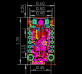
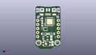
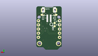
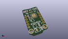

Contents
========

* [PROJ-ADAF-3500-STAN-01>Adafruit Trinket M0 PCB](#proj-adaf-3500-stan-01adafruit-trinket-m0-pcb)
	* [Images](#images)
	* [Interactive BOM](#interactive-bom)
	* [OOMP Parts](#oomp-parts)
	* [Tags](#tags)
  
![][im]
# PROJ-ADAF-3500-STAN-01>Adafruit Trinket M0 PCB

- ID: PROJ-ADAF-3500-STAN-01
- Hex ID: PRA3500
- Name: Adafruit Trinket M0 PCB
- Description: 

## Images
  
  

|eagleImage|kicadPcb3dFront|kicadPcb3dBack|kicadPcb3d|
| :---: | :---: | :---: | :---: |
|||||

## Interactive BOM

- Interactive BOM page: [ibom.html](kicad/bom/ibom.html)

## OOMP Parts
  

|OOMP Parts|
| :---: |
|CAPC-0805-X-UNMATCHED-01, C1, 2.032, -7.175499999999999, 270,C1, 10uF, 0805-NO, microbuilder, (0.08, -0.2825), R270|
|CAPC-0603-X-UNMATCHED-01, C2, -3.556, 1.3335, 270,C2, 1uF, 0603-NO, microbuilder, (-0.14, 0.0525), R270|
|CAPC-0603-X-UNMATCHED-01, C3, -3.556, 4.381499999999999, 90,C3, 1uF, 0603-NO, microbuilder, (-0.14, 0.1725), R90|
|CAPC-0805-X-UNMATCHED-01, C8, 2.7304999999999997, -10.6045, 270,C8, 10uF, 0805-NO, microbuilder, (0.1075, -0.4175), R270|
|UNMATCHED-UNMATCHED-X-UNMATCHED-01, CN1, 0.0, 8.382, 180,CN1, 4U#20329, 4UCONN_20329_V2, microbuilder, (0, 0.33), R180|
|UNMATCHED-UNMATCHED-X-UNMATCHED-01, D2, 2.2352, -4.6354999999999995, 0,D2, SCHOTTKY, SOD-123FL, adafruit, (0.088, -0.1825), R0|
|UNMATCHED-UNMATCHED-X-UNMATCHED-01, D3, -2.1590000000000003, -4.6354999999999995, 180,D3, SCHOTTKY, SOD-123FL, adafruit, (-0.085, -0.1825), R180|
|UNMATCHED-UNMATCHED-X-UNMATCHED-01, IC3, 1.07188127, 3.032759492, 90,IC3, ATSAMD21E, QFN32_5MM, microbuilder, (0.04220005, 0.11939998), R90|
|<table><tr><td></td><td> JP3</td><td>[HEAD-I01-X-PI05-01 2.54 mm 5 Pin Header](https://github.com/oomlout/oomlout_OOMP_parts/tree/main/HEAD-I01-X-PI05-01/)</td><td>[H05](https://github.com/oomlout/oomlout_OOMP_parts/tree/main/HEAD-I01-X-PI05-01/)</td></tr></table>|
|<table><tr><td></td><td> JP4</td><td>[HEAD-I01-X-PI05-01 2.54 mm 5 Pin Header](https://github.com/oomlout/oomlout_OOMP_parts/tree/main/HEAD-I01-X-PI05-01/)</td><td>[H05](https://github.com/oomlout/oomlout_OOMP_parts/tree/main/HEAD-I01-X-PI05-01/)</td></tr></table>|
|LEDS-UNMATCHED-X-UNMATCHED-01, L, 5.5245, 10.287, 180,L, red, CHIPLED_0603_NOOUTLINE, microbuilder, (0.2175, 0.405), R180|
|UNMATCHED-UNMATCHED-X-UNMATCHED-01, LED1, -1.5036812699999997, -1.6001999999999998, 90,LED1, AP102-2020, APA102_2020, microbuilder, (-0.05920005, -0.063), R90|
|UNMATCHED-UNMATCHED-X-UNMATCHED-01, PWR, -5.5245, 10.287, 180,PWR, green, CHIPLED_0603_NOOUTLINE, microbuilder, (-0.2175, 0.405), R180|
|UNMATCHED-UNMATCHED-X-UNMATCHED-01, Q2, -0.889, -10.80008127, 0,Q2, reset, BTN_KMR2_4.6X2.8, microbuilder, (-0.035, -0.42520005), R0|
|RESE-0603-X-UNMATCHED-01, R1, 6.731, 10.1346, 270,R1, 1.5K, 0603-NO, microbuilder, (0.265, 0.399), R270|
|<table><tr><td></td><td> R4</td><td>[RESE-0603-X-O103-01 SMD (0603) 10k Ohm Resistor](https://github.com/oomlout/oomlout_OOMP_parts/tree/main/RESE-0603-X-O103-01/)</td><td>[R6103](https://github.com/oomlout/oomlout_OOMP_parts/tree/main/RESE-0603-X-O103-01/)</td></tr></table>|
|UNMATCHED-UNMATCHED-X-UNMATCHED-01, SWC, -3.3655, 2.4384, M0,SWC, TPB1,27, B1,27, testpad, (-0.1325, 0.096), MR0|
|UNMATCHED-UNMATCHED-X-UNMATCHED-01, SWD, -3.3655, 0.4445, M0,SWD, TPB1,27, B1,27, testpad, (-0.1325, 0.0175), MR0|
|UNMATCHED-UNMATCHED-X-UNMATCHED-01, U1, -1.5875, -7.365999999999999, 270,U1, AP2112K-3.3, SOT23-5, microbuilder, (-0.0625, -0.29), R270|

## Tags

- hexID: PRA3500
- oompType: PROJ
- oompSize: ADAF
- oompColor: 3500
- oompDesc: STAN
- oompIndex: 01
- oompName: Adafruit Trinket M0 PCB
- sources: All source files from https://github.com/adafruit/Adafruit-Trinket-M0-PCB (source licence details in srcLicense.md)
- linkBuyPage: http://www.adafruit.com/products/3500
- oompPart: SKIP-UNMATCHED-X-UNMATCHED-01, BAT, 0.0, 9.017, M0
- oompPart: CAPC-0805-X-UNMATCHED-01, C1, 2.032, -7.175499999999999, 270
- oompPart: CAPC-0603-X-UNMATCHED-01, C2, -3.556, 1.3335, 270
- oompPart: CAPC-0603-X-UNMATCHED-01, C3, -3.556, 4.381499999999999, 90
- oompPart: CAPC-0805-X-UNMATCHED-01, C8, 2.7304999999999997, -10.6045, 270
- oompPart: UNMATCHED-UNMATCHED-X-UNMATCHED-01, CN1, 0.0, 8.382, 180
- oompPart: UNMATCHED-UNMATCHED-X-UNMATCHED-01, D2, 2.2352, -4.6354999999999995, 0
- oompPart: UNMATCHED-UNMATCHED-X-UNMATCHED-01, D3, -2.1590000000000003, -4.6354999999999995, 180
- oompPart: UNMATCHED-UNMATCHED-X-UNMATCHED-01, IC3, 1.07188127, 3.032759492, 90
- oompPart: HEAD-I01-X-PI05-01, JP3, -6.324599999999999, -1.27, 270
- oompPart: HEAD-I01-X-PI05-01, JP4, 6.35, -1.27, 90
- oompPart: LEDS-UNMATCHED-X-UNMATCHED-01, L, 5.5245, 10.287, 180
- oompPart: UNMATCHED-UNMATCHED-X-UNMATCHED-01, LED1, -1.5036812699999997, -1.6001999999999998, 90
- oompPart: UNMATCHED-UNMATCHED-X-UNMATCHED-01, PWR, -5.5245, 10.287, 180
- oompPart: UNMATCHED-UNMATCHED-X-UNMATCHED-01, Q2, -0.889, -10.80008127, 0
- oompPart: RESE-0603-X-UNMATCHED-01, R1, 6.731, 10.1346, 270
- oompPart: RESE-0603-X-O103-01, R4, -6.731, 10.16, 270
- oompPart: UNMATCHED-UNMATCHED-X-UNMATCHED-01, SWC, -3.3655, 2.4384, M0
- oompPart: UNMATCHED-UNMATCHED-X-UNMATCHED-01, SWD, -3.3655, 0.4445, M0
- oompPart: SKIP-UNMATCHED-X-UNMATCHED-01, U$6, -1.2065, -10.921999999999999, 0
- oompPart: SKIP-UNMATCHED-X-UNMATCHED-01, U$8, -5.715, -10.16, 0
- oompPart: SKIP-UNMATCHED-X-UNMATCHED-01, U$9, 5.715, -10.16, 0
- oompPart: UNMATCHED-UNMATCHED-X-UNMATCHED-01, U1, -1.5875, -7.365999999999999, 270
- rawPart: BAT, JST-2PH, JSTPH2, microbuilder, (0, 0.355), MR0
- rawPart: C1, 10uF, 0805-NO, microbuilder, (0.08, -0.2825), R270
- rawPart: C2, 1uF, 0603-NO, microbuilder, (-0.14, 0.0525), R270
- rawPart: C3, 1uF, 0603-NO, microbuilder, (-0.14, 0.1725), R90
- rawPart: C8, 10uF, 0805-NO, microbuilder, (0.1075, -0.4175), R270
- rawPart: CN1, 4U#20329, 4UCONN_20329_V2, microbuilder, (0, 0.33), R180
- rawPart: D2, SCHOTTKY, SOD-123FL, adafruit, (0.088, -0.1825), R0
- rawPart: D3, SCHOTTKY, SOD-123FL, adafruit, (-0.085, -0.1825), R180
- rawPart: IC3, ATSAMD21E, QFN32_5MM, microbuilder, (0.04220005, 0.11939998), R90
- rawPart: JP3, 1X05_ROUND_76, microbuilder, (-0.249, -0.05), R270
- rawPart: JP4, 1X05_ROUND_76, microbuilder, (0.25, -0.05), R90
- rawPart: L, red, CHIPLED_0603_NOOUTLINE, microbuilder, (0.2175, 0.405), R180
- rawPart: LED1, AP102-2020, APA102_2020, microbuilder, (-0.05920005, -0.063), R90
- rawPart: PWR, green, CHIPLED_0603_NOOUTLINE, microbuilder, (-0.2175, 0.405), R180
- rawPart: Q2, reset, BTN_KMR2_4.6X2.8, microbuilder, (-0.035, -0.42520005), R0
- rawPart: R1, 1.5K, 0603-NO, microbuilder, (0.265, 0.399), R270
- rawPart: R4, 10K, 0603-NO, microbuilder, (-0.265, 0.4), R270
- rawPart: SWC, TPB1,27, B1,27, testpad, (-0.1325, 0.096), MR0
- rawPart: SWD, TPB1,27, B1,27, testpad, (-0.1325, 0.0175), MR0
- rawPart: U$6, FIDUCIAL_1MM, FIDUCIAL_1MM, microbuilder, (-0.0475, -0.43), R0
- rawPart: U$8, MOUNTINGHOLE2.0, MOUNTINGHOLE_2.0_PLATED, microbuilder, (-0.225, -0.4), R0
- rawPart: U$9, MOUNTINGHOLE2.0, MOUNTINGHOLE_2.0_PLATED, microbuilder, (0.225, -0.4), R0
- rawPart: U1, AP2112K-3.3, SOT23-5, microbuilder, (-0.0625, -0.29), R270
- oompID: PROJ-ADAF-3500-STAN-01

[im]: kicadPcb3d_450.png
