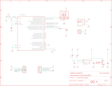

Contents
========

* [PRA3500 > Adafruit](#pra3500--adafruit)
	* [Schematic](#schematic)
	* [Interactive BOM](#interactive-bom)
	* [OOMP Parts](#oomp-parts)
	* [Images](#images)
	* [Tags](#tags)
  
![][im]
# PRA3500 > Adafruit

- ID: PROJ-ADAF-3500-STAN-01
- Hex ID: PRA3500
- Name: Adafruit
- Description: Adafruit
- Long Link: [http://oom.lt/PROJ-ADAF-3500-STAN-01](http://oom.lt/PROJ-ADAF-3500-STAN-01)
- Short Link: [http://oom.lt/PRA3500](http://oom.lt/PRA3500)

## Schematic
  

## Interactive BOM

- Interactive BOM page: [ibom.html](https://htmlpreview.github.io/?https://github.com/oomlout/oomlout_OOMP_projects/blob/main/PROJ-ADAF-3500-STAN-01/kicad/bom/ibom.html)

## OOMP Parts
  

|OOMP Parts|
| :---: |
|BAT,UNMATCHED-UNMATCHED-UNMATCHED-UNMATCHED-UNMATCHED,BAT,JST-2PH,CON_JST_PH_2PIN,JSTPH2,JST 2-Pin Right-Angle Connector,,,|
|C1,UNMATCHED-UNMATCHED-UNMATCHED-UNMATCHED-UNMATCHED,C1,10uF,CAP_CERAMIC0805-NOOUTLINE,0805-NO,Ceramic Capacitors,,,|
|C2,UNMATCHED-UNMATCHED-UNMATCHED-UNMATCHED-UNMATCHED,C2,1uF,CAP_CERAMIC0603_NO,0603-NO,Ceramic Capacitors,,,|
|C3,UNMATCHED-UNMATCHED-UNMATCHED-UNMATCHED-UNMATCHED,C3,1uF,CAP_CERAMIC0603_NO,0603-NO,Ceramic Capacitors,,,|
|C8,UNMATCHED-UNMATCHED-UNMATCHED-UNMATCHED-UNMATCHED,C8,10uF,CAP_CERAMIC0805-NOOUTLINE,0805-NO,Ceramic Capacitors,,,|
|CN1,UNMATCHED-UNMATCHED-UNMATCHED-UNMATCHED-UNMATCHED,CN1,4U#20329,USB_MICRO_20329_V2,4UCONN_20329_V2,USB Connectors,,,|
|D2,UNMATCHED-UNMATCHED-UNMATCHED-UNMATCHED-UNMATCHED,D2,SCHOTTKY,DIODE_SOD-123FL,SOD-123FL,Diode,,,|
|D3,UNMATCHED-UNMATCHED-UNMATCHED-UNMATCHED-UNMATCHED,D3,SCHOTTKY,DIODE_SOD-123FL,SOD-123FL,Diode,,,|
|IC3,UNMATCHED-UNMATCHED-UNMATCHED-UNMATCHED-UNMATCHED,IC3,ATSAMD21E,ATSAMD21E,QFN32_5MM,,,,|
|JP3,UNMATCHED-UNMATCHED-UNMATCHED-UNMATCHED-UNMATCHED,JP3,,HEADER-1X576MIL,1X05_ROUND_76,PIN HEADER,,,|
|JP4,UNMATCHED-UNMATCHED-UNMATCHED-UNMATCHED-UNMATCHED,JP4,,HEADER-1X576MIL,1X05_ROUND_76,PIN HEADER,,,|
|L,UNMATCHED-UNMATCHED-UNMATCHED-UNMATCHED-UNMATCHED,L,red,LED0603_NOOUTLINE,CHIPLED_0603_NOOUTLINE,LED,,,|
|LED1,UNMATCHED-UNMATCHED-UNMATCHED-UNMATCHED-UNMATCHED,LED1,AP102-2020,APA1022020,APA102_2020,APA102/DotStar Pixels,,,|
|PWR,UNMATCHED-UNMATCHED-UNMATCHED-UNMATCHED-UNMATCHED,PWR,green,LED0603_NOOUTLINE,CHIPLED_0603_NOOUTLINE,LED,,,|
|Q2,UNMATCHED-UNMATCHED-UNMATCHED-UNMATCHED-UNMATCHED,Q2,reset,SWITCH_TACT_SMT4.6X2.8,BTN_KMR2_4.6X2.8,SMT Tact Switches,,,|
|R1,UNMATCHED-UNMATCHED-UNMATCHED-UNMATCHED-UNMATCHED,R1,1.5K,RESISTOR_0603_NOOUT,0603-NO,Resistors,,,|
|R4,UNMATCHED-UNMATCHED-UNMATCHED-UNMATCHED-UNMATCHED,R4,10K,RESISTOR_0603_NOOUT,0603-NO,Resistors,,,|
|SWC,UNMATCHED-UNMATCHED-UNMATCHED-UNMATCHED-UNMATCHED,SWC,TPB1,27,TPB1,27,B1,27,Test pad,,,|
|SWD,UNMATCHED-UNMATCHED-UNMATCHED-UNMATCHED-UNMATCHED,SWD,TPB1,27,TPB1,27,B1,27,Test pad,,,|
|U1,UNMATCHED-UNMATCHED-UNMATCHED-UNMATCHED-UNMATCHED,U$6,FIDUCIAL_1MM,FIDUCIAL_1MM,FIDUCIAL_1MM,Fiducial Alignment Points,EXCLUDE,,|

## Images
  
  

|kicadPcb3d|kicadPcb3dFront|kicadPcb3dBack|eagleImage|eagleSchemImage|
| :---: | :---: | :---: | :---: | :---: |
||||||

## Tags

- hexID: PRA3500
- oompType: PROJ
- oompSize: ADAF
- oompColor: 3500
- oompDesc: STAN
- oompIndex: 01
- oompName: Adafruit Trinket M0 PCB
- sources: All source files from https://github.com/adafruit/Adafruit-Trinket-M0-PCB (source licence details in srcLicense.md)
- linkBuyPage: http://www.adafruit.com/products/3500
- oompID: PROJ-ADAF-3500-STAN-01
- oompParts: BAT,UNMATCHED-UNMATCHED-UNMATCHED-UNMATCHED-UNMATCHED
- oompParts: C1,UNMATCHED-UNMATCHED-UNMATCHED-UNMATCHED-UNMATCHED
- oompParts: C2,UNMATCHED-UNMATCHED-UNMATCHED-UNMATCHED-UNMATCHED
- oompParts: C3,UNMATCHED-UNMATCHED-UNMATCHED-UNMATCHED-UNMATCHED
- oompParts: C8,UNMATCHED-UNMATCHED-UNMATCHED-UNMATCHED-UNMATCHED
- oompParts: CN1,UNMATCHED-UNMATCHED-UNMATCHED-UNMATCHED-UNMATCHED
- oompParts: D2,UNMATCHED-UNMATCHED-UNMATCHED-UNMATCHED-UNMATCHED
- oompParts: D3,UNMATCHED-UNMATCHED-UNMATCHED-UNMATCHED-UNMATCHED
- oompParts: IC3,UNMATCHED-UNMATCHED-UNMATCHED-UNMATCHED-UNMATCHED
- oompParts: JP3,UNMATCHED-UNMATCHED-UNMATCHED-UNMATCHED-UNMATCHED
- oompParts: JP4,UNMATCHED-UNMATCHED-UNMATCHED-UNMATCHED-UNMATCHED
- oompParts: L,UNMATCHED-UNMATCHED-UNMATCHED-UNMATCHED-UNMATCHED
- oompParts: LED1,UNMATCHED-UNMATCHED-UNMATCHED-UNMATCHED-UNMATCHED
- oompParts: PWR,UNMATCHED-UNMATCHED-UNMATCHED-UNMATCHED-UNMATCHED
- oompParts: Q2,UNMATCHED-UNMATCHED-UNMATCHED-UNMATCHED-UNMATCHED
- oompParts: R1,UNMATCHED-UNMATCHED-UNMATCHED-UNMATCHED-UNMATCHED
- oompParts: R4,UNMATCHED-UNMATCHED-UNMATCHED-UNMATCHED-UNMATCHED
- oompParts: SWC,UNMATCHED-UNMATCHED-UNMATCHED-UNMATCHED-UNMATCHED
- oompParts: SWD,UNMATCHED-UNMATCHED-UNMATCHED-UNMATCHED-UNMATCHED
- oompParts: U1,UNMATCHED-UNMATCHED-UNMATCHED-UNMATCHED-UNMATCHED
- rawParts: BAT,JST-2PH,CON_JST_PH_2PIN,JSTPH2,JST 2-Pin Right-Angle Connector,,,
- rawParts: C1,10uF,CAP_CERAMIC0805-NOOUTLINE,0805-NO,Ceramic Capacitors,,,
- rawParts: C2,1uF,CAP_CERAMIC0603_NO,0603-NO,Ceramic Capacitors,,,
- rawParts: C3,1uF,CAP_CERAMIC0603_NO,0603-NO,Ceramic Capacitors,,,
- rawParts: C8,10uF,CAP_CERAMIC0805-NOOUTLINE,0805-NO,Ceramic Capacitors,,,
- rawParts: CN1,4U#20329,USB_MICRO_20329_V2,4UCONN_20329_V2,USB Connectors,,,
- rawParts: D2,SCHOTTKY,DIODE_SOD-123FL,SOD-123FL,Diode,,,
- rawParts: D3,SCHOTTKY,DIODE_SOD-123FL,SOD-123FL,Diode,,,
- rawParts: IC3,ATSAMD21E,ATSAMD21E,QFN32_5MM,,,,
- rawParts: JP3,,HEADER-1X576MIL,1X05_ROUND_76,PIN HEADER,,,
- rawParts: JP4,,HEADER-1X576MIL,1X05_ROUND_76,PIN HEADER,,,
- rawParts: L,red,LED0603_NOOUTLINE,CHIPLED_0603_NOOUTLINE,LED,,,
- rawParts: LED1,AP102-2020,APA1022020,APA102_2020,APA102/DotStar Pixels,,,
- rawParts: PWR,green,LED0603_NOOUTLINE,CHIPLED_0603_NOOUTLINE,LED,,,
- rawParts: Q2,reset,SWITCH_TACT_SMT4.6X2.8,BTN_KMR2_4.6X2.8,SMT Tact Switches,,,
- rawParts: R1,1.5K,RESISTOR_0603_NOOUT,0603-NO,Resistors,,,
- rawParts: R4,10K,RESISTOR_0603_NOOUT,0603-NO,Resistors,,,
- rawParts: SWC,TPB1,27,TPB1,27,B1,27,Test pad,,,
- rawParts: SWD,TPB1,27,TPB1,27,B1,27,Test pad,,,
- rawParts: U$6,FIDUCIAL_1MM,FIDUCIAL_1MM,FIDUCIAL_1MM,Fiducial Alignment Points,EXCLUDE,,
- rawParts: U$8,MOUNTINGHOLE2.0,MOUNTINGHOLE2.0,MOUNTINGHOLE_2.0_PLATED,Mounting Hole,EXCLUDE,,
- rawParts: U$9,MOUNTINGHOLE2.0,MOUNTINGHOLE2.0,MOUNTINGHOLE_2.0_PLATED,Mounting Hole,EXCLUDE,,
- rawParts: U1,AP2112K-3.3,VREG_SOT23-5,SOT23-5,SOT23-5 Fixed Voltage Regulators,,,

[im]: kicadPcb3d_450.png
