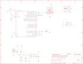

Contents
========

* [PRA3501 > Adafruit Gemma M0 PCB](#pra3501--adafruit-gemma-m0-pcb)
	* [Schematic](#schematic)
	* [PCB](#pcb)
	* [Interactive BOM](#interactive-bom)
	* [OOMP Parts](#oomp-parts)
	* [Images](#images)
	* [Tags](#tags)
  
![][im]
# PRA3501 > Adafruit Gemma M0 PCB

- ID: PROJ-ADAF-3501-STAN-01
- Hex ID: PRA3501
- Name: Adafruit
- Description: Adafruit
- Long Link: [http://oom.lt/PROJ-ADAF-3501-STAN-01](http://oom.lt/PROJ-ADAF-3501-STAN-01)
- Short Link: [http://oom.lt/PRA3501](http://oom.lt/PRA3501)

## Schematic
  

## PCB
  

## Interactive BOM

- Interactive BOM page: [ibom.html](https://htmlpreview.github.io/?https://github.com/oomlout/oomlout_OOMP_projects/blob/main/PROJ-ADAF-3501-STAN-01/kicad/bom/ibom.html)

## OOMP Parts
  

|OOMP Parts|
| :---: |
|[CAPC-0805-X-UF10-V10  SMD (0805) 10 uF Capacitor (Ceramic) 10v  C1, C8](https://github.com/oomlout/oomlout_OOMP_parts/tree/main/CAPC-0805-X-UF10-V10/)|
|[CAPC-0603-X-UF1-V25  SMD (0603) 1 uF Capacitor (Ceramic) 25v  C2, C3](https://github.com/oomlout/oomlout_OOMP_parts/tree/main/CAPC-0603-X-UF1-V25/)|
|UNMATCHED-UNMATCHED-X-UNMATCHED-01 CN1, IC1, SW1, SWC, SWD, TP1, X2|
|DIOD-S123-X-UNMATCHED-01 D1, D2|
|[LEDS-2020-RGB-K102-01  SMD (2020) Smart Controller (APA102) RGB LED  LED1](https://github.com/oomlout/oomlout_OOMP_parts/tree/main/LEDS-2020-RGB-K102-01/)|
|[LEDS-0603-R-STAN-01  SMD (0603) Red LED  PWR](https://github.com/oomlout/oomlout_OOMP_parts/tree/main/LEDS-0603-R-STAN-01/)|
|[BUTA-4628-X-STAN-01  SMD (4628) Pushbutton (Tactile)  Q1](https://github.com/oomlout/oomlout_OOMP_parts/tree/main/BUTA-4628-X-STAN-01/)|
|[RESE-0603-X-O102-01  SMD (0603) 1k Ohm Resistor  R5](https://github.com/oomlout/oomlout_OOMP_parts/tree/main/RESE-0603-X-O102-01/)|
|[VREG-SO235-X-KAP2112K-V33D  SMD (SOT-23-5) AP2112K Voltage Regulator 3.3v  U1](https://github.com/oomlout/oomlout_OOMP_parts/tree/main/VREG-SO235-X-KAP2112K-V33D/)|

## Images
  
  

|bominteractivefront|bominteractiveback|kicadPcb3d|kicadPcb3dFront|kicadPcb3dBack|eagleImage|eagleSchemImage|
| :---: | :---: | :---: | :---: | :---: | :---: | :---: |
||||||||

## Tags

- hexID: PRA3501
- oompType: PROJ
- oompSize: ADAF
- oompColor: 3501
- oompDesc: STAN
- oompIndex: 01
- oompName: Adafruit Gemma M0 PCB
- sources: All source files from https://github.com/adafruit/Adafruit-Gemma-M0-PCB (source licence details in srcLicense.md)
- linkBuyPage: http://www.adafruit.com/products/3501
- oompID: PROJ-ADAF-3501-STAN-01
- oompParts: C1,CAPC-0805-X-UF10-V10
- oompParts: C2,CAPC-0603-X-UF1-V25
- oompParts: C3,CAPC-0603-X-UF1-V25
- oompParts: C8,CAPC-0805-X-UF10-V10
- oompParts: CN1,UNMATCHED-UNMATCHED-X-UNMATCHED-01
- oompParts: D1,DIOD-S123-X-UNMATCHED-01
- oompParts: D2,DIOD-S123-X-UNMATCHED-01
- oompParts: IC1,UNMATCHED-UNMATCHED-X-UNMATCHED-01
- oompParts: LED1,LEDS-2020-RGB-K102-01
- oompParts: PWR,LEDS-0603-R-STAN-01
- oompParts: Q1,BUTA-4628-X-STAN-01
- oompParts: R5,RESE-0603-X-O102-01
- oompParts: SW1,UNMATCHED-UNMATCHED-X-UNMATCHED-01
- oompParts: SWC,UNMATCHED-UNMATCHED-X-UNMATCHED-01
- oompParts: SWD,UNMATCHED-UNMATCHED-X-UNMATCHED-01
- oompParts: TP1,UNMATCHED-UNMATCHED-X-UNMATCHED-01
- oompParts: U1,VREG-SO235-X-KAP2112K-V33D
- oompParts: X2,UNMATCHED-UNMATCHED-X-UNMATCHED-01
- rawParts: 3V3,SEWTAP-ALLIGATOR,SEWTAP-ALLIGATOR,SEWALLI,,,,
- rawParts: B0,SEWTAP-ALLIGATOR,SEWTAP-ALLIGATOR,SEWALLI,,,,
- rawParts: B1,SEWTAP-ALLIGATOR,SEWTAP-ALLIGATOR,SEWALLI,,,,
- rawParts: B2,SEWTAP-ALLIGATOR,SEWTAP-ALLIGATOR,SEWALLI,,,,
- rawParts: C1,10uF,CAP_CERAMIC0805-NOOUTLINE,0805-NO,Ceramic Capacitors,,,
- rawParts: C2,1uF,CAP_CERAMIC0603_NO,0603-NO,Ceramic Capacitors,,,
- rawParts: C3,1uF,CAP_CERAMIC0603_NO,0603-NO,Ceramic Capacitors,,,
- rawParts: C8,10uF,CAP_CERAMIC0805-NOOUTLINE,0805-NO,Ceramic Capacitors,,,
- rawParts: CN1,JST-PH,CON_JST_PH_2PIN,JSTPH2,JST 2-Pin Right-Angle Connector,,,
- rawParts: D1,SCHOTTKY,DIODE_SOD-123FL,SOD-123FL,Diode,,,
- rawParts: D2,SCHOTTKY,DIODE_SOD-123FL,SOD-123FL,Diode,,,
- rawParts: GND,SEWTAP-ALLIGATOR,SEWTAP-ALLIGATOR,SEWALLI,,,,
- rawParts: IC1,ATSAMD21E,ATSAMD21E,QFN32_5MM,,,,
- rawParts: LED1,AP102-2020,APA1022020,APA102_2020,APA102/DotStar Pixels,,,
- rawParts: PWR,red,LED0603_NOOUTLINE,CHIPLED_0603_NOOUTLINE,LED,,,
- rawParts: Q1,reset,SWITCH_TACT_SMT4.6X2.8,BTN_KMR2_4.6X2.8,SMT Tact Switches,,,
- rawParts: R5,1K,RESISTOR_0603_NOOUT,0603-NO,Resistors,,,
- rawParts: SW1,EG1218,SWITCH_DPDTEG1390,EG1390,Switch - DPDT,,,
- rawParts: SWC,TPTP15R,TPTP15R,TP15R,Test pad,,,
- rawParts: SWD,TPTP15R,TPTP15R,TP15R,Test pad,,,
- rawParts: TP1,TPTP16R,TPTP16R,TP16R,Test pad,,,
- rawParts: U$1,FIDUCIAL_1MM,FIDUCIAL_1MM,FIDUCIAL_1MM,Fiducial Alignment Points,EXCLUDE,,
- rawParts: U$6,FIDUCIAL_1MM,FIDUCIAL_1MM,FIDUCIAL_1MM,Fiducial Alignment Points,EXCLUDE,,
- rawParts: U1,AP2112K-3.3,VREG_SOT23-5,SOT23-5,SOT23-5 Fixed Voltage Regulators,,,
- rawParts: VBAT,SEWTAP-ALLIGATOR,SEWTAP-ALLIGATOR,SEWALLI,,,,
- rawParts: X2,MicroUSB,USB_MICRO_20329_V2,4UCONN_20329_V2,USB Connectors,,,

[im]: kicadPcb3d_450.png
