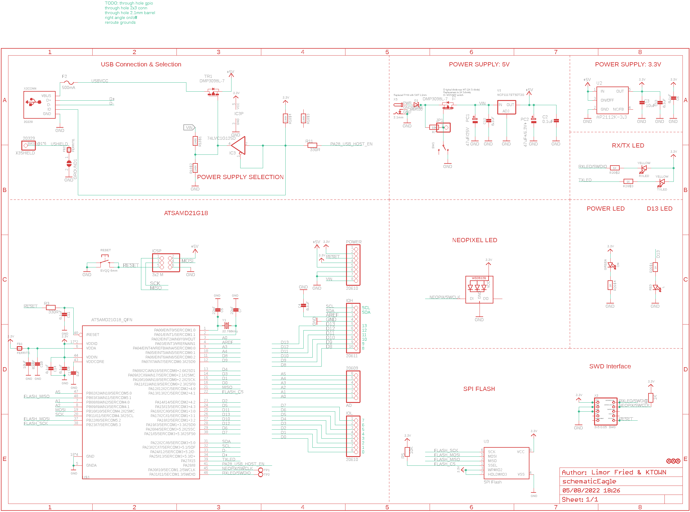
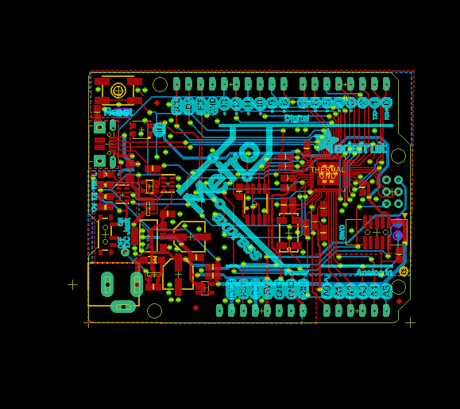
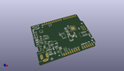
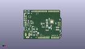
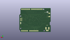
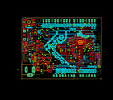

Contents
========

* [PRA3505 > Adafruit Metro M0 Express PCB](#pra3505--adafruit-metro-m0-express-pcb)
	* [Schematic](#schematic)
	* [PCB](#pcb)
	* [Interactive BOM](#interactive-bom)
	* [OOMP Parts](#oomp-parts)
	* [Images](#images)
	* [Tags](#tags)
  
![][im]
# PRA3505 > Adafruit Metro M0 Express PCB

- ID: PROJ-ADAF-3505-STAN-01
- Hex ID: PRA3505
- Name: Adafruit
- Description: Adafruit
- Long Link: [http://oom.lt/PROJ-ADAF-3505-STAN-01](http://oom.lt/PROJ-ADAF-3505-STAN-01)
- Short Link: [http://oom.lt/PRA3505](http://oom.lt/PRA3505)

## Schematic
  

## PCB
  

## Interactive BOM

- Interactive BOM page: [ibom.html](https://htmlpreview.github.io/?https://github.com/oomlout/oomlout_OOMP_projects/blob/main/PROJ-ADAF-3505-STAN-01/kicad/bom/ibom.html)

## OOMP Parts
  

|OOMP Parts|
| :---: |
|[AD HEAD-I01-X-PI06-01 2.54 mm 6 Pin Header](https://github.com/oomlout/oomlout_OOMP_parts/tree/main/HEAD-I01-X-PI06-01/)|
|C1 C1,CAPC-0805-X-UF1-01|
|C2 C2,CAPC-0805-X-UF1D-01|
|[C3 CAPC-0805-X-UF10-V10 SMD (0805) 10 uF Capacitor (Ceramic) 10v](https://github.com/oomlout/oomlout_OOMP_parts/tree/main/CAPC-0805-X-UF10-V10/)|
|C4 C4,CAPC-0805-X-UF1D-01|
|C5 C5,CAPC-0805-X-PF22-01|
|C6 C6,CAPC-0805-X-UF1D-01|
|C7 C7,CAPC-0805-X-PF22-01|
|[C8 CAPC-0805-X-UF10-V10 SMD (0805) 10 uF Capacitor (Ceramic) 10v](https://github.com/oomlout/oomlout_OOMP_parts/tree/main/CAPC-0805-X-UF10-V10/)|
|C9 C9,CAPC-0805-X-UF1D-01|
|C10 C10,CAPC-0805-X-UF1D-01|
|C11 C11,CAPC-0805-X-UF1D-01|
|C12 C12,CAPC-0805-X-UF1D-01|
|C13 C13,CAPC-0805-X-UF1D-01|
|C14 C14,CAPC-0805-X-UF1D-01|
|[D1 DIOD-S123-X-KMBR120-01 SMD (SOD-123) MBR120 Diode](https://github.com/oomlout/oomlout_OOMP_parts/tree/main/DIOD-S123-X-KMBR120-01/)|
|F2 F2,UNMATCHED-1206-X-UNMATCHED-01|
|FB1 FB1,FERB-0805-X-UNMATCHED-01|
|FB2 FB2,FERB-0805-X-UNMATCHED-01|
|GROUND1 GROUND1,UNMATCHED-UNMATCHED-X-UNMATCHED-01|
|IC3 IC3,UNMATCHED-SO235-X-UNMATCHED-01|
|ICSP ICSP,HEAD-I01-X-UNMATCHED-01|
|[IOH HEAD-I01-X-PI10-01 2.54 mm 10 Pin Header](https://github.com/oomlout/oomlout_OOMP_parts/tree/main/HEAD-I01-X-PI10-01/)|
|[IOL HEAD-I01-X-PI08-01 2.54 mm 8 Pin Header](https://github.com/oomlout/oomlout_OOMP_parts/tree/main/HEAD-I01-X-PI08-01/)|
|JP1 JP1,HEAD-I01-X-PI01-01|
|[L LEDS-0805-G-STAN-01 SMD (0805) Green LED](https://github.com/oomlout/oomlout_OOMP_parts/tree/main/LEDS-0805-G-STAN-01/)|
|[LED1 LEDS-3535-RGB-K2812-01 SMD (3535) Smart Controller (WS2812B) RGB LED](https://github.com/oomlout/oomlout_OOMP_parts/tree/main/LEDS-3535-RGB-K2812-01/)|
|[ON LEDS-0805-G-STAN-01 SMD (0805) Green LED](https://github.com/oomlout/oomlout_OOMP_parts/tree/main/LEDS-0805-G-STAN-01/)|
|PC1 PC1,CAPX-UNMATCHED-X-UNMATCHED-01|
|PC2 PC2,CAPX-UNMATCHED-X-UNMATCHED-01|
|[POWER HEAD-I01-X-PI08-01 2.54 mm 8 Pin Header](https://github.com/oomlout/oomlout_OOMP_parts/tree/main/HEAD-I01-X-PI08-01/)|
|R1 R1,RESA-06038-X-O1003X4-01|
|R2 R2,RESA-06038-X-O102X4-01|
|R3 R3,RESE-0805-X-UNMATCHED-01|
|[R4 RESE-0805-X-O102-01 SMD (0805) 1k Ohm Resistor](https://github.com/oomlout/oomlout_OOMP_parts/tree/main/RESE-0805-X-O102-01/)|
|[R5 RESE-0805-X-O103-01 SMD (0805) 10k Ohm Resistor](https://github.com/oomlout/oomlout_OOMP_parts/tree/main/RESE-0805-X-O103-01/)|
|[R7 RESE-0805-X-O103-01 SMD (0805) 10k Ohm Resistor](https://github.com/oomlout/oomlout_OOMP_parts/tree/main/RESE-0805-X-O103-01/)|
|R11 R11,RESE-0805-X-UNMATCHED-01|
|RESET RESET,UNMATCHED-UNMATCHED-X-UNMATCHED-01|
|[RXLED LEDS-0805-G-STAN-01 SMD (0805) Green LED](https://github.com/oomlout/oomlout_OOMP_parts/tree/main/LEDS-0805-G-STAN-01/)|
|SW1 SW1,UNMATCHED-UNMATCHED-X-UNMATCHED-01|
|T2 T2,UNMATCHED-UNMATCHED-X-UNMATCHED-01|
|TP1 TP1,UNMATCHED-UNMATCHED-X-UNMATCHED-01|
|TP2 TP2,UNMATCHED-UNMATCHED-X-UNMATCHED-01|
|TR1 TR1,UNMATCHED-UNMATCHED-X-UNMATCHED-01|
|[TXLED LEDS-0805-G-STAN-01 SMD (0805) Green LED](https://github.com/oomlout/oomlout_OOMP_parts/tree/main/LEDS-0805-G-STAN-01/)|
|U$1 U$1,UNMATCHED-UNMATCHED-X-UNMATCHED-01|
|U1 U1,UNMATCHED-UNMATCHED-X-UNMATCHED-01|
|U2 U2,VREG-SO23-X-KAP2112K-01|
|U3 U3,UNMATCHED-UNMATCHED-X-UNMATCHED-01|
|X2 X2,UNMATCHED-UNMATCHED-X-UNMATCHED-01|
|X3 X3,UNMATCHED-UNMATCHED-X-UNMATCHED-01|
|X5 X5,UNMATCHED-UNMATCHED-X-UNMATCHED-01|
|Y1 Y1,UNMATCHED-UNMATCHED-X-UNMATCHED-01|

## Images
  
  

|kicadPcb3d|kicadPcb3dFront|kicadPcb3dBack|eagleImage|eagleSchemImage|
| :---: | :---: | :---: | :---: | :---: |
||||||

## Tags

- hexID: PRA3505
- oompType: PROJ
- oompSize: ADAF
- oompColor: 3505
- oompDesc: STAN
- oompIndex: 01
- oompName: Adafruit Metro M0 Express PCB
- sources: All source files from https://github.com/adafruit/Adafruit-Metro-M0-Express-PCB (source licence details in srcLicense.md)
- linkBuyPage: http://www.adafruit.com/products/3505
- oompID: PROJ-ADAF-3505-STAN-01
- oompParts: AD,HEAD-I01-X-PI06-01
- oompParts: C1,CAPC-0805-X-UF1-01
- oompParts: C2,CAPC-0805-X-UF1D-01
- oompParts: C3,CAPC-0805-X-UF10-V10
- oompParts: C4,CAPC-0805-X-UF1D-01
- oompParts: C5,CAPC-0805-X-PF22-01
- oompParts: C6,CAPC-0805-X-UF1D-01
- oompParts: C7,CAPC-0805-X-PF22-01
- oompParts: C8,CAPC-0805-X-UF10-V10
- oompParts: C9,CAPC-0805-X-UF1D-01
- oompParts: C10,CAPC-0805-X-UF1D-01
- oompParts: C11,CAPC-0805-X-UF1D-01
- oompParts: C12,CAPC-0805-X-UF1D-01
- oompParts: C13,CAPC-0805-X-UF1D-01
- oompParts: C14,CAPC-0805-X-UF1D-01
- oompParts: D1,DIOD-S123-X-KMBR120-01
- oompParts: F2,UNMATCHED-1206-X-UNMATCHED-01
- oompParts: FB1,FERB-0805-X-UNMATCHED-01
- oompParts: FB2,FERB-0805-X-UNMATCHED-01
- oompParts: GROUND1,UNMATCHED-UNMATCHED-X-UNMATCHED-01
- oompParts: IC3,UNMATCHED-SO235-X-UNMATCHED-01
- oompParts: ICSP,HEAD-I01-X-UNMATCHED-01
- oompParts: IOH,HEAD-I01-X-PI10-01
- oompParts: IOL,HEAD-I01-X-PI08-01
- oompParts: JP1,HEAD-I01-X-PI01-01
- oompParts: L,LEDS-0805-G-STAN-01
- oompParts: LED1,LEDS-3535-RGB-K2812-01
- oompParts: ON,LEDS-0805-G-STAN-01
- oompParts: PC1,CAPX-UNMATCHED-X-UNMATCHED-01
- oompParts: PC2,CAPX-UNMATCHED-X-UNMATCHED-01
- oompParts: POWER,HEAD-I01-X-PI08-01
- oompParts: R1,RESA-06038-X-O1003X4-01
- oompParts: R2,RESA-06038-X-O102X4-01
- oompParts: R3,RESE-0805-X-UNMATCHED-01
- oompParts: R4,RESE-0805-X-O102-01
- oompParts: R5,RESE-0805-X-O103-01
- oompParts: R7,RESE-0805-X-O103-01
- oompParts: R11,RESE-0805-X-UNMATCHED-01
- oompParts: RESET,UNMATCHED-UNMATCHED-X-UNMATCHED-01
- oompParts: RXLED,LEDS-0805-G-STAN-01
- oompParts: SW1,UNMATCHED-UNMATCHED-X-UNMATCHED-01
- oompParts: T2,UNMATCHED-UNMATCHED-X-UNMATCHED-01
- oompParts: TP1,UNMATCHED-UNMATCHED-X-UNMATCHED-01
- oompParts: TP2,UNMATCHED-UNMATCHED-X-UNMATCHED-01
- oompParts: TR1,UNMATCHED-UNMATCHED-X-UNMATCHED-01
- oompParts: TXLED,LEDS-0805-G-STAN-01
- oompParts: U$1,UNMATCHED-UNMATCHED-X-UNMATCHED-01
- oompParts: U1,UNMATCHED-UNMATCHED-X-UNMATCHED-01
- oompParts: U2,VREG-SO23-X-KAP2112K-01
- oompParts: U3,UNMATCHED-UNMATCHED-X-UNMATCHED-01
- oompParts: X2,UNMATCHED-UNMATCHED-X-UNMATCHED-01
- oompParts: X3,UNMATCHED-UNMATCHED-X-UNMATCHED-01
- oompParts: X5,UNMATCHED-UNMATCHED-X-UNMATCHED-01
- oompParts: Y1,UNMATCHED-UNMATCHED-X-UNMATCHED-01
- rawParts: AD,20609,HEADER-1X6OVALWAVE,1X06_OVALWAVE,PIN HEADER,,,,,,,,,,,,,
- rawParts: C1,1uF,CAP_CERAMIC0805-NOOUTLINE,0805-NO,Ceramic Capacitors,,,,,,,,,,,,,
- rawParts: C2,0.1uF,CAP_CERAMIC0805-NOOUTLINE,0805-NO,Ceramic Capacitors,,,,,,,,,,,,,
- rawParts: C3,10uF,CAP_CERAMIC0805-NOOUTLINE,0805-NO,Ceramic Capacitors,,,,,,,,,,,,,
- rawParts: C4,0.1uF,CAP_CERAMIC0805-NOOUTLINE,0805-NO,Ceramic Capacitors,,,,,,,,,,,,,
- rawParts: C5,22pF,CAP_CERAMIC0805-NOOUTLINE,0805-NO,Ceramic Capacitors,,,,,,,,,,,,,
- rawParts: C6,0.1uF,CAP_CERAMIC0805-NOOUTLINE,0805-NO,Ceramic Capacitors,,,,,,,,,,,,,
- rawParts: C7,22pF,CAP_CERAMIC0805-NOOUTLINE,0805-NO,Ceramic Capacitors,,,,,,,,,,,,,
- rawParts: C8,10uF,CAP_CERAMIC0805-NOOUTLINE,0805-NO,Ceramic Capacitors,,,,,,,,,,,,,
- rawParts: C9,0.1uF,CAP_CERAMIC0805-NOOUTLINE,0805-NO,Ceramic Capacitors,,,,,,,,,,,,,
- rawParts: C10,0.1uF,CAP_CERAMIC0805-NOOUTLINE,0805-NO,Ceramic Capacitors,,,,,,,,,,,,,
- rawParts: C11,0.1uF,CAP_CERAMIC0805-NOOUTLINE,0805-NO,Ceramic Capacitors,,,,,,,,,,,,,
- rawParts: C12,0.1uF,CAP_CERAMIC0805-NOOUTLINE,0805-NO,Ceramic Capacitors,,,,,,,,,,,,,
- rawParts: C13,0.1uF,CAP_CERAMIC0805-NOOUTLINE,0805-NO,Ceramic Capacitors,,,,,,,,,,,,,
- rawParts: C14,0.1uF,CAP_CERAMIC0805-NOOUTLINE,0805-NO,Ceramic Capacitors,,,,,,,,,,,,,
- rawParts: D1,MBR120,DIODE-SCHOTTKYSOD-123,SOD-123,,,,,,,,,,,,,,
- rawParts: F2,500mA,PTCFUSE-1206,R1206,PTC fuses, resettable thermistors,,,,,,,,,,,,,
- rawParts: FB1,FERRITE,FERRITE-0805NO,0805-NO,Ferrite Bead,,,,,,,,,,,,,
- rawParts: FB2,FERRITE,FERRITE-0805NO,0805-NO,Ferrite Bead,,,,,,,,,,,,,
- rawParts: FD1,FIDUCIAL_1MM,FIDUCIAL_1MM,FIDUCIAL_1MM,Fiducial Alignment Points,EXCLUDE,,,,,,,,,,,,
- rawParts: FD2,FIDUCIAL_1MM,FIDUCIAL_1MM,FIDUCIAL_1MM,Fiducial Alignment Points,EXCLUDE,,,,,,,,,,,,
- rawParts: FD3,FIDUCIAL_1MM,FIDUCIAL_1MM,FIDUCIAL_1MM,Fiducial Alignment Points,EXCLUDE,,,,,,,,,,,,
- rawParts: GROUND1,,SJ,SJ,SMD solder JUMPER,,,,,,,,,,,,,
- rawParts: IC3,74LVC1G125D,74AHC1G125DBV,SOT23-5,Single Bus Buffer Gate with 3-State Output,,,,,,,,,,,,,
- rawParts: ICSP,3x2 M,HEADER-2X3,2X03_ROUND_70MIL,PIN HEADER,,,,,,,,,,,,,
- rawParts: IOH,20611,HEADER-1X10OVALWAVE,1X10_OVALWAVE,PIN HEADER,,,,,,,,,,,,,
- rawParts: IOL,20610,HEADER-1X8OVALWAVE,1X08_OVALWAVE,PIN HEADER,,,,,,,,,,,,,
- rawParts: JP1,,HEADER-1X1ROUND,1X01_ROUND,PIN HEADER,,,,,,,,,,,,,
- rawParts: L,RED,LED0805_NOOUTLINE,CHIPLED_0805_NOOUTLINE,LED,,,,,,,,,,,,,
- rawParts: LED1,WS2812B3535,WS2812B3535,LED3535,,,,,,,,,,,,,,
- rawParts: ON,GREEN,LED0805_NOOUTLINE,CHIPLED_0805_NOOUTLINE,LED,,,,,,,,,,,,,
- rawParts: PC1,47uF/25V,CAP_ELECTROLYTICPANASONIC_D,PANASONIC_D,Electrolytic Capacitors,,,,,,,,,,,,,
- rawParts: PC2,47uF+/6.3V+,CAP_ELECTROLYTICPANASONIC_D,PANASONIC_D,Electrolytic Capacitors,,,,,,,,,,,,,
- rawParts: POWER,20610,HEADER-1X8OVALWAVE,1X08_OVALWAVE,PIN HEADER,,,,,,,,,,,,,
- rawParts: R1,100K,RESISTOR_4PACK,RESPACK_4X0603,Resistor Packs (4 resistors),,,,,,,,,,,,,
- rawParts: R2,1K,RESISTOR_4PACK,RESPACK_4X0603,Resistor Packs (4 resistors),,,,,,,,,,,,,
- rawParts: R3,330R,RESISTOR0805_NOOUTLINE,0805-NO,Resistors,,,,,,,,,,,,,
- rawParts: R4,1K,RESISTOR0805_NOOUTLINE,0805-NO,Resistors,,,,,,,,,,,,,
- rawParts: R5,10K,RESISTOR0805_NOOUTLINE,0805-NO,Resistors,,,,,,,,,,,,,
- rawParts: R7,10K,RESISTOR0805_NOOUTLINE,0805-NO,Resistors,,,,,,,,,,,,,
- rawParts: R11,330R,RESISTOR0805_NOOUTLINE,0805-NO,Resistors,,,,,,,,,,,,,
- rawParts: RESET,EVQQ 6mm,SWITCH_TACT_SMT,EVQ-Q2,SMT Tact Switches,,,,,,,,,,,,,
- rawParts: RXLED,YELLOW,LED0805_NOOUTLINE,CHIPLED_0805_NOOUTLINE,LED,,,,,,,,,,,,,
- rawParts: SW1,,SWITCH_SPDT,SPDT_SMT_SSSS811101,Switch - SPDT,,,,,,,,,,,,,
- rawParts: T2,DMP3098L-7,PMOSSOT23,SOT-23,MOS FET,,,,,,unknown,unknown,,,,,,
- rawParts: TP1,,TESTPOINTROUND1.5MM,TESTPOINT_ROUND_1.5MM,Test Point,,,,,,,,,,,,,
- rawParts: TP2,,TESTPOINTROUND1.5MM,TESTPOINT_ROUND_1.5MM,Test Point,,,,,,,,,,,,,
- rawParts: TR1,DMP3098L-7,0297_PMV48XP,SOT-23,20 V, 3.5 A P-channel Trench MOSFET - PMV48XP,,SOT23,,_____,,,,PMV48XP,_____,_____,Transistor,PMV48XP,
- rawParts: TXLED,YELLOW,LED0805_NOOUTLINE,CHIPLED_0805_NOOUTLINE,LED,,,,,,,,,,,,,
- rawParts: U$1,ATSAMD21G18_QFN,ATSAMD21J_QFN,TQFN48_7MM,,,,,,,,,,,,,,
- rawParts: U1,NCP1117ST50T3G,LM1117SOT223-REFLOW,SOT223-R,LM1117 Voltage Regulator,,,,,,,,,,,,,
- rawParts: U2,AP2112K-3.3,LP2985-XXDBVR33,SOT23-DBV,ULTRALOW-POWER 50-mA LOW-DROPOUT LINEAR REGULATORS,,,,,,,,,,,,,
- rawParts: U3,SPI Flash,SPIFLASH_SOIC8208MIL,SOIC8_208MIL,SOIC8 SPI Flash,,,,,,,,,,,,,
- rawParts: X2,2x5 0.05 SWD,JTAG-CORTEXBOXPOSTS,2X05_1.27MM_BOX_POSTS,Serial Wire (SW-DP) Connector,,,,,,,,,,,,,
- rawParts: X3,20329,USB_W_SHIELD_V2,4UCONN_20329_V2,,,,,,,,,,,,,,
- rawParts: X5,2.1mm,DCBARRELPTH,DCJACK_2MM_PTH,DC Barrel Jack,,,,,,,,,,,,,
- rawParts: Y1,32.768KHz,CRYSTAL8.0X3.8,CRYSTAL_8X3.8,Crystals,,,,,,,,,,,,,

[im]: kicadPcb3d_450.png
