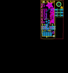
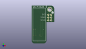
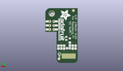
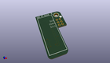

Contents
========

* [PROJ-ADAF-3527-STAN-01>Adafruit PiOLED 128x32 PCB](#proj-adaf-3527-stan-01adafruit-pioled-128x32-pcb)
	* [Images](#images)
	* [Interactive BOM](#interactive-bom)
	* [OOMP Parts](#oomp-parts)
	* [Tags](#tags)
  
![][im]
# PROJ-ADAF-3527-STAN-01>Adafruit PiOLED 128x32 PCB

- ID: PROJ-ADAF-3527-STAN-01
- Hex ID: PRA3527
- Name: Adafruit PiOLED 128x32 PCB
- Description: 

## Images
  
  

|eagleImage|kicadPcb3dFront|kicadPcb3dBack|kicadPcb3d|
| :---: | :---: | :---: | :---: |
|||||

## Interactive BOM

- Interactive BOM page: [ibom.html](kicad/bom/ibom.html)

## OOMP Parts
  

|OOMP Parts|
| :---: |
|CAPE-0805-X-UNMATCHED-01, C2, 1.27, -3.175, M270,C2, 1uF, 0805-NO, microbuilder, (0.05, -0.125), MR270|
|CAPE-0805-X-UNMATCHED-01, C3, 3.0479999999999996, -3.175, M270,C3, 1uF, 0805-NO, microbuilder, (0.12, -0.125), MR270|
|CAPE-0805-X-UNMATCHED-01, C4, 4.826, -1.27, M270,C4, 10uF, 0805-NO, microbuilder, (0.19, -0.05), MR270|
|CAPE-0805-X-UNMATCHED-01, C5, 11.937999999999999, -3.175, M270,C5, 10uF, 0805-NO, microbuilder, (0.47, -0.125), MR270|
|CAPE-0805-X-UNMATCHED-01, C6, 10.16, -3.175, M270,C6, 10uF, 0805-NO, microbuilder, (0.4, -0.125), MR270|
|UNMATCHED-UNMATCHED-X-UNMATCHED-01, IC5, 5.968999999999999, 2.2859999999999996, M270,IC5, APX803, SOT23, adafruit, (0.235, 0.09), MR270|
|ERROR, LCD1 OLED 128x32, 0, 0, 0,LCD1, OLED, 128x32, UG-2832HSWEG02_WRAPUNDER, microbuilder, (0.27, -0.43), R270|
|<table><tr><td></td><td> R2</td><td>[RESE-0805-X-O103-01 SMD (0805) 10k Ohm Resistor](https://github.com/oomlout/oomlout_OOMP_parts/tree/main/RESE-0805-X-O103-01/)</td><td>[R85103](https://github.com/oomlout/oomlout_OOMP_parts/tree/main/RESE-0805-X-O103-01/)</td></tr></table>|
|RESE-0805-X-O394-01, R3, 8.382, -3.175, M270,R3, 390K, 0805-NO, microbuilder, (0.33, -0.125), MR270|
|UNMATCHED-UNMATCHED-X-UNMATCHED-01, RPI1, 16.0782, 10.4394, 0,RPI1, RASPBERRYPI_2X3, RASPBERRYPI_2X3_THMSMT, microbuilder, (0.633, 0.411), R0|

## Tags

- hexID: PRA3527
- oompType: PROJ
- oompSize: ADAF
- oompColor: 3527
- oompDesc: STAN
- oompIndex: 01
- oompName: Adafruit PiOLED 128x32 PCB
- sources: All source files from https://github.com/adafruit/Adafruit-PiOLED-128x32-PCB (source licence details in srcLicense.md)
- linkBuyPage: http://www.adafruit.com/products/3527
- oompPart: CAPE-0805-X-UNMATCHED-01, C2, 1.27, -3.175, M270
- oompPart: CAPE-0805-X-UNMATCHED-01, C3, 3.0479999999999996, -3.175, M270
- oompPart: CAPE-0805-X-UNMATCHED-01, C4, 4.826, -1.27, M270
- oompPart: CAPE-0805-X-UNMATCHED-01, C5, 11.937999999999999, -3.175, M270
- oompPart: CAPE-0805-X-UNMATCHED-01, C6, 10.16, -3.175, M270
- oompPart: SKIP-UNMATCHED-X-UNMATCHED-01, FID3, 11.6332, -10.6426, M0
- oompPart: SKIP-UNMATCHED-X-UNMATCHED-01, FID4, 2.6161999999999996, 19.8374, M0
- oompPart: UNMATCHED-UNMATCHED-X-UNMATCHED-01, IC5, 5.968999999999999, 2.2859999999999996, M270
- oompPart: ERROR, LCD1 OLED 128x32, 0, 0, 0
- oompPart: RESE-0805-X-O103-01, R2, 5.715, -3.937, M0
- oompPart: RESE-0805-X-O394-01, R3, 8.382, -3.175, M270
- oompPart: UNMATCHED-UNMATCHED-X-UNMATCHED-01, RPI1, 16.0782, 10.4394, 0
- oompPart: SKIP-UNMATCHED-X-UNMATCHED-01, U$4, 16.0782, 17.856199999999998, 180
- rawPart: C2, 1uF, 0805-NO, microbuilder, (0.05, -0.125), MR270
- rawPart: C3, 1uF, 0805-NO, microbuilder, (0.12, -0.125), MR270
- rawPart: C4, 10uF, 0805-NO, microbuilder, (0.19, -0.05), MR270
- rawPart: C5, 10uF, 0805-NO, microbuilder, (0.47, -0.125), MR270
- rawPart: C6, 10uF, 0805-NO, microbuilder, (0.4, -0.125), MR270
- rawPart: FID3, FIDUCIAL_1MM, FIDUCIAL_1MM, microbuilder, (0.458, -0.419), MR0
- rawPart: FID4, FIDUCIAL_1MM, FIDUCIAL_1MM, microbuilder, (0.103, 0.781), MR0
- rawPart: IC5, APX803, SOT23, adafruit, (0.235, 0.09), MR270
- rawPart: LCD1, OLED, 128x32, UG-2832HSWEG02_WRAPUNDER, microbuilder, (0.27, -0.43), R270
- rawPart: R2, 10K, 0805-NO, microbuilder, (0.225, -0.155), MR0
- rawPart: R3, 390K, 0805-NO, microbuilder, (0.33, -0.125), MR270
- rawPart: RPI1, RASPBERRYPI_2X3, RASPBERRYPI_2X3_THMSMT, microbuilder, (0.633, 0.411), R0
- rawPart: U$4, MOUNTINGHOLE3.0THIN, MOUNTINGHOLE_3.0_PLATEDTHIN, microbuilder, (0.633, 0.703), R180

[im]: kicadPcb3d_450.png
