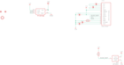

Contents
========

* [PRA3527 > Adafruit](#pra3527--adafruit)
	* [Schematic](#schematic)
	* [Interactive BOM](#interactive-bom)
	* [OOMP Parts](#oomp-parts)
	* [Images](#images)
	* [Tags](#tags)
  
![][im]
# PRA3527 > Adafruit

- ID: PROJ-ADAF-3527-STAN-01
- Hex ID: PRA3527
- Name: Adafruit
- Description: Adafruit
- Long Link: [http://oom.lt/PROJ-ADAF-3527-STAN-01](http://oom.lt/PROJ-ADAF-3527-STAN-01)
- Short Link: [http://oom.lt/PRA3527](http://oom.lt/PRA3527)

## Schematic
  

## Interactive BOM

- Interactive BOM page: [ibom.html](https://htmlpreview.github.io/?https://github.com/oomlout/oomlout_OOMP_projects/blob/main/PROJ-ADAF-3527-STAN-01/kicad/bom/ibom.html)

## OOMP Parts
  

|OOMP Parts|
| :---: |
|C2,CAPC-0805-X-UF1-01,C2,1uF,CAP_CERAMIC0805-NOOUTLINE,0805-NO,Ceramic Capacitors,,|
|C3,CAPC-0805-X-UF1-01,C3,1uF,CAP_CERAMIC0805-NOOUTLINE,0805-NO,Ceramic Capacitors,,|
|C4,CAPC-0805-X-UF10-V10,C4,10uF,CAP_CERAMIC0805-NOOUTLINE,0805-NO,Ceramic Capacitors,,|
|C5,CAPC-0805-X-UF10-V10,C5,10uF,CAP_CERAMIC0805-NOOUTLINE,0805-NO,Ceramic Capacitors,,|
|C6,CAPC-0805-X-UF10-V10,C6,10uF,CAP_CERAMIC0805-NOOUTLINE,0805-NO,Ceramic Capacitors,,|
|IC5,UNMATCHED-SO23-X-UNMATCHED-01,FID3,FIDUCIAL_1MM,FIDUCIAL_1MM,FIDUCIAL_1MM,Fiducial Alignment Points,EXCLUDE,|
|LCD1,UNMATCHED-UNMATCHED-X-UNMATCHED-01,FID4,FIDUCIAL_1MM,FIDUCIAL_1MM,FIDUCIAL_1MM,Fiducial Alignment Points,EXCLUDE,|
|R2,RESE-0805-X-O103-01,IC5,APX803,AXP083-SAG,SOT23,,,|
|R3,RESE-0805-X-O3903-01,LCD1,OLED 128x32,DISP_OLED_UG-2832HSWEG02,UG-2832HSWEG02_WRAPUNDER,128x32 I2C 0.91 Monochrome OLED Display,,|
|RPI1,UNMATCHED-UNMATCHED-X-UNMATCHED-01,R2,10K,RESISTOR0805_NOOUTLINE,0805-NO,Resistors,,|

## Images
  
  

|kicadPcb3d|kicadPcb3dFront|kicadPcb3dBack|eagleImage|eagleSchemImage|
| :---: | :---: | :---: | :---: | :---: |
||||||

## Tags

- hexID: PRA3527
- oompType: PROJ
- oompSize: ADAF
- oompColor: 3527
- oompDesc: STAN
- oompIndex: 01
- oompName: Adafruit PiOLED 128x32 PCB
- sources: All source files from https://github.com/adafruit/Adafruit-PiOLED-128x32-PCB (source licence details in srcLicense.md)
- linkBuyPage: http://www.adafruit.com/products/3527
- oompID: PROJ-ADAF-3527-STAN-01
- oompParts: C2,CAPC-0805-X-UF1-01
- oompParts: C3,CAPC-0805-X-UF1-01
- oompParts: C4,CAPC-0805-X-UF10-V10
- oompParts: C5,CAPC-0805-X-UF10-V10
- oompParts: C6,CAPC-0805-X-UF10-V10
- oompParts: IC5,UNMATCHED-SO23-X-UNMATCHED-01
- oompParts: LCD1,UNMATCHED-UNMATCHED-X-UNMATCHED-01
- oompParts: R2,RESE-0805-X-O103-01
- oompParts: R3,RESE-0805-X-O3903-01
- oompParts: RPI1,UNMATCHED-UNMATCHED-X-UNMATCHED-01
- rawParts: C2,1uF,CAP_CERAMIC0805-NOOUTLINE,0805-NO,Ceramic Capacitors,,
- rawParts: C3,1uF,CAP_CERAMIC0805-NOOUTLINE,0805-NO,Ceramic Capacitors,,
- rawParts: C4,10uF,CAP_CERAMIC0805-NOOUTLINE,0805-NO,Ceramic Capacitors,,
- rawParts: C5,10uF,CAP_CERAMIC0805-NOOUTLINE,0805-NO,Ceramic Capacitors,,
- rawParts: C6,10uF,CAP_CERAMIC0805-NOOUTLINE,0805-NO,Ceramic Capacitors,,
- rawParts: FID3,FIDUCIAL_1MM,FIDUCIAL_1MM,FIDUCIAL_1MM,Fiducial Alignment Points,EXCLUDE,
- rawParts: FID4,FIDUCIAL_1MM,FIDUCIAL_1MM,FIDUCIAL_1MM,Fiducial Alignment Points,EXCLUDE,
- rawParts: IC5,APX803,AXP083-SAG,SOT23,,,
- rawParts: LCD1,OLED 128x32,DISP_OLED_UG-2832HSWEG02,UG-2832HSWEG02_WRAPUNDER,128x32 I2C 0.91 Monochrome OLED Display,,
- rawParts: R2,10K,RESISTOR0805_NOOUTLINE,0805-NO,Resistors,,
- rawParts: R3,390K,RESISTOR0805_NOOUTLINE,0805-NO,Resistors,,
- rawParts: RPI1,RASPBERRYPI_2X3,RASPBERRYPI_2X3,RASPBERRYPI_2X3_THMSMT,,,
- rawParts: U$4,MOUNTINGHOLE3.0THIN,MOUNTINGHOLE3.0THIN,MOUNTINGHOLE_3.0_PLATEDTHIN,Mounting Hole,EXCLUDE,

[im]: kicadPcb3d_450.png
