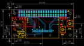
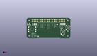
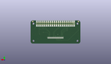
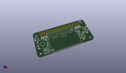

Contents
========

* [PROJ-ADAF-3531-STAN-01>Adafruit 128x64 OLED Bonnet for Raspberry Pi PCB](#proj-adaf-3531-stan-01adafruit-128x64-oled-bonnet-for-raspberry-pi-pcb)
	* [Images](#images)
	* [Interactive BOM](#interactive-bom)
	* [OOMP Parts](#oomp-parts)
	* [Tags](#tags)
  
![][im]
# PROJ-ADAF-3531-STAN-01>Adafruit 128x64 OLED Bonnet for Raspberry Pi PCB

- ID: PROJ-ADAF-3531-STAN-01
- Hex ID: PRA3531
- Name: Adafruit 128x64 OLED Bonnet for Raspberry Pi PCB
- Description: 

## Images
  
  

|eagleImage|kicadPcb3dFront|kicadPcb3dBack|kicadPcb3d|
| :---: | :---: | :---: | :---: |
|||||

## Interactive BOM

- Interactive BOM page: [ibom.html](kicad/bom/ibom.html)

## OOMP Parts
  

|OOMP Parts|
| :---: |
|CAPE-0805-X-UNMATCHED-01, C2, 57.023, 21.59, 90,C2, 10uF, 0805-NO, microbuilder, (57.023, 21.59), R90|
|CAPE-0805-X-UF22D-01, C3, 11.43, 21.336, 270,C3, 2.2uF, 0805-NO, microbuilder, (11.43, 21.336), R270|
|CAPE-0805-X-UF22D-01, C4, 13.97, 21.336, 270,C4, 2.2uF, 0805-NO, microbuilder, (13.97, 21.336), R270|
|CAPE-0805-X-UNMATCHED-01, C5, 52.197, 14.986, 180,C5, 10uF, 0805-NO, microbuilder, (52.197, 14.986), R180|
|CAPE-0805-X-UF22D-01, C6, 9.144, 21.336, 90,C6, 2.2uF, 0805-NO, microbuilder, (9.144, 21.336), R90|
|CAPE-0805-X-UF22D-01, C7, 54.991, 21.59, 270,C7, 2.2uF, 0805-NO, microbuilder, (54.991, 21.59), R270|
|CAPE-0805-X-UF22D-01, C8, 53.086, 21.59, 270,C8, 2.2uF, 0805-NO, microbuilder, (53.086, 21.59), R270|
|UNMATCHED-UNMATCHED-X-UNMATCHED-01, IC1, 4.572, 21.336, 0,IC1, APX803, SOT23, adafruit, (4.572, 21.336), R0|
|<table><tr><td></td><td> R1</td><td>[RESE-0805-X-O103-01 SMD (0805) 10k Ohm Resistor](https://github.com/oomlout/oomlout_OOMP_parts/tree/main/RESE-0805-X-O103-01/)</td><td>[R85103](https://github.com/oomlout/oomlout_OOMP_parts/tree/main/RESE-0805-X-O103-01/)</td></tr></table>|
|RESE-0805-X-O394-01, R3, 51.181, 21.59, 270,R3, 390K, 0805-NO, microbuilder, (51.181, 21.59), R270|
|UNMATCHED-UNMATCHED-X-UNMATCHED-01, RPI1, 0.0254, 0.0, 0,RPI1, RASPBERRYPI_BPLUS_BONNET_THMSMT, PI_BONNET_THMSMT, microbuilder, (0.0254, 0), R0|
|UNMATCHED-UNMATCHED-X-UNMATCHED-01, SW1, 61.087, 15.748, 270,SW1, EVQQ, EVQ-Q2_SMALLER, microbuilder, (61.087, 15.748), R270|
|UNMATCHED-UNMATCHED-X-UNMATCHED-01, SW2, 53.848, 9.271, 270,SW2, EVQQ, EVQ-Q2_SMALLER, microbuilder, (53.848, 9.271), R270|
|UNMATCHED-UNMATCHED-X-UNMATCHED-01, SW3, 8.128, 13.462, 0,SW3, NAVSWITCHSKQUABAUE010, SKQUBAE010, microbuilder, (8.128, 13.462), R0|
|UNMATCHED-UNMATCHED-X-UNMATCHED-01, U1, 32.512, 7.874, 0,U1, UG-2864HSWEG01, UG-2864HSWEG01_1.3_WRAPAROUND, microbuilder, (32.512, 7.874), R0|

## Tags

- hexID: PRA3531
- oompType: PROJ
- oompSize: ADAF
- oompColor: 3531
- oompDesc: STAN
- oompIndex: 01
- oompName: Adafruit 128x64 OLED Bonnet for Raspberry Pi PCB
- sources: All source files from https://github.com/adafruit/Adafruit-128x64-OLED-Bonnet-for-Raspberry-Pi-PCB (source licence details in srcLicense.md)
- linkBuyPage: http://www.adafruit.com/products/3531
- oompPart: CAPE-0805-X-UNMATCHED-01, C2, 57.023, 21.59, 90
- oompPart: CAPE-0805-X-UF22D-01, C3, 11.43, 21.336, 270
- oompPart: CAPE-0805-X-UF22D-01, C4, 13.97, 21.336, 270
- oompPart: CAPE-0805-X-UNMATCHED-01, C5, 52.197, 14.986, 180
- oompPart: CAPE-0805-X-UF22D-01, C6, 9.144, 21.336, 90
- oompPart: CAPE-0805-X-UF22D-01, C7, 54.991, 21.59, 270
- oompPart: CAPE-0805-X-UF22D-01, C8, 53.086, 21.59, 270
- oompPart: SKIP-UNMATCHED-X-UNMATCHED-01, FID1, 45.72, 20.955, 0
- oompPart: SKIP-UNMATCHED-X-UNMATCHED-01, FID2, 17.0208, 3.0122, 0
- oompPart: UNMATCHED-UNMATCHED-X-UNMATCHED-01, IC1, 4.572, 21.336, 0
- oompPart: RESE-0805-X-O103-01, R1, 1.524, 21.336, 90
- oompPart: RESE-0805-X-O394-01, R3, 51.181, 21.59, 270
- oompPart: UNMATCHED-UNMATCHED-X-UNMATCHED-01, RPI1, 0.0254, 0.0, 0
- oompPart: UNMATCHED-UNMATCHED-X-UNMATCHED-01, SW1, 61.087, 15.748, 270
- oompPart: UNMATCHED-UNMATCHED-X-UNMATCHED-01, SW2, 53.848, 9.271, 270
- oompPart: UNMATCHED-UNMATCHED-X-UNMATCHED-01, SW3, 8.128, 13.462, 0
- oompPart: UNMATCHED-UNMATCHED-X-UNMATCHED-01, U1, 32.512, 7.874, 0
- rawPart: C2, 10uF, 0805-NO, microbuilder, (57.023, 21.59), R90
- rawPart: C3, 2.2uF, 0805-NO, microbuilder, (11.43, 21.336), R270
- rawPart: C4, 2.2uF, 0805-NO, microbuilder, (13.97, 21.336), R270
- rawPart: C5, 10uF, 0805-NO, microbuilder, (52.197, 14.986), R180
- rawPart: C6, 2.2uF, 0805-NO, microbuilder, (9.144, 21.336), R90
- rawPart: C7, 2.2uF, 0805-NO, microbuilder, (54.991, 21.59), R270
- rawPart: C8, 2.2uF, 0805-NO, microbuilder, (53.086, 21.59), R270
- rawPart: FID1, FIDUCIAL_1MM, FIDUCIAL_1MM, microbuilder, (45.72, 20.955), R0
- rawPart: FID2, FIDUCIAL_1MM, FIDUCIAL_1MM, microbuilder, (17.0208, 3.0122), R0
- rawPart: IC1, APX803, SOT23, adafruit, (4.572, 21.336), R0
- rawPart: R1, 10K, 0805-NO, microbuilder, (1.524, 21.336), R90
- rawPart: R3, 390K, 0805-NO, microbuilder, (51.181, 21.59), R270
- rawPart: RPI1, RASPBERRYPI_BPLUS_BONNET_THMSMT, PI_BONNET_THMSMT, microbuilder, (0.0254, 0), R0
- rawPart: SW1, EVQQ, EVQ-Q2_SMALLER, microbuilder, (61.087, 15.748), R270
- rawPart: SW2, EVQQ, EVQ-Q2_SMALLER, microbuilder, (53.848, 9.271), R270
- rawPart: SW3, NAVSWITCHSKQUABAUE010, SKQUBAE010, microbuilder, (8.128, 13.462), R0
- rawPart: U1, UG-2864HSWEG01, UG-2864HSWEG01_1.3_WRAPAROUND, microbuilder, (32.512, 7.874), R0

[im]: kicadPcb3d_450.png
