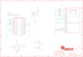

Contents
========

* [PRA3531 > Adafruit 128x64 OLED Bonnet for Raspberry Pi PCB](#pra3531--adafruit-128x64-oled-bonnet-for-raspberry-pi-pcb)
	* [Schematic](#schematic)
	* [PCB](#pcb)
	* [Interactive BOM](#interactive-bom)
	* [OOMP Parts](#oomp-parts)
	* [Images](#images)
	* [Tags](#tags)
  
![][im]
# PRA3531 > Adafruit 128x64 OLED Bonnet for Raspberry Pi PCB

- ID: PROJ-ADAF-3531-STAN-01
- Hex ID: PRA3531
- Name: Adafruit
- Description: Adafruit
- Long Link: [http://oom.lt/PROJ-ADAF-3531-STAN-01](http://oom.lt/PROJ-ADAF-3531-STAN-01)
- Short Link: [http://oom.lt/PRA3531](http://oom.lt/PRA3531)

## Schematic
  

## PCB
  

## Interactive BOM

- Interactive BOM page: [ibom.html](https://htmlpreview.github.io/?https://github.com/oomlout/oomlout_OOMP_projects/blob/main/PROJ-ADAF-3531-STAN-01/kicad/bom/ibom.html)

## OOMP Parts
  

|OOMP Parts|
| :---: |
|[C2 CAPC-0805-X-UF10-V10 SMD (0805) 10 uF Capacitor (Ceramic) 10v](https://github.com/oomlout/oomlout_OOMP_parts/tree/main/CAPC-0805-X-UF10-V10/)|
|C3 C3,CAPC-0805-X-UF22D-01|
|C4 C4,CAPC-0805-X-UF22D-01|
|[C5 CAPC-0805-X-UF10-V10 SMD (0805) 10 uF Capacitor (Ceramic) 10v](https://github.com/oomlout/oomlout_OOMP_parts/tree/main/CAPC-0805-X-UF10-V10/)|
|C6 C6,CAPC-0805-X-UF22D-01|
|C7 C7,CAPC-0805-X-UF22D-01|
|C8 C8,CAPC-0805-X-UF22D-01|
|IC1 IC1,UNMATCHED-SO23-X-UNMATCHED-01|
|[R1 RESE-0805-X-O103-01 SMD (0805) 10k Ohm Resistor](https://github.com/oomlout/oomlout_OOMP_parts/tree/main/RESE-0805-X-O103-01/)|
|R3 R3,RESE-0805-X-O3903-01|
|RPI1 RPI1,UNMATCHED-UNMATCHED-X-UNMATCHED-01|
|SW1 SW1,UNMATCHED-UNMATCHED-X-UNMATCHED-01|
|SW2 SW2,UNMATCHED-UNMATCHED-X-UNMATCHED-01|
|SW3 SW3,UNMATCHED-UNMATCHED-X-UNMATCHED-01|
|U1 U1,UNMATCHED-UNMATCHED-X-UNMATCHED-01|

## Images
  
  

|kicadPcb3d|kicadPcb3dFront|kicadPcb3dBack|eagleImage|eagleSchemImage|
| :---: | :---: | :---: | :---: | :---: |
||||||

## Tags

- hexID: PRA3531
- oompType: PROJ
- oompSize: ADAF
- oompColor: 3531
- oompDesc: STAN
- oompIndex: 01
- oompName: Adafruit 128x64 OLED Bonnet for Raspberry Pi PCB
- sources: All source files from https://github.com/adafruit/Adafruit-128x64-OLED-Bonnet-for-Raspberry-Pi-PCB (source licence details in srcLicense.md)
- linkBuyPage: http://www.adafruit.com/products/3531
- oompID: PROJ-ADAF-3531-STAN-01
- oompParts: C2,CAPC-0805-X-UF10-V10
- oompParts: C3,CAPC-0805-X-UF22D-01
- oompParts: C4,CAPC-0805-X-UF22D-01
- oompParts: C5,CAPC-0805-X-UF10-V10
- oompParts: C6,CAPC-0805-X-UF22D-01
- oompParts: C7,CAPC-0805-X-UF22D-01
- oompParts: C8,CAPC-0805-X-UF22D-01
- oompParts: IC1,UNMATCHED-SO23-X-UNMATCHED-01
- oompParts: R1,RESE-0805-X-O103-01
- oompParts: R3,RESE-0805-X-O3903-01
- oompParts: RPI1,UNMATCHED-UNMATCHED-X-UNMATCHED-01
- oompParts: SW1,UNMATCHED-UNMATCHED-X-UNMATCHED-01
- oompParts: SW2,UNMATCHED-UNMATCHED-X-UNMATCHED-01
- oompParts: SW3,UNMATCHED-UNMATCHED-X-UNMATCHED-01
- oompParts: U1,UNMATCHED-UNMATCHED-X-UNMATCHED-01
- rawParts: C2,10uF,CAP_CERAMIC0805-NOOUTLINE,0805-NO,Ceramic Capacitors,,
- rawParts: C3,2.2uF,CAP_CERAMIC0805-NOOUTLINE,0805-NO,Ceramic Capacitors,,
- rawParts: C4,2.2uF,CAP_CERAMIC0805-NOOUTLINE,0805-NO,Ceramic Capacitors,,
- rawParts: C5,10uF,CAP_CERAMIC0805-NOOUTLINE,0805-NO,Ceramic Capacitors,,
- rawParts: C6,2.2uF,CAP_CERAMIC0805-NOOUTLINE,0805-NO,Ceramic Capacitors,,
- rawParts: C7,2.2uF,CAP_CERAMIC0805-NOOUTLINE,0805-NO,Ceramic Capacitors,,
- rawParts: C8,2.2uF,CAP_CERAMIC0805-NOOUTLINE,0805-NO,Ceramic Capacitors,,
- rawParts: FID1,FIDUCIAL_1MM,FIDUCIAL_1MM,FIDUCIAL_1MM,Fiducial Alignment Points,EXCLUDE,
- rawParts: FID2,FIDUCIAL_1MM,FIDUCIAL_1MM,FIDUCIAL_1MM,Fiducial Alignment Points,EXCLUDE,
- rawParts: IC1,APX803,AXP083-SAG,SOT23,,,
- rawParts: R1,10K,RESISTOR0805_NOOUTLINE,0805-NO,Resistors,,
- rawParts: R3,390K,RESISTOR0805_NOOUTLINE,0805-NO,Resistors,,
- rawParts: RPI1,RASPBERRYPI_BPLUS_BONNET_THMSMT,RASPBERRYPI_BPLUS_BONNET_THMSMT,PI_BONNET_THMSMT,,,
- rawParts: SW1,EVQQ,SWITCH_TACT_SMT_EVQQ2_SMALL,EVQ-Q2_SMALLER,SMT Tact Switches,,
- rawParts: SW2,EVQQ,SWITCH_TACT_SMT_EVQQ2_SMALL,EVQ-Q2_SMALLER,SMT Tact Switches,,
- rawParts: SW3,NAVSWITCHSKQUABAUE010,NAVSWITCHSKQUABAUE010,SKQUBAE010,,,
- rawParts: U1,UG-2864HSWEG01,DISP_OLED_UG-2864HSWEG01,UG-2864HSWEG01_1.3_WRAPAROUND,UG-2864HSWEG01 OLED display,,

[im]: kicadPcb3d_450.png
