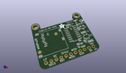
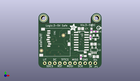
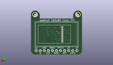
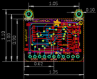
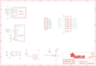

Contents
========

* [PRA3533 > Adafruit](#pra3533--adafruit)
	* [Schematic](#schematic)
	* [Interactive BOM](#interactive-bom)
	* [OOMP Parts](#oomp-parts)
	* [Images](#images)
	* [Tags](#tags)
  
![][im]
# PRA3533 > Adafruit

- ID: PROJ-ADAF-3533-STAN-01
- Hex ID: PRA3533
- Name: Adafruit
- Description: Adafruit
- Long Link: [http://oom.lt/PROJ-ADAF-3533-STAN-01](http://oom.lt/PROJ-ADAF-3533-STAN-01)
- Short Link: [http://oom.lt/PRA3533](http://oom.lt/PRA3533)

## Schematic
  

## Interactive BOM

- Interactive BOM page: [ibom.html](https://htmlpreview.github.io/?https://github.com/oomlout/oomlout_OOMP_projects/blob/main/PROJ-ADAF-3533-STAN-01/kicad/bom/ibom.html)

## OOMP Parts
  

|OOMP Parts|
| :---: |
|C1,CAPC-0805-X-UNMATCHED-01,C1,10µF,CAP_CERAMIC0805-NOOUTLINE,0805-NO,Ceramic Capacitors,,|
|C2,CAPC-0805-X-UNMATCHED-01,C2,10µF,CAP_CERAMIC0805-NOOUTLINE,0805-NO,Ceramic Capacitors,,|
|C3,CAPC-0805-X-NF100-V50,C3,0.1uF,CAP_CERAMIC0805-NOOUTLINE,0805-NO,Ceramic Capacitors,,|
|CN1,UNMATCHED-UNMATCHED-X-UNMATCHED-01,CN1,,MICROSD,MICROSD,MicroSD/Transflash Card Holder with SPI pinout,,|
|IC5,UNMATCHED-SO23-X-UNMATCHED-01,FID1,FIDUCIAL_1MM,FIDUCIAL_1MM,FIDUCIAL_1MM,Fiducial Alignment Points,EXCLUDE,|
|JP1,HEAD-I01-X-PI11-01,FID2,FIDUCIAL_1MM,FIDUCIAL_1MM,FIDUCIAL_1MM,Fiducial Alignment Points,EXCLUDE,|
|Q1,UNMATCHED-SO23-X-UNMATCHED-01,IC5,APX803,AXP083-SAG,SOT23,,,|
|R2,RESE-0603-X-O103-01,JP1,,HEADER-1X11,1X11_ROUND,,,|
|R5,RESE-0603-X-O21-01,Q1,MMBT2222,TRANSISTOR_NPNWIDE,SOT23-WIDE,NPN Transistor,,|
|R7,RESE-0603-X-O102-01,R2,10K,RESISTOR_0603_NOOUT,0603-NO,Resistors,,|
|R8,RESE-0603-X-O103-01,R5,22,RESISTOR_0603_NOOUT,0603-NO,Resistors,,|
|U$2,UNMATCHED-UNMATCHED-X-UNMATCHED-01,R7,1K,RESISTOR_0603_NOOUT,0603-NO,Resistors,,|
|U2,VREG-SO235-X-KMIC5225-V33D,R8,10K,RESISTOR_0603_NOOUT,0603-NO,Resistors,,|
|U3,UNMATCHED-UNMATCHED-X-UNMATCHED-01,U$2,DISP_LCD_0.9IN_160X80,DISP_LCD_0.9IN_160X80,TFT_0.96IN_160X80,,,|

## Images
  
  

|kicadPcb3d|kicadPcb3dFront|kicadPcb3dBack|eagleImage|eagleSchemImage|
| :---: | :---: | :---: | :---: | :---: |
||||||

## Tags

- hexID: PRA3533
- oompType: PROJ
- oompSize: ADAF
- oompColor: 3533
- oompDesc: STAN
- oompIndex: 01
- oompName: Adafruit 0.96 160x80 TFT Display Breakout PCB
- sources: All source files from https://github.com/adafruit/Adafruit-0.96-160x80-TFT-Display-Breakout-PCB (source licence details in srcLicense.md)
- linkBuyPage: http://www.adafruit.com/products/3533
- oompID: PROJ-ADAF-3533-STAN-01
- oompParts: C1,CAPC-0805-X-UNMATCHED-01
- oompParts: C2,CAPC-0805-X-UNMATCHED-01
- oompParts: C3,CAPC-0805-X-NF100-V50
- oompParts: CN1,UNMATCHED-UNMATCHED-X-UNMATCHED-01
- oompParts: IC5,UNMATCHED-SO23-X-UNMATCHED-01
- oompParts: JP1,HEAD-I01-X-PI11-01
- oompParts: Q1,UNMATCHED-SO23-X-UNMATCHED-01
- oompParts: R2,RESE-0603-X-O103-01
- oompParts: R5,RESE-0603-X-O21-01
- oompParts: R7,RESE-0603-X-O102-01
- oompParts: R8,RESE-0603-X-O103-01
- oompParts: U$2,UNMATCHED-UNMATCHED-X-UNMATCHED-01
- oompParts: U2,VREG-SO235-X-KMIC5225-V33D
- oompParts: U3,UNMATCHED-UNMATCHED-X-UNMATCHED-01
- rawParts: C1,10µF,CAP_CERAMIC0805-NOOUTLINE,0805-NO,Ceramic Capacitors,,
- rawParts: C2,10µF,CAP_CERAMIC0805-NOOUTLINE,0805-NO,Ceramic Capacitors,,
- rawParts: C3,0.1uF,CAP_CERAMIC0805-NOOUTLINE,0805-NO,Ceramic Capacitors,,
- rawParts: CN1,,MICROSD,MICROSD,MicroSD/Transflash Card Holder with SPI pinout,,
- rawParts: FID1,FIDUCIAL_1MM,FIDUCIAL_1MM,FIDUCIAL_1MM,Fiducial Alignment Points,EXCLUDE,
- rawParts: FID2,FIDUCIAL_1MM,FIDUCIAL_1MM,FIDUCIAL_1MM,Fiducial Alignment Points,EXCLUDE,
- rawParts: IC5,APX803,AXP083-SAG,SOT23,,,
- rawParts: JP1,,HEADER-1X11,1X11_ROUND,,,
- rawParts: Q1,MMBT2222,TRANSISTOR_NPNWIDE,SOT23-WIDE,NPN Transistor,,
- rawParts: R2,10K,RESISTOR_0603_NOOUT,0603-NO,Resistors,,
- rawParts: R5,22,RESISTOR_0603_NOOUT,0603-NO,Resistors,,
- rawParts: R7,1K,RESISTOR_0603_NOOUT,0603-NO,Resistors,,
- rawParts: R8,10K,RESISTOR_0603_NOOUT,0603-NO,Resistors,,
- rawParts: U$2,DISP_LCD_0.9IN_160X80,DISP_LCD_0.9IN_160X80,TFT_0.96IN_160X80,,,
- rawParts: U$9,MOUNTINGHOLE2.5,MOUNTINGHOLE2.5,MOUNTINGHOLE_2.5_PLATED,Mounting Hole,EXCLUDE,
- rawParts: U$10,MOUNTINGHOLE2.5,MOUNTINGHOLE2.5,MOUNTINGHOLE_2.5_PLATED,Mounting Hole,EXCLUDE,
- rawParts: U2,MIC5225-3.3,VREG_SOT23-5,SOT23-5,SOT23-5 Fixed Voltage Regulators,,
- rawParts: U3,74HC4050D,74HC4050D,SOIC16,6-channel level shifter,,

[im]: kicadPcb3d_450.png
