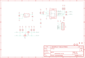

Contents
========

* [PRA3566 > Adafruit](#pra3566--adafruit)
	* [Schematic](#schematic)
	* [Interactive BOM](#interactive-bom)
	* [OOMP Parts](#oomp-parts)
	* [Images](#images)
	* [Tags](#tags)
  
![][im]
# PRA3566 > Adafruit

- ID: PROJ-ADAF-3566-STAN-01
- Hex ID: PRA3566
- Name: Adafruit
- Description: Adafruit
- Long Link: [http://oom.lt/PROJ-ADAF-3566-STAN-01](http://oom.lt/PROJ-ADAF-3566-STAN-01)
- Short Link: [http://oom.lt/PRA3566](http://oom.lt/PRA3566)

## Schematic
  

## Interactive BOM

- Interactive BOM page: [ibom.html](https://htmlpreview.github.io/?https://github.com/oomlout/oomlout_OOMP_projects/blob/main/PROJ-ADAF-3566-STAN-01/kicad/bom/ibom.html)

## OOMP Parts
  

|OOMP Parts|
| :---: |
|C1,CAPC-0603-X-NF100-V50,C1,0.1uF,CAP_CERAMIC0603_NO,0603-NO,Ceramic Capacitors,,|
|C2,CAPC-0805-X-UF10-V10,C2,10uF,CAP_CERAMIC0805-NOOUTLINE,0805-NO,Ceramic Capacitors,,|
|C3,CAPC-0805-X-UF10-V10,C3,10uF,CAP_CERAMIC0805-NOOUTLINE,0805-NO,Ceramic Capacitors,,|
|D1,DIOD-S323-X-K4148-01,D1,1N4148,DIODESOD-323,SOD-323,Diode,,|
|D2,DIOD-S323-X-K4148-01,D2,1N4148,DIODESOD-323,SOD-323,Diode,,|
|JP3,HEAD-I01-X-PI08-01,FID1,FIDUCIAL_1MM,FIDUCIAL_1MM,FIDUCIAL_1MM,Fiducial Alignment Points,EXCLUDE,|
|Q3,MOSN-SO363-X-UNMATCHED-01,FID2,FIDUCIAL_1MM,FIDUCIAL_1MM,FIDUCIAL_1MM,Fiducial Alignment Points,EXCLUDE,|
|R1,RESE-UNMATCHED-X-O103-01,JP3,,HEADER-1X870MIL,1X08_ROUND_70,PIN HEADER,,|
|R2,RESE-UNMATCHED-X-O1003-01,Q3,2N7002D,MOSFET-N_DUAL,SOT363,Dual N-Channel MOSFET,,|
|R5,RESE-0402-X-UNMATCHED-01,R1,10k,RESISTOR_4PACK,RESPACK_4X0603,Resistor Packs (4 resistors),,|
|U2,VREG-SO235-X-KMIC5225-V33D,R2,100k,RESISTOR_4PACK,RESPACK_4X0603,Resistor Packs (4 resistors),,|
|U3,UNMATCHED-UNMATCHED-X-UNMATCHED-01,R5,10K NTC,RESISTOR_0402,_0402,Resistors,,|

## Images
  
  

|kicadPcb3d|kicadPcb3dFront|kicadPcb3dBack|eagleImage|eagleSchemImage|
| :---: | :---: | :---: | :---: | :---: |
||||||

## Tags

- hexID: PRA3566
- oompType: PROJ
- oompSize: ADAF
- oompColor: 3566
- oompDesc: STAN
- oompIndex: 01
- oompName: Adafruit CCS811 Breakout PCB
- sources: All source files from https://github.com/adafruit/Adafruit-CCS811-Breakout-PCB (source licence details in srcLicense.md)
- linkBuyPage: http://www.adafruit.com/products/3566
- oompID: PROJ-ADAF-3566-STAN-01
- oompParts: C1,CAPC-0603-X-NF100-V50
- oompParts: C2,CAPC-0805-X-UF10-V10
- oompParts: C3,CAPC-0805-X-UF10-V10
- oompParts: D1,DIOD-S323-X-K4148-01
- oompParts: D2,DIOD-S323-X-K4148-01
- oompParts: JP3,HEAD-I01-X-PI08-01
- oompParts: Q3,MOSN-SO363-X-UNMATCHED-01
- oompParts: R1,RESE-UNMATCHED-X-O103-01
- oompParts: R2,RESE-UNMATCHED-X-O1003-01
- oompParts: R5,RESE-0402-X-UNMATCHED-01
- oompParts: U2,VREG-SO235-X-KMIC5225-V33D
- oompParts: U3,UNMATCHED-UNMATCHED-X-UNMATCHED-01
- rawParts: C1,0.1uF,CAP_CERAMIC0603_NO,0603-NO,Ceramic Capacitors,,
- rawParts: C2,10uF,CAP_CERAMIC0805-NOOUTLINE,0805-NO,Ceramic Capacitors,,
- rawParts: C3,10uF,CAP_CERAMIC0805-NOOUTLINE,0805-NO,Ceramic Capacitors,,
- rawParts: D1,1N4148,DIODESOD-323,SOD-323,Diode,,
- rawParts: D2,1N4148,DIODESOD-323,SOD-323,Diode,,
- rawParts: FID1,FIDUCIAL_1MM,FIDUCIAL_1MM,FIDUCIAL_1MM,Fiducial Alignment Points,EXCLUDE,
- rawParts: FID2,FIDUCIAL_1MM,FIDUCIAL_1MM,FIDUCIAL_1MM,Fiducial Alignment Points,EXCLUDE,
- rawParts: JP3,,HEADER-1X870MIL,1X08_ROUND_70,PIN HEADER,,
- rawParts: Q3,2N7002D,MOSFET-N_DUAL,SOT363,Dual N-Channel MOSFET,,
- rawParts: R1,10k,RESISTOR_4PACK,RESPACK_4X0603,Resistor Packs (4 resistors),,
- rawParts: R2,100k,RESISTOR_4PACK,RESPACK_4X0603,Resistor Packs (4 resistors),,
- rawParts: R5,10K NTC,RESISTOR_0402,_0402,Resistors,,
- rawParts: U$3,MOUNTINGHOLE2.5,MOUNTINGHOLE2.5,MOUNTINGHOLE_2.5_PLATED,Mounting Hole,EXCLUDE,
- rawParts: U$4,MOUNTINGHOLE2.5,MOUNTINGHOLE2.5,MOUNTINGHOLE_2.5_PLATED,Mounting Hole,EXCLUDE,
- rawParts: U2,MIC5225-3.3,VREG_SOT23-5,SOT23-5,SOT23-5 Fixed Voltage Regulators,,
- rawParts: U3,CCS811,CCS811,CCS811,CCS811 - I2C Gas and Air Quality Sensor,,

[im]: kicadPcb3d_450.png
