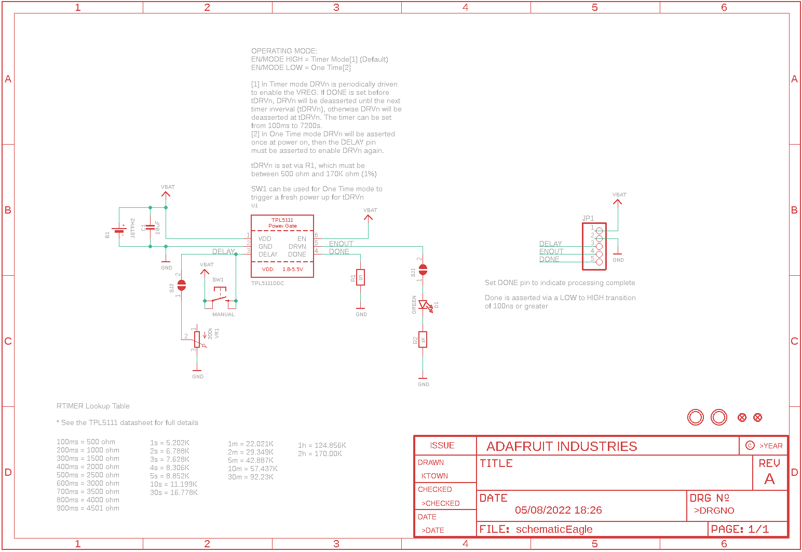
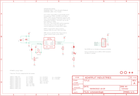

Contents
========

* [PRA3573 > Adafruit](#pra3573--adafruit)
	* [Schematic](#schematic)
	* [Interactive BOM](#interactive-bom)
	* [OOMP Parts](#oomp-parts)
	* [Images](#images)
	* [Tags](#tags)
  
![][im]
# PRA3573 > Adafruit

- ID: PROJ-ADAF-3573-STAN-01
- Hex ID: PRA3573
- Name: Adafruit
- Description: Adafruit
- Long Link: [http://oom.lt/PROJ-ADAF-3573-STAN-01](http://oom.lt/PROJ-ADAF-3573-STAN-01)
- Short Link: [http://oom.lt/PRA3573](http://oom.lt/PRA3573)

## Schematic
  

## Interactive BOM

- Interactive BOM page: [ibom.html](https://htmlpreview.github.io/?https://github.com/oomlout/oomlout_OOMP_projects/blob/main/PROJ-ADAF-3573-STAN-01/kicad/bom/ibom.html)

## OOMP Parts
  

|OOMP Parts|
| :---: |
|B1,UNMATCHED-UNMATCHED-X-UNMATCHED-01,B1,JSTPH2,BATTERY,JSTPH2,CR1220 SMT - Digikey: 3001K-ND,,|
|C1,CAPC-0805-X-UF10-V10,C1,10uF,CAP_CERAMIC0805-NOOUTLINE,0805-NO,Ceramic Capacitors,,|
|D1,LEDS-0805-G-STAN-01,D1,GREEN,LED0805_NOOUTLINE,CHIPLED_0805_NOOUTLINE,LED,,|
|JP1,HEAD-I01-X-PI05-01,FID2,FIDUCIAL_1MM,FIDUCIAL_1MM,FIDUCIAL_1MM,Fiducial Alignment Points,EXCLUDE,|
|R1,RESE-0805-X-O105-01,FID3,FIDUCIAL_1MM,FIDUCIAL_1MM,FIDUCIAL_1MM,Fiducial Alignment Points,EXCLUDE,|
|R2,RESE-0805-X-O102-01,JP1,,HEADER-1X576MIL,1X05_ROUND_76,PIN HEADER,,|
|SW1,UNMATCHED-UNMATCHED-X-UNMATCHED-01,R1,1M,RESISTOR0805_NOOUTLINE,0805-NO,Resistors,,|
|U1,UNMATCHED-SO23-X-UNMATCHED-01,R2,1K,RESISTOR0805_NOOUTLINE,0805-NO,Resistors,,|
|VR1,UNMATCHED-UNMATCHED-X-UNMATCHED-01,SJ1,,SOLDERJUMPERCLOSED,SOLDERJUMPER_CLOSEDWIRE,SMD Solder JUMPER,,|

## Images
  
  

|kicadPcb3d|kicadPcb3dFront|kicadPcb3dBack|eagleImage|eagleSchemImage|
| :---: | :---: | :---: | :---: | :---: |
||||||

## Tags

- hexID: PRA3573
- oompType: PROJ
- oompSize: ADAF
- oompColor: 3573
- oompDesc: STAN
- oompIndex: 01
- oompName: Adafruit TPL5111 Reset Enable Timer PCB
- sources: All source files from https://github.com/adafruit/Adafruit-TPL5111-Reset-Enable-Timer-PCB (source licence details in srcLicense.md)
- linkBuyPage: http://www.adafruit.com/products/3573
- oompID: PROJ-ADAF-3573-STAN-01
- oompParts: B1,UNMATCHED-UNMATCHED-X-UNMATCHED-01
- oompParts: C1,CAPC-0805-X-UF10-V10
- oompParts: D1,LEDS-0805-G-STAN-01
- oompParts: JP1,HEAD-I01-X-PI05-01
- oompParts: R1,RESE-0805-X-O105-01
- oompParts: R2,RESE-0805-X-O102-01
- oompParts: SW1,UNMATCHED-UNMATCHED-X-UNMATCHED-01
- oompParts: U1,UNMATCHED-SO23-X-UNMATCHED-01
- oompParts: VR1,UNMATCHED-UNMATCHED-X-UNMATCHED-01
- rawParts: B1,JSTPH2,BATTERY,JSTPH2,CR1220 SMT - Digikey: 3001K-ND,,
- rawParts: C1,10uF,CAP_CERAMIC0805-NOOUTLINE,0805-NO,Ceramic Capacitors,,
- rawParts: D1,GREEN,LED0805_NOOUTLINE,CHIPLED_0805_NOOUTLINE,LED,,
- rawParts: FID2,FIDUCIAL_1MM,FIDUCIAL_1MM,FIDUCIAL_1MM,Fiducial Alignment Points,EXCLUDE,
- rawParts: FID3,FIDUCIAL_1MM,FIDUCIAL_1MM,FIDUCIAL_1MM,Fiducial Alignment Points,EXCLUDE,
- rawParts: JP1,,HEADER-1X576MIL,1X05_ROUND_76,PIN HEADER,,
- rawParts: R1,1M,RESISTOR0805_NOOUTLINE,0805-NO,Resistors,,
- rawParts: R2,1K,RESISTOR0805_NOOUTLINE,0805-NO,Resistors,,
- rawParts: SJ1,,SOLDERJUMPERCLOSED,SOLDERJUMPER_CLOSEDWIRE,SMD Solder JUMPER,,
- rawParts: SJ2,,SOLDERJUMPERCLOSED,SOLDERJUMPER_CLOSEDWIRE,SMD Solder JUMPER,,
- rawParts: SW1,MANUAL,SWITCH_TACT_SMT_EVQQ2_SMALL,EVQ-Q2_SMALLER,SMT Tact Switches,,
- rawParts: U$8,MOUNTINGHOLE2.5,MOUNTINGHOLE2.5,MOUNTINGHOLE_2.5_PLATED,Mounting Hole,EXCLUDE,
- rawParts: U$9,MOUNTINGHOLE2.5,MOUNTINGHOLE2.5,MOUNTINGHOLE_2.5_PLATED,Mounting Hole,EXCLUDE,
- rawParts: U1,TPL5111DDC,TPL5111,SOT23-6,TPL5111 Timer Based Power Gate,,
- rawParts: VR1,200k,TRIMPOTTC33X-2,TRIMPOT_BOURNS_TC33X-2,3-Pin SMT Trimpots,,

[im]: kicadPcb3d_450.png
