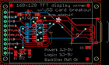
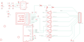

Contents
========

* [PRA358 > Adafruit](#pra358--adafruit)
	* [Images](#images)
	* [Tags](#tags)
  
![][im]
# PRA358 > Adafruit

- ID: PROJ-ADAF-358-STAN-01
- Hex ID: PRA358
- Name: Adafruit
- Description: Adafruit

## Images
  
  

|kicadPcb3d|kicadPcb3dFront|kicadPcb3dBack|eagleImage|eagleSchemImage|
| :---: | :---: | :---: | :---: | :---: |
||||||

## Tags

- hexID: PRA358
- oompType: PROJ
- oompSize: ADAF
- oompColor: 358
- oompDesc: STAN
- oompIndex: 01
- oompName: Adafruit_1.8_Inch_TFT_Breakout_PCB
- sources: All source files from https://github.com/adafruit/Adafruit_1.8_Inch_TFT_Breakout_PCB (source licence details in srcLicense.md)
- linkBuyPage: http://www.adafruit.com/products/358
- oompID: PROJ-ADAF-358-STAN-01
- oompParts: C1,UNMATCHED-UNMATCHED-UNMATCHED-UNMATCHED-UNMATCHED
- oompParts: C2,UNMATCHED-UNMATCHED-UNMATCHED-UNMATCHED-UNMATCHED
- oompParts: C3,UNMATCHED-UNMATCHED-UNMATCHED-UNMATCHED-UNMATCHED
- oompParts: C4,UNMATCHED-UNMATCHED-UNMATCHED-UNMATCHED-UNMATCHED
- oompParts: IC1,UNMATCHED-UNMATCHED-UNMATCHED-UNMATCHED-UNMATCHED
- oompParts: IC2,UNMATCHED-UNMATCHED-UNMATCHED-UNMATCHED-UNMATCHED
- oompParts: Q1,UNMATCHED-UNMATCHED-UNMATCHED-UNMATCHED-UNMATCHED
- oompParts: Q2,UNMATCHED-UNMATCHED-UNMATCHED-UNMATCHED-UNMATCHED
- oompParts: R1,UNMATCHED-UNMATCHED-UNMATCHED-UNMATCHED-UNMATCHED
- oompParts: R2,UNMATCHED-UNMATCHED-UNMATCHED-UNMATCHED-UNMATCHED
- oompParts: U$1,UNMATCHED-UNMATCHED-UNMATCHED-UNMATCHED-UNMATCHED
- oompParts: U$2,UNMATCHED-UNMATCHED-UNMATCHED-UNMATCHED-UNMATCHED
- rawParts: C1,10uF,C-USC0805K,C0805K,CAPACITOR, American symbol,,
- rawParts: C2,10uF,C-USC0805K,C0805K,CAPACITOR, American symbol,,
- rawParts: C3,0.1uF,C-USC0805K,C0805K,CAPACITOR, American symbol,,
- rawParts: C4,0.1uF,C-USC0805K,C0805K,CAPACITOR, American symbol,,
- rawParts: IC1,4050D,4050D,SO16,Hex non-inverting BUFFER,,
- rawParts: IC2,LP298XS,LP298XS,SOT23-5L,,,
- rawParts: Q1,2N2222,MMBT2222ALT1-NPN-SOT23-BEC,SOT23-BEC,NPN Transistror,,
- rawParts: Q2,MICROSD,MICROSD,MICROSD,Micro-SD / Transflash card holder with SPI pinout,,
- rawParts: R1,22 ohm,R-US_R0805,R0805,RESISTOR, American symbol,,
- rawParts: R2,1K,R-US_R0805,R0805,RESISTOR, American symbol,,
- rawParts: U$1,JD-T1800,JD-T1800,JD-T1800,,,
- rawParts: U$2,PINHD-1X10,PINHD-1X10,1X10-BIG,Pin header 1x10 0.1 spacing,,
- rawParts: U$3,FIDUCIAL,FIDUCIAL,FIDUCIAL_1MM,For use by pick and place machines to calibrate the vision/machine, 1mm,,
- rawParts: U$4,FIDUCIAL,FIDUCIAL,FIDUCIAL_1MM,For use by pick and place machines to calibrate the vision/machine, 1mm,,
- rawParts: U$5,FIDUCIAL,FIDUCIAL,FIDUCIAL_1MM,For use by pick and place machines to calibrate the vision/machine, 1mm,,

[im]: kicadPcb3d_450.png
