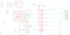

Contents
========

* [PRA358 > Adafruit_1.8_Inch_TFT_Breakout_PCB](#pra358--adafruit_18_inch_tft_breakout_pcb)
	* [Schematic](#schematic)
	* [PCB](#pcb)
	* [OOMP Parts](#oomp-parts)
	* [Images](#images)
	* [Tags](#tags)
  
![][im]
# PRA358 > Adafruit_1.8_Inch_TFT_Breakout_PCB

- ID: PROJ-ADAF-358-STAN-01
- Hex ID: PRA358
- Name: Adafruit
- Description: Adafruit
- Long Link: [http://oom.lt/PROJ-ADAF-358-STAN-01](http://oom.lt/PROJ-ADAF-358-STAN-01)
- Short Link: [http://oom.lt/PRA358](http://oom.lt/PRA358)

## Schematic
  

## PCB
  

## OOMP Parts
  

|OOMP Parts|
| :---: |
|[CAPC-0805-X-UF10-V10  SMD (0805) 10 uF Capacitor (Ceramic) 10v  C1, C2](https://github.com/oomlout/oomlout_OOMP_parts/tree/main/CAPC-0805-X-UF10-V10/)|
|[CAPC-0805-X-NF100-V50  SMD (0805) 100 nF Capacitor (Ceramic) 50v  C3, C4](https://github.com/oomlout/oomlout_OOMP_parts/tree/main/CAPC-0805-X-NF100-V50/)|
|UNMATCHED-UNMATCHED-X-UNMATCHED-01 IC1, Q2, U$1|
|VREG-SO235-X-KLP298XS-V33D IC2|
|UNMATCHED-SO23-X-UNMATCHED-01 Q1|
|RESE-0805-X-UNMATCHED-01 R1|
|[RESE-0805-X-O102-01  SMD (0805) 1k Ohm Resistor  R2](https://github.com/oomlout/oomlout_OOMP_parts/tree/main/RESE-0805-X-O102-01/)|
|[HEAD-I01-X-PI10-01  2.54 mm 10 Pin Header  U$2](https://github.com/oomlout/oomlout_OOMP_parts/tree/main/HEAD-I01-X-PI10-01/)|

## Images
  
  

|kicadPcb3d|kicadPcb3dFront|kicadPcb3dBack|eagleImage|eagleSchemImage|
| :---: | :---: | :---: | :---: | :---: |
||||||

## Tags

- hexID: PRA358
- oompType: PROJ
- oompSize: ADAF
- oompColor: 358
- oompDesc: STAN
- oompIndex: 01
- oompName: Adafruit_1.8_Inch_TFT_Breakout_PCB
- sources: All source files from https://github.com/adafruit/Adafruit_1.8_Inch_TFT_Breakout_PCB (source licence details in srcLicense.md)
- linkBuyPage: http://www.adafruit.com/products/358
- oompID: PROJ-ADAF-358-STAN-01
- oompParts: C1,CAPC-0805-X-UF10-V10
- oompParts: C2,CAPC-0805-X-UF10-V10
- oompParts: C3,CAPC-0805-X-NF100-V50
- oompParts: C4,CAPC-0805-X-NF100-V50
- oompParts: IC1,UNMATCHED-UNMATCHED-X-UNMATCHED-01
- oompParts: IC2,VREG-SO235-X-KLP298XS-V33D
- oompParts: Q1,UNMATCHED-SO23-X-UNMATCHED-01
- oompParts: Q2,UNMATCHED-UNMATCHED-X-UNMATCHED-01
- oompParts: R1,RESE-0805-X-UNMATCHED-01
- oompParts: R2,RESE-0805-X-O102-01
- oompParts: U$1,UNMATCHED-UNMATCHED-X-UNMATCHED-01
- oompParts: U$2,HEAD-I01-X-PI10-01
- rawParts: C1,10uF,C-USC0805K,C0805K,CAPACITOR, American symbol,,
- rawParts: C2,10uF,C-USC0805K,C0805K,CAPACITOR, American symbol,,
- rawParts: C3,0.1uF,C-USC0805K,C0805K,CAPACITOR, American symbol,,
- rawParts: C4,0.1uF,C-USC0805K,C0805K,CAPACITOR, American symbol,,
- rawParts: IC1,4050D,4050D,SO16,Hex non-inverting BUFFER,,
- rawParts: IC2,LP298XS,LP298XS,SOT23-5L,,,
- rawParts: Q1,2N2222,MMBT2222ALT1-NPN-SOT23-BEC,SOT23-BEC,NPN Transistror,,
- rawParts: Q2,MICROSD,MICROSD,MICROSD,Micro-SD / Transflash card holder with SPI pinout,,
- rawParts: R1,22 ohm,R-US_R0805,R0805,RESISTOR, American symbol,,
- rawParts: R2,1K,R-US_R0805,R0805,RESISTOR, American symbol,,
- rawParts: U$1,JD-T1800,JD-T1800,JD-T1800,,,
- rawParts: U$2,PINHD-1X10,PINHD-1X10,1X10-BIG,Pin header 1x10 0.1 spacing,,
- rawParts: U$3,FIDUCIAL,FIDUCIAL,FIDUCIAL_1MM,For use by pick and place machines to calibrate the vision/machine, 1mm,,
- rawParts: U$4,FIDUCIAL,FIDUCIAL,FIDUCIAL_1MM,For use by pick and place machines to calibrate the vision/machine, 1mm,,
- rawParts: U$5,FIDUCIAL,FIDUCIAL,FIDUCIAL_1MM,For use by pick and place machines to calibrate the vision/machine, 1mm,,

[im]: kicadPcb3d_450.png
