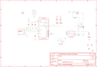

Contents
========

* [PRA3589 > Adafruit PiUART PCB](#pra3589--adafruit-piuart-pcb)
	* [Schematic](#schematic)
	* [PCB](#pcb)
	* [Interactive BOM](#interactive-bom)
	* [OOMP Parts](#oomp-parts)
	* [Images](#images)
	* [Tags](#tags)
  
![][im]
# PRA3589 > Adafruit PiUART PCB

- ID: PROJ-ADAF-3589-STAN-01
- Hex ID: PRA3589
- Name: Adafruit
- Description: Adafruit
- Long Link: [http://oom.lt/PROJ-ADAF-3589-STAN-01](http://oom.lt/PROJ-ADAF-3589-STAN-01)
- Short Link: [http://oom.lt/PRA3589](http://oom.lt/PRA3589)

## Schematic
  

## PCB
  

## Interactive BOM

- Interactive BOM page: [ibom.html](https://htmlpreview.github.io/?https://github.com/oomlout/oomlout_OOMP_projects/blob/main/PROJ-ADAF-3589-STAN-01/kicad/bom/ibom.html)

## OOMP Parts
  

|OOMP Parts|
| :---: |
|[CAPC-0805-X-UF10-V10  SMD (0805) 10 uF Capacitor (Ceramic) 10v  C1, C2, C3](https://github.com/oomlout/oomlout_OOMP_parts/tree/main/CAPC-0805-X-UF10-V10/)|
|[CAPC-0603-X-NF100-V50  SMD (0603) 100 nF Capacitor (Ceramic) 50v  C4](https://github.com/oomlout/oomlout_OOMP_parts/tree/main/CAPC-0603-X-NF100-V50/)|
|[LEDS-0603-R-STAN-01  SMD (0603) Red LED  D1](https://github.com/oomlout/oomlout_OOMP_parts/tree/main/LEDS-0603-R-STAN-01/)|
|[LEDS-0603-Y-STAN-01  SMD (0603) Yellow LED  D2](https://github.com/oomlout/oomlout_OOMP_parts/tree/main/LEDS-0603-Y-STAN-01/)|
|[LEDS-0603-G-STAN-01  SMD (0603) Green LED  D3](https://github.com/oomlout/oomlout_OOMP_parts/tree/main/LEDS-0603-G-STAN-01/)|
|UNMATCHED-UNMATCHED-X-UNMATCHED-01 ON/OFF, T2, U$9, U1, X1|
|[RESE-0603-X-O222-01  SMD (0603) 2.2k Ohm Resistor  R1, R2](https://github.com/oomlout/oomlout_OOMP_parts/tree/main/RESE-0603-X-O222-01/)|
|[RESE-0603-X-O103-01  SMD (0603) 10k Ohm Resistor  R3, R7](https://github.com/oomlout/oomlout_OOMP_parts/tree/main/RESE-0603-X-O103-01/)|

## Images
  
  

|bominteractivefront|bominteractiveback|kicadPcb3d|kicadPcb3dFront|kicadPcb3dBack|eagleImage|eagleSchemImage|pcbdraw|pcbdrawback|
| :---: | :---: | :---: | :---: | :---: | :---: | :---: | :---: | :---: |
||||||||||

## Tags

- hexID: PRA3589
- oompType: PROJ
- oompSize: ADAF
- oompColor: 3589
- oompDesc: STAN
- oompIndex: 01
- oompName: Adafruit PiUART PCB
- sources: All source files from https://github.com/adafruit/Adafruit-PiUART-PCB (source licence details in srcLicense.md)
- linkBuyPage: http://www.adafruit.com/products/3589
- oompID: PROJ-ADAF-3589-STAN-01
- oompParts: C1,CAPC-0805-X-UF10-V10
- oompParts: C2,CAPC-0805-X-UF10-V10
- oompParts: C3,CAPC-0805-X-UF10-V10
- oompParts: C4,CAPC-0603-X-NF100-V50
- oompParts: D1,LEDS-0603-R-STAN-01
- oompParts: D2,LEDS-0603-Y-STAN-01
- oompParts: D3,LEDS-0603-G-STAN-01
- oompParts: ON/OFF,UNMATCHED-UNMATCHED-X-UNMATCHED-01
- oompParts: R1,RESE-0603-X-O222-01
- oompParts: R2,RESE-0603-X-O222-01
- oompParts: R3,RESE-0603-X-O103-01
- oompParts: R7,RESE-0603-X-O103-01
- oompParts: T2,UNMATCHED-UNMATCHED-X-UNMATCHED-01
- oompParts: U$9,UNMATCHED-UNMATCHED-X-UNMATCHED-01
- oompParts: U1,UNMATCHED-UNMATCHED-X-UNMATCHED-01
- oompParts: X1,UNMATCHED-UNMATCHED-X-UNMATCHED-01
- rawParts: C1,10uF,CAP_CERAMIC0805-NOOUTLINE,0805-NO,Ceramic Capacitors,,,,,,
- rawParts: C2,10uF,CAP_CERAMIC0805-NOOUTLINE,0805-NO,Ceramic Capacitors,,,,,,
- rawParts: C3,10uF,CAP_CERAMIC0805-NOOUTLINE,0805-NO,Ceramic Capacitors,,,,,,
- rawParts: C4,0.1uF,CAP_CERAMIC0603_NO,0603-NO,Ceramic Capacitors,,,,,,
- rawParts: D1,RED,LED0603_NOOUTLINE,CHIPLED_0603_NOOUTLINE,LED,,,,,,
- rawParts: D2,YELLOW,LED0603_NOOUTLINE,CHIPLED_0603_NOOUTLINE,LED,,,,,,
- rawParts: D3,GREEN,LED0603_NOOUTLINE,CHIPLED_0603_NOOUTLINE,LED,,,,,,
- rawParts: FID1,FIDUCIAL_1MM,FIDUCIAL_1MM,FIDUCIAL_1MM,Fiducial Alignment Points,EXCLUDE,,,,,
- rawParts: FID2,FIDUCIAL_1MM,FIDUCIAL_1MM,FIDUCIAL_1MM,Fiducial Alignment Points,EXCLUDE,,,,,
- rawParts: FID3,FIDUCIAL_1MM,FIDUCIAL_1MM,FIDUCIAL_1MM,Fiducial Alignment Points,EXCLUDE,,,,,
- rawParts: FID4,FIDUCIAL_1MM,FIDUCIAL_1MM,FIDUCIAL_1MM,Fiducial Alignment Points,EXCLUDE,,,,,
- rawParts: ON/OFF,EG1390,DPDT-EG1390,EG1390,,,,,,,
- rawParts: R1,2.2K,RESISTOR_0603_NOOUT,0603-NO,Resistors,,,,,,
- rawParts: R2,2.2K,RESISTOR_0603_NOOUT,0603-NO,Resistors,,,,,,
- rawParts: R3,10K,RESISTOR_0603_NOOUT,0603-NO,Resistors,,,,,,
- rawParts: R7,10K,RESISTOR_0603_NOOUT,0603-NO,Resistors,,,,,,
- rawParts: SJ1,,SOLDERJUMPERCLOSED,SOLDERJUMPER_CLOSEDWIRE,SMD Solder JUMPER,,,,,,
- rawParts: T2,DMG3415U,PMOSSOT23,SOT-23,MOS FET,,,,unknown,unknown,
- rawParts: U$9,RASPBERRYPI_2X5,RASPBERRYPI_2X5,RASPBERRYPI_2X5_THMSMT,,,,,,,
- rawParts: U$18,MOUNTINGHOLE3.0THIN,MOUNTINGHOLE3.0THIN,MOUNTINGHOLE_3.0_PLATEDTHIN,Mounting Hole,EXCLUDE,,,,,
- rawParts: U1,CP2104,CP2104,QFN24_4MM_SMSC,CP2104 - USB to UART Bridge,,,,,,
- rawParts: X1,20329,USB_MICRO_20329_V2,4UCONN_20329_V2,USB Connectors,,,,,,

[im]: kicadPcb3d_450.png
