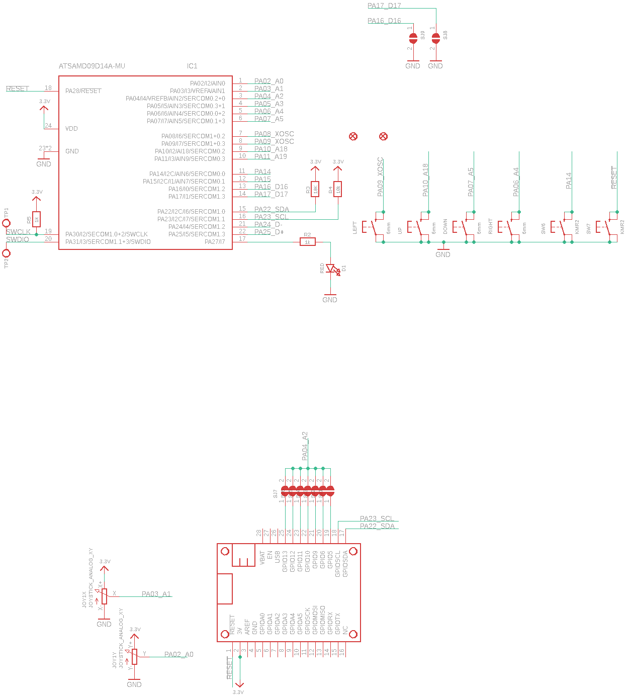
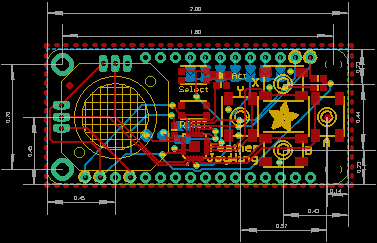
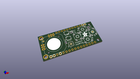
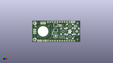
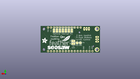
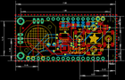
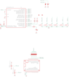

Contents
========

* [PRA3632 > Adafruit Joy Featherwing PCB](#pra3632--adafruit-joy-featherwing-pcb)
	* [Schematic](#schematic)
	* [PCB](#pcb)
	* [Interactive BOM](#interactive-bom)
	* [OOMP Parts](#oomp-parts)
	* [Images](#images)
	* [Tags](#tags)
  
![][im]
# PRA3632 > Adafruit Joy Featherwing PCB

- ID: PROJ-ADAF-3632-STAN-01
- Hex ID: PRA3632
- Name: Adafruit
- Description: Adafruit
- Long Link: [http://oom.lt/PROJ-ADAF-3632-STAN-01](http://oom.lt/PROJ-ADAF-3632-STAN-01)
- Short Link: [http://oom.lt/PRA3632](http://oom.lt/PRA3632)

## Schematic
  

## PCB
  

## Interactive BOM

- Interactive BOM page: [ibom.html](https://htmlpreview.github.io/?https://github.com/oomlout/oomlout_OOMP_projects/blob/main/PROJ-ADAF-3632-STAN-01/kicad/bom/ibom.html)

## OOMP Parts
  

|OOMP Parts|
| :---: |
|[D1 LEDS-0805-G-STAN-01 SMD (0805) Green LED](https://github.com/oomlout/oomlout_OOMP_parts/tree/main/LEDS-0805-G-STAN-01/)|
|DOWN DOWN,UNMATCHED-UNMATCHED-X-UNMATCHED-01|
|IC1 IC1,UNMATCHED-UNMATCHED-X-UNMATCHED-01|
|JOY1 JOY1,UNMATCHED-UNMATCHED-X-UNMATCHED-01|
|LEFT LEFT,UNMATCHED-UNMATCHED-X-UNMATCHED-01|
|MS1 MS1,UNMATCHED-UNMATCHED-X-UNMATCHED-01|
|[R2 RESE-0603-X-O102-01 SMD (0603) 1k Ohm Resistor](https://github.com/oomlout/oomlout_OOMP_parts/tree/main/RESE-0603-X-O102-01/)|
|[R3 RESE-0603-X-O103-01 SMD (0603) 10k Ohm Resistor](https://github.com/oomlout/oomlout_OOMP_parts/tree/main/RESE-0603-X-O103-01/)|
|[R4 RESE-0603-X-O103-01 SMD (0603) 10k Ohm Resistor](https://github.com/oomlout/oomlout_OOMP_parts/tree/main/RESE-0603-X-O103-01/)|
|[R5 RESE-0603-X-O102-01 SMD (0603) 1k Ohm Resistor](https://github.com/oomlout/oomlout_OOMP_parts/tree/main/RESE-0603-X-O102-01/)|
|RIGHT RIGHT,UNMATCHED-UNMATCHED-X-UNMATCHED-01|
|SW6 SW6,UNMATCHED-UNMATCHED-X-UNMATCHED-01|
|SW7 SW7,UNMATCHED-UNMATCHED-X-UNMATCHED-01|
|TP1 TP1,UNMATCHED-UNMATCHED-X-UNMATCHED-01|
|TP2 TP2,UNMATCHED-UNMATCHED-X-UNMATCHED-01|
|UP UP,UNMATCHED-UNMATCHED-X-UNMATCHED-01|

## Images
  
  

|kicadPcb3d|kicadPcb3dFront|kicadPcb3dBack|eagleImage|eagleSchemImage|
| :---: | :---: | :---: | :---: | :---: |
||||||

## Tags

- hexID: PRA3632
- oompType: PROJ
- oompSize: ADAF
- oompColor: 3632
- oompDesc: STAN
- oompIndex: 01
- oompName: Adafruit Joy Featherwing PCB
- sources: All source files from https://github.com/adafruit/Adafruit-Joy-Featherwing-PCB (source licence details in srcLicense.md)
- linkBuyPage: http://www.adafruit.com/products/3632
- oompID: PROJ-ADAF-3632-STAN-01
- oompParts: D1,LEDS-0805-G-STAN-01
- oompParts: DOWN,UNMATCHED-UNMATCHED-X-UNMATCHED-01
- oompParts: IC1,UNMATCHED-UNMATCHED-X-UNMATCHED-01
- oompParts: JOY1,UNMATCHED-UNMATCHED-X-UNMATCHED-01
- oompParts: LEFT,UNMATCHED-UNMATCHED-X-UNMATCHED-01
- oompParts: MS1,UNMATCHED-UNMATCHED-X-UNMATCHED-01
- oompParts: R2,RESE-0603-X-O102-01
- oompParts: R3,RESE-0603-X-O103-01
- oompParts: R4,RESE-0603-X-O103-01
- oompParts: R5,RESE-0603-X-O102-01
- oompParts: RIGHT,UNMATCHED-UNMATCHED-X-UNMATCHED-01
- oompParts: SW6,UNMATCHED-UNMATCHED-X-UNMATCHED-01
- oompParts: SW7,UNMATCHED-UNMATCHED-X-UNMATCHED-01
- oompParts: TP1,UNMATCHED-UNMATCHED-X-UNMATCHED-01
- oompParts: TP2,UNMATCHED-UNMATCHED-X-UNMATCHED-01
- oompParts: UP,UNMATCHED-UNMATCHED-X-UNMATCHED-01
- rawParts: D1,RED,LED0805_NOOUTLINE,CHIPLED_0805_NOOUTLINE,LED,,
- rawParts: DOWN,6mm,SWITCH_TACT_SMT_EVQQ2_SMALL,EVQ-Q2_SMALLER,SMT Tact Switches,,
- rawParts: FID1,FIDUCIAL_1MM,FIDUCIAL_1MM,FIDUCIAL_1MM,Fiducial Alignment Points,EXCLUDE,
- rawParts: FID2,FIDUCIAL_1MM,FIDUCIAL_1MM,FIDUCIAL_1MM,Fiducial Alignment Points,EXCLUDE,
- rawParts: IC1,ATSAMD09D14A-MU,ATSAMD09D14A-MU,QFN24_4MM,,,
- rawParts: JOY1,JOYSTICK_ANALOG_XY,JOYSTICK_ANALOG_XY,JOYSTICK_ANALOG_MINITHM,,,
- rawParts: LEFT,6mm,SWITCH_TACT_SMT_EVQQ2_SMALL,EVQ-Q2_SMALLER,SMT Tact Switches,,
- rawParts: MS1,FEATHERWING,FEATHERWING,FEATHERWING,,,
- rawParts: R2,1k,RESISTOR_0603_NOOUT,0603-NO,Resistors,,
- rawParts: R3,10K,RESISTOR_0603_NOOUT,0603-NO,Resistors,,
- rawParts: R4,10k,RESISTOR_0603_NOOUT,0603-NO,Resistors,,
- rawParts: R5,1k,RESISTOR_0603_NOOUT,0603-NO,Resistors,,
- rawParts: RIGHT,6mm,SWITCH_TACT_SMT_EVQQ2_SMALL,EVQ-Q2_SMALLER,SMT Tact Switches,,
- rawParts: SJ1,,SOLDERJUMPER,SOLDERJUMPER_ARROW_NOPASTE,SMD Solder JUMPER,EXCLUDE,
- rawParts: SJ2,,SOLDERJUMPER,SOLDERJUMPER_ARROW_NOPASTE,SMD Solder JUMPER,EXCLUDE,
- rawParts: SJ3,,SOLDERJUMPER,SOLDERJUMPER_ARROW_NOPASTE,SMD Solder JUMPER,EXCLUDE,
- rawParts: SJ4,,SOLDERJUMPER,SOLDERJUMPER_ARROW_NOPASTE,SMD Solder JUMPER,EXCLUDE,
- rawParts: SJ5,,SOLDERJUMPER,SOLDERJUMPER_ARROW_NOPASTE,SMD Solder JUMPER,EXCLUDE,
- rawParts: SJ6,,SOLDERJUMPER,SOLDERJUMPER_ARROW_NOPASTE,SMD Solder JUMPER,EXCLUDE,
- rawParts: SJ7,,SOLDERJUMPER,SOLDERJUMPER_ARROW_NOPASTE,SMD Solder JUMPER,EXCLUDE,
- rawParts: SJ8,,SOLDERJUMPER,SOLDERJUMPER_ARROW_NOPASTE,SMD Solder JUMPER,EXCLUDE,
- rawParts: SJ9,,SOLDERJUMPER,SOLDERJUMPER_ARROW_NOPASTE,SMD Solder JUMPER,EXCLUDE,
- rawParts: SW6,KMR2,SWITCH_TACT_SMT4.6X2.8,BTN_KMR2_4.6X2.8,SMT Tact Switches,,
- rawParts: SW7,KMR2,SWITCH_TACT_SMT4.6X2.8,BTN_KMR2_4.6X2.8,SMT Tact Switches,,
- rawParts: TP1,,TESTPOINTROUND2MM,TESTPOINT_ROUND_2MM,Test Point,,
- rawParts: TP2,,TESTPOINTROUND2MM,TESTPOINT_ROUND_2MM,Test Point,,
- rawParts: UP,6mm,SWITCH_TACT_SMT_EVQQ2_SMALL,EVQ-Q2_SMALLER,SMT Tact Switches,,

[im]: kicadPcb3d_450.png
