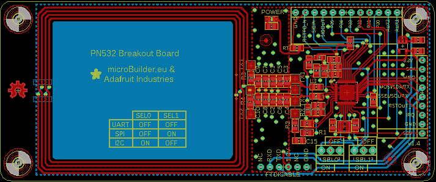

Contents
========

* [PRA364 > Adafruit PN532 RFID NFC Breakout](#pra364--adafruit-pn532-rfid-nfc-breakout)
	* [Schematic](#schematic)
	* [PCB](#pcb)
	* [OOMP Parts](#oomp-parts)
	* [Images](#images)
	* [Tags](#tags)
  
![][im]
# PRA364 > Adafruit PN532 RFID NFC Breakout

- ID: PROJ-ADAF-364-STAN-01
- Hex ID: PRA364
- Name: Adafruit 364
- Description: Adafruit 364
- Long Link: [http://oom.lt/PROJ-ADAF-364-STAN-01](http://oom.lt/PROJ-ADAF-364-STAN-01)
- Short Link: [http://oom.lt/PRA364](http://oom.lt/PRA364)

## Schematic
  

## PCB
  

## OOMP Parts
  

|OOMP ID|Name|Identifier|
| :---: | :---: | :---: |
|CAPC-0805-X-PF22-01||C1, C2|
|CAPC-0805-X-PF220-01||C3, C4|
|[CAPC-0805-X-NF100-V50](https://github.com/oomlout/oomlout_OOMP_parts/tree/main/CAPC-0805-X-NF100-V50/)|[SMD (0805) 100 nF Capacitor (Ceramic) 50v](https://github.com/oomlout/oomlout_OOMP_parts/tree/main/CAPC-0805-X-NF100-V50/)|[C5, C6, C9, C10](https://github.com/oomlout/oomlout_OOMP_parts/tree/main/CAPC-0805-X-NF100-V50/)|
|CAPC-0805-X-PF100-01||C7, C8|
|CAPC-0805-X-UNMATCHED-01||C11, C14, C15, C16, C17, C18, C19, C20, C21, C22, C23, C24, C25, C26|
|CAPC-0805-X-PF33-01||C12, C13|
|UNMATCHED-UNMATCHED-X-UNMATCHED-01||CN1, JP1, JP2, U1, Y1|
|[HEAD-I01-X-PI12-01](https://github.com/oomlout/oomlout_OOMP_parts/tree/main/HEAD-I01-X-PI12-01/)|[2.54 mm 12 Pin Header](https://github.com/oomlout/oomlout_OOMP_parts/tree/main/HEAD-I01-X-PI12-01/)|[JP3](https://github.com/oomlout/oomlout_OOMP_parts/tree/main/HEAD-I01-X-PI12-01/)|
|[HEAD-I01-X-PI08-01](https://github.com/oomlout/oomlout_OOMP_parts/tree/main/HEAD-I01-X-PI08-01/)|[2.54 mm 8 Pin Header](https://github.com/oomlout/oomlout_OOMP_parts/tree/main/HEAD-I01-X-PI08-01/)|[JP4](https://github.com/oomlout/oomlout_OOMP_parts/tree/main/HEAD-I01-X-PI08-01/)|
|HEAD-I01-X-PI01-01||JP5|
|UNMATCHED-0603-X-UNMATCHED-01||L1, L2|
|UNMATCHED-0805-X-UNMATCHED-01||L3, L4|
|[LEDS-0805-G-STAN-01](https://github.com/oomlout/oomlout_OOMP_parts/tree/main/LEDS-0805-G-STAN-01/)|[SMD (0805) Green LED](https://github.com/oomlout/oomlout_OOMP_parts/tree/main/LEDS-0805-G-STAN-01/)|[LED1](https://github.com/oomlout/oomlout_OOMP_parts/tree/main/LEDS-0805-G-STAN-01/)|
|[RESE-0805-X-O102-01](https://github.com/oomlout/oomlout_OOMP_parts/tree/main/RESE-0805-X-O102-01/)|[SMD (0805) 1k Ohm Resistor](https://github.com/oomlout/oomlout_OOMP_parts/tree/main/RESE-0805-X-O102-01/)|[R1](https://github.com/oomlout/oomlout_OOMP_parts/tree/main/RESE-0805-X-O102-01/)|
|RESE-0805-X-UNMATCHED-01||R2, R3, R4, R8|
|RESE-UNMATCHED-X-UNMATCHED-01||R5, R6|
|[RESE-0805-X-O103-01](https://github.com/oomlout/oomlout_OOMP_parts/tree/main/RESE-0805-X-O103-01/)|[SMD (0805) 10k Ohm Resistor](https://github.com/oomlout/oomlout_OOMP_parts/tree/main/RESE-0805-X-O103-01/)|[R7](https://github.com/oomlout/oomlout_OOMP_parts/tree/main/RESE-0805-X-O103-01/)|
|UNMATCHED-SO235-X-UNMATCHED-01||U2|

## Images
  
  

|kicadPcb3d|kicadPcb3dFront|kicadPcb3dBack|eagleImage|eagleSchemImage|
| :---: | :---: | :---: | :---: | :---: |
||||||

## Tags

- hexID: PRA364
- oompType: PROJ
- oompSize: ADAF
- oompColor: 364
- oompDesc: STAN
- oompIndex: 01
- oompName: Adafruit PN532 RFID NFC Breakout
- sources: All source files from https://github.com/adafruit/Adafruit-PN532-RFID-NFC-Breakout (source licence details in srcLicense.md)
- linkBuyPage: http://www.adafruit.com/products/364
- oompID: PROJ-ADAF-364-STAN-01
- oompParts: C1,CAPC-0805-X-PF22-01
- oompParts: C2,CAPC-0805-X-PF22-01
- oompParts: C3,CAPC-0805-X-PF220-01
- oompParts: C4,CAPC-0805-X-PF220-01
- oompParts: C5,CAPC-0805-X-NF100-V50
- oompParts: C6,CAPC-0805-X-NF100-V50
- oompParts: C7,CAPC-0805-X-PF100-01
- oompParts: C8,CAPC-0805-X-PF100-01
- oompParts: C9,CAPC-0805-X-NF100-V50
- oompParts: C10,CAPC-0805-X-NF100-V50
- oompParts: C11,CAPC-0805-X-UNMATCHED-01
- oompParts: C12,CAPC-0805-X-PF33-01
- oompParts: C13,CAPC-0805-X-PF33-01
- oompParts: C14,CAPC-0805-X-UNMATCHED-01
- oompParts: C15,CAPC-0805-X-UNMATCHED-01
- oompParts: C16,CAPC-0805-X-UNMATCHED-01
- oompParts: C17,CAPC-0805-X-UNMATCHED-01
- oompParts: C18,CAPC-0805-X-UNMATCHED-01
- oompParts: C19,CAPC-0805-X-UNMATCHED-01
- oompParts: C20,CAPC-0805-X-UNMATCHED-01
- oompParts: C21,CAPC-0805-X-UNMATCHED-01
- oompParts: C22,CAPC-0805-X-UNMATCHED-01
- oompParts: C23,CAPC-0805-X-UNMATCHED-01
- oompParts: C24,CAPC-0805-X-UNMATCHED-01
- oompParts: C25,CAPC-0805-X-UNMATCHED-01
- oompParts: C26,CAPC-0805-X-UNMATCHED-01
- oompParts: CN1,UNMATCHED-UNMATCHED-X-UNMATCHED-01
- oompParts: JP1,UNMATCHED-UNMATCHED-X-UNMATCHED-01
- oompParts: JP2,UNMATCHED-UNMATCHED-X-UNMATCHED-01
- oompParts: JP3,HEAD-I01-X-PI12-01
- oompParts: JP4,HEAD-I01-X-PI08-01
- oompParts: JP5,HEAD-I01-X-PI01-01
- oompParts: L1,UNMATCHED-0603-X-UNMATCHED-01
- oompParts: L2,UNMATCHED-0603-X-UNMATCHED-01
- oompParts: L3,UNMATCHED-0805-X-UNMATCHED-01
- oompParts: L4,UNMATCHED-0805-X-UNMATCHED-01
- oompParts: LED1,LEDS-0805-G-STAN-01
- oompParts: R1,RESE-0805-X-O102-01
- oompParts: R2,RESE-0805-X-UNMATCHED-01
- oompParts: R3,RESE-0805-X-UNMATCHED-01
- oompParts: R4,RESE-0805-X-UNMATCHED-01
- oompParts: R5,RESE-UNMATCHED-X-UNMATCHED-01
- oompParts: R6,RESE-UNMATCHED-X-UNMATCHED-01
- oompParts: R7,RESE-0805-X-O103-01
- oompParts: R8,RESE-0805-X-UNMATCHED-01
- oompParts: U1,UNMATCHED-UNMATCHED-X-UNMATCHED-01
- oompParts: U2,UNMATCHED-SO235-X-UNMATCHED-01
- oompParts: Y1,UNMATCHED-UNMATCHED-X-UNMATCHED-01
- rawParts: C1,22pF,CAP_CERAMIC0805,0805,Ceramic Capacitors,,
- rawParts: C2,22pF,CAP_CERAMIC0805,0805,Ceramic Capacitors,,
- rawParts: C3,220pF,CAP_CERAMIC0805,0805,Ceramic Capacitors,,
- rawParts: C4,220pF,CAP_CERAMIC0805,0805,Ceramic Capacitors,,
- rawParts: C5,NC,CAP_CERAMIC0805,0805,Ceramic Capacitors,,
- rawParts: C6,NC,CAP_CERAMIC0805,0805,Ceramic Capacitors,,
- rawParts: C7,100pF,CAP_CERAMIC0805,0805,Ceramic Capacitors,,
- rawParts: C8,100pF,CAP_CERAMIC0805,0805,Ceramic Capacitors,,
- rawParts: C9,NC,CAP_CERAMIC0805,0805,Ceramic Capacitors,,
- rawParts: C10,NC,CAP_CERAMIC0805,0805,Ceramic Capacitors,,
- rawParts: C11,0.1µF,CAP_CERAMIC0805,0805,Ceramic Capacitors,,
- rawParts: C12,33pF,CAP_CERAMIC0805,0805,Ceramic Capacitors,,
- rawParts: C13,33pF,CAP_CERAMIC0805,0805,Ceramic Capacitors,,
- rawParts: C14,0.1µF,CAP_CERAMIC0805,0805,Ceramic Capacitors,,
- rawParts: C15,1000pF,CAP_CERAMIC0805,0805,Ceramic Capacitors,,
- rawParts: C16,0.1µF,CAP_CERAMIC0805,0805,Ceramic Capacitors,,
- rawParts: C17,0.1µF,CAP_CERAMIC0805,0805,Ceramic Capacitors,,
- rawParts: C18,10µF,CAP_CERAMIC0805,0805,Ceramic Capacitors,,
- rawParts: C19,10µF,CAP_CERAMIC0805,0805,Ceramic Capacitors,,
- rawParts: C20,0.1µF,CAP_CERAMIC0805,0805,Ceramic Capacitors,,
- rawParts: C21,10µF,CAP_CERAMIC0805,0805,Ceramic Capacitors,,
- rawParts: C22,10µF,CAP_CERAMIC0805,0805,Ceramic Capacitors,,
- rawParts: C23,0.1µF,CAP_CERAMIC0805,0805,Ceramic Capacitors,,
- rawParts: C24,0.1µF,CAP_CERAMIC0805,0805,Ceramic Capacitors,,
- rawParts: C25,10µF,CAP_CERAMIC0805,0805,Ceramic Capacitors,,
- rawParts: C26,10µF,CAP_CERAMIC0805,0805,Ceramic Capacitors,,
- rawParts: CN1,FTDI,FTDIUSBCABLE,1X06_ROUND,FTDI TTL-232R USB Cable,,
- rawParts: FID1,FIDUCIAL1X2.5,FIDUCIAL1X2.5,FIDUCIAL-1X2.5,Fiducial Alignment Points,,
- rawParts: FID2,FIDUCIAL1X2.5,FIDUCIAL1X2.5,FIDUCIAL-1X2.5,Fiducial Alignment Points,,
- rawParts: JP1,SEL0,JUMPER3,JUMPER3,JUMPER - 3 Pins,,
- rawParts: JP2,SEL1,JUMPER3,JUMPER3,JUMPER - 3 Pins,,
- rawParts: JP3,,HEADER-1X12,1X12_ROUND,,,
- rawParts: JP4,,HEADER-1X8ROUND,1X08_ROUND,PIN HEADER,,
- rawParts: JP5,,HEADER-1X1ROUND,1X01_ROUND,PIN HEADER,,
- rawParts: L1,FERRITE,FERRITE,0603,Ferrite Bead,,
- rawParts: L2,FERRITE,FERRITE,0603,Ferrite Bead,,
- rawParts: L3,560nH,INDUCTOR0805,0805,Inductors,,
- rawParts: L4,560nH,INDUCTOR0805,0805,Inductors,,
- rawParts: LED1,PWR,LED0805,CHIPLED_0805,LED,,
- rawParts: R1,1.0K,RESISTOR0805,0805,Resistors,,
- rawParts: R2,1.69K,RESISTOR0805,0805,Resistors,,
- rawParts: R3,1.5,RESISTOR0805,0805,Resistors,,
- rawParts: R4,1.5,RESISTOR0805,0805,Resistors,,
- rawParts: R5,NC,R-EU_R0201,R0201,RESISTOR, European symbol,,
- rawParts: R6,NC,R-EU_R0201,R0201,RESISTOR, European symbol,,
- rawParts: R7,10K,RESISTOR0805,0805,Resistors,,
- rawParts: R8,TBD,RESISTOR0805,0805,Resistors,,
- rawParts: TP1,TX1_POST,TESTPOINTPAD,TESTPOINT_PAD_2MM,Test Point,,
- rawParts: TP2,TGND,TESTPOINTPAD,TESTPOINT_PAD_2MM,Test Point,,
- rawParts: TP3,TX2_POST,TESTPOINTPAD,TESTPOINT_PAD_2MM,Test Point,,
- rawParts: TP4,TX2_PRE,TESTPOINTPAD,TESTPOINT_PAD_2MM,Test Point,,
- rawParts: TP5,TX1_PRE,TESTPOINTPAD,TESTPOINT_PAD_2MM,Test Point,,
- rawParts: TP6,TGND,TESTPOINTPAD,TESTPOINT_PAD_2MM,Test Point,,
- rawParts: TP7,RX,TESTPOINTPAD,TESTPOINT_PAD_2MM,Test Point,,
- rawParts: U1,PN532,PN532,HVQFN40-6X6,PN532 - Near Field Communication (NFC) controller,,
- rawParts: U2,ADP121(3.3V),VREG_SOT23-5,SOT23-5,SOT23-5 Fixed Voltage Regulators,,
- rawParts: Y1,27.12MHz,CRYSTALTHIN,CRYSTAL_3.2X2.5,Crystals,,

[im]: kicadPcb3d_450.png
