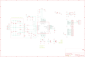

Contents
========

* [PRA364 > Adafruit](#pra364--adafruit)
	* [Schematic](#schematic)
	* [OOMP Parts](#oomp-parts)
	* [Images](#images)
	* [Tags](#tags)
  
![][im]
# PRA364 > Adafruit

- ID: PROJ-ADAF-364-STAN-01
- Hex ID: PRA364
- Name: Adafruit
- Description: Adafruit
- Long Link: [http://oom.lt/PROJ-ADAF-364-STAN-01](http://oom.lt/PROJ-ADAF-364-STAN-01)
- Short Link: [http://oom.lt/PRA364](http://oom.lt/PRA364)

## Schematic
  

## OOMP Parts
  

|OOMP Parts|
| :---: |
|C1,CAPC-0805-X-UNMATCHED-01,C1,22pF,CAP_CERAMIC0805,0805,Ceramic Capacitors,,|
|C2,CAPC-0805-X-UNMATCHED-01,C2,22pF,CAP_CERAMIC0805,0805,Ceramic Capacitors,,|
|C3,CAPC-0805-X-UNMATCHED-01,C3,220pF,CAP_CERAMIC0805,0805,Ceramic Capacitors,,|
|C4,CAPC-0805-X-UNMATCHED-01,C4,220pF,CAP_CERAMIC0805,0805,Ceramic Capacitors,,|
|C5,CAPC-0805-X-UNMATCHED-01,C5,NC,CAP_CERAMIC0805,0805,Ceramic Capacitors,,|
|C6,CAPC-0805-X-UNMATCHED-01,C6,NC,CAP_CERAMIC0805,0805,Ceramic Capacitors,,|
|C7,CAPC-0805-X-UNMATCHED-01,C7,100pF,CAP_CERAMIC0805,0805,Ceramic Capacitors,,|
|C8,CAPC-0805-X-UNMATCHED-01,C8,100pF,CAP_CERAMIC0805,0805,Ceramic Capacitors,,|
|C9,CAPC-0805-X-UNMATCHED-01,C9,NC,CAP_CERAMIC0805,0805,Ceramic Capacitors,,|
|C10,CAPC-0805-X-UNMATCHED-01,C10,NC,CAP_CERAMIC0805,0805,Ceramic Capacitors,,|
|C11,CAPC-0805-X-UNMATCHED-01,C11,0.1µF,CAP_CERAMIC0805,0805,Ceramic Capacitors,,|
|C12,CAPC-0805-X-UNMATCHED-01,C12,33pF,CAP_CERAMIC0805,0805,Ceramic Capacitors,,|
|C13,CAPC-0805-X-UNMATCHED-01,C13,33pF,CAP_CERAMIC0805,0805,Ceramic Capacitors,,|
|C14,CAPC-0805-X-UNMATCHED-01,C14,0.1µF,CAP_CERAMIC0805,0805,Ceramic Capacitors,,|
|C15,CAPC-0805-X-UNMATCHED-01,C15,1000pF,CAP_CERAMIC0805,0805,Ceramic Capacitors,,|
|C16,CAPC-0805-X-UNMATCHED-01,C16,0.1µF,CAP_CERAMIC0805,0805,Ceramic Capacitors,,|
|C17,CAPC-0805-X-UNMATCHED-01,C17,0.1µF,CAP_CERAMIC0805,0805,Ceramic Capacitors,,|
|C18,CAPC-0805-X-UNMATCHED-01,C18,10µF,CAP_CERAMIC0805,0805,Ceramic Capacitors,,|
|C19,CAPC-0805-X-UNMATCHED-01,C19,10µF,CAP_CERAMIC0805,0805,Ceramic Capacitors,,|
|C20,CAPC-0805-X-UNMATCHED-01,C20,0.1µF,CAP_CERAMIC0805,0805,Ceramic Capacitors,,|
|C21,CAPC-0805-X-UNMATCHED-01,C21,10µF,CAP_CERAMIC0805,0805,Ceramic Capacitors,,|
|C22,CAPC-0805-X-UNMATCHED-01,C22,10µF,CAP_CERAMIC0805,0805,Ceramic Capacitors,,|
|C23,CAPC-0805-X-UNMATCHED-01,C23,0.1µF,CAP_CERAMIC0805,0805,Ceramic Capacitors,,|
|C24,CAPC-0805-X-UNMATCHED-01,C24,0.1µF,CAP_CERAMIC0805,0805,Ceramic Capacitors,,|
|C25,CAPC-0805-X-UNMATCHED-01,C25,10µF,CAP_CERAMIC0805,0805,Ceramic Capacitors,,|
|C26,CAPC-0805-X-UNMATCHED-01,C26,10µF,CAP_CERAMIC0805,0805,Ceramic Capacitors,,|
|CN1,UNMATCHED-UNMATCHED-X-UNMATCHED-01,CN1,FTDI,FTDIUSBCABLE,1X06_ROUND,FTDI TTL-232R USB Cable,,|
|JP1,UNMATCHED-UNMATCHED-X-UNMATCHED-01,FID1,FIDUCIAL1X2.5,FIDUCIAL1X2.5,FIDUCIAL-1X2.5,Fiducial Alignment Points,,|
|JP2,UNMATCHED-UNMATCHED-X-UNMATCHED-01,FID2,FIDUCIAL1X2.5,FIDUCIAL1X2.5,FIDUCIAL-1X2.5,Fiducial Alignment Points,,|
|JP3,HEAD-I01-X-PI12-01,JP1,SEL0,JUMPER3,JUMPER3,JUMPER - 3 Pins,,|
|JP4,HEAD-I01-X-PI08-01,JP2,SEL1,JUMPER3,JUMPER3,JUMPER - 3 Pins,,|
|JP5,HEAD-I01-X-PI01-01,JP3,,HEADER-1X12,1X12_ROUND,,,|
|L1,UNMATCHED-0603-X-UNMATCHED-01,JP4,,HEADER-1X8ROUND,1X08_ROUND,PIN HEADER,,|
|L2,UNMATCHED-0603-X-UNMATCHED-01,JP5,,HEADER-1X1ROUND,1X01_ROUND,PIN HEADER,,|
|L3,UNMATCHED-0805-X-UNMATCHED-01,L1,FERRITE,FERRITE,0603,Ferrite Bead,,|
|L4,UNMATCHED-0805-X-UNMATCHED-01,L2,FERRITE,FERRITE,0603,Ferrite Bead,,|
|LED1,LEDS-0805-G-STAN-01,L3,560nH,INDUCTOR0805,0805,Inductors,,|
|R1,RESE-0805-X-UNMATCHED-01,L4,560nH,INDUCTOR0805,0805,Inductors,,|
|R2,RESE-0805-X-UNMATCHED-01,LED1,PWR,LED0805,CHIPLED_0805,LED,,|
|R3,RESE-0805-X-UNMATCHED-01,R1,1.0K,RESISTOR0805,0805,Resistors,,|
|R4,RESE-0805-X-UNMATCHED-01,R2,1.69K,RESISTOR0805,0805,Resistors,,|
|R5,RESE-UNMATCHED-X-UNMATCHED-01,R3,1.5,RESISTOR0805,0805,Resistors,,|
|R6,RESE-UNMATCHED-X-UNMATCHED-01,R4,1.5,RESISTOR0805,0805,Resistors,,|
|R7,RESE-0805-X-O103-01,R5,NC,R-EU_R0201,R0201,RESISTOR, European symbol,,|
|R8,RESE-0805-X-UNMATCHED-01,R6,NC,R-EU_R0201,R0201,RESISTOR, European symbol,,|
|TP1,UNMATCHED-UNMATCHED-X-UNMATCHED-01,R7,10K,RESISTOR0805,0805,Resistors,,|
|TP2,UNMATCHED-UNMATCHED-X-UNMATCHED-01,R8,TBD,RESISTOR0805,0805,Resistors,,|
|TP3,UNMATCHED-UNMATCHED-X-UNMATCHED-01,TP1,TX1_POST,TESTPOINTPAD,TESTPOINT_PAD_2MM,Test Point,,|
|TP4,UNMATCHED-UNMATCHED-X-UNMATCHED-01,TP2,TGND,TESTPOINTPAD,TESTPOINT_PAD_2MM,Test Point,,|
|TP5,UNMATCHED-UNMATCHED-X-UNMATCHED-01,TP3,TX2_POST,TESTPOINTPAD,TESTPOINT_PAD_2MM,Test Point,,|
|TP6,UNMATCHED-UNMATCHED-X-UNMATCHED-01,TP4,TX2_PRE,TESTPOINTPAD,TESTPOINT_PAD_2MM,Test Point,,|
|TP7,UNMATCHED-UNMATCHED-X-UNMATCHED-01,TP5,TX1_PRE,TESTPOINTPAD,TESTPOINT_PAD_2MM,Test Point,,|
|U1,UNMATCHED-UNMATCHED-X-UNMATCHED-01,TP6,TGND,TESTPOINTPAD,TESTPOINT_PAD_2MM,Test Point,,|
|U2,UNMATCHED-SO235-X-UNMATCHED-01,TP7,RX,TESTPOINTPAD,TESTPOINT_PAD_2MM,Test Point,,|
|Y1,UNMATCHED-UNMATCHED-X-UNMATCHED-01,U1,PN532,PN532,HVQFN40-6X6,PN532 - Near Field Communication (NFC) controller,,|

## Images
  
  

|kicadPcb3d|kicadPcb3dFront|kicadPcb3dBack|eagleImage|eagleSchemImage|
| :---: | :---: | :---: | :---: | :---: |
||||||

## Tags

- hexID: PRA364
- oompType: PROJ
- oompSize: ADAF
- oompColor: 364
- oompDesc: STAN
- oompIndex: 01
- oompName: Adafruit PN532 RFID NFC Breakout
- sources: All source files from https://github.com/adafruit/Adafruit-PN532-RFID-NFC-Breakout (source licence details in srcLicense.md)
- linkBuyPage: http://www.adafruit.com/products/364
- oompID: PROJ-ADAF-364-STAN-01
- oompParts: C1,CAPC-0805-X-UNMATCHED-01
- oompParts: C2,CAPC-0805-X-UNMATCHED-01
- oompParts: C3,CAPC-0805-X-UNMATCHED-01
- oompParts: C4,CAPC-0805-X-UNMATCHED-01
- oompParts: C5,CAPC-0805-X-UNMATCHED-01
- oompParts: C6,CAPC-0805-X-UNMATCHED-01
- oompParts: C7,CAPC-0805-X-UNMATCHED-01
- oompParts: C8,CAPC-0805-X-UNMATCHED-01
- oompParts: C9,CAPC-0805-X-UNMATCHED-01
- oompParts: C10,CAPC-0805-X-UNMATCHED-01
- oompParts: C11,CAPC-0805-X-UNMATCHED-01
- oompParts: C12,CAPC-0805-X-UNMATCHED-01
- oompParts: C13,CAPC-0805-X-UNMATCHED-01
- oompParts: C14,CAPC-0805-X-UNMATCHED-01
- oompParts: C15,CAPC-0805-X-UNMATCHED-01
- oompParts: C16,CAPC-0805-X-UNMATCHED-01
- oompParts: C17,CAPC-0805-X-UNMATCHED-01
- oompParts: C18,CAPC-0805-X-UNMATCHED-01
- oompParts: C19,CAPC-0805-X-UNMATCHED-01
- oompParts: C20,CAPC-0805-X-UNMATCHED-01
- oompParts: C21,CAPC-0805-X-UNMATCHED-01
- oompParts: C22,CAPC-0805-X-UNMATCHED-01
- oompParts: C23,CAPC-0805-X-UNMATCHED-01
- oompParts: C24,CAPC-0805-X-UNMATCHED-01
- oompParts: C25,CAPC-0805-X-UNMATCHED-01
- oompParts: C26,CAPC-0805-X-UNMATCHED-01
- oompParts: CN1,UNMATCHED-UNMATCHED-X-UNMATCHED-01
- oompParts: JP1,UNMATCHED-UNMATCHED-X-UNMATCHED-01
- oompParts: JP2,UNMATCHED-UNMATCHED-X-UNMATCHED-01
- oompParts: JP3,HEAD-I01-X-PI12-01
- oompParts: JP4,HEAD-I01-X-PI08-01
- oompParts: JP5,HEAD-I01-X-PI01-01
- oompParts: L1,UNMATCHED-0603-X-UNMATCHED-01
- oompParts: L2,UNMATCHED-0603-X-UNMATCHED-01
- oompParts: L3,UNMATCHED-0805-X-UNMATCHED-01
- oompParts: L4,UNMATCHED-0805-X-UNMATCHED-01
- oompParts: LED1,LEDS-0805-G-STAN-01
- oompParts: R1,RESE-0805-X-UNMATCHED-01
- oompParts: R2,RESE-0805-X-UNMATCHED-01
- oompParts: R3,RESE-0805-X-UNMATCHED-01
- oompParts: R4,RESE-0805-X-UNMATCHED-01
- oompParts: R5,RESE-UNMATCHED-X-UNMATCHED-01
- oompParts: R6,RESE-UNMATCHED-X-UNMATCHED-01
- oompParts: R7,RESE-0805-X-O103-01
- oompParts: R8,RESE-0805-X-UNMATCHED-01
- oompParts: TP1,UNMATCHED-UNMATCHED-X-UNMATCHED-01
- oompParts: TP2,UNMATCHED-UNMATCHED-X-UNMATCHED-01
- oompParts: TP3,UNMATCHED-UNMATCHED-X-UNMATCHED-01
- oompParts: TP4,UNMATCHED-UNMATCHED-X-UNMATCHED-01
- oompParts: TP5,UNMATCHED-UNMATCHED-X-UNMATCHED-01
- oompParts: TP6,UNMATCHED-UNMATCHED-X-UNMATCHED-01
- oompParts: TP7,UNMATCHED-UNMATCHED-X-UNMATCHED-01
- oompParts: U1,UNMATCHED-UNMATCHED-X-UNMATCHED-01
- oompParts: U2,UNMATCHED-SO235-X-UNMATCHED-01
- oompParts: Y1,UNMATCHED-UNMATCHED-X-UNMATCHED-01
- rawParts: C1,22pF,CAP_CERAMIC0805,0805,Ceramic Capacitors,,
- rawParts: C2,22pF,CAP_CERAMIC0805,0805,Ceramic Capacitors,,
- rawParts: C3,220pF,CAP_CERAMIC0805,0805,Ceramic Capacitors,,
- rawParts: C4,220pF,CAP_CERAMIC0805,0805,Ceramic Capacitors,,
- rawParts: C5,NC,CAP_CERAMIC0805,0805,Ceramic Capacitors,,
- rawParts: C6,NC,CAP_CERAMIC0805,0805,Ceramic Capacitors,,
- rawParts: C7,100pF,CAP_CERAMIC0805,0805,Ceramic Capacitors,,
- rawParts: C8,100pF,CAP_CERAMIC0805,0805,Ceramic Capacitors,,
- rawParts: C9,NC,CAP_CERAMIC0805,0805,Ceramic Capacitors,,
- rawParts: C10,NC,CAP_CERAMIC0805,0805,Ceramic Capacitors,,
- rawParts: C11,0.1µF,CAP_CERAMIC0805,0805,Ceramic Capacitors,,
- rawParts: C12,33pF,CAP_CERAMIC0805,0805,Ceramic Capacitors,,
- rawParts: C13,33pF,CAP_CERAMIC0805,0805,Ceramic Capacitors,,
- rawParts: C14,0.1µF,CAP_CERAMIC0805,0805,Ceramic Capacitors,,
- rawParts: C15,1000pF,CAP_CERAMIC0805,0805,Ceramic Capacitors,,
- rawParts: C16,0.1µF,CAP_CERAMIC0805,0805,Ceramic Capacitors,,
- rawParts: C17,0.1µF,CAP_CERAMIC0805,0805,Ceramic Capacitors,,
- rawParts: C18,10µF,CAP_CERAMIC0805,0805,Ceramic Capacitors,,
- rawParts: C19,10µF,CAP_CERAMIC0805,0805,Ceramic Capacitors,,
- rawParts: C20,0.1µF,CAP_CERAMIC0805,0805,Ceramic Capacitors,,
- rawParts: C21,10µF,CAP_CERAMIC0805,0805,Ceramic Capacitors,,
- rawParts: C22,10µF,CAP_CERAMIC0805,0805,Ceramic Capacitors,,
- rawParts: C23,0.1µF,CAP_CERAMIC0805,0805,Ceramic Capacitors,,
- rawParts: C24,0.1µF,CAP_CERAMIC0805,0805,Ceramic Capacitors,,
- rawParts: C25,10µF,CAP_CERAMIC0805,0805,Ceramic Capacitors,,
- rawParts: C26,10µF,CAP_CERAMIC0805,0805,Ceramic Capacitors,,
- rawParts: CN1,FTDI,FTDIUSBCABLE,1X06_ROUND,FTDI TTL-232R USB Cable,,
- rawParts: FID1,FIDUCIAL1X2.5,FIDUCIAL1X2.5,FIDUCIAL-1X2.5,Fiducial Alignment Points,,
- rawParts: FID2,FIDUCIAL1X2.5,FIDUCIAL1X2.5,FIDUCIAL-1X2.5,Fiducial Alignment Points,,
- rawParts: JP1,SEL0,JUMPER3,JUMPER3,JUMPER - 3 Pins,,
- rawParts: JP2,SEL1,JUMPER3,JUMPER3,JUMPER - 3 Pins,,
- rawParts: JP3,,HEADER-1X12,1X12_ROUND,,,
- rawParts: JP4,,HEADER-1X8ROUND,1X08_ROUND,PIN HEADER,,
- rawParts: JP5,,HEADER-1X1ROUND,1X01_ROUND,PIN HEADER,,
- rawParts: L1,FERRITE,FERRITE,0603,Ferrite Bead,,
- rawParts: L2,FERRITE,FERRITE,0603,Ferrite Bead,,
- rawParts: L3,560nH,INDUCTOR0805,0805,Inductors,,
- rawParts: L4,560nH,INDUCTOR0805,0805,Inductors,,
- rawParts: LED1,PWR,LED0805,CHIPLED_0805,LED,,
- rawParts: R1,1.0K,RESISTOR0805,0805,Resistors,,
- rawParts: R2,1.69K,RESISTOR0805,0805,Resistors,,
- rawParts: R3,1.5,RESISTOR0805,0805,Resistors,,
- rawParts: R4,1.5,RESISTOR0805,0805,Resistors,,
- rawParts: R5,NC,R-EU_R0201,R0201,RESISTOR, European symbol,,
- rawParts: R6,NC,R-EU_R0201,R0201,RESISTOR, European symbol,,
- rawParts: R7,10K,RESISTOR0805,0805,Resistors,,
- rawParts: R8,TBD,RESISTOR0805,0805,Resistors,,
- rawParts: TP1,TX1_POST,TESTPOINTPAD,TESTPOINT_PAD_2MM,Test Point,,
- rawParts: TP2,TGND,TESTPOINTPAD,TESTPOINT_PAD_2MM,Test Point,,
- rawParts: TP3,TX2_POST,TESTPOINTPAD,TESTPOINT_PAD_2MM,Test Point,,
- rawParts: TP4,TX2_PRE,TESTPOINTPAD,TESTPOINT_PAD_2MM,Test Point,,
- rawParts: TP5,TX1_PRE,TESTPOINTPAD,TESTPOINT_PAD_2MM,Test Point,,
- rawParts: TP6,TGND,TESTPOINTPAD,TESTPOINT_PAD_2MM,Test Point,,
- rawParts: TP7,RX,TESTPOINTPAD,TESTPOINT_PAD_2MM,Test Point,,
- rawParts: U1,PN532,PN532,HVQFN40-6X6,PN532 - Near Field Communication (NFC) controller,,
- rawParts: U2,ADP121(3.3V),VREG_SOT23-5,SOT23-5,SOT23-5 Fixed Voltage Regulators,,
- rawParts: Y1,27.12MHz,CRYSTALTHIN,CRYSTAL_3.2X2.5,Crystals,,

[im]: kicadPcb3d_450.png
