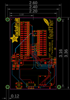
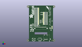
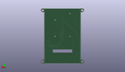
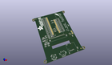

Contents
========

* [PROJ-ADAF-3651-STAN-01>Adafruit 3.5in TFT Featherwing PCB](#proj-adaf-3651-stan-01adafruit-35in-tft-featherwing-pcb)
	* [Images](#images)
	* [Interactive BOM](#interactive-bom)
	* [OOMP Parts](#oomp-parts)
	* [Tags](#tags)
  
![][im]
# PROJ-ADAF-3651-STAN-01>Adafruit 3.5in TFT Featherwing PCB

- ID: PROJ-ADAF-3651-STAN-01
- Hex ID: PRA3651
- Name: Adafruit 3.5in TFT Featherwing PCB
- Description: 

## Images
  
  

|eagleImage|kicadPcb3dFront|kicadPcb3dBack|kicadPcb3d|
| :---: | :---: | :---: | :---: |
|||||

## Interactive BOM

- Interactive BOM page: [ibom.html](kicad/bom/ibom.html)

## OOMP Parts
  

|OOMP Parts|
| :---: |
|CAPE-0805-X-UNMATCHED-01, C1, -9.779, -0.254, 90,C1, 1uF, 0805-NO, microbuilder, (-0.385, -0.01), R90|
|CAPE-0805-X-UNMATCHED-01, C2, -18.541999999999998, 1.016, 0,C2, 10uF, 0805-NO, microbuilder, (-0.73, 0.04), R0|
|CAPE-0805-X-UNMATCHED-01, C3, 23.368, -10.668, 270,C3, 10uF, 0805-NO, microbuilder, (0.92, -0.42), R270|
|CAPE-0805-X-UNMATCHED-01, C4, 21.59, -32.004, 90,C4, 10uF, 0805-NO, microbuilder, (0.85, -1.26), R90|
|CAPE-0805-X-UNMATCHED-01, C5, -23.114, 2.54, 180,C5, 10uF, 0805-NO, microbuilder, (-0.91, 0.1), R180|
|CAPE-0805-X-UNMATCHED-01, C16, -18.541999999999998, 3.6829999999999994, 0,C16, 1uF, 0805-NO, microbuilder, (-0.73, 0.145), R0|
|CAPE-0805-X-NF100-01, C18, -13.843, -1.27, 180,C18, 0.1uF, 0805-NO, microbuilder, (-0.545, -0.05), R180|
|CAPE-0805-X-UNMATCHED-01, C20, -18.796, -13.589, 180,C20, 1uF, 0805-NO, microbuilder, (-0.74, -0.535), R180|
|UNMATCHED-UNMATCHED-X-UNMATCHED-01, D1, -20.574, -10.033, 180,D1, MM3Z24VT1G, SMADIODE, microbuilder, (-0.81, -0.395), R180|
|UNMATCHED-UNMATCHED-X-UNMATCHED-01, D2, -20.827999999999996, -6.731, 180,D2, MBR0540, SOD-123, microbuilder, (-0.82, -0.265), R180|
|UNMATCHED-UNMATCHED-X-UNMATCHED-01, D3, 1.5239999999999998, 31.241999999999997, 0,D3, MBR120, SOD-123, microbuilder, (0.06, 1.23), R0|
|UNMATCHED-UNMATCHED-X-UNMATCHED-01, D4, 1.5239999999999998, 26.162, 0,D4, MBR120, SOD-123, microbuilder, (0.06, 1.03), R0|
|ERROR, ENABLE Slide Switch, 0, 0, 0,ENABLE, Slide, Switch, EG1390, microbuilder, (-0.1, -1.27), R180|
|UNMATCHED-UNMATCHED-X-UNMATCHED-01, IC4, -4.3180000000000005, -0.254, 270,IC4, APX803-SAG, SOT23, adafruit, (-0.17, -0.01), R270|
|UNMATCHED-UNMATCHED-X-UNMATCHED-01, L1, -23.368, -1.778, 270,L1, 15uH, INDUCTOR_5X5MM_NR5040_NOTHERMALS, microbuilder, (-0.92, -0.07), R270|
|UNMATCHED-UNMATCHED-X-UNMATCHED-01, MS2, -11.43, 47.751999999999995, 270,MS2, FEATHERWING_SMTDUAL, FEATHERWING_SMT2, microbuilder, (-0.45, 1.88), R270|
|RESE-0805-X-UNMATCHED-01, R1, -23.622, -13.716, 0,R1, 12?, 0805-NO, microbuilder, (-0.93, -0.54), R0|
|RESE-0805-X-O104-01, R2, -0.508, 6.858, 180,R2, 100K, 0805-NO, microbuilder, (-0.02, 0.27), R180|
|RESE-0805-X-O104-01, R5, -0.508, 12.7, 180,R5, 100K, 0805-NO, microbuilder, (-0.02, 0.5), R180|
|<table><tr><td></td><td> R6</td><td>[RESE-0805-X-O103-01 SMD (0805) 10k Ohm Resistor](https://github.com/oomlout/oomlout_OOMP_parts/tree/main/RESE-0805-X-O103-01/)</td><td>[R85103](https://github.com/oomlout/oomlout_OOMP_parts/tree/main/RESE-0805-X-O103-01/)</td></tr></table>|
|RESE-0805-X-O104-01, R8, -0.508, 9.652, 180,R8, 100K, 0805-NO, microbuilder, (-0.02, 0.38), R180|
|<table><tr><td></td><td> R12</td><td>[RESE-0805-X-O103-01 SMD (0805) 10k Ohm Resistor](https://github.com/oomlout/oomlout_OOMP_parts/tree/main/RESE-0805-X-O103-01/)</td><td>[R85103](https://github.com/oomlout/oomlout_OOMP_parts/tree/main/RESE-0805-X-O103-01/)</td></tr></table>|
|UNMATCHED-UNMATCHED-X-UNMATCHED-01, SJ1, 5.334, 13.462, 180,SJ1, SOLDERJUMPER_CLOSEDWIRE, microbuilder, (0.21, 0.53), R180|
|UNMATCHED-UNMATCHED-X-UNMATCHED-01, SJ2, 5.334, 10.921999999999999, 180,SJ2, SOLDERJUMPER_CLOSEDWIRE, microbuilder, (0.21, 0.43), R180|
|UNMATCHED-UNMATCHED-X-UNMATCHED-01, SJ3, 5.334, 8.382, 180,SJ3, SOLDERJUMPER_CLOSEDWIRE, microbuilder, (0.21, 0.33), R180|
|UNMATCHED-UNMATCHED-X-UNMATCHED-01, SJ4, 5.334, 16.002, 180,SJ4, SOLDERJUMPER_CLOSEDWIRE, microbuilder, (0.21, 0.63), R180|
|UNMATCHED-UNMATCHED-X-UNMATCHED-01, SW1, -17.018, -32.766, 0,SW1, EVQQ2, EVQ-Q2_SMALLER, microbuilder, (-0.67, -1.29), R0|
|UNMATCHED-UNMATCHED-X-UNMATCHED-01, TP1, 25.654, -5.842, 0,TP1, TESTPOINT_PAD_2MM, microbuilder, (1.01, -0.23), R0|
|UNMATCHED-UNMATCHED-X-UNMATCHED-01, TP2, 25.654, -2.54, 0,TP2, TESTPOINT_PAD_2MM, microbuilder, (1.01, -0.1), R0|
|UNMATCHED-UNMATCHED-X-UNMATCHED-01, TP4, -5.842, 41.401999999999994, 90,TP4, TESTPOINT_PAD_2MM, microbuilder, (-0.23, 1.63), R90|
|UNMATCHED-UNMATCHED-X-UNMATCHED-01, TP5, -5.842, 38.862, 90,TP5, TESTPOINT_PAD_2MM, microbuilder, (-0.23, 1.53), R90|
|UNMATCHED-UNMATCHED-X-UNMATCHED-01, TP6, -5.842, 36.321999999999996, 90,TP6, TESTPOINT_PAD_2MM, microbuilder, (-0.23, 1.43), R90|
|UNMATCHED-UNMATCHED-X-UNMATCHED-01, TP7, -5.842, 33.782, 90,TP7, TESTPOINT_PAD_2MM, microbuilder, (-0.23, 1.33), R90|
|UNMATCHED-UNMATCHED-X-UNMATCHED-01, TP8, -5.842, 31.241999999999997, 90,TP8, TESTPOINT_PAD_2MM, microbuilder, (-0.23, 1.23), R90|
|UNMATCHED-UNMATCHED-X-UNMATCHED-01, TP9, -5.842, 28.701999999999995, 90,TP9, TESTPOINT_PAD_2MM, microbuilder, (-0.23, 1.13), R90|
|UNMATCHED-UNMATCHED-X-UNMATCHED-01, TP10, 5.842, 28.701999999999995, 90,TP10, TESTPOINT_PAD_2MM, microbuilder, (0.23, 1.13), R90|
|UNMATCHED-UNMATCHED-X-UNMATCHED-01, TP11, -5.842, 26.162, 90,TP11, TESTPOINT_PAD_2MM, microbuilder, (-0.23, 1.03), R90|
|UNMATCHED-UNMATCHED-X-UNMATCHED-01, TP12, -5.842, 23.622, 90,TP12, TESTPOINT_PAD_2MM, microbuilder, (-0.23, 0.93), R90|
|UNMATCHED-UNMATCHED-X-UNMATCHED-01, TP13, -5.842, 21.081999999999997, 90,TP13, TESTPOINT_PAD_2MM, microbuilder, (-0.23, 0.83), R90|
|UNMATCHED-UNMATCHED-X-UNMATCHED-01, TP14, -5.842, 18.541999999999998, 90,TP14, TESTPOINT_PAD_2MM, microbuilder, (-0.23, 0.73), R90|
|UNMATCHED-UNMATCHED-X-UNMATCHED-01, TP15, -5.842, 16.002, 90,TP15, TESTPOINT_PAD_2MM, microbuilder, (-0.23, 0.63), R90|
|UNMATCHED-UNMATCHED-X-UNMATCHED-01, TP16, -5.842, 13.462, 90,TP16, TESTPOINT_PAD_2MM, microbuilder, (-0.23, 0.53), R90|
|UNMATCHED-UNMATCHED-X-UNMATCHED-01, TP17, -5.842, 10.921999999999999, 90,TP17, TESTPOINT_PAD_2MM, microbuilder, (-0.23, 0.43), R90|
|UNMATCHED-UNMATCHED-X-UNMATCHED-01, TP18, -5.842, 8.382, 90,TP18, TESTPOINT_PAD_2MM, microbuilder, (-0.23, 0.33), R90|
|UNMATCHED-UNMATCHED-X-UNMATCHED-01, TP19, -5.842, 5.842, 90,TP19, TESTPOINT_PAD_2MM, microbuilder, (-0.23, 0.23), R90|
|UNMATCHED-UNMATCHED-X-UNMATCHED-01, TP20, -5.842, 3.302, 90,TP20, TESTPOINT_PAD_2MM, microbuilder, (-0.23, 0.13), R90|
|UNMATCHED-UNMATCHED-X-UNMATCHED-01, TP21, 5.842, 31.241999999999997, 90,TP21, TESTPOINT_PAD_2MM, microbuilder, (0.23, 1.23), R90|
|UNMATCHED-UNMATCHED-X-UNMATCHED-01, TP22, 5.842, 26.162, 90,TP22, TESTPOINT_PAD_2MM, microbuilder, (0.23, 1.03), R90|
|UNMATCHED-UNMATCHED-X-UNMATCHED-01, TP23, 5.842, 23.622, 90,TP23, TESTPOINT_PAD_2MM, microbuilder, (0.23, 0.93), R90|
|UNMATCHED-UNMATCHED-X-UNMATCHED-01, TP24, 5.842, 21.081999999999997, 90,TP24, TESTPOINT_PAD_2MM, microbuilder, (0.23, 0.83), R90|
|UNMATCHED-UNMATCHED-X-UNMATCHED-01, TP25, 5.842, 18.541999999999998, 90,TP25, TESTPOINT_PAD_2MM, microbuilder, (0.23, 0.73), R90|
|UNMATCHED-UNMATCHED-X-UNMATCHED-01, TP26, 5.842, 5.842, 90,TP26, TESTPOINT_PAD_2MM, microbuilder, (0.23, 0.23), R90|
|UNMATCHED-UNMATCHED-X-UNMATCHED-01, TP27, 5.842, 3.302, 90,TP27, TESTPOINT_PAD_2MM, microbuilder, (0.23, 0.13), R90|
|UNMATCHED-UNMATCHED-X-UNMATCHED-01, U2, 21.336, -6.095999999999999, 0,U2, STMPE811, QFN16_3MM, microbuilder, (0.84, -0.24), R0|
|UNMATCHED-UNMATCHED-X-UNMATCHED-01, U3, -18.541999999999998, -2.794, 0,U3, FAN5333BSX, SOT23-5@1, microbuilder, (-0.73, -0.11), R0|
|UNMATCHED-UNMATCHED-X-UNMATCHED-01, X1, 6.095999999999999, -21.843999999999998, 0,X1, MicroSD, MICROSD, microbuilder, (0.24, -0.86), R0|
|ERROR, X2 3.5 TFT, 0, 0, 0,X2, 3.5, TFT, TFT_3.5IN_320X480_50PIN, microbuilder, (0, 0), MR0|

## Tags

- hexID: PRA3651
- oompType: PROJ
- oompSize: ADAF
- oompColor: 3651
- oompDesc: STAN
- oompIndex: 01
- oompName: Adafruit 3.5in TFT Featherwing PCB
- sources: All source files from https://github.com/adafruit/Adafruit-3.5in-TFT-Featherwing-PCB (source licence details in srcLicense.md)
- linkBuyPage: http://www.adafruit.com/products/3651
- oompPart: CAPE-0805-X-UNMATCHED-01, C1, -9.779, -0.254, 90
- oompPart: CAPE-0805-X-UNMATCHED-01, C2, -18.541999999999998, 1.016, 0
- oompPart: CAPE-0805-X-UNMATCHED-01, C3, 23.368, -10.668, 270
- oompPart: CAPE-0805-X-UNMATCHED-01, C4, 21.59, -32.004, 90
- oompPart: CAPE-0805-X-UNMATCHED-01, C5, -23.114, 2.54, 180
- oompPart: CAPE-0805-X-UNMATCHED-01, C16, -18.541999999999998, 3.6829999999999994, 0
- oompPart: CAPE-0805-X-NF100-01, C18, -13.843, -1.27, 180
- oompPart: CAPE-0805-X-UNMATCHED-01, C20, -18.796, -13.589, 180
- oompPart: UNMATCHED-UNMATCHED-X-UNMATCHED-01, D1, -20.574, -10.033, 180
- oompPart: UNMATCHED-UNMATCHED-X-UNMATCHED-01, D2, -20.827999999999996, -6.731, 180
- oompPart: UNMATCHED-UNMATCHED-X-UNMATCHED-01, D3, 1.5239999999999998, 31.241999999999997, 0
- oompPart: UNMATCHED-UNMATCHED-X-UNMATCHED-01, D4, 1.5239999999999998, 26.162, 0
- oompPart: ERROR, ENABLE Slide Switch, 0, 0, 0
- oompPart: UNMATCHED-UNMATCHED-X-UNMATCHED-01, IC4, -4.3180000000000005, -0.254, 270
- oompPart: UNMATCHED-UNMATCHED-X-UNMATCHED-01, L1, -23.368, -1.778, 270
- oompPart: UNMATCHED-UNMATCHED-X-UNMATCHED-01, MS2, -11.43, 47.751999999999995, 270
- oompPart: RESE-0805-X-UNMATCHED-01, R1, -23.622, -13.716, 0
- oompPart: RESE-0805-X-O104-01, R2, -0.508, 6.858, 180
- oompPart: RESE-0805-X-O104-01, R5, -0.508, 12.7, 180
- oompPart: RESE-0805-X-O103-01, R6, -7.619999999999999, -0.254, 90
- oompPart: RESE-0805-X-O104-01, R8, -0.508, 9.652, 180
- oompPart: RESE-0805-X-O103-01, R12, -13.97, 0.7619999999999999, 180
- oompPart: UNMATCHED-UNMATCHED-X-UNMATCHED-01, SJ1, 5.334, 13.462, 180
- oompPart: UNMATCHED-UNMATCHED-X-UNMATCHED-01, SJ2, 5.334, 10.921999999999999, 180
- oompPart: UNMATCHED-UNMATCHED-X-UNMATCHED-01, SJ3, 5.334, 8.382, 180
- oompPart: UNMATCHED-UNMATCHED-X-UNMATCHED-01, SJ4, 5.334, 16.002, 180
- oompPart: UNMATCHED-UNMATCHED-X-UNMATCHED-01, SW1, -17.018, -32.766, 0
- oompPart: UNMATCHED-UNMATCHED-X-UNMATCHED-01, TP1, 25.654, -5.842, 0
- oompPart: UNMATCHED-UNMATCHED-X-UNMATCHED-01, TP2, 25.654, -2.54, 0
- oompPart: UNMATCHED-UNMATCHED-X-UNMATCHED-01, TP4, -5.842, 41.401999999999994, 90
- oompPart: UNMATCHED-UNMATCHED-X-UNMATCHED-01, TP5, -5.842, 38.862, 90
- oompPart: UNMATCHED-UNMATCHED-X-UNMATCHED-01, TP6, -5.842, 36.321999999999996, 90
- oompPart: UNMATCHED-UNMATCHED-X-UNMATCHED-01, TP7, -5.842, 33.782, 90
- oompPart: UNMATCHED-UNMATCHED-X-UNMATCHED-01, TP8, -5.842, 31.241999999999997, 90
- oompPart: UNMATCHED-UNMATCHED-X-UNMATCHED-01, TP9, -5.842, 28.701999999999995, 90
- oompPart: UNMATCHED-UNMATCHED-X-UNMATCHED-01, TP10, 5.842, 28.701999999999995, 90
- oompPart: UNMATCHED-UNMATCHED-X-UNMATCHED-01, TP11, -5.842, 26.162, 90
- oompPart: UNMATCHED-UNMATCHED-X-UNMATCHED-01, TP12, -5.842, 23.622, 90
- oompPart: UNMATCHED-UNMATCHED-X-UNMATCHED-01, TP13, -5.842, 21.081999999999997, 90
- oompPart: UNMATCHED-UNMATCHED-X-UNMATCHED-01, TP14, -5.842, 18.541999999999998, 90
- oompPart: UNMATCHED-UNMATCHED-X-UNMATCHED-01, TP15, -5.842, 16.002, 90
- oompPart: UNMATCHED-UNMATCHED-X-UNMATCHED-01, TP16, -5.842, 13.462, 90
- oompPart: UNMATCHED-UNMATCHED-X-UNMATCHED-01, TP17, -5.842, 10.921999999999999, 90
- oompPart: UNMATCHED-UNMATCHED-X-UNMATCHED-01, TP18, -5.842, 8.382, 90
- oompPart: UNMATCHED-UNMATCHED-X-UNMATCHED-01, TP19, -5.842, 5.842, 90
- oompPart: UNMATCHED-UNMATCHED-X-UNMATCHED-01, TP20, -5.842, 3.302, 90
- oompPart: UNMATCHED-UNMATCHED-X-UNMATCHED-01, TP21, 5.842, 31.241999999999997, 90
- oompPart: UNMATCHED-UNMATCHED-X-UNMATCHED-01, TP22, 5.842, 26.162, 90
- oompPart: UNMATCHED-UNMATCHED-X-UNMATCHED-01, TP23, 5.842, 23.622, 90
- oompPart: UNMATCHED-UNMATCHED-X-UNMATCHED-01, TP24, 5.842, 21.081999999999997, 90
- oompPart: UNMATCHED-UNMATCHED-X-UNMATCHED-01, TP25, 5.842, 18.541999999999998, 90
- oompPart: UNMATCHED-UNMATCHED-X-UNMATCHED-01, TP26, 5.842, 5.842, 90
- oompPart: UNMATCHED-UNMATCHED-X-UNMATCHED-01, TP27, 5.842, 3.302, 90
- oompPart: SKIP-UNMATCHED-X-UNMATCHED-01, U$7, -30.479999999999997, -35.05199999999999, 0
- oompPart: SKIP-UNMATCHED-X-UNMATCHED-01, U$9, 25.907999999999998, -34.798, 0
- oompPart: SKIP-UNMATCHED-X-UNMATCHED-01, U$15, 30.479999999999997, -35.05199999999999, 0
- oompPart: SKIP-UNMATCHED-X-UNMATCHED-01, U$16, -30.479999999999997, 45.211999999999996, 0
- oompPart: SKIP-UNMATCHED-X-UNMATCHED-01, U$17, 30.479999999999997, 45.211999999999996, 0
- oompPart: SKIP-UNMATCHED-X-UNMATCHED-01, U$23, -25.780999999999995, 45.084999999999994, 0
- oompPart: UNMATCHED-UNMATCHED-X-UNMATCHED-01, U2, 21.336, -6.095999999999999, 0
- oompPart: UNMATCHED-UNMATCHED-X-UNMATCHED-01, U3, -18.541999999999998, -2.794, 0
- oompPart: UNMATCHED-UNMATCHED-X-UNMATCHED-01, X1, 6.095999999999999, -21.843999999999998, 0
- oompPart: ERROR, X2 3.5 TFT, 0, 0, 0
- rawPart: C1, 1uF, 0805-NO, microbuilder, (-0.385, -0.01), R90
- rawPart: C2, 10uF, 0805-NO, microbuilder, (-0.73, 0.04), R0
- rawPart: C3, 10uF, 0805-NO, microbuilder, (0.92, -0.42), R270
- rawPart: C4, 10uF, 0805-NO, microbuilder, (0.85, -1.26), R90
- rawPart: C5, 10uF, 0805-NO, microbuilder, (-0.91, 0.1), R180
- rawPart: C16, 1uF, 0805-NO, microbuilder, (-0.73, 0.145), R0
- rawPart: C18, 0.1uF, 0805-NO, microbuilder, (-0.545, -0.05), R180
- rawPart: C20, 1uF, 0805-NO, microbuilder, (-0.74, -0.535), R180
- rawPart: D1, MM3Z24VT1G, SMADIODE, microbuilder, (-0.81, -0.395), R180
- rawPart: D2, MBR0540, SOD-123, microbuilder, (-0.82, -0.265), R180
- rawPart: D3, MBR120, SOD-123, microbuilder, (0.06, 1.23), R0
- rawPart: D4, MBR120, SOD-123, microbuilder, (0.06, 1.03), R0
- rawPart: ENABLE, Slide, Switch, EG1390, microbuilder, (-0.1, -1.27), R180
- rawPart: IC4, APX803-SAG, SOT23, adafruit, (-0.17, -0.01), R270
- rawPart: L1, 15uH, INDUCTOR_5X5MM_NR5040_NOTHERMALS, microbuilder, (-0.92, -0.07), R270
- rawPart: MS2, FEATHERWING_SMTDUAL, FEATHERWING_SMT2, microbuilder, (-0.45, 1.88), R270
- rawPart: R1, 12?, 0805-NO, microbuilder, (-0.93, -0.54), R0
- rawPart: R2, 100K, 0805-NO, microbuilder, (-0.02, 0.27), R180
- rawPart: R5, 100K, 0805-NO, microbuilder, (-0.02, 0.5), R180
- rawPart: R6, 10K, R0805, rcl, (-0.3, -0.01), R90
- rawPart: R8, 100K, 0805-NO, microbuilder, (-0.02, 0.38), R180
- rawPart: R12, 10K, 0805-NO, microbuilder, (-0.55, 0.03), R180
- rawPart: SJ1, SOLDERJUMPER_CLOSEDWIRE, microbuilder, (0.21, 0.53), R180
- rawPart: SJ2, SOLDERJUMPER_CLOSEDWIRE, microbuilder, (0.21, 0.43), R180
- rawPart: SJ3, SOLDERJUMPER_CLOSEDWIRE, microbuilder, (0.21, 0.33), R180
- rawPart: SJ4, SOLDERJUMPER_CLOSEDWIRE, microbuilder, (0.21, 0.63), R180
- rawPart: SW1, EVQQ2, EVQ-Q2_SMALLER, microbuilder, (-0.67, -1.29), R0
- rawPart: TP1, TESTPOINT_PAD_2MM, microbuilder, (1.01, -0.23), R0
- rawPart: TP2, TESTPOINT_PAD_2MM, microbuilder, (1.01, -0.1), R0
- rawPart: TP4, TESTPOINT_PAD_2MM, microbuilder, (-0.23, 1.63), R90
- rawPart: TP5, TESTPOINT_PAD_2MM, microbuilder, (-0.23, 1.53), R90
- rawPart: TP6, TESTPOINT_PAD_2MM, microbuilder, (-0.23, 1.43), R90
- rawPart: TP7, TESTPOINT_PAD_2MM, microbuilder, (-0.23, 1.33), R90
- rawPart: TP8, TESTPOINT_PAD_2MM, microbuilder, (-0.23, 1.23), R90
- rawPart: TP9, TESTPOINT_PAD_2MM, microbuilder, (-0.23, 1.13), R90
- rawPart: TP10, TESTPOINT_PAD_2MM, microbuilder, (0.23, 1.13), R90
- rawPart: TP11, TESTPOINT_PAD_2MM, microbuilder, (-0.23, 1.03), R90
- rawPart: TP12, TESTPOINT_PAD_2MM, microbuilder, (-0.23, 0.93), R90
- rawPart: TP13, TESTPOINT_PAD_2MM, microbuilder, (-0.23, 0.83), R90
- rawPart: TP14, TESTPOINT_PAD_2MM, microbuilder, (-0.23, 0.73), R90
- rawPart: TP15, TESTPOINT_PAD_2MM, microbuilder, (-0.23, 0.63), R90
- rawPart: TP16, TESTPOINT_PAD_2MM, microbuilder, (-0.23, 0.53), R90
- rawPart: TP17, TESTPOINT_PAD_2MM, microbuilder, (-0.23, 0.43), R90
- rawPart: TP18, TESTPOINT_PAD_2MM, microbuilder, (-0.23, 0.33), R90
- rawPart: TP19, TESTPOINT_PAD_2MM, microbuilder, (-0.23, 0.23), R90
- rawPart: TP20, TESTPOINT_PAD_2MM, microbuilder, (-0.23, 0.13), R90
- rawPart: TP21, TESTPOINT_PAD_2MM, microbuilder, (0.23, 1.23), R90
- rawPart: TP22, TESTPOINT_PAD_2MM, microbuilder, (0.23, 1.03), R90
- rawPart: TP23, TESTPOINT_PAD_2MM, microbuilder, (0.23, 0.93), R90
- rawPart: TP24, TESTPOINT_PAD_2MM, microbuilder, (0.23, 0.83), R90
- rawPart: TP25, TESTPOINT_PAD_2MM, microbuilder, (0.23, 0.73), R90
- rawPart: TP26, TESTPOINT_PAD_2MM, microbuilder, (0.23, 0.23), R90
- rawPart: TP27, TESTPOINT_PAD_2MM, microbuilder, (0.23, 0.13), R90
- rawPart: U$7, MOUNTINGHOLE3.0THIN, MOUNTINGHOLE_3.0_PLATEDTHIN, microbuilder, (-1.2, -1.38), R0
- rawPart: U$9, FIDUCIAL_1MM, FIDUCIAL_1MM, microbuilder, (1.02, -1.37), R0
- rawPart: U$15, MOUNTINGHOLE3.0THIN, MOUNTINGHOLE_3.0_PLATEDTHIN, microbuilder, (1.2, -1.38), R0
- rawPart: U$16, MOUNTINGHOLE3.0THIN, MOUNTINGHOLE_3.0_PLATEDTHIN, microbuilder, (-1.2, 1.78), R0
- rawPart: U$17, MOUNTINGHOLE3.0THIN, MOUNTINGHOLE_3.0_PLATEDTHIN, microbuilder, (1.2, 1.78), R0
- rawPart: U$23, FIDUCIAL_1MM, FIDUCIAL_1MM, microbuilder, (-1.015, 1.775), R0
- rawPart: U2, STMPE811, QFN16_3MM, microbuilder, (0.84, -0.24), R0
- rawPart: U3, FAN5333BSX, SOT23-5@1, microbuilder, (-0.73, -0.11), R0
- rawPart: X1, MicroSD, MICROSD, microbuilder, (0.24, -0.86), R0
- rawPart: X2, 3.5, TFT, TFT_3.5IN_320X480_50PIN, microbuilder, (0, 0), MR0

[im]: kicadPcb3d_450.png
