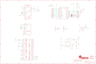

Contents
========

* [PRA3651 > Adafruit](#pra3651--adafruit)
	* [Schematic](#schematic)
	* [Interactive BOM](#interactive-bom)
	* [OOMP Parts](#oomp-parts)
	* [Images](#images)
	* [Tags](#tags)
  
![][im]
# PRA3651 > Adafruit

- ID: PROJ-ADAF-3651-STAN-01
- Hex ID: PRA3651
- Name: Adafruit
- Description: Adafruit
- Long Link: [http://oom.lt/PROJ-ADAF-3651-STAN-01](http://oom.lt/PROJ-ADAF-3651-STAN-01)
- Short Link: [http://oom.lt/PRA3651](http://oom.lt/PRA3651)

## Schematic
  

## Interactive BOM

- Interactive BOM page: [ibom.html](https://htmlpreview.github.io/?https://github.com/oomlout/oomlout_OOMP_projects/blob/main/PROJ-ADAF-3651-STAN-01/kicad/bom/ibom.html)

## OOMP Parts
  

|OOMP Parts|
| :---: |
|C1,CAPC-0805-X-UF1-01,C1,1uF,CAP_CERAMIC0805-NOOUTLINE,0805-NO,Ceramic Capacitors,,|
|C2,CAPC-0805-X-UF10-V10,C2,10uF,CAP_CERAMIC0805-NOOUTLINE,0805-NO,Ceramic Capacitors,,|
|C3,CAPC-0805-X-UF10-V10,C3,10uF,CAP_CERAMIC0805-NOOUTLINE,0805-NO,Ceramic Capacitors,,|
|C4,CAPC-0805-X-UF10-V10,C4,10uF,CAP_CERAMIC0805-NOOUTLINE,0805-NO,Ceramic Capacitors,,|
|C5,CAPC-0805-X-UF10-V10,C5,10uF,CAP_CERAMIC0805-NOOUTLINE,0805-NO,Ceramic Capacitors,,|
|C16,CAPC-0805-X-UF1-01,C16,1uF,CAP_CERAMIC0805-NOOUTLINE,0805-NO,Ceramic Capacitors,,|
|C18,CAPC-0805-X-NF100-V50,C18,0.1uF,CAP_CERAMIC0805-NOOUTLINE,0805-NO,Ceramic Capacitors,,|
|C20,CAPC-0805-X-UF1-01,C20,1uF,CAP_CERAMIC0805-NOOUTLINE,0805-NO,Ceramic Capacitors,,|
|D1,DIOD-UNMATCHED-X-UNMATCHED-01,D1,MM3Z24VT1G,DIODESMA,SMADIODE,Diode,,|
|D2,DIOD-UNMATCHED-X-UNMATCHED-01,D2,MBR0540,DIODESOD-123,SOD-123,Diode,,|
|D3,DIOD-UNMATCHED-X-UNMATCHED-01,D3,MBR120,DIODESOD-123,SOD-123,Diode,,|
|D4,DIOD-UNMATCHED-X-UNMATCHED-01,D4,MBR120,DIODESOD-123,SOD-123,Diode,,|
|ENABLE,UNMATCHED-UNMATCHED-X-UNMATCHED-01,ENABLE,Slide Switch,SWITCH_DPDTEG1390,EG1390,Switch - DPDT,,|
|IC4,UNMATCHED-SO23-X-UNMATCHED-01,IC4,APX803-SAG,AXP083-SAG,SOT23,,,|
|L1,UNMATCHED-UNMATCHED-X-UNMATCHED-01,L1,15uH,INDUCTORNR5040,INDUCTOR_5X5MM_NR5040_NOTHERMALS,Inductors,,|
|MS2,UNMATCHED-UNMATCHED-X-UNMATCHED-01,MS2,FEATHERWING_SMTDUAL,FEATHERWING_SMTDUAL,FEATHERWING_SMT2,,,|
|R1,RESE-0805-X-UNMATCHED-01,R1,12Ω,RESISTOR0805_NOOUTLINE,0805-NO,Resistors,,|
|R2,RESE-0805-X-O1003-01,R2,100K,RESISTOR0805_NOOUTLINE,0805-NO,Resistors,,|
|R5,RESE-0805-X-O1003-01,R5,100K,RESISTOR0805_NOOUTLINE,0805-NO,Resistors,,|
|R6,RESE-0805-X-O103-01,R6,10K,R-US_R0805,R0805,RESISTOR, American symbol,,|
|R8,RESE-0805-X-O1003-01,R8,100K,RESISTOR0805_NOOUTLINE,0805-NO,Resistors,,|
|R12,RESE-0805-X-O103-01,R12,10K,RESISTOR0805_NOOUTLINE,0805-NO,Resistors,,|
|SW1,UNMATCHED-UNMATCHED-X-UNMATCHED-01,SJ1,,SOLDERJUMPER_CLOSED,SOLDERJUMPER_CLOSEDWIRE,Solder Jumper - Closed,,|
|TP1,UNMATCHED-UNMATCHED-X-UNMATCHED-01,SJ2,,SOLDERJUMPER_CLOSED,SOLDERJUMPER_CLOSEDWIRE,Solder Jumper - Closed,,|
|TP2,UNMATCHED-UNMATCHED-X-UNMATCHED-01,SJ3,,SOLDERJUMPER_CLOSED,SOLDERJUMPER_CLOSEDWIRE,Solder Jumper - Closed,,|
|TP4,UNMATCHED-UNMATCHED-X-UNMATCHED-01,SJ4,,SOLDERJUMPER_CLOSED,SOLDERJUMPER_CLOSEDWIRE,Solder Jumper - Closed,,|
|TP5,UNMATCHED-UNMATCHED-X-UNMATCHED-01,SW1,EVQQ2,SWITCH_TACT_SMT_EVQQ2_SMALL,EVQ-Q2_SMALLER,SMT Tact Switches,,|
|TP6,UNMATCHED-UNMATCHED-X-UNMATCHED-01,TP1,,TESTPOINTPAD2MM,TESTPOINT_PAD_2MM,Test Point,,|
|TP7,UNMATCHED-UNMATCHED-X-UNMATCHED-01,TP2,,TESTPOINTPAD2MM,TESTPOINT_PAD_2MM,Test Point,,|
|TP8,UNMATCHED-UNMATCHED-X-UNMATCHED-01,TP4,,TESTPOINTPAD2MM,TESTPOINT_PAD_2MM,Test Point,,|
|TP9,UNMATCHED-UNMATCHED-X-UNMATCHED-01,TP5,,TESTPOINTPAD2MM,TESTPOINT_PAD_2MM,Test Point,,|
|TP10,UNMATCHED-UNMATCHED-X-UNMATCHED-01,TP6,,TESTPOINTPAD2MM,TESTPOINT_PAD_2MM,Test Point,,|
|TP11,UNMATCHED-UNMATCHED-X-UNMATCHED-01,TP7,,TESTPOINTPAD2MM,TESTPOINT_PAD_2MM,Test Point,,|
|TP12,UNMATCHED-UNMATCHED-X-UNMATCHED-01,TP8,,TESTPOINTPAD2MM,TESTPOINT_PAD_2MM,Test Point,,|
|TP13,UNMATCHED-UNMATCHED-X-UNMATCHED-01,TP9,,TESTPOINTPAD2MM,TESTPOINT_PAD_2MM,Test Point,,|
|TP14,UNMATCHED-UNMATCHED-X-UNMATCHED-01,TP10,,TESTPOINTPAD2MM,TESTPOINT_PAD_2MM,Test Point,,|
|TP15,UNMATCHED-UNMATCHED-X-UNMATCHED-01,TP11,,TESTPOINTPAD2MM,TESTPOINT_PAD_2MM,Test Point,,|
|TP16,UNMATCHED-UNMATCHED-X-UNMATCHED-01,TP12,,TESTPOINTPAD2MM,TESTPOINT_PAD_2MM,Test Point,,|
|TP17,UNMATCHED-UNMATCHED-X-UNMATCHED-01,TP13,,TESTPOINTPAD2MM,TESTPOINT_PAD_2MM,Test Point,,|
|TP18,UNMATCHED-UNMATCHED-X-UNMATCHED-01,TP14,,TESTPOINTPAD2MM,TESTPOINT_PAD_2MM,Test Point,,|
|TP19,UNMATCHED-UNMATCHED-X-UNMATCHED-01,TP15,,TESTPOINTPAD2MM,TESTPOINT_PAD_2MM,Test Point,,|
|TP20,UNMATCHED-UNMATCHED-X-UNMATCHED-01,TP16,,TESTPOINTPAD2MM,TESTPOINT_PAD_2MM,Test Point,,|
|TP21,UNMATCHED-UNMATCHED-X-UNMATCHED-01,TP17,,TESTPOINTPAD2MM,TESTPOINT_PAD_2MM,Test Point,,|
|TP22,UNMATCHED-UNMATCHED-X-UNMATCHED-01,TP18,,TESTPOINTPAD2MM,TESTPOINT_PAD_2MM,Test Point,,|
|TP23,UNMATCHED-UNMATCHED-X-UNMATCHED-01,TP19,,TESTPOINTPAD2MM,TESTPOINT_PAD_2MM,Test Point,,|
|TP24,UNMATCHED-UNMATCHED-X-UNMATCHED-01,TP20,,TESTPOINTPAD2MM,TESTPOINT_PAD_2MM,Test Point,,|
|TP25,UNMATCHED-UNMATCHED-X-UNMATCHED-01,TP21,,TESTPOINTPAD2MM,TESTPOINT_PAD_2MM,Test Point,,|
|TP26,UNMATCHED-UNMATCHED-X-UNMATCHED-01,TP22,,TESTPOINTPAD2MM,TESTPOINT_PAD_2MM,Test Point,,|
|TP27,UNMATCHED-UNMATCHED-X-UNMATCHED-01,TP23,,TESTPOINTPAD2MM,TESTPOINT_PAD_2MM,Test Point,,|
|U2,UNMATCHED-UNMATCHED-X-UNMATCHED-01,TP24,,TESTPOINTPAD2MM,TESTPOINT_PAD_2MM,Test Point,,|
|U3,UNMATCHED-SO235-X-UNMATCHED-01,TP25,,TESTPOINTPAD2MM,TESTPOINT_PAD_2MM,Test Point,,|
|X1,UNMATCHED-UNMATCHED-X-UNMATCHED-01,TP26,,TESTPOINTPAD2MM,TESTPOINT_PAD_2MM,Test Point,,|
|X2,UNMATCHED-UNMATCHED-X-UNMATCHED-01,TP27,,TESTPOINTPAD2MM,TESTPOINT_PAD_2MM,Test Point,,|

## Images
  
  

|kicadPcb3d|kicadPcb3dFront|kicadPcb3dBack|eagleImage|eagleSchemImage|
| :---: | :---: | :---: | :---: | :---: |
||||||

## Tags

- hexID: PRA3651
- oompType: PROJ
- oompSize: ADAF
- oompColor: 3651
- oompDesc: STAN
- oompIndex: 01
- oompName: Adafruit 3.5in TFT Featherwing PCB
- sources: All source files from https://github.com/adafruit/Adafruit-3.5in-TFT-Featherwing-PCB (source licence details in srcLicense.md)
- linkBuyPage: http://www.adafruit.com/products/3651
- oompID: PROJ-ADAF-3651-STAN-01
- oompParts: C1,CAPC-0805-X-UF1-01
- oompParts: C2,CAPC-0805-X-UF10-V10
- oompParts: C3,CAPC-0805-X-UF10-V10
- oompParts: C4,CAPC-0805-X-UF10-V10
- oompParts: C5,CAPC-0805-X-UF10-V10
- oompParts: C16,CAPC-0805-X-UF1-01
- oompParts: C18,CAPC-0805-X-NF100-V50
- oompParts: C20,CAPC-0805-X-UF1-01
- oompParts: D1,DIOD-UNMATCHED-X-UNMATCHED-01
- oompParts: D2,DIOD-UNMATCHED-X-UNMATCHED-01
- oompParts: D3,DIOD-UNMATCHED-X-UNMATCHED-01
- oompParts: D4,DIOD-UNMATCHED-X-UNMATCHED-01
- oompParts: ENABLE,UNMATCHED-UNMATCHED-X-UNMATCHED-01
- oompParts: IC4,UNMATCHED-SO23-X-UNMATCHED-01
- oompParts: L1,UNMATCHED-UNMATCHED-X-UNMATCHED-01
- oompParts: MS2,UNMATCHED-UNMATCHED-X-UNMATCHED-01
- oompParts: R1,RESE-0805-X-UNMATCHED-01
- oompParts: R2,RESE-0805-X-O1003-01
- oompParts: R5,RESE-0805-X-O1003-01
- oompParts: R6,RESE-0805-X-O103-01
- oompParts: R8,RESE-0805-X-O1003-01
- oompParts: R12,RESE-0805-X-O103-01
- oompParts: SW1,UNMATCHED-UNMATCHED-X-UNMATCHED-01
- oompParts: TP1,UNMATCHED-UNMATCHED-X-UNMATCHED-01
- oompParts: TP2,UNMATCHED-UNMATCHED-X-UNMATCHED-01
- oompParts: TP4,UNMATCHED-UNMATCHED-X-UNMATCHED-01
- oompParts: TP5,UNMATCHED-UNMATCHED-X-UNMATCHED-01
- oompParts: TP6,UNMATCHED-UNMATCHED-X-UNMATCHED-01
- oompParts: TP7,UNMATCHED-UNMATCHED-X-UNMATCHED-01
- oompParts: TP8,UNMATCHED-UNMATCHED-X-UNMATCHED-01
- oompParts: TP9,UNMATCHED-UNMATCHED-X-UNMATCHED-01
- oompParts: TP10,UNMATCHED-UNMATCHED-X-UNMATCHED-01
- oompParts: TP11,UNMATCHED-UNMATCHED-X-UNMATCHED-01
- oompParts: TP12,UNMATCHED-UNMATCHED-X-UNMATCHED-01
- oompParts: TP13,UNMATCHED-UNMATCHED-X-UNMATCHED-01
- oompParts: TP14,UNMATCHED-UNMATCHED-X-UNMATCHED-01
- oompParts: TP15,UNMATCHED-UNMATCHED-X-UNMATCHED-01
- oompParts: TP16,UNMATCHED-UNMATCHED-X-UNMATCHED-01
- oompParts: TP17,UNMATCHED-UNMATCHED-X-UNMATCHED-01
- oompParts: TP18,UNMATCHED-UNMATCHED-X-UNMATCHED-01
- oompParts: TP19,UNMATCHED-UNMATCHED-X-UNMATCHED-01
- oompParts: TP20,UNMATCHED-UNMATCHED-X-UNMATCHED-01
- oompParts: TP21,UNMATCHED-UNMATCHED-X-UNMATCHED-01
- oompParts: TP22,UNMATCHED-UNMATCHED-X-UNMATCHED-01
- oompParts: TP23,UNMATCHED-UNMATCHED-X-UNMATCHED-01
- oompParts: TP24,UNMATCHED-UNMATCHED-X-UNMATCHED-01
- oompParts: TP25,UNMATCHED-UNMATCHED-X-UNMATCHED-01
- oompParts: TP26,UNMATCHED-UNMATCHED-X-UNMATCHED-01
- oompParts: TP27,UNMATCHED-UNMATCHED-X-UNMATCHED-01
- oompParts: U2,UNMATCHED-UNMATCHED-X-UNMATCHED-01
- oompParts: U3,UNMATCHED-SO235-X-UNMATCHED-01
- oompParts: X1,UNMATCHED-UNMATCHED-X-UNMATCHED-01
- oompParts: X2,UNMATCHED-UNMATCHED-X-UNMATCHED-01
- rawParts: C1,1uF,CAP_CERAMIC0805-NOOUTLINE,0805-NO,Ceramic Capacitors,,
- rawParts: C2,10uF,CAP_CERAMIC0805-NOOUTLINE,0805-NO,Ceramic Capacitors,,
- rawParts: C3,10uF,CAP_CERAMIC0805-NOOUTLINE,0805-NO,Ceramic Capacitors,,
- rawParts: C4,10uF,CAP_CERAMIC0805-NOOUTLINE,0805-NO,Ceramic Capacitors,,
- rawParts: C5,10uF,CAP_CERAMIC0805-NOOUTLINE,0805-NO,Ceramic Capacitors,,
- rawParts: C16,1uF,CAP_CERAMIC0805-NOOUTLINE,0805-NO,Ceramic Capacitors,,
- rawParts: C18,0.1uF,CAP_CERAMIC0805-NOOUTLINE,0805-NO,Ceramic Capacitors,,
- rawParts: C20,1uF,CAP_CERAMIC0805-NOOUTLINE,0805-NO,Ceramic Capacitors,,
- rawParts: D1,MM3Z24VT1G,DIODESMA,SMADIODE,Diode,,
- rawParts: D2,MBR0540,DIODESOD-123,SOD-123,Diode,,
- rawParts: D3,MBR120,DIODESOD-123,SOD-123,Diode,,
- rawParts: D4,MBR120,DIODESOD-123,SOD-123,Diode,,
- rawParts: ENABLE,Slide Switch,SWITCH_DPDTEG1390,EG1390,Switch - DPDT,,
- rawParts: IC4,APX803-SAG,AXP083-SAG,SOT23,,,
- rawParts: L1,15uH,INDUCTORNR5040,INDUCTOR_5X5MM_NR5040_NOTHERMALS,Inductors,,
- rawParts: MS2,FEATHERWING_SMTDUAL,FEATHERWING_SMTDUAL,FEATHERWING_SMT2,,,
- rawParts: R1,12Ω,RESISTOR0805_NOOUTLINE,0805-NO,Resistors,,
- rawParts: R2,100K,RESISTOR0805_NOOUTLINE,0805-NO,Resistors,,
- rawParts: R5,100K,RESISTOR0805_NOOUTLINE,0805-NO,Resistors,,
- rawParts: R6,10K,R-US_R0805,R0805,RESISTOR, American symbol,,
- rawParts: R8,100K,RESISTOR0805_NOOUTLINE,0805-NO,Resistors,,
- rawParts: R12,10K,RESISTOR0805_NOOUTLINE,0805-NO,Resistors,,
- rawParts: SJ1,,SOLDERJUMPER_CLOSED,SOLDERJUMPER_CLOSEDWIRE,Solder Jumper - Closed,,
- rawParts: SJ2,,SOLDERJUMPER_CLOSED,SOLDERJUMPER_CLOSEDWIRE,Solder Jumper - Closed,,
- rawParts: SJ3,,SOLDERJUMPER_CLOSED,SOLDERJUMPER_CLOSEDWIRE,Solder Jumper - Closed,,
- rawParts: SJ4,,SOLDERJUMPER_CLOSED,SOLDERJUMPER_CLOSEDWIRE,Solder Jumper - Closed,,
- rawParts: SW1,EVQQ2,SWITCH_TACT_SMT_EVQQ2_SMALL,EVQ-Q2_SMALLER,SMT Tact Switches,,
- rawParts: TP1,,TESTPOINTPAD2MM,TESTPOINT_PAD_2MM,Test Point,,
- rawParts: TP2,,TESTPOINTPAD2MM,TESTPOINT_PAD_2MM,Test Point,,
- rawParts: TP4,,TESTPOINTPAD2MM,TESTPOINT_PAD_2MM,Test Point,,
- rawParts: TP5,,TESTPOINTPAD2MM,TESTPOINT_PAD_2MM,Test Point,,
- rawParts: TP6,,TESTPOINTPAD2MM,TESTPOINT_PAD_2MM,Test Point,,
- rawParts: TP7,,TESTPOINTPAD2MM,TESTPOINT_PAD_2MM,Test Point,,
- rawParts: TP8,,TESTPOINTPAD2MM,TESTPOINT_PAD_2MM,Test Point,,
- rawParts: TP9,,TESTPOINTPAD2MM,TESTPOINT_PAD_2MM,Test Point,,
- rawParts: TP10,,TESTPOINTPAD2MM,TESTPOINT_PAD_2MM,Test Point,,
- rawParts: TP11,,TESTPOINTPAD2MM,TESTPOINT_PAD_2MM,Test Point,,
- rawParts: TP12,,TESTPOINTPAD2MM,TESTPOINT_PAD_2MM,Test Point,,
- rawParts: TP13,,TESTPOINTPAD2MM,TESTPOINT_PAD_2MM,Test Point,,
- rawParts: TP14,,TESTPOINTPAD2MM,TESTPOINT_PAD_2MM,Test Point,,
- rawParts: TP15,,TESTPOINTPAD2MM,TESTPOINT_PAD_2MM,Test Point,,
- rawParts: TP16,,TESTPOINTPAD2MM,TESTPOINT_PAD_2MM,Test Point,,
- rawParts: TP17,,TESTPOINTPAD2MM,TESTPOINT_PAD_2MM,Test Point,,
- rawParts: TP18,,TESTPOINTPAD2MM,TESTPOINT_PAD_2MM,Test Point,,
- rawParts: TP19,,TESTPOINTPAD2MM,TESTPOINT_PAD_2MM,Test Point,,
- rawParts: TP20,,TESTPOINTPAD2MM,TESTPOINT_PAD_2MM,Test Point,,
- rawParts: TP21,,TESTPOINTPAD2MM,TESTPOINT_PAD_2MM,Test Point,,
- rawParts: TP22,,TESTPOINTPAD2MM,TESTPOINT_PAD_2MM,Test Point,,
- rawParts: TP23,,TESTPOINTPAD2MM,TESTPOINT_PAD_2MM,Test Point,,
- rawParts: TP24,,TESTPOINTPAD2MM,TESTPOINT_PAD_2MM,Test Point,,
- rawParts: TP25,,TESTPOINTPAD2MM,TESTPOINT_PAD_2MM,Test Point,,
- rawParts: TP26,,TESTPOINTPAD2MM,TESTPOINT_PAD_2MM,Test Point,,
- rawParts: TP27,,TESTPOINTPAD2MM,TESTPOINT_PAD_2MM,Test Point,,
- rawParts: U$7,MOUNTINGHOLE3.0THIN,MOUNTINGHOLE3.0THIN,MOUNTINGHOLE_3.0_PLATEDTHIN,Mounting Hole,EXCLUDE,
- rawParts: U$9,FIDUCIAL_1MM,FIDUCIAL_1MM,FIDUCIAL_1MM,Fiducial Alignment Points,EXCLUDE,
- rawParts: U$15,MOUNTINGHOLE3.0THIN,MOUNTINGHOLE3.0THIN,MOUNTINGHOLE_3.0_PLATEDTHIN,Mounting Hole,EXCLUDE,
- rawParts: U$16,MOUNTINGHOLE3.0THIN,MOUNTINGHOLE3.0THIN,MOUNTINGHOLE_3.0_PLATEDTHIN,Mounting Hole,EXCLUDE,
- rawParts: U$17,MOUNTINGHOLE3.0THIN,MOUNTINGHOLE3.0THIN,MOUNTINGHOLE_3.0_PLATEDTHIN,Mounting Hole,EXCLUDE,
- rawParts: U$23,FIDUCIAL_1MM,FIDUCIAL_1MM,FIDUCIAL_1MM,Fiducial Alignment Points,EXCLUDE,
- rawParts: U2,STMPE811,STMPE610,QFN16_3MM,STMPE610 - 12-Bit Touch Screen Controller,,
- rawParts: U3,FAN5333BSX,FAN5331,SOT23-5@1,FAN5331 - LED/OLED 20V Boost Converter,,
- rawParts: X1,MicroSD,MICROSD,MICROSD,MicroSD/Transflash Card Holder with SPI pinout,,
- rawParts: X2,3.5 TFT,DISP_LCD_3.5IN_320X480_50PIN,TFT_3.5IN_320X480_50PIN,DT350HV15-T - 3.5 320x480 TFT Display, 50 Pin Connector,,

[im]: kicadPcb3d_450.png
