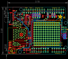
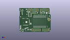
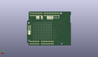
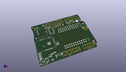

Contents
========

* [PROJ-ADAF-3654-STAN-01>Adafruit WINC1500 Shield PCB](#proj-adaf-3654-stan-01adafruit-winc1500-shield-pcb)
	* [Images](#images)
	* [Interactive BOM](#interactive-bom)
	* [OOMP Parts](#oomp-parts)
	* [Tags](#tags)
  
![][im]
# PROJ-ADAF-3654-STAN-01>Adafruit WINC1500 Shield PCB

- ID: PROJ-ADAF-3654-STAN-01
- Hex ID: PRA3654
- Name: Adafruit WINC1500 Shield PCB
- Description: 

## Images
  
  

|eagleImage|kicadPcb3dFront|kicadPcb3dBack|kicadPcb3d|
| :---: | :---: | :---: | :---: |
|||||

## Interactive BOM

- Interactive BOM page: [ibom.html](kicad/bom/ibom.html)

## OOMP Parts
  

|OOMP Parts|
| :---: |
|CAPE-0805-X-UNMATCHED-01, C1, 25.526999999999997, 5.08, 270,C1, 10uF, 0805-NO, microbuilder, (1.005, 0.2), R270|
|CAPE-0805-X-UNMATCHED-01, C2, 7.112, 49.149, 180,C2, 10uF, 0805-NO, microbuilder, (0.28, 1.935), R180|
|CAPE-0805-X-UNMATCHED-01, C3, 18.796, 5.206999999999999, 270,C3, 10uF, 0805-NO, microbuilder, (0.74, 0.205), R270|
|CAPE-0805-X-UNMATCHED-01, C4, 23.875999999999998, 18.287999999999997, 90,C4, 10uF, 0805-NO, microbuilder, (0.94, 0.72), R90|
|CAPE-0805-X-UNMATCHED-01, C5, 25.780999999999995, 18.287999999999997, 90,C5, 1uF, 0805-NO, microbuilder, (1.015, 0.72), R90|
|UNMATCHED-UNMATCHED-X-UNMATCHED-01, CS_JMP, 36.57599999999999, 44.196, M270,CS_JMP, SOLDERJUMPER_CLOSEDWIRE, microbuilder, (1.44, 1.74), MR270|
|UNMATCHED-UNMATCHED-X-UNMATCHED-01, D1, 2.667, 12.827, 270,D1, green, CHIPLED_0805_NOOUTLINE, microbuilder, (0.105, 0.505), R270|
|UNMATCHED-UNMATCHED-X-UNMATCHED-01, D2, 2.667, 10.287, 270,D2, Yellow, CHIPLED_0805_NOOUTLINE, microbuilder, (0.105, 0.405), R270|
|UNMATCHED-UNMATCHED-X-UNMATCHED-01, D3, 2.667, 7.746999999999999, 270,D3, Red, CHIPLED_0805_NOOUTLINE, microbuilder, (0.105, 0.305), R270|
|UNMATCHED-UNMATCHED-X-UNMATCHED-01, IC4, 22.352, 5.206999999999999, 270,IC4, AP2112-3.3, SOT23-5L, adafruit, (0.88, 0.205), R270|
|UNMATCHED-UNMATCHED-X-UNMATCHED-01, IRQ_JMP, 45.72, 44.449999999999996, M270,IRQ_JMP, SOLDERJUMPER_CLOSEDWIRE, microbuilder, (1.8, 1.75), MR270|
|UNMATCHED-UNMATCHED-X-UNMATCHED-01, JP1, 36.57599999999999, 41.65599999999999, 0,JP1, 1X01_ROUND, microbuilder, (1.44, 1.64), R0|
|UNMATCHED-UNMATCHED-X-UNMATCHED-01, JP2, 54.60999999999999, 46.99, 0,JP2, 1X08_ROUND_70, microbuilder, (2.15, 1.85), R0|
|UNMATCHED-UNMATCHED-X-UNMATCHED-01, JP3, 36.83, 6.35, 180,JP3, 1X08_ROUND_70, microbuilder, (1.45, 0.25), R180|
|UNMATCHED-UNMATCHED-X-UNMATCHED-01, JP4, 57.15, 6.35, 180,JP4, 1X06_ROUND_70, microbuilder, (2.25, 0.25), R180|
|UNMATCHED-UNMATCHED-X-UNMATCHED-01, JP5, 30.225999999999996, 46.99, 0,JP5, 1X10_ROUND70, microbuilder, (1.19, 1.85), R0|
|UNMATCHED-UNMATCHED-X-UNMATCHED-01, JP6, 45.72, 41.91, 0,JP6, 1X01_ROUND, microbuilder, (1.8, 1.65), R0|
|UNMATCHED-UNMATCHED-X-UNMATCHED-01, JP7, 50.8, 41.91, 0,JP7, 1X01_ROUND, microbuilder, (2, 1.65), R0|
|UNMATCHED-UNMATCHED-X-UNMATCHED-01, JP8, 18.796, 44.449999999999996, 0,JP8, 1X01_ROUND, microbuilder, (0.74, 1.75), R0|
|UNMATCHED-UNMATCHED-X-UNMATCHED-01, JP9, 31.496, 41.65599999999999, 0,JP9, 1X01_ROUND, microbuilder, (1.24, 1.64), R0|
|UNMATCHED-UNMATCHED-X-UNMATCHED-01, JP10, 28.955999999999996, 41.65599999999999, 0,JP10, 1X01_ROUND, microbuilder, (1.14, 1.64), R0|
|UNMATCHED-UNMATCHED-X-UNMATCHED-01, JP11, 34.036, 41.65599999999999, 0,JP11, 1X01_ROUND, microbuilder, (1.34, 1.64), R0|
|UNMATCHED-UNMATCHED-X-UNMATCHED-01, JP12, 53.339999999999996, 41.91, 0,JP12, 1X01_ROUND, microbuilder, (2.1, 1.65), R0|
|UNMATCHED-UNMATCHED-X-UNMATCHED-01, M1, 0.0, 0.0, 0,M1, ARDUINO_R3_ICSP_NODIM, ARDUINOR3_ICSP_NODIM, adafruit, (0, 0), R0|
|RESE-0805-X-O104-01, R1, 48.132999999999996, 42.799, 270,R1, 100K, 0805-NO, microbuilder, (1.895, 1.685), R270|
|RESE-0805-X-UNMATCHED-01, R2, 12.827, 6.476999999999999, 180,R2, 1K, 0805-NO, microbuilder, (0.505, 0.255), R180|
|RESE-0805-X-O104-01, R3, 21.971, 44.704, 180,R3, 100K, 0805-NO, microbuilder, (0.865, 1.76), R180|
|RESE-0805-X-UNMATCHED-01, R4, 14.731999999999998, 8.382, 180,R4, 1K, 0805-NO, microbuilder, (0.58, 0.33), R180|
|RESE-0805-X-UNMATCHED-01, R5, 18.287999999999997, 9.270999999999999, 180,R5, 1K, 0805-NO, microbuilder, (0.72, 0.365), R180|
|RESE-0805-X-O104-01, R7, 40.004999999999995, 43.053, 270,R7, 100K, 0805-NO, microbuilder, (1.575, 1.695), R270|
|RESE-0805-X-O104-01, R8, 55.498999999999995, 42.799, 90,R8, 100K, 0805-NO, microbuilder, (2.185, 1.685), R90|
|UNMATCHED-UNMATCHED-X-UNMATCHED-01, RST_JMP, 50.8, 44.449999999999996, M270,RST_JMP, SOLDERJUMPER_CLOSEDWIRE, microbuilder, (2, 1.75), MR270|
|UNMATCHED-UNMATCHED-X-UNMATCHED-01, SD_JMP, 53.339999999999996, 44.449999999999996, M270,SD_JMP, SOLDERJUMPER_CLOSEDWIRE, microbuilder, (2.1, 1.75), MR270|
|UNMATCHED-UNMATCHED-X-UNMATCHED-01, SJ2, 65.024, 18.034, M0,SJ2, ICSP_MISO, SOLDERJUMPER_CLOSEDWIRE, microbuilder, (2.56, 0.71), MR0|
|UNMATCHED-UNMATCHED-X-UNMATCHED-01, SJ3, 65.024, 20.32, M0,SJ3, ISCP_SCLK, SOLDERJUMPER_CLOSEDWIRE, microbuilder, (2.56, 0.8), MR0|
|UNMATCHED-UNMATCHED-X-UNMATCHED-01, SJ4, 65.024, 22.605999999999998, M0,SJ4, ICSP_MOSI, SOLDERJUMPER_CLOSEDWIRE, microbuilder, (2.56, 0.89), MR0|
|UNMATCHED-UNMATCHED-X-UNMATCHED-01, SJ5, 31.496, 44.196, M90,SJ5, D12_MISO, SOLDERJUMPER_REFLOW_NOPASTE, microbuilder, (1.24, 1.74), MR90|
|UNMATCHED-UNMATCHED-X-UNMATCHED-01, SJ6, 28.955999999999996, 44.196, M90,SJ6, D13_SCLK, SOLDERJUMPER_REFLOW_NOPASTE, microbuilder, (1.14, 1.74), MR90|
|UNMATCHED-UNMATCHED-X-UNMATCHED-01, SJ7, 34.036, 44.196, M90,SJ7, D11_MOSI, SOLDERJUMPER_REFLOW_NOPASTE, microbuilder, (1.34, 1.74), MR90|
|UNMATCHED-UNMATCHED-X-UNMATCHED-01, SW2, 4.571999999999999, 3.6829999999999994, 0,SW2, Tactile, EVQ-Q2_SMALLER, microbuilder, (0.18, 0.145), R0|
|UNMATCHED-UNMATCHED-X-UNMATCHED-01, U2, 23.114, 38.608, 90,U2, 74HC4050, SOIC16, microbuilder, (0.91, 1.52), R90|
|UNMATCHED-UNMATCHED-X-UNMATCHED-01, X1, 17.018, 47.370999999999995, 270,X1, microSd, MICROSD, microbuilder, (0.67, 1.865), R270|

## Tags

- hexID: PRA3654
- oompType: PROJ
- oompSize: ADAF
- oompColor: 3654
- oompDesc: STAN
- oompIndex: 01
- oompName: Adafruit WINC1500 Shield PCB
- sources: All source files from https://github.com/adafruit/Adafruit-WINC1500-Shield-PCB (source licence details in srcLicense.md)
- linkBuyPage: http://www.adafruit.com/products/3654
- oompPart: CAPE-0805-X-UNMATCHED-01, C1, 25.526999999999997, 5.08, 270
- oompPart: CAPE-0805-X-UNMATCHED-01, C2, 7.112, 49.149, 180
- oompPart: CAPE-0805-X-UNMATCHED-01, C3, 18.796, 5.206999999999999, 270
- oompPart: CAPE-0805-X-UNMATCHED-01, C4, 23.875999999999998, 18.287999999999997, 90
- oompPart: CAPE-0805-X-UNMATCHED-01, C5, 25.780999999999995, 18.287999999999997, 90
- oompPart: UNMATCHED-UNMATCHED-X-UNMATCHED-01, CS_JMP, 36.57599999999999, 44.196, M270
- oompPart: UNMATCHED-UNMATCHED-X-UNMATCHED-01, D1, 2.667, 12.827, 270
- oompPart: UNMATCHED-UNMATCHED-X-UNMATCHED-01, D2, 2.667, 10.287, 270
- oompPart: UNMATCHED-UNMATCHED-X-UNMATCHED-01, D3, 2.667, 7.746999999999999, 270
- oompPart: SKIP-UNMATCHED-X-UNMATCHED-01, FID1, 63.75399999999999, 44.449999999999996, 0
- oompPart: SKIP-UNMATCHED-X-UNMATCHED-01, FID2, 65.532, 4.3180000000000005, 0
- oompPart: SKIP-UNMATCHED-X-UNMATCHED-01, FID3, 2.2859999999999996, 50.673, 0
- oompPart: UNMATCHED-UNMATCHED-X-UNMATCHED-01, IC4, 22.352, 5.206999999999999, 270
- oompPart: UNMATCHED-UNMATCHED-X-UNMATCHED-01, IRQ_JMP, 45.72, 44.449999999999996, M270
- oompPart: UNMATCHED-UNMATCHED-X-UNMATCHED-01, JP1, 36.57599999999999, 41.65599999999999, 0
- oompPart: UNMATCHED-UNMATCHED-X-UNMATCHED-01, JP2, 54.60999999999999, 46.99, 0
- oompPart: UNMATCHED-UNMATCHED-X-UNMATCHED-01, JP3, 36.83, 6.35, 180
- oompPart: UNMATCHED-UNMATCHED-X-UNMATCHED-01, JP4, 57.15, 6.35, 180
- oompPart: UNMATCHED-UNMATCHED-X-UNMATCHED-01, JP5, 30.225999999999996, 46.99, 0
- oompPart: UNMATCHED-UNMATCHED-X-UNMATCHED-01, JP6, 45.72, 41.91, 0
- oompPart: UNMATCHED-UNMATCHED-X-UNMATCHED-01, JP7, 50.8, 41.91, 0
- oompPart: UNMATCHED-UNMATCHED-X-UNMATCHED-01, JP8, 18.796, 44.449999999999996, 0
- oompPart: UNMATCHED-UNMATCHED-X-UNMATCHED-01, JP9, 31.496, 41.65599999999999, 0
- oompPart: UNMATCHED-UNMATCHED-X-UNMATCHED-01, JP10, 28.955999999999996, 41.65599999999999, 0
- oompPart: UNMATCHED-UNMATCHED-X-UNMATCHED-01, JP11, 34.036, 41.65599999999999, 0
- oompPart: UNMATCHED-UNMATCHED-X-UNMATCHED-01, JP12, 53.339999999999996, 41.91, 0
- oompPart: UNMATCHED-UNMATCHED-X-UNMATCHED-01, M1, 0.0, 0.0, 0
- oompPart: RESE-0805-X-O104-01, R1, 48.132999999999996, 42.799, 270
- oompPart: RESE-0805-X-UNMATCHED-01, R2, 12.827, 6.476999999999999, 180
- oompPart: RESE-0805-X-O104-01, R3, 21.971, 44.704, 180
- oompPart: RESE-0805-X-UNMATCHED-01, R4, 14.731999999999998, 8.382, 180
- oompPart: RESE-0805-X-UNMATCHED-01, R5, 18.287999999999997, 9.270999999999999, 180
- oompPart: RESE-0805-X-O104-01, R7, 40.004999999999995, 43.053, 270
- oompPart: RESE-0805-X-O104-01, R8, 55.498999999999995, 42.799, 90
- oompPart: UNMATCHED-UNMATCHED-X-UNMATCHED-01, RST_JMP, 50.8, 44.449999999999996, M270
- oompPart: UNMATCHED-UNMATCHED-X-UNMATCHED-01, SD_JMP, 53.339999999999996, 44.449999999999996, M270
- oompPart: UNMATCHED-UNMATCHED-X-UNMATCHED-01, SJ2, 65.024, 18.034, M0
- oompPart: UNMATCHED-UNMATCHED-X-UNMATCHED-01, SJ3, 65.024, 20.32, M0
- oompPart: UNMATCHED-UNMATCHED-X-UNMATCHED-01, SJ4, 65.024, 22.605999999999998, M0
- oompPart: UNMATCHED-UNMATCHED-X-UNMATCHED-01, SJ5, 31.496, 44.196, M90
- oompPart: UNMATCHED-UNMATCHED-X-UNMATCHED-01, SJ6, 28.955999999999996, 44.196, M90
- oompPart: UNMATCHED-UNMATCHED-X-UNMATCHED-01, SJ7, 34.036, 44.196, M90
- oompPart: UNMATCHED-UNMATCHED-X-UNMATCHED-01, SW2, 4.571999999999999, 3.6829999999999994, 0
- oompPart: SKIP-UNMATCHED-X-UNMATCHED-01, U$1, 14.224, 22.733, 90
- oompPart: UNMATCHED-UNMATCHED-X-UNMATCHED-01, U2, 23.114, 38.608, 90
- oompPart: UNMATCHED-UNMATCHED-X-UNMATCHED-01, X1, 17.018, 47.370999999999995, 270
- rawPart: C1, 10uF, 0805-NO, microbuilder, (1.005, 0.2), R270
- rawPart: C2, 10uF, 0805-NO, microbuilder, (0.28, 1.935), R180
- rawPart: C3, 10uF, 0805-NO, microbuilder, (0.74, 0.205), R270
- rawPart: C4, 10uF, 0805-NO, microbuilder, (0.94, 0.72), R90
- rawPart: C5, 1uF, 0805-NO, microbuilder, (1.015, 0.72), R90
- rawPart: CS_JMP, SOLDERJUMPER_CLOSEDWIRE, microbuilder, (1.44, 1.74), MR270
- rawPart: D1, green, CHIPLED_0805_NOOUTLINE, microbuilder, (0.105, 0.505), R270
- rawPart: D2, Yellow, CHIPLED_0805_NOOUTLINE, microbuilder, (0.105, 0.405), R270
- rawPart: D3, Red, CHIPLED_0805_NOOUTLINE, microbuilder, (0.105, 0.305), R270
- rawPart: FID1, FIDUCIAL_1MM, FIDUCIAL_1MM, microbuilder, (2.51, 1.75), R0
- rawPart: FID2, FIDUCIAL_1MM, FIDUCIAL_1MM, microbuilder, (2.58, 0.17), R0
- rawPart: FID3, FIDUCIAL_1MM, FIDUCIAL_1MM, microbuilder, (0.09, 1.995), R0
- rawPart: IC4, AP2112-3.3, SOT23-5L, adafruit, (0.88, 0.205), R270
- rawPart: IRQ_JMP, SOLDERJUMPER_CLOSEDWIRE, microbuilder, (1.8, 1.75), MR270
- rawPart: JP1, 1X01_ROUND, microbuilder, (1.44, 1.64), R0
- rawPart: JP2, 1X08_ROUND_70, microbuilder, (2.15, 1.85), R0
- rawPart: JP3, 1X08_ROUND_70, microbuilder, (1.45, 0.25), R180
- rawPart: JP4, 1X06_ROUND_70, microbuilder, (2.25, 0.25), R180
- rawPart: JP5, 1X10_ROUND70, microbuilder, (1.19, 1.85), R0
- rawPart: JP6, 1X01_ROUND, microbuilder, (1.8, 1.65), R0
- rawPart: JP7, 1X01_ROUND, microbuilder, (2, 1.65), R0
- rawPart: JP8, 1X01_ROUND, microbuilder, (0.74, 1.75), R0
- rawPart: JP9, 1X01_ROUND, microbuilder, (1.24, 1.64), R0
- rawPart: JP10, 1X01_ROUND, microbuilder, (1.14, 1.64), R0
- rawPart: JP11, 1X01_ROUND, microbuilder, (1.34, 1.64), R0
- rawPart: JP12, 1X01_ROUND, microbuilder, (2.1, 1.65), R0
- rawPart: M1, ARDUINO_R3_ICSP_NODIM, ARDUINOR3_ICSP_NODIM, adafruit, (0, 0), R0
- rawPart: R1, 100K, 0805-NO, microbuilder, (1.895, 1.685), R270
- rawPart: R2, 1K, 0805-NO, microbuilder, (0.505, 0.255), R180
- rawPart: R3, 100K, 0805-NO, microbuilder, (0.865, 1.76), R180
- rawPart: R4, 1K, 0805-NO, microbuilder, (0.58, 0.33), R180
- rawPart: R5, 1K, 0805-NO, microbuilder, (0.72, 0.365), R180
- rawPart: R7, 100K, 0805-NO, microbuilder, (1.575, 1.695), R270
- rawPart: R8, 100K, 0805-NO, microbuilder, (2.185, 1.685), R90
- rawPart: RST_JMP, SOLDERJUMPER_CLOSEDWIRE, microbuilder, (2, 1.75), MR270
- rawPart: SD_JMP, SOLDERJUMPER_CLOSEDWIRE, microbuilder, (2.1, 1.75), MR270
- rawPart: SJ2, ICSP_MISO, SOLDERJUMPER_CLOSEDWIRE, microbuilder, (2.56, 0.71), MR0
- rawPart: SJ3, ISCP_SCLK, SOLDERJUMPER_CLOSEDWIRE, microbuilder, (2.56, 0.8), MR0
- rawPart: SJ4, ICSP_MOSI, SOLDERJUMPER_CLOSEDWIRE, microbuilder, (2.56, 0.89), MR0
- rawPart: SJ5, D12_MISO, SOLDERJUMPER_REFLOW_NOPASTE, microbuilder, (1.24, 1.74), MR90
- rawPart: SJ6, D13_SCLK, SOLDERJUMPER_REFLOW_NOPASTE, microbuilder, (1.14, 1.74), MR90
- rawPart: SJ7, D11_MOSI, SOLDERJUMPER_REFLOW_NOPASTE, microbuilder, (1.34, 1.74), MR90
- rawPart: SW2, Tactile, EVQ-Q2_SMALLER, microbuilder, (0.18, 0.145), R0
- rawPart: U$1, ATWINC1500_MR210PB, ATWINC1500_MR210PA, microbuilder, (0.56, 0.895), R90
- rawPart: U2, 74HC4050, SOIC16, microbuilder, (0.91, 1.52), R90
- rawPart: X1, microSd, MICROSD, microbuilder, (0.67, 1.865), R270

[im]: kicadPcb3d_450.png
