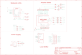

Contents
========

* [PRA3654 > Adafruit WINC1500 Shield PCB](#pra3654--adafruit-winc1500-shield-pcb)
	* [Schematic](#schematic)
	* [PCB](#pcb)
	* [Interactive BOM](#interactive-bom)
	* [Images](#images)
	* [Tags](#tags)
  
![][im]
# PRA3654 > Adafruit WINC1500 Shield PCB

- ID: PROJ-ADAF-3654-STAN-01
- Hex ID: PRA3654
- Name: Adafruit
- Description: Adafruit
- Long Link: [http://oom.lt/PROJ-ADAF-3654-STAN-01](http://oom.lt/PROJ-ADAF-3654-STAN-01)
- Short Link: [http://oom.lt/PRA3654](http://oom.lt/PRA3654)

## Schematic
  

## PCB
  

## Interactive BOM

- Interactive BOM page: [ibom.html](https://htmlpreview.github.io/?https://github.com/oomlout/oomlout_OOMP_projects/blob/main/PROJ-ADAF-3654-STAN-01/kicad/bom/ibom.html)

## Images
  
  

|bominteractivefront|bominteractiveback|kicadPcb3d|kicadPcb3dFront|kicadPcb3dBack|eagleImage|eagleSchemImage|pcbdraw|pcbdrawback|
| :---: | :---: | :---: | :---: | :---: | :---: | :---: | :---: | :---: |
||||||||||

## Tags

- hexID: PRA3654
- oompType: PROJ
- oompSize: ADAF
- oompColor: 3654
- oompDesc: STAN
- oompIndex: 01
- oompName: Adafruit WINC1500 Shield PCB
- sources: All source files from https://github.com/adafruit/Adafruit-WINC1500-Shield-PCB (source licence details in srcLicense.md)
- linkBuyPage: http://www.adafruit.com/products/3654
- oompID: PROJ-ADAF-3654-STAN-01
- rawParts: C1,10uF,CAP_CERAMIC0805-NOOUTLINE,0805-NO,Ceramic Capacitors,,
- rawParts: C2,10uF,CAP_CERAMIC0805-NOOUTLINE,0805-NO,Ceramic Capacitors,,
- rawParts: C3,10uF,CAP_CERAMIC0805-NOOUTLINE,0805-NO,Ceramic Capacitors,,
- rawParts: C4,10uF,CAP_CERAMIC0805-NOOUTLINE,0805-NO,Ceramic Capacitors,,
- rawParts: C5,1uF,CAP_CERAMIC0805-NOOUTLINE,0805-NO,Ceramic Capacitors,,
- rawParts: CS_JMP,,SOLDERJUMPERCLOSED,SOLDERJUMPER_CLOSEDWIRE,SMD Solder JUMPER,,
- rawParts: D1,green,LED0805_NOOUTLINE,CHIPLED_0805_NOOUTLINE,LED,,
- rawParts: D2,Yellow,LED0805_NOOUTLINE,CHIPLED_0805_NOOUTLINE,LED,,
- rawParts: D3,Red,LED0805_NOOUTLINE,CHIPLED_0805_NOOUTLINE,LED,,
- rawParts: FID1,FIDUCIAL_1MM,FIDUCIAL_1MM,FIDUCIAL_1MM,Fiducial Alignment Points,EXCLUDE,
- rawParts: FID2,FIDUCIAL_1MM,FIDUCIAL_1MM,FIDUCIAL_1MM,Fiducial Alignment Points,EXCLUDE,
- rawParts: FID3,FIDUCIAL_1MM,FIDUCIAL_1MM,FIDUCIAL_1MM,Fiducial Alignment Points,EXCLUDE,
- rawParts: IC4,AP2112-3.3,LP298XS,SOT23-5L,,,
- rawParts: IRQ_JMP,,SOLDERJUMPERCLOSED,SOLDERJUMPER_CLOSEDWIRE,SMD Solder JUMPER,,
- rawParts: JP1,,HEADER-1X1ROUND,1X01_ROUND,PIN HEADER,,
- rawParts: JP2,,HEADER-1X870MIL,1X08_ROUND_70,PIN HEADER,,
- rawParts: JP3,,HEADER-1X870MIL,1X08_ROUND_70,PIN HEADER,,
- rawParts: JP4,,HEADER-1X670MIL,1X06_ROUND_70,PIN HEADER,,
- rawParts: JP5,,HEADER-1X1070MIL,1X10_ROUND70,PIN HEADER,,
- rawParts: JP6,,HEADER-1X1ROUND,1X01_ROUND,PIN HEADER,,
- rawParts: JP7,,HEADER-1X1ROUND,1X01_ROUND,PIN HEADER,,
- rawParts: JP8,,HEADER-1X1ROUND,1X01_ROUND,PIN HEADER,,
- rawParts: JP9,,HEADER-1X1ROUND,1X01_ROUND,PIN HEADER,,
- rawParts: JP10,,HEADER-1X1ROUND,1X01_ROUND,PIN HEADER,,
- rawParts: JP11,,HEADER-1X1ROUND,1X01_ROUND,PIN HEADER,,
- rawParts: JP12,,HEADER-1X1ROUND,1X01_ROUND,PIN HEADER,,
- rawParts: M1,ARDUINO_R3_ICSP_NODIM,ARDUINO_R3_ICSP_NODIM,ARDUINOR3_ICSP_NODIM,,,
- rawParts: R1,100K,RESISTOR0805_NOOUTLINE,0805-NO,Resistors,,
- rawParts: R2,1K,RESISTOR0805_NOOUTLINE,0805-NO,Resistors,,
- rawParts: R3,100K,RESISTOR0805_NOOUTLINE,0805-NO,Resistors,,
- rawParts: R4,1K,RESISTOR0805_NOOUTLINE,0805-NO,Resistors,,
- rawParts: R5,1K,RESISTOR0805_NOOUTLINE,0805-NO,Resistors,,
- rawParts: R7,100K,RESISTOR0805_NOOUTLINE,0805-NO,Resistors,,
- rawParts: R8,100K,RESISTOR0805_NOOUTLINE,0805-NO,Resistors,,
- rawParts: RST_JMP,,SOLDERJUMPERCLOSED,SOLDERJUMPER_CLOSEDWIRE,SMD Solder JUMPER,,
- rawParts: SD_JMP,,SOLDERJUMPERCLOSED,SOLDERJUMPER_CLOSEDWIRE,SMD Solder JUMPER,,
- rawParts: SJ2,ICSP_MISO,SOLDERJUMPERCLOSED,SOLDERJUMPER_CLOSEDWIRE,SMD Solder JUMPER,,
- rawParts: SJ3,ISCP_SCLK,SOLDERJUMPERCLOSED,SOLDERJUMPER_CLOSEDWIRE,SMD Solder JUMPER,,
- rawParts: SJ4,ICSP_MOSI,SOLDERJUMPERCLOSED,SOLDERJUMPER_CLOSEDWIRE,SMD Solder JUMPER,,
- rawParts: SJ5,D12_MISO,SOLDERJUMPERREFLOW_NOPASTE,SOLDERJUMPER_REFLOW_NOPASTE,SMD Solder JUMPER,,
- rawParts: SJ6,D13_SCLK,SOLDERJUMPERREFLOW_NOPASTE,SOLDERJUMPER_REFLOW_NOPASTE,SMD Solder JUMPER,,
- rawParts: SJ7,D11_MOSI,SOLDERJUMPERREFLOW_NOPASTE,SOLDERJUMPER_REFLOW_NOPASTE,SMD Solder JUMPER,,
- rawParts: SW2,Tactile,SWITCH_TACT_SMT_EVQQ2_SMALL,EVQ-Q2_SMALLER,SMT Tact Switches,,
- rawParts: U$1,ATWINC1500_MR210PB,ATWINC1500_MR210PA,ATWINC1500_MR210PA,ATWINC1500_MR210PA wifi module,,
- rawParts: U2,74HC4050,74HC4050D,SOIC16,6-channel level shifter,,
- rawParts: X1,microSd,MICROSD,MICROSD,MicroSD/Transflash Card Holder with SPI pinout,,

[im]: kicadPcb3d_450.png
