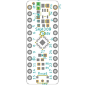
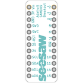
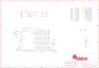
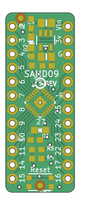
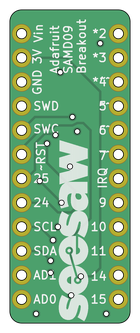

Contents
========

* [PRA3657 > Adafruit SAMD09 Breakout PCB](#pra3657--adafruit-samd09-breakout-pcb)
	* [Schematic](#schematic)
	* [PCB](#pcb)
	* [Interactive BOM](#interactive-bom)
	* [OOMP Parts](#oomp-parts)
	* [Images](#images)
	* [Tags](#tags)
  
![][im]
# PRA3657 > Adafruit SAMD09 Breakout PCB

- ID: PROJ-ADAF-3657-STAN-01
- Hex ID: PRA3657
- Name: Adafruit
- Description: Adafruit
- Long Link: [http://oom.lt/PROJ-ADAF-3657-STAN-01](http://oom.lt/PROJ-ADAF-3657-STAN-01)
- Short Link: [http://oom.lt/PRA3657](http://oom.lt/PRA3657)

## Schematic
  

## PCB
  

## Interactive BOM

- Interactive BOM page: [ibom.html](https://htmlpreview.github.io/?https://github.com/oomlout/oomlout_OOMP_projects/blob/main/PROJ-ADAF-3657-STAN-01/kicad/bom/ibom.html)

## OOMP Parts
  

|OOMP Parts|
| :---: |
|[CAPC-0805-X-UF10-V10  SMD (0805) 10 uF Capacitor (Ceramic) 10v  C1, C4](https://github.com/oomlout/oomlout_OOMP_parts/tree/main/CAPC-0805-X-UF10-V10/)|
|[CAPC-0603-X-NF100-V50  SMD (0603) 100 nF Capacitor (Ceramic) 50v  C2](https://github.com/oomlout/oomlout_OOMP_parts/tree/main/CAPC-0603-X-NF100-V50/)|
|[LEDS-0805-R-STAN-01  SMD (0805) Red LED  D1](https://github.com/oomlout/oomlout_OOMP_parts/tree/main/LEDS-0805-R-STAN-01/)|
|[LEDS-0805-G-STAN-01  SMD (0805) Green LED  D2](https://github.com/oomlout/oomlout_OOMP_parts/tree/main/LEDS-0805-G-STAN-01/)|
|UNMATCHED-UNMATCHED-X-UNMATCHED-01 IC1|
|[HEAD-I01-X-PI12-01  2.54 mm 12 Pin Header  JP1, JP3](https://github.com/oomlout/oomlout_OOMP_parts/tree/main/HEAD-I01-X-PI12-01/)|
|[RESE-0603-X-O102-01  SMD (0603) 1k Ohm Resistor  R1, R2, R3](https://github.com/oomlout/oomlout_OOMP_parts/tree/main/RESE-0603-X-O102-01/)|
|[RESE-0603-X-O103-01  SMD (0603) 10k Ohm Resistor  R4, R5](https://github.com/oomlout/oomlout_OOMP_parts/tree/main/RESE-0603-X-O103-01/)|
|[BUTA-4628-X-STAN-01  SMD (4628) Pushbutton (Tactile)  SW1](https://github.com/oomlout/oomlout_OOMP_parts/tree/main/BUTA-4628-X-STAN-01/)|
|[VREG-SO235-X-KAP2112K-V33D  SMD (SOT-23-5) AP2112K Voltage Regulator 3.3v  U1](https://github.com/oomlout/oomlout_OOMP_parts/tree/main/VREG-SO235-X-KAP2112K-V33D/)|

## Images
  
  

|bominteractivefront|bominteractiveback|kicadPcb3d|kicadPcb3dFront|kicadPcb3dBack|eagleImage|eagleSchemImage|pcbdraw|pcbdrawback|
| :---: | :---: | :---: | :---: | :---: | :---: | :---: | :---: | :---: |
||||||||||

## Tags

- hexID: PRA3657
- oompType: PROJ
- oompSize: ADAF
- oompColor: 3657
- oompDesc: STAN
- oompIndex: 01
- oompName: Adafruit SAMD09 Breakout PCB
- sources: All source files from https://github.com/adafruit/Adafruit-SAMD09-Breakout-PCB (source licence details in srcLicense.md)
- linkBuyPage: http://www.adafruit.com/products/3657
- oompID: PROJ-ADAF-3657-STAN-01
- oompParts: C1,CAPC-0805-X-UF10-V10
- oompParts: C2,CAPC-0603-X-NF100-V50
- oompParts: C4,CAPC-0805-X-UF10-V10
- oompParts: D1,LEDS-0805-R-STAN-01
- oompParts: D2,LEDS-0805-G-STAN-01
- oompParts: IC1,UNMATCHED-UNMATCHED-X-UNMATCHED-01
- oompParts: JP1,HEAD-I01-X-PI12-01
- oompParts: JP3,HEAD-I01-X-PI12-01
- oompParts: R1,RESE-0603-X-O102-01
- oompParts: R2,RESE-0603-X-O102-01
- oompParts: R3,RESE-0603-X-O102-01
- oompParts: R4,RESE-0603-X-O103-01
- oompParts: R5,RESE-0603-X-O103-01
- oompParts: SW1,BUTA-4628-X-STAN-01
- oompParts: U1,VREG-SO235-X-KAP2112K-V33D
- rawParts: C1,10uF,CAP_CERAMIC0805-NOOUTLINE,0805-NO,Ceramic Capacitors,,
- rawParts: C2,0.1uF,CAP_CERAMIC0603_NO,0603-NO,Ceramic Capacitors,,
- rawParts: C4,10uF,CAP_CERAMIC0805-NOOUTLINE,0805-NO,Ceramic Capacitors,,
- rawParts: D1,RED,LED0805_NOOUTLINE,CHIPLED_0805_NOOUTLINE,LED,,
- rawParts: D2,GREEN,LED0805_NOOUTLINE,CHIPLED_0805_NOOUTLINE,LED,,
- rawParts: FID1,FIDUCIAL,FIDUCIAL,FIDUCIAL_1MM,Fiducial Alignment Points,EXCLUDE,
- rawParts: FID2,FIDUCIAL,FIDUCIAL,FIDUCIAL_1MM,Fiducial Alignment Points,EXCLUDE,
- rawParts: IC1,ATSAMD09D14A-MU,ATSAMD09D14A-MU,QFN24_4MM,,,
- rawParts: JP1,,HEADER-1X1276MIL,1X12_ROUND_76MIL,,,
- rawParts: JP3,,HEADER-1X1276MIL,1X12_ROUND_76MIL,,,
- rawParts: R1,1K,RESISTOR_0603_NOOUT,0603-NO,Resistors,,
- rawParts: R2,1K,RESISTOR_0603_NOOUT,0603-NO,Resistors,,
- rawParts: R3,1K,RESISTOR_0603_NOOUT,0603-NO,Resistors,,
- rawParts: R4,10k,RESISTOR_0603_NOOUT,0603-NO,Resistors,,
- rawParts: R5,10k,RESISTOR_0603_NOOUT,0603-NO,Resistors,,
- rawParts: SW1,KMR2,SWITCH_TACT_SMT4.6X2.8,BTN_KMR2_4.6X2.8,SMT Tact Switches,,
- rawParts: U1,AP2112K,VREG_SOT23-5,SOT23-5,SOT23-5 Fixed Voltage Regulators,,

[im]: kicadPcb3d_450.png
