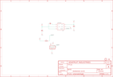

Contents
========

* [PRA3661 > Adafruit](#pra3661--adafruit)
	* [Schematic](#schematic)
	* [Interactive BOM](#interactive-bom)
	* [OOMP Parts](#oomp-parts)
	* [Images](#images)
	* [Tags](#tags)
  
![][im]
# PRA3661 > Adafruit

- ID: PROJ-ADAF-3661-STAN-01
- Hex ID: PRA3661
- Name: Adafruit
- Description: Adafruit
- Long Link: [http://oom.lt/PROJ-ADAF-3661-STAN-01](http://oom.lt/PROJ-ADAF-3661-STAN-01)
- Short Link: [http://oom.lt/PRA3661](http://oom.lt/PRA3661)

## Schematic
  

## Interactive BOM

- Interactive BOM page: [ibom.html](https://htmlpreview.github.io/?https://github.com/oomlout/oomlout_OOMP_projects/blob/main/PROJ-ADAF-3661-STAN-01/kicad/bom/ibom.html)

## OOMP Parts
  

|OOMP Parts|
| :---: |
|C1,CAPC-0805-X-UF10-V10,C1,10uF,CAP_CERAMIC0805-NOOUTLINE,0805-NO,Ceramic Capacitors,,|
|C2,CAPC-0805-X-UF10-V10,C2,10uF,CAP_CERAMIC0805-NOOUTLINE,0805-NO,Ceramic Capacitors,,|
|C3,CAPC-0805-X-UF1-01,C3,1uF,CAP_CERAMIC0805-NOOUTLINE,0805-NO,Ceramic Capacitors,,|
|IC1,UNMATCHED-SO23-X-UNMATCHED-01,FID1,FIDUCIAL,FIDUCIAL,FIDUCIAL_1MM,Fiducial Alignment Points,EXCLUDE,|
|JP1,HEAD-I01-X-PI04-01,IC1,AP3602,AP3602,SOT23-6,,,|
|R1,RESE-0805-X-O1003-01,JP1,,HEADER-1X4ROUND,1X04_ROUND,PIN HEADER,,|

## Images
  
  

|kicadPcb3d|kicadPcb3dFront|kicadPcb3dBack|eagleImage|eagleSchemImage|
| :---: | :---: | :---: | :---: | :---: |
||||||

## Tags

- hexID: PRA3661
- oompType: PROJ
- oompSize: ADAF
- oompColor: 3661
- oompDesc: STAN
- oompIndex: 01
- oompName: Adafruit AP3602A PCB
- sources: All source files from https://github.com/adafruit/Adafruit-AP3602A-PCB (source licence details in srcLicense.md)
- linkBuyPage: http://www.adafruit.com/products/3661
- oompID: PROJ-ADAF-3661-STAN-01
- oompParts: C1,CAPC-0805-X-UF10-V10
- oompParts: C2,CAPC-0805-X-UF10-V10
- oompParts: C3,CAPC-0805-X-UF1-01
- oompParts: IC1,UNMATCHED-SO23-X-UNMATCHED-01
- oompParts: JP1,HEAD-I01-X-PI04-01
- oompParts: R1,RESE-0805-X-O1003-01
- rawParts: C1,10uF,CAP_CERAMIC0805-NOOUTLINE,0805-NO,Ceramic Capacitors,,
- rawParts: C2,10uF,CAP_CERAMIC0805-NOOUTLINE,0805-NO,Ceramic Capacitors,,
- rawParts: C3,1uF,CAP_CERAMIC0805-NOOUTLINE,0805-NO,Ceramic Capacitors,,
- rawParts: FID1,FIDUCIAL,FIDUCIAL,FIDUCIAL_1MM,Fiducial Alignment Points,EXCLUDE,
- rawParts: IC1,AP3602,AP3602,SOT23-6,,,
- rawParts: JP1,,HEADER-1X4ROUND,1X04_ROUND,PIN HEADER,,
- rawParts: R1,100K,RESISTOR0805_NOOUTLINE,0805-NO,Resistors,,
- rawParts: U$9,MOUNTINGHOLE2.5,MOUNTINGHOLE2.5,MOUNTINGHOLE_2.5_PLATED,Mounting Hole,EXCLUDE,

[im]: kicadPcb3d_450.png
