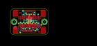
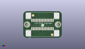
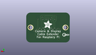
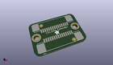

Contents
========

* [PROJ-ADAF-3671-STAN-01>Adafruit CSI or DSI Cable Extender Thingy for Raspberry Pi](#proj-adaf-3671-stan-01adafruit-csi-or-dsi-cable-extender-thingy-for-raspberry-pi)
	* [Images](#images)
	* [Interactive BOM](#interactive-bom)
	* [OOMP Parts](#oomp-parts)
	* [Tags](#tags)
  
![][im]
# PROJ-ADAF-3671-STAN-01>Adafruit CSI or DSI Cable Extender Thingy for Raspberry Pi

- ID: PROJ-ADAF-3671-STAN-01
- Hex ID: PRA3671
- Name: Adafruit CSI or DSI Cable Extender Thingy for Raspberry Pi
- Description: 

## Images
  
  

|eagleImage|kicadPcb3dFront|kicadPcb3dBack|kicadPcb3d|
| :---: | :---: | :---: | :---: |
|||||

## Interactive BOM

- Interactive BOM page: [ibom.html](kicad/bom/ibom.html)

## OOMP Parts
  

|OOMP Parts|
| :---: |
|UNMATCHED-UNMATCHED-X-UNMATCHED-01, JP1, 12.7, 5.08, 0,JP1, FPC_15PIN_1.0MM, microbuilder, (0.5, 0.2), R0|
|UNMATCHED-UNMATCHED-X-UNMATCHED-01, JP2, 12.7, 12.7, 180,JP2, FPC_15PIN_1.0MM, microbuilder, (0.5, 0.5), R180|

## Tags

- hexID: PRA3671
- oompType: PROJ
- oompSize: ADAF
- oompColor: 3671
- oompDesc: STAN
- oompIndex: 01
- oompName: Adafruit CSI or DSI Cable Extender Thingy for Raspberry Pi
- sources: All source files from https://github.com/adafruit/Adafruit-CSI-or-DSI-Cable-Extender-Thingy-for-Raspberry-Pi (source licence details in srcLicense.md)
- linkBuyPage: http://www.adafruit.com/products/3671
- oompID: PROJ-ADAF-3671-STAN-01
- oompPart: SKIP-UNMATCHED-X-UNMATCHED-01, FID1, 19.049999999999997, 2.032, 0
- oompPart: SKIP-UNMATCHED-X-UNMATCHED-01, FID2, 6.476999999999999, 14.985999999999999, 0
- oompPart: UNMATCHED-UNMATCHED-X-UNMATCHED-01, JP1, 12.7, 5.08, 0
- oompPart: UNMATCHED-UNMATCHED-X-UNMATCHED-01, JP2, 12.7, 12.7, 180
- oompPart: SKIP-UNMATCHED-X-UNMATCHED-01, U$2, 2.54, 8.889999999999999, 0
- oompPart: SKIP-UNMATCHED-X-UNMATCHED-01, U$3, 22.86, 8.889999999999999, 0
- rawPart: FID1, FIDUCIAL_1MM, FIDUCIAL_1MM, microbuilder, (0.75, 0.08), R0
- rawPart: FID2, FIDUCIAL_1MM, FIDUCIAL_1MM, microbuilder, (0.255, 0.59), R0
- rawPart: JP1, FPC_15PIN_1.0MM, microbuilder, (0.5, 0.2), R0
- rawPart: JP2, FPC_15PIN_1.0MM, microbuilder, (0.5, 0.5), R180
- rawPart: U$2, MOUNTINGHOLE2.5, MOUNTINGHOLE_2.5_PLATED, microbuilder, (0.1, 0.35), R0
- rawPart: U$3, MOUNTINGHOLE2.5, MOUNTINGHOLE_2.5_PLATED, microbuilder, (0.9, 0.35), R0

[im]: kicadPcb3d_450.png
