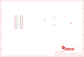

Contents
========

* [PRA3671 > Adafruit](#pra3671--adafruit)
	* [Schematic](#schematic)
	* [Interactive BOM](#interactive-bom)
	* [OOMP Parts](#oomp-parts)
	* [Images](#images)
	* [Tags](#tags)
  
![][im]
# PRA3671 > Adafruit

- ID: PROJ-ADAF-3671-STAN-01
- Hex ID: PRA3671
- Name: Adafruit
- Description: Adafruit
- Long Link: [http://oom.lt/PROJ-ADAF-3671-STAN-01](http://oom.lt/PROJ-ADAF-3671-STAN-01)
- Long Link: [http://oom.lt/PRA3671](http://oom.lt/PRA3671)

## Schematic
  
![][schem]
## Interactive BOM

- Interactive BOM page: [ibom.html](https://htmlpreview.github.io/?https://github.com/oomlout/oomlout_OOMP_projects/blob/main/PROJ-ADAF-3671-STAN-01/kicad/bom/ibom.html)

## OOMP Parts
  

|OOMP Parts|
| :---: |
|JP1,UNMATCHED-UNMATCHED-UNMATCHED-UNMATCHED-UNMATCHED,FID1,FIDUCIAL_1MM,FIDUCIAL_1MM,FIDUCIAL_1MM,Fiducial Alignment Points,EXCLUDE,|
|JP2,UNMATCHED-UNMATCHED-UNMATCHED-UNMATCHED-UNMATCHED,FID2,FIDUCIAL_1MM,FIDUCIAL_1MM,FIDUCIAL_1MM,Fiducial Alignment Points,EXCLUDE,|

## Images
  
  

|kicadPcb3d|kicadPcb3dFront|kicadPcb3dBack|eagleImage|eagleSchemImage|
| :---: | :---: | :---: | :---: | :---: |
||||||

## Tags

- hexID: PRA3671
- oompType: PROJ
- oompSize: ADAF
- oompColor: 3671
- oompDesc: STAN
- oompIndex: 01
- oompName: Adafruit CSI or DSI Cable Extender Thingy for Raspberry Pi
- sources: All source files from https://github.com/adafruit/Adafruit-CSI-or-DSI-Cable-Extender-Thingy-for-Raspberry-Pi (source licence details in srcLicense.md)
- linkBuyPage: http://www.adafruit.com/products/3671
- oompID: PROJ-ADAF-3671-STAN-01
- oompParts: JP1,UNMATCHED-UNMATCHED-UNMATCHED-UNMATCHED-UNMATCHED
- oompParts: JP2,UNMATCHED-UNMATCHED-UNMATCHED-UNMATCHED-UNMATCHED
- rawParts: FID1,FIDUCIAL_1MM,FIDUCIAL_1MM,FIDUCIAL_1MM,Fiducial Alignment Points,EXCLUDE,
- rawParts: FID2,FIDUCIAL_1MM,FIDUCIAL_1MM,FIDUCIAL_1MM,Fiducial Alignment Points,EXCLUDE,
- rawParts: JP1,,HEADER-1X15_FPC1MM_PI,FPC_15PIN_1.0MM,1x15 Header,,
- rawParts: JP2,,HEADER-1X15_FPC1MM_PI,FPC_15PIN_1.0MM,1x15 Header,,
- rawParts: U$2,MOUNTINGHOLE2.5,MOUNTINGHOLE2.5,MOUNTINGHOLE_2.5_PLATED,Mounting Hole,EXCLUDE,
- rawParts: U$3,MOUNTINGHOLE2.5,MOUNTINGHOLE2.5,MOUNTINGHOLE_2.5_PLATED,Mounting Hole,EXCLUDE,

[im]: kicadPcb3d_450.png
[schem]: eagleSchemImage.png
