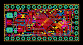
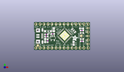
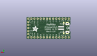
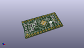

Contents
========

* [PROJ-ADAF-3677-STAN-01>Adafruit ItsyBitsy 32u4 PCB](#proj-adaf-3677-stan-01adafruit-itsybitsy-32u4-pcb)
	* [Images](#images)
	* [Interactive BOM](#interactive-bom)
	* [Tags](#tags)
  
![][im]
# PROJ-ADAF-3677-STAN-01>Adafruit ItsyBitsy 32u4 PCB

- ID: PROJ-ADAF-3677-STAN-01
- Hex ID: PRA3677
- Name: Adafruit ItsyBitsy 32u4 PCB
- Description: 

## Images
  
  

|eagleImage|kicadPcb3dFront|kicadPcb3dBack|kicadPcb3d|
| :---: | :---: | :---: | :---: |
|||||

## Interactive BOM

- Interactive BOM page: [ibom.html](kicad/bom/ibom.html)

## Tags

- hexID: PRA3677
- oompType: PROJ
- oompSize: ADAF
- oompColor: 3677
- oompDesc: STAN
- oompIndex: 01
- oompName: Adafruit ItsyBitsy 32u4 PCB
- sources: All source files from https://github.com/adafruit/Adafruit-ItsyBitsy-32u4-PCB (source licence details in srcLicense.md)
- linkBuyPage: http://www.adafruit.com/products/3677
- oompPart: CAPC-0805-X-UF10-V25, C6, 12.572999999999999, 12.953999999999999, 90
- oompPart: CAPC-0805-X-UF10-V25, C7, 25.145999999999997, 4.191, 90
- oompPart: CAPC-0805-X-UF10-V25, C8, 7.112, 5.968999999999999, 90
- oompPart: CAPC-0603-X-UNMATCHED-01, C9, 30.479999999999997, 5.588, 0
- oompPart: CAPC-0603-X-UNMATCHED-01, C14, 8.636000000000001, 5.842, 90
- oompPart: UNMATCHED-UNMATCHED-X-UNMATCHED-01, D1, 8.889999999999999, 11.937999999999999, 180
- oompPart: UNMATCHED-UNMATCHED-X-UNMATCHED-01, IC1, 19.431, 9.143999999999998, 45
- oompPart: UNMATCHED-UNMATCHED-X-UNMATCHED-01, JP1, 34.29, 8.889999999999999, 270
- oompPart: UNMATCHED-UNMATCHED-X-UNMATCHED-01, JP2, 17.779999999999998, 16.509999999999998, 0
- oompPart: UNMATCHED-UNMATCHED-X-UNMATCHED-01, JP4, 17.779999999999998, 1.27, 180
- oompPart: UNMATCHED-UNMATCHED-X-UNMATCHED-01, L, 30.225999999999996, 13.716, 90
- oompPart: RESE-0603-X-UNMATCHED-01, R4, 7.874, 10.033, 0
- oompPart: RESE-0603-X-UNMATCHED-01, R5, 7.810499999999999, 8.5725, 0
- oompPart: RESE-0603-X-O222-01, R7, 30.479999999999997, 12.318999999999999, 0
- oompPart: RESE-0603-X-UNMATCHED-01, R9, 11.937999999999999, 10.3124, 180
- oompPart: UNMATCHED-UNMATCHED-X-UNMATCHED-01, SW1, 30.479999999999997, 8.889999999999999, 270
- oompPart: SKIP-UNMATCHED-X-UNMATCHED-01, U$34, 2.413, 2.794, 270
- oompPart: SKIP-UNMATCHED-X-UNMATCHED-01, U$35, 30.019200058, 9.023999985999998, 270
- oompPart: UNMATCHED-UNMATCHED-X-UNMATCHED-01, U2, 11.937999999999999, 7.5691999999999995, 180
- oompPart: UNMATCHED-UNMATCHED-X-UNMATCHED-01, X1, 3.8099999999999996, 8.889999999999999, M270
- oompPart: UNMATCHED-UNMATCHED-X-UNMATCHED-01, X3, 4.444999999999999, 8.889999999999999, 270
- oompPart: UNMATCHED-UNMATCHED-X-UNMATCHED-01, Y1, 25.183196776, 12.303590582, 315
- rawPart: 

[im]: kicadPcb3d_450.png
