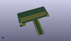
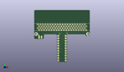
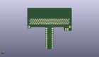
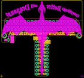
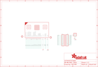

Contents
========

* [PRA3695 > Adafruit](#pra3695--adafruit)
	* [Schematic](#schematic)
	* [Interactive BOM](#interactive-bom)
	* [OOMP Parts](#oomp-parts)
	* [Images](#images)
	* [Tags](#tags)
  
![][im]
# PRA3695 > Adafruit

- ID: PROJ-ADAF-3695-STAN-01
- Hex ID: PRA3695
- Name: Adafruit
- Description: Adafruit
- Long Link: [http://oom.lt/PROJ-ADAF-3695-STAN-01](http://oom.lt/PROJ-ADAF-3695-STAN-01)
- Short Link: [http://oom.lt/PRA3695](http://oom.lt/PRA3695)

## Schematic
  

## Interactive BOM

- Interactive BOM page: [ibom.html](https://htmlpreview.github.io/?https://github.com/oomlout/oomlout_OOMP_projects/blob/main/PROJ-ADAF-3695-STAN-01/kicad/bom/ibom.html)

## OOMP Parts
  

|OOMP Parts|
| :---: |
|JP1,UNMATCHED-UNMATCHED-UNMATCHED-UNMATCHED-UNMATCHED,JP1,,HEADER-1X1176MIL,1X11_ROUND_76,,,|
|JP2,UNMATCHED-UNMATCHED-UNMATCHED-UNMATCHED-UNMATCHED,JP2,,HEADER-1X1176MIL,1X11_ROUND_76,,,|
|JP4,UNMATCHED-UNMATCHED-UNMATCHED-UNMATCHED-UNMATCHED,JP4,,HEADER-1X2,1X02_OVAL,PIN HEADER,,|
|MB1,UNMATCHED-UNMATCHED-UNMATCHED-UNMATCHED-UNMATCHED,MB1,MICRO:BIT_RA,MICRO:BIT_RA,2X20_CARDEDGE_RA,,,|

## Images
  
  

|kicadPcb3d|kicadPcb3dFront|kicadPcb3dBack|eagleImage|eagleSchemImage|
| :---: | :---: | :---: | :---: | :---: |
||||||

## Tags

- hexID: PRA3695
- oompType: PROJ
- oompSize: ADAF
- oompColor: 3695
- oompDesc: STAN
- oompIndex: 01
- oompName: Adafruit DragonTail for micro bit PCB
- sources: All source files from https://github.com/adafruit/Adafruit-DragonTail-for-micro-bit-PCB (source licence details in srcLicense.md)
- linkBuyPage: http://www.adafruit.com/products/3695
- oompID: PROJ-ADAF-3695-STAN-01
- oompParts: JP1,UNMATCHED-UNMATCHED-UNMATCHED-UNMATCHED-UNMATCHED
- oompParts: JP2,UNMATCHED-UNMATCHED-UNMATCHED-UNMATCHED-UNMATCHED
- oompParts: JP4,UNMATCHED-UNMATCHED-UNMATCHED-UNMATCHED-UNMATCHED
- oompParts: MB1,UNMATCHED-UNMATCHED-UNMATCHED-UNMATCHED-UNMATCHED
- rawParts: JP1,,HEADER-1X1176MIL,1X11_ROUND_76,,,
- rawParts: JP2,,HEADER-1X1176MIL,1X11_ROUND_76,,,
- rawParts: JP4,,HEADER-1X2,1X02_OVAL,PIN HEADER,,
- rawParts: MB1,MICRO:BIT_RA,MICRO:BIT_RA,2X20_CARDEDGE_RA,,,
- rawParts: U$9,MOUNTINGHOLE2.0,MOUNTINGHOLE2.0,MOUNTINGHOLE_2.0_PLATED,Mounting Hole,EXCLUDE,
- rawParts: U$10,MOUNTINGHOLE2.0,MOUNTINGHOLE2.0,MOUNTINGHOLE_2.0_PLATED,Mounting Hole,EXCLUDE,

[im]: kicadPcb3d_450.png
