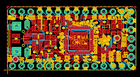
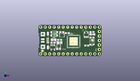
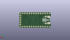
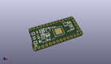

Contents
========

* [PROJ-ADAF-3727-STAN-01>Adafruit ItsyBitsy M0 PCB](#proj-adaf-3727-stan-01adafruit-itsybitsy-m0-pcb)
	* [Images](#images)
	* [Interactive BOM](#interactive-bom)
	* [OOMP Parts](#oomp-parts)
	* [Tags](#tags)
  
![][im]
# PROJ-ADAF-3727-STAN-01>Adafruit ItsyBitsy M0 PCB

- ID: PROJ-ADAF-3727-STAN-01
- Hex ID: PRA3727
- Name: Adafruit ItsyBitsy M0 PCB
- Description: 

## Images
  
  

|eagleImage|kicadPcb3dFront|kicadPcb3dBack|kicadPcb3d|
| :---: | :---: | :---: | :---: |
|||||

## Interactive BOM

- Interactive BOM page: [ibom.html](kicad/bom/ibom.html)

## OOMP Parts
  

|OOMP Parts|
| :---: |
|CAPC-0603-X-UNMATCHED-01, C1, 11.9126, 9.270999999999999, 180,C1, 1uF, 0603-NO, microbuilder, (0.469, 0.365), R180|
|CAPC-0603-X-UNMATCHED-01, C5, 27.2415, 6.0325, 0,C5, 1uF, 0603-NO, microbuilder, (1.0725, 0.2375), R0|
|CAPC-0805-X-UNMATCHED-01, C6, 8.57749999, 9.310999919999999, 0,C6, 10uF, 0805-NO, microbuilder, (0.33769685, 0.3665748), R0|
|CAPC-0603-X-UNMATCHED-01, C7, 16.268500102, 13.097999965999998, 180,C7, 1uF, 0603-NO, microbuilder, (0.64049213, 0.51566929), R180|
|CAPC-0805-X-UNMATCHED-01, C8, 11.941500119999999, 7.73200003, 180,C8, 10uF, 0805-NO, microbuilder, (0.4701378, 0.30440945), R180|
|CAPC-0603-X-UNMATCHED-01, C14, 11.3538, 4.027093799999999, 0,C14, 1uF, 0603-NO, microbuilder, (0.447, 0.158547), R0|
|UNMATCHED-UNMATCHED-X-UNMATCHED-01, D1, 8.889999999999999, 13.589, 180,D1, MBR120, SOD-123FL, adafruit, (0.35, 0.535), R180|
|UNMATCHED-UNMATCHED-X-UNMATCHED-01, D2, 8.889999999999999, 11.811, 180,D2, MBR120, SOD-123FL, adafruit, (0.35, 0.465), R180|
|UNMATCHED-UNMATCHED-X-UNMATCHED-01, IC1, 26.924, 12.128499999999999, 0,IC1, 74HCT1G125, SOT23-5, 74xx-little-us, (1.06, 0.4775), R0|
|<table><tr><td></td><td> JP1</td><td>[HEAD-I01-X-PI05-01 2.54 mm 5 Pin Header](https://github.com/oomlout/oomlout_OOMP_parts/tree/main/HEAD-I01-X-PI05-01/)</td><td>[H05](https://github.com/oomlout/oomlout_OOMP_parts/tree/main/HEAD-I01-X-PI05-01/)</td></tr></table>|
|<table><tr><td></td><td> JP2</td><td>[HEAD-I01-X-PI14-01 2.54 mm 14 Pin Header](https://github.com/oomlout/oomlout_OOMP_parts/tree/main/HEAD-I01-X-PI14-01/)</td><td>[H14](https://github.com/oomlout/oomlout_OOMP_parts/tree/main/HEAD-I01-X-PI14-01/)</td></tr></table>|
|<table><tr><td></td><td> JP4</td><td>[HEAD-I01-X-PI14-01 2.54 mm 14 Pin Header](https://github.com/oomlout/oomlout_OOMP_parts/tree/main/HEAD-I01-X-PI14-01/)</td><td>[H14](https://github.com/oomlout/oomlout_OOMP_parts/tree/main/HEAD-I01-X-PI14-01/)</td></tr></table>|
|LEDS-UNMATCHED-X-UNMATCHED-01, L, 30.374999955999996, 12.358999919999999, 270,L, RED, CHIPLED_0805_NOOUTLINE, microbuilder, (1.19586614, 0.4865748), R270|
|UNMATCHED-UNMATCHED-X-UNMATCHED-01, L2, 11.43, 5.7785, 0,L2, AP102-2020, APA102_2020, microbuilder, (0.45, 0.2275), R0|
|<table><tr><td></td><td> R1</td><td>[RESE-0603-X-O104-01 SMD (0603) 100k Ohm Resistor](https://github.com/oomlout/oomlout_OOMP_parts/tree/main/RESE-0603-X-O104-01/)</td><td>[R6104](https://github.com/oomlout/oomlout_OOMP_parts/tree/main/RESE-0603-X-O104-01/)</td></tr></table>|
|<table><tr><td></td><td> R2</td><td>[RESE-0603-X-O104-01 SMD (0603) 100k Ohm Resistor](https://github.com/oomlout/oomlout_OOMP_parts/tree/main/RESE-0603-X-O104-01/)</td><td>[R6104](https://github.com/oomlout/oomlout_OOMP_parts/tree/main/RESE-0603-X-O104-01/)</td></tr></table>|
|RESE-0603-X-UNMATCHED-01, R7, 30.162499999999998, 13.716, 180,R7, 2.2K, 0603-NO, microbuilder, (1.1875, 0.54), R180|
|UNMATCHED-UNMATCHED-X-UNMATCHED-01, SW1, 30.162499999999998, 8.5725, 270,SW1, SPST_TACT-KMR2, KMR2, adafruit, (1.1875, 0.3375), R270|
|UNMATCHED-UNMATCHED-X-UNMATCHED-01, U$4, 19.812, 8.382, 0,U$4, ATSAMD21G18, TQFN48_7MM, microbuilder, (0.78, 0.33), R0|
|UNMATCHED-UNMATCHED-X-UNMATCHED-01, U1, 13.208, 11.811, 0,U1, flash, USON8, microbuilder, (0.52, 0.465), R0|
|UNMATCHED-UNMATCHED-X-UNMATCHED-01, U2, 8.128, 5.0165, 180,U2, AP2112K-3.3, SOT23-5, microbuilder, (0.32, 0.1975), R180|
|UNMATCHED-UNMATCHED-X-UNMATCHED-01, X3, 4.444999999999999, 8.889999999999999, 270,X3, microUSB, 4UCONN_20329_V2, microbuilder, (0.175, 0.35), R270|

## Tags

- hexID: PRA3727
- oompType: PROJ
- oompSize: ADAF
- oompColor: 3727
- oompDesc: STAN
- oompIndex: 01
- oompName: Adafruit ItsyBitsy M0 PCB
- sources: All source files from https://github.com/adafruit/Adafruit-ItsyBitsy-M0-PCB (source licence details in srcLicense.md)
- linkBuyPage: http://www.adafruit.com/products/3727
- oompPart: CAPC-0603-X-UNMATCHED-01, C1, 11.9126, 9.270999999999999, 180
- oompPart: CAPC-0603-X-UNMATCHED-01, C5, 27.2415, 6.0325, 0
- oompPart: CAPC-0805-X-UNMATCHED-01, C6, 8.57749999, 9.310999919999999, 0
- oompPart: CAPC-0603-X-UNMATCHED-01, C7, 16.268500102, 13.097999965999998, 180
- oompPart: CAPC-0805-X-UNMATCHED-01, C8, 11.941500119999999, 7.73200003, 180
- oompPart: CAPC-0603-X-UNMATCHED-01, C14, 11.3538, 4.027093799999999, 0
- oompPart: UNMATCHED-UNMATCHED-X-UNMATCHED-01, D1, 8.889999999999999, 13.589, 180
- oompPart: UNMATCHED-UNMATCHED-X-UNMATCHED-01, D2, 8.889999999999999, 11.811, 180
- oompPart: UNMATCHED-UNMATCHED-X-UNMATCHED-01, IC1, 26.924, 12.128499999999999, 0
- oompPart: HEAD-I01-X-PI05-01, JP1, 34.29, 8.889999999999999, 90
- oompPart: HEAD-I01-X-PI14-01, JP2, 17.779999999999998, 16.509999999999998, 0
- oompPart: HEAD-I01-X-PI14-01, JP4, 17.779999999999998, 1.27, 180
- oompPart: LEDS-UNMATCHED-X-UNMATCHED-01, L, 30.374999955999996, 12.358999919999999, 270
- oompPart: UNMATCHED-UNMATCHED-X-UNMATCHED-01, L2, 11.43, 5.7785, 0
- oompPart: RESE-0603-X-O104-01, R1, 8.1915, 7.6834999999999996, 180
- oompPart: RESE-0603-X-O104-01, R2, 13.144499999999999, 13.652499999999998, 180
- oompPart: RESE-0603-X-UNMATCHED-01, R7, 30.162499999999998, 13.716, 180
- oompPart: UNMATCHED-UNMATCHED-X-UNMATCHED-01, SW1, 30.162499999999998, 8.5725, 270
- oompPart: UNMATCHED-UNMATCHED-X-UNMATCHED-01, U$4, 19.812, 8.382, 0
- oompPart: SKIP-UNMATCHED-X-UNMATCHED-01, U$34, 30.4165, 9.017, 270
- oompPart: SKIP-UNMATCHED-X-UNMATCHED-01, U$35, 2.2697000579999997, 2.991499986, 270
- oompPart: UNMATCHED-UNMATCHED-X-UNMATCHED-01, U1, 13.208, 11.811, 0
- oompPart: UNMATCHED-UNMATCHED-X-UNMATCHED-01, U2, 8.128, 5.0165, 180
- oompPart: SKIP-UNMATCHED-X-UNMATCHED-01, X1, 3.556, 8.889999999999999, M270
- oompPart: UNMATCHED-UNMATCHED-X-UNMATCHED-01, X3, 4.444999999999999, 8.889999999999999, 270
- rawPart: C1, 1uF, 0603-NO, microbuilder, (0.469, 0.365), R180
- rawPart: C5, 1uF, 0603-NO, microbuilder, (1.0725, 0.2375), R0
- rawPart: C6, 10uF, 0805-NO, microbuilder, (0.33769685, 0.3665748), R0
- rawPart: C7, 1uF, 0603-NO, microbuilder, (0.64049213, 0.51566929), R180
- rawPart: C8, 10uF, 0805-NO, microbuilder, (0.4701378, 0.30440945), R180
- rawPart: C14, 1uF, 0603-NO, microbuilder, (0.447, 0.158547), R0
- rawPart: D1, MBR120, SOD-123FL, adafruit, (0.35, 0.535), R180
- rawPart: D2, MBR120, SOD-123FL, adafruit, (0.35, 0.465), R180
- rawPart: IC1, 74HCT1G125, SOT23-5, 74xx-little-us, (1.06, 0.4775), R0
- rawPart: JP1, 1X05_ROUND_70, microbuilder, (1.35, 0.35), R90
- rawPart: JP2, 1X14_ROUND70, microbuilder, (0.7, 0.65), R0
- rawPart: JP4, 1X14_ROUND70, microbuilder, (0.7, 0.05), R180
- rawPart: L, RED, CHIPLED_0805_NOOUTLINE, microbuilder, (1.19586614, 0.4865748), R270
- rawPart: L2, AP102-2020, APA102_2020, microbuilder, (0.45, 0.2275), R0
- rawPart: R1, 100k, 0603-NO, microbuilder, (0.3225, 0.3025), R180
- rawPart: R2, 100k, 0603-NO, microbuilder, (0.5175, 0.5375), R180
- rawPart: R7, 2.2K, 0603-NO, microbuilder, (1.1875, 0.54), R180
- rawPart: SW1, SPST_TACT-KMR2, KMR2, adafruit, (1.1875, 0.3375), R270
- rawPart: U$4, ATSAMD21G18, TQFN48_7MM, microbuilder, (0.78, 0.33), R0
- rawPart: U$34, FIDUCIAL_1MM, FIDUCIAL_1MM, microbuilder, (1.1975, 0.355), R270
- rawPart: U$35, FIDUCIAL_1MM, FIDUCIAL_1MM, microbuilder, (0.08935827, 0.11777559), R270
- rawPart: U1, flash, USON8, microbuilder, (0.52, 0.465), R0
- rawPart: U2, AP2112K-3.3, SOT23-5, microbuilder, (0.32, 0.1975), R180
- rawPart: X1, JSTPH2, microbuilder, (0.14, 0.35), MR270
- rawPart: X3, microUSB, 4UCONN_20329_V2, microbuilder, (0.175, 0.35), R270
- oompID: PROJ-ADAF-3727-STAN-01

[im]: kicadPcb3d_450.png
