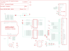

Contents
========

* [PRA376 > Adafruit](#pra376--adafruit)
	* [Images](#images)
	* [Tags](#tags)
  
![][im]
# PRA376 > Adafruit

- ID: PROJ-ADAF-376-STAN-01
- Hex ID: PRA376
- Name: Adafruit
- Description: Adafruit

## Images
  
  

|kicadPcb3d|kicadPcb3dFront|kicadPcb3dBack|eagleImage|eagleSchemImage|
| :---: | :---: | :---: | :---: | :---: |
||||||

## Tags

- hexID: PRA376
- oompType: PROJ
- oompSize: ADAF
- oompColor: 376
- oompDesc: STAN
- oompIndex: 01
- oompName: Adafruit_2.8_Inch_TFT_Shield_PCB
- sources: All source files from https://github.com/adafruit/Adafruit_2.8_Inch_TFT_Shield_PCB (source licence details in srcLicense.md)
- linkBuyPage: http://www.adafruit.com/products/376
- oompID: PROJ-ADAF-376-STAN-01
- oompParts: C1,UNMATCHED-UNMATCHED-UNMATCHED-UNMATCHED-UNMATCHED
- oompParts: C2,UNMATCHED-UNMATCHED-UNMATCHED-UNMATCHED-UNMATCHED
- oompParts: C3,UNMATCHED-UNMATCHED-UNMATCHED-UNMATCHED-UNMATCHED
- oompParts: C4,UNMATCHED-UNMATCHED-UNMATCHED-UNMATCHED-UNMATCHED
- oompParts: C5,UNMATCHED-UNMATCHED-UNMATCHED-UNMATCHED-UNMATCHED
- oompParts: CN2,UNMATCHED-UNMATCHED-UNMATCHED-UNMATCHED-UNMATCHED
- oompParts: IC1,UNMATCHED-UNMATCHED-UNMATCHED-UNMATCHED-UNMATCHED
- oompParts: IC3,UNMATCHED-UNMATCHED-UNMATCHED-UNMATCHED-UNMATCHED
- oompParts: IC4,UNMATCHED-UNMATCHED-UNMATCHED-UNMATCHED-UNMATCHED
- oompParts: IC5,UNMATCHED-UNMATCHED-UNMATCHED-UNMATCHED-UNMATCHED
- oompParts: PIN3,UNMATCHED-UNMATCHED-UNMATCHED-UNMATCHED-UNMATCHED
- oompParts: Q1,UNMATCHED-UNMATCHED-UNMATCHED-UNMATCHED-UNMATCHED
- oompParts: R1,UNMATCHED-UNMATCHED-UNMATCHED-UNMATCHED-UNMATCHED
- oompParts: R2,UNMATCHED-UNMATCHED-UNMATCHED-UNMATCHED-UNMATCHED
- oompParts: R3,UNMATCHED-UNMATCHED-UNMATCHED-UNMATCHED-UNMATCHED
- oompParts: R4,UNMATCHED-UNMATCHED-UNMATCHED-UNMATCHED-UNMATCHED
- oompParts: R5,UNMATCHED-UNMATCHED-UNMATCHED-UNMATCHED-UNMATCHED
- oompParts: RD,UNMATCHED-UNMATCHED-UNMATCHED-UNMATCHED-UNMATCHED
- oompParts: U$2,UNMATCHED-UNMATCHED-UNMATCHED-UNMATCHED-UNMATCHED
- oompParts: U$3,UNMATCHED-UNMATCHED-UNMATCHED-UNMATCHED-UNMATCHED
- oompParts: VCC,UNMATCHED-UNMATCHED-UNMATCHED-UNMATCHED-UNMATCHED
- rawParts: C1,10uF,C-USC0805K,C0805K,CAPACITOR, American symbol,,
- rawParts: C2,0.1uF,C-USC0805K,C0805K,CAPACITOR, American symbol,,
- rawParts: C3,0.1uF,C-USC0805K,C0805K,CAPACITOR, American symbol,,
- rawParts: C4,0.1uF,C-USC0805K,C0805K,CAPACITOR, American symbol,,
- rawParts: C5,10uF,C-USC0805K,C0805K,CAPACITOR, American symbol,,
- rawParts: CN2,ILI9325_28TFT,ILI9325_LCD1.0MM,ILI9325_28INCH_TS,2.8 ILI9325-based TFT LCD w/Integrated Touch Screen,,
- rawParts: IC1,74ACT245DW,74ACT245DW,SO20W,Octal BUS TRANSCEIVER, 3-state,,
- rawParts: IC3,74ACT245DW,74ACT245DW,SO20W,Octal BUS TRANSCEIVER, 3-state,,
- rawParts: IC4,ADP122,LP298XS,SOT23-5L,,,
- rawParts: IC5,,AXP083-SAG,SOT23,,,
- rawParts: PIN3,,SJ,SJ,SMD solder JUMPER,,
- rawParts: Q1,2222,MMBT2222ALT1-NPN-SOT23-BEC,SOT23-BEC,NPN Transistror,,
- rawParts: R1,22,R-US_R0805,R0805,RESISTOR, American symbol,,
- rawParts: R2,22,R-US_R0805,R0805,RESISTOR, American symbol,,
- rawParts: R3,22,R-US_R0805,R0805,RESISTOR, American symbol,,
- rawParts: R4,22,R-US_R0805,R0805,RESISTOR, American symbol,,
- rawParts: R5,1K,R-US_R0805,R0805,RESISTOR, American symbol,,
- rawParts: RD,,SJ,SJ,SMD solder JUMPER,,
- rawParts: U$2,ARDUINO-NOHOLE,ARDUINO-NOHOLE,ARDUINO-NOHOLE,Arduino Diecimila/Duemilanove,,
- rawParts: U$3,MICROSD,MICROSD,MICROSD,Micro-SD / Transflash card holder with SPI pinout,,
- rawParts: U$10,FIDUCIAL,FIDUCIAL,FIDUCIAL_1MM,For use by pick and place machines to calibrate the vision/machine, 1mm,,
- rawParts: U$11,FIDUCIAL,FIDUCIAL,FIDUCIAL_1MM,For use by pick and place machines to calibrate the vision/machine, 1mm,,
- rawParts: VCC,,SJ,SJ,SMD solder JUMPER,,

[im]: kicadPcb3d_450.png
