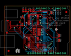

Contents
========

* [PROJ-ADAF-376-STAN-01>Adafruit_2.8_Inch_TFT_Shield_PCB](#proj-adaf-376-stan-01adafruit_28_inch_tft_shield_pcb)
	* [Images](#images)
	* [OOMP Parts](#oomp-parts)
	* [Tags](#tags)
  
![][im]
# PROJ-ADAF-376-STAN-01>Adafruit_2.8_Inch_TFT_Shield_PCB

- ID: PROJ-ADAF-376-STAN-01
- Hex ID: PRA376
- Name: Adafruit_2.8_Inch_TFT_Shield_PCB
- Description: 

## Images
  
  

|eagleImage|kicadPcb3dFront|kicadPcb3dBack|kicadPcb3d|
| :---: | :---: | :---: | :---: |
|||||

## OOMP Parts
  

|OOMP Parts|
| :---: |
|CAPC-0805-X-UNMATCHED-01, C1, 19.812, 48.513999999999996, 90,C1, 10uF, C0805K, adafruit, (0.78, 1.91), R90|
|<table><tr><td></td><td> C2</td><td>[CAPC-0805-X-NF100-V50 SMD (0805) 100 nF Capacitor (Ceramic) 50v](https://github.com/oomlout/oomlout_OOMP_parts/tree/main/CAPC-0805-X-NF100-V50/)</td><td>[C85N100](https://github.com/oomlout/oomlout_OOMP_parts/tree/main/CAPC-0805-X-NF100-V50/)</td></tr></table>|
|<table><tr><td></td><td> C3</td><td>[CAPC-0805-X-NF100-V50 SMD (0805) 100 nF Capacitor (Ceramic) 50v](https://github.com/oomlout/oomlout_OOMP_parts/tree/main/CAPC-0805-X-NF100-V50/)</td><td>[C85N100](https://github.com/oomlout/oomlout_OOMP_parts/tree/main/CAPC-0805-X-NF100-V50/)</td></tr></table>|
|<table><tr><td></td><td> C4</td><td>[CAPC-0805-X-NF100-V50 SMD (0805) 100 nF Capacitor (Ceramic) 50v](https://github.com/oomlout/oomlout_OOMP_parts/tree/main/CAPC-0805-X-NF100-V50/)</td><td>[C85N100](https://github.com/oomlout/oomlout_OOMP_parts/tree/main/CAPC-0805-X-NF100-V50/)</td></tr></table>|
|CAPC-0805-X-UNMATCHED-01, C5, 30.987999999999996, 48.513999999999996, 90,C5, 10uF, C0805K, adafruit, (1.22, 1.91), R90|
|UNMATCHED-UNMATCHED-X-UNMATCHED-01, CN2, 70.10399999999998, 26.669999999999998, M270,CN2, ILI9325_28TFT, ILI9325_28INCH_TS, adafruit, (2.76, 1.05), MR270|
|UNMATCHED-UNMATCHED-X-UNMATCHED-01, IC1, 30.733999999999998, 13.97, 270,IC1, 74ACT245DW, SO20W, 74xx-eu, (1.21, 0.55), R270|
|UNMATCHED-UNMATCHED-X-UNMATCHED-01, IC3, 30.733999999999998, 38.862, 270,IC3, 74ACT245DW, SO20W, 74xx-eu, (1.21, 1.53), R270|
|UNMATCHED-UNMATCHED-X-UNMATCHED-01, IC4, 26.669999999999998, 48.513999999999996, 90,IC4, ADP122, SOT23-5L, adafruit, (1.05, 1.91), R90|
|UNMATCHED-UNMATCHED-X-UNMATCHED-01, IC5, 19.304, 41.65599999999999, 0,IC5, SOT23, adafruit, (0.76, 1.64), R0|
|UNMATCHED-UNMATCHED-X-UNMATCHED-01, Q1, 32.004, 26.416, 270,Q1, 2222, SOT23-BEC, transistor-neu-to92, (1.26, 1.04), R270|
|RESE-0805-X-UNMATCHED-01, R1, 36.83, 28.448, 0,R1, 22, R0805, rcl, (1.45, 1.12), R0|
|RESE-0805-X-UNMATCHED-01, R2, 36.83, 26.416, 0,R2, 22, R0805, rcl, (1.45, 1.04), R0|
|RESE-0805-X-UNMATCHED-01, R3, 36.83, 24.383999999999997, 0,R3, 22, R0805, rcl, (1.45, 0.96), R0|
|RESE-0805-X-UNMATCHED-01, R4, 36.83, 22.352, 0,R4, 22, R0805, rcl, (1.45, 0.88), R0|
|RESE-0805-X-UNMATCHED-01, R5, 31.75, 29.209999999999997, 180,R5, 1K, R0805, rcl, (1.25, 1.15), R180|
|UNMATCHED-UNMATCHED-X-UNMATCHED-01, U$2, 1.5239999999999998, 53.339999999999996, M180,U$2, ARDUINO-NOHOLE, ARDUINO-NOHOLE, adafruit, (0.06, 2.1), MR180|
|UNMATCHED-UNMATCHED-X-UNMATCHED-01, U$3, 16.764, 38.099999999999994, 270,U$3, MICROSD, MICROSD, adafruit, (0.66, 1.5), R270|

## Tags

- hexID: PRA376
- oompType: PROJ
- oompSize: ADAF
- oompColor: 376
- oompDesc: STAN
- oompIndex: 01
- oompName: Adafruit_2.8_Inch_TFT_Shield_PCB
- sources: All source files from https://github.com/adafruit/Adafruit_2.8_Inch_TFT_Shield_PCB (source licence details in srcLicense.md)
- linkBuyPage: http://www.adafruit.com/products/376
- oompID: PROJ-ADAF-376-STAN-01
- oompPart: CAPC-0805-X-UNMATCHED-01, C1, 19.812, 48.513999999999996, 90
- oompPart: CAPC-0805-X-NF100-V50, C2, 22.605999999999998, 48.513999999999996, 90
- oompPart: CAPC-0805-X-NF100-V50, C3, 32.004, 22.86, 180
- oompPart: CAPC-0805-X-NF100-V50, C4, 19.049999999999997, 33.528, 90
- oompPart: CAPC-0805-X-UNMATCHED-01, C5, 30.987999999999996, 48.513999999999996, 90
- oompPart: UNMATCHED-UNMATCHED-X-UNMATCHED-01, CN2, 70.10399999999998, 26.669999999999998, M270
- oompPart: UNMATCHED-UNMATCHED-X-UNMATCHED-01, IC1, 30.733999999999998, 13.97, 270
- oompPart: UNMATCHED-UNMATCHED-X-UNMATCHED-01, IC3, 30.733999999999998, 38.862, 270
- oompPart: UNMATCHED-UNMATCHED-X-UNMATCHED-01, IC4, 26.669999999999998, 48.513999999999996, 90
- oompPart: UNMATCHED-UNMATCHED-X-UNMATCHED-01, IC5, 19.304, 41.65599999999999, 0
- oompPart: SKIP-UNMATCHED-X-UNMATCHED-01, PIN3, 58.674, 16.509999999999998, 270
- oompPart: UNMATCHED-UNMATCHED-X-UNMATCHED-01, Q1, 32.004, 26.416, 270
- oompPart: RESE-0805-X-UNMATCHED-01, R1, 36.83, 28.448, 0
- oompPart: RESE-0805-X-UNMATCHED-01, R2, 36.83, 26.416, 0
- oompPart: RESE-0805-X-UNMATCHED-01, R3, 36.83, 24.383999999999997, 0
- oompPart: RESE-0805-X-UNMATCHED-01, R4, 36.83, 22.352, 0
- oompPart: RESE-0805-X-UNMATCHED-01, R5, 31.75, 29.209999999999997, 180
- oompPart: SKIP-UNMATCHED-X-UNMATCHED-01, RD, 50.291999999999994, 46.228, 90
- oompPart: UNMATCHED-UNMATCHED-X-UNMATCHED-01, U$2, 1.5239999999999998, 53.339999999999996, M180
- oompPart: UNMATCHED-UNMATCHED-X-UNMATCHED-01, U$3, 16.764, 38.099999999999994, 270
- oompPart: SKIP-UNMATCHED-X-UNMATCHED-01, U$10, 66.294, 46.99, 180
- oompPart: SKIP-UNMATCHED-X-UNMATCHED-01, U$11, 4.064, 5.08, 180
- oompPart: SKIP-UNMATCHED-X-UNMATCHED-01, VCC, 58.674, 21.59, 270
- rawPart: C1, 10uF, C0805K, adafruit, (0.78, 1.91), R90
- rawPart: C2, 0.1uF, C0805K, adafruit, (0.89, 1.91), R90
- rawPart: C3, 0.1uF, C0805K, adafruit, (1.26, 0.9), R180
- rawPart: C4, 0.1uF, C0805K, adafruit, (0.75, 1.32), R90
- rawPart: C5, 10uF, C0805K, adafruit, (1.22, 1.91), R90
- rawPart: CN2, ILI9325_28TFT, ILI9325_28INCH_TS, adafruit, (2.76, 1.05), MR270
- rawPart: IC1, 74ACT245DW, SO20W, 74xx-eu, (1.21, 0.55), R270
- rawPart: IC3, 74ACT245DW, SO20W, 74xx-eu, (1.21, 1.53), R270
- rawPart: IC4, ADP122, SOT23-5L, adafruit, (1.05, 1.91), R90
- rawPart: IC5, SOT23, adafruit, (0.76, 1.64), R0
- rawPart: PIN3, SJ, jumper, (2.31, 0.65), R270
- rawPart: Q1, 2222, SOT23-BEC, transistor-neu-to92, (1.26, 1.04), R270
- rawPart: R1, 22, R0805, rcl, (1.45, 1.12), R0
- rawPart: R2, 22, R0805, rcl, (1.45, 1.04), R0
- rawPart: R3, 22, R0805, rcl, (1.45, 0.96), R0
- rawPart: R4, 22, R0805, rcl, (1.45, 0.88), R0
- rawPart: R5, 1K, R0805, rcl, (1.25, 1.15), R180
- rawPart: RD, SJ, jumper, (1.98, 1.82), R90
- rawPart: U$2, ARDUINO-NOHOLE, ARDUINO-NOHOLE, adafruit, (0.06, 2.1), MR180
- rawPart: U$3, MICROSD, MICROSD, adafruit, (0.66, 1.5), R270
- rawPart: U$10, FIDUCIAL, FIDUCIAL_1MM, adafruit, (2.61, 1.85), R180
- rawPart: U$11, FIDUCIAL, FIDUCIAL_1MM, adafruit, (0.16, 0.2), R180
- rawPart: VCC, SJ, jumper, (2.31, 0.85), R270

[im]: kicadPcb3d_450.png
