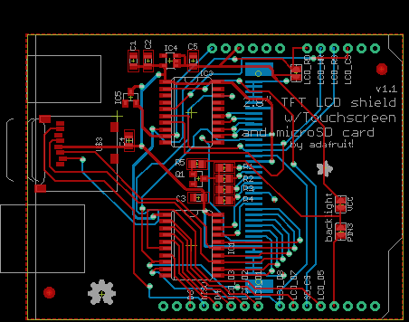
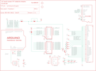

Contents
========

* [PRA376 > Adafruit_2.8_Inch_TFT_Shield_PCB](#pra376--adafruit_28_inch_tft_shield_pcb)
	* [Schematic](#schematic)
	* [PCB](#pcb)
	* [OOMP Parts](#oomp-parts)
	* [Images](#images)
	* [Tags](#tags)
  
![][im]
# PRA376 > Adafruit_2.8_Inch_TFT_Shield_PCB

- ID: PROJ-ADAF-376-STAN-01
- Hex ID: PRA376
- Name: Adafruit 376
- Description: Adafruit 376
- Long Link: [http://oom.lt/PROJ-ADAF-376-STAN-01](http://oom.lt/PROJ-ADAF-376-STAN-01)
- Short Link: [http://oom.lt/PRA376](http://oom.lt/PRA376)

## Schematic
  

## PCB
  

## OOMP Parts
  

|OOMP ID|Name|Identifier|
| :---: | :---: | :---: |
|[CAPC-0805-X-UF10-V10](https://github.com/oomlout/oomlout_OOMP_parts/tree/main/CAPC-0805-X-UF10-V10/)|[SMD (0805) 10 uF Capacitor (Ceramic) 10v](https://github.com/oomlout/oomlout_OOMP_parts/tree/main/CAPC-0805-X-UF10-V10/)|[C1, C5](https://github.com/oomlout/oomlout_OOMP_parts/tree/main/CAPC-0805-X-UF10-V10/)|
|[CAPC-0805-X-NF100-V50](https://github.com/oomlout/oomlout_OOMP_parts/tree/main/CAPC-0805-X-NF100-V50/)|[SMD (0805) 100 nF Capacitor (Ceramic) 50v](https://github.com/oomlout/oomlout_OOMP_parts/tree/main/CAPC-0805-X-NF100-V50/)|[C2, C3, C4](https://github.com/oomlout/oomlout_OOMP_parts/tree/main/CAPC-0805-X-NF100-V50/)|
|UNMATCHED-UNMATCHED-X-UNMATCHED-01||CN2, IC1, IC3, PIN3, RD, U$2, U$3, VCC|
|VREG-SO235-X-KLP298XS-V33D||IC4|
|UNMATCHED-SO23-X-UNMATCHED-01||IC5, Q1|
|[RESE-0805-X-O220-01](https://github.com/oomlout/oomlout_OOMP_parts/tree/main/RESE-0805-X-O220-01/)|[SMD (0805) 22 Ohm Resistor](https://github.com/oomlout/oomlout_OOMP_parts/tree/main/RESE-0805-X-O220-01/)|[R1, R2, R3, R4](https://github.com/oomlout/oomlout_OOMP_parts/tree/main/RESE-0805-X-O220-01/)|
|[RESE-0805-X-O102-01](https://github.com/oomlout/oomlout_OOMP_parts/tree/main/RESE-0805-X-O102-01/)|[SMD (0805) 1k Ohm Resistor](https://github.com/oomlout/oomlout_OOMP_parts/tree/main/RESE-0805-X-O102-01/)|[R5](https://github.com/oomlout/oomlout_OOMP_parts/tree/main/RESE-0805-X-O102-01/)|

## Images
  
  

|kicadPcb3d|kicadPcb3dFront|kicadPcb3dBack|eagleImage|eagleSchemImage|
| :---: | :---: | :---: | :---: | :---: |
||||||

## Tags

- hexID: PRA376
- oompType: PROJ
- oompSize: ADAF
- oompColor: 376
- oompDesc: STAN
- oompIndex: 01
- oompName: Adafruit_2.8_Inch_TFT_Shield_PCB
- sources: All source files from https://github.com/adafruit/Adafruit_2.8_Inch_TFT_Shield_PCB (source licence details in srcLicense.md)
- linkBuyPage: http://www.adafruit.com/products/376
- oompID: PROJ-ADAF-376-STAN-01
- oompParts: C1,CAPC-0805-X-UF10-V10
- oompParts: C2,CAPC-0805-X-NF100-V50
- oompParts: C3,CAPC-0805-X-NF100-V50
- oompParts: C4,CAPC-0805-X-NF100-V50
- oompParts: C5,CAPC-0805-X-UF10-V10
- oompParts: CN2,UNMATCHED-UNMATCHED-X-UNMATCHED-01
- oompParts: IC1,UNMATCHED-UNMATCHED-X-UNMATCHED-01
- oompParts: IC3,UNMATCHED-UNMATCHED-X-UNMATCHED-01
- oompParts: IC4,VREG-SO235-X-KLP298XS-V33D
- oompParts: IC5,UNMATCHED-SO23-X-UNMATCHED-01
- oompParts: PIN3,UNMATCHED-UNMATCHED-X-UNMATCHED-01
- oompParts: Q1,UNMATCHED-SO23-X-UNMATCHED-01
- oompParts: R1,RESE-0805-X-O220-01
- oompParts: R2,RESE-0805-X-O220-01
- oompParts: R3,RESE-0805-X-O220-01
- oompParts: R4,RESE-0805-X-O220-01
- oompParts: R5,RESE-0805-X-O102-01
- oompParts: RD,UNMATCHED-UNMATCHED-X-UNMATCHED-01
- oompParts: U$2,UNMATCHED-UNMATCHED-X-UNMATCHED-01
- oompParts: U$3,UNMATCHED-UNMATCHED-X-UNMATCHED-01
- oompParts: VCC,UNMATCHED-UNMATCHED-X-UNMATCHED-01
- rawParts: C1,10uF,C-USC0805K,C0805K,CAPACITOR, American symbol,,
- rawParts: C2,0.1uF,C-USC0805K,C0805K,CAPACITOR, American symbol,,
- rawParts: C3,0.1uF,C-USC0805K,C0805K,CAPACITOR, American symbol,,
- rawParts: C4,0.1uF,C-USC0805K,C0805K,CAPACITOR, American symbol,,
- rawParts: C5,10uF,C-USC0805K,C0805K,CAPACITOR, American symbol,,
- rawParts: CN2,ILI9325_28TFT,ILI9325_LCD1.0MM,ILI9325_28INCH_TS,2.8 ILI9325-based TFT LCD w/Integrated Touch Screen,,
- rawParts: IC1,74ACT245DW,74ACT245DW,SO20W,Octal BUS TRANSCEIVER, 3-state,,
- rawParts: IC3,74ACT245DW,74ACT245DW,SO20W,Octal BUS TRANSCEIVER, 3-state,,
- rawParts: IC4,ADP122,LP298XS,SOT23-5L,,,
- rawParts: IC5,,AXP083-SAG,SOT23,,,
- rawParts: PIN3,,SJ,SJ,SMD solder JUMPER,,
- rawParts: Q1,2222,MMBT2222ALT1-NPN-SOT23-BEC,SOT23-BEC,NPN Transistror,,
- rawParts: R1,22,R-US_R0805,R0805,RESISTOR, American symbol,,
- rawParts: R2,22,R-US_R0805,R0805,RESISTOR, American symbol,,
- rawParts: R3,22,R-US_R0805,R0805,RESISTOR, American symbol,,
- rawParts: R4,22,R-US_R0805,R0805,RESISTOR, American symbol,,
- rawParts: R5,1K,R-US_R0805,R0805,RESISTOR, American symbol,,
- rawParts: RD,,SJ,SJ,SMD solder JUMPER,,
- rawParts: U$2,ARDUINO-NOHOLE,ARDUINO-NOHOLE,ARDUINO-NOHOLE,Arduino Diecimila/Duemilanove,,
- rawParts: U$3,MICROSD,MICROSD,MICROSD,Micro-SD / Transflash card holder with SPI pinout,,
- rawParts: U$10,FIDUCIAL,FIDUCIAL,FIDUCIAL_1MM,For use by pick and place machines to calibrate the vision/machine, 1mm,,
- rawParts: U$11,FIDUCIAL,FIDUCIAL,FIDUCIAL_1MM,For use by pick and place machines to calibrate the vision/machine, 1mm,,
- rawParts: VCC,,SJ,SJ,SMD solder JUMPER,,

[im]: kicadPcb3d_450.png
