Contents
========

* [PRA3779 > Adafruit AS7262 Breakout PCB](#pra3779--adafruit-as7262-breakout-pcb)
	* [Schematic](#schematic)
	* [PCB](#pcb)
	* [Interactive BOM](#interactive-bom)
	* [OOMP Parts](#oomp-parts)
	* [Images](#images)
	* [Tags](#tags)
  
![][im]
# PRA3779 > Adafruit AS7262 Breakout PCB

- ID: PROJ-ADAF-3779-STAN-01
- Hex ID: PRA3779
- Name: Adafruit
- Description: Adafruit
- Long Link: [http://oom.lt/PROJ-ADAF-3779-STAN-01](http://oom.lt/PROJ-ADAF-3779-STAN-01)
- Short Link: [http://oom.lt/PRA3779](http://oom.lt/PRA3779)

## Schematic
  
[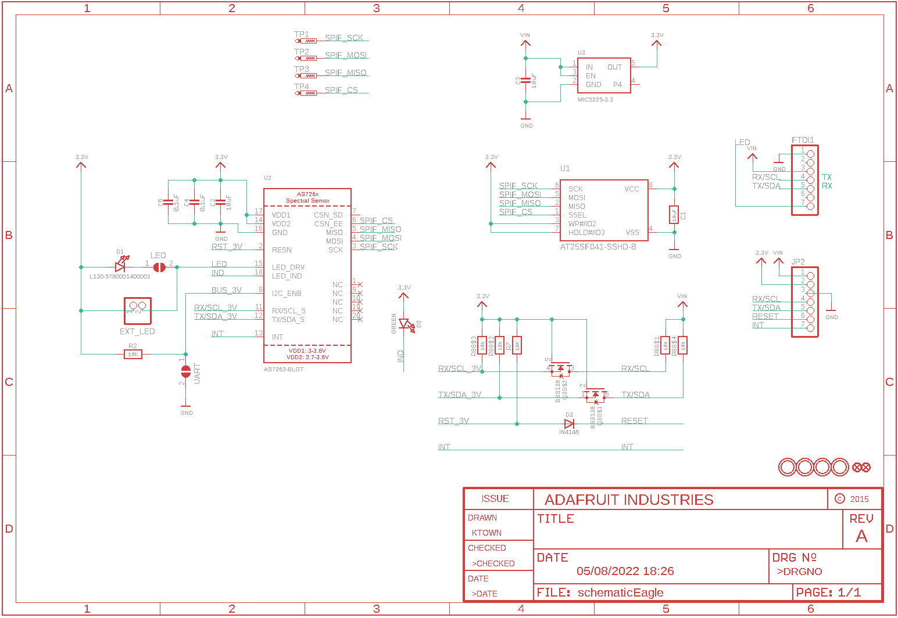](eagleSchemImage.png)
## PCB
  
[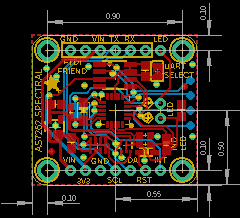](eagleImage.png)
## Interactive BOM

- Interactive BOM page: [ibom.html](https://htmlpreview.github.io/?https://github.com/oomlout/oomlout_OOMP_projects/blob/main/PROJ-ADAF-3779-STAN-01/kicad/bom/ibom.html)

## OOMP Parts
  

|OOMP Parts|
| :---: |
|[CAPC-0805-X-UF10-V10  SMD (0805) 10 uF Capacitor (Ceramic) 10v  C1, C2, C3](https://github.com/oomlout/oomlout_OOMP_parts/tree/main/CAPC-0805-X-UF10-V10/)|
|[CAPC-0603-X-NF100-V50  SMD (0603) 100 nF Capacitor (Ceramic) 50v  C4, C5](https://github.com/oomlout/oomlout_OOMP_parts/tree/main/CAPC-0603-X-NF100-V50/)|
|LEDS-UNMATCHED-G-STAN-01 D1|
|[LEDS-0805-G-STAN-01  SMD (0805) Green LED  D2](https://github.com/oomlout/oomlout_OOMP_parts/tree/main/LEDS-0805-G-STAN-01/)|
|DIOD-S323-X-UNMATCHED-01 D3|
|[HEAD-I01-X-PI02-01  2.54 mm 2 Pin Header  EXT_LED](https://github.com/oomlout/oomlout_OOMP_parts/tree/main/HEAD-I01-X-PI02-01/)|
|[HEAD-I01-X-PI07-01  2.54 mm 7 Pin Header  FTDI1, JP2](https://github.com/oomlout/oomlout_OOMP_parts/tree/main/HEAD-I01-X-PI07-01/)|
|[MOSN-SO363-X-KBSS138-01  SMD (SOT-363) BSS138 N-Ch. MOSFET  Q3](https://github.com/oomlout/oomlout_OOMP_parts/tree/main/MOSN-SO363-X-KBSS138-01/)|
|[RESE-0805-X-O103-01  SMD (0805) 10k Ohm Resistor  R2](https://github.com/oomlout/oomlout_OOMP_parts/tree/main/RESE-0805-X-O103-01/)|
|[RESE-0603-X-O103-01  SMD (0603) 10k Ohm Resistor  R7](https://github.com/oomlout/oomlout_OOMP_parts/tree/main/RESE-0603-X-O103-01/)|
|RESA-06038-X-O103X4-01 R8|
|UNMATCHED-UNMATCHED-X-UNMATCHED-01 TP1, TP2, TP3, TP4, U1, U2|
|[VREG-SO235-X-KMIC5225-V33D  SMD (SOT-23-5) MIC5225 Voltage Regulator 3.3v  U3](https://github.com/oomlout/oomlout_OOMP_parts/tree/main/VREG-SO235-X-KMIC5225-V33D/)|

## Images
  
  

|bominteractivefront|bominteractiveback|kicadPcb3d|kicadPcb3dFront|kicadPcb3dBack|eagleImage|eagleSchemImage|pcbdraw|pcbdrawback|
| :---: | :---: | :---: | :---: | :---: | :---: | :---: | :---: | :---: |
|[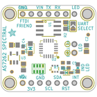](bomFront.png)|[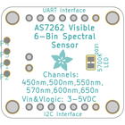](bomBack.png)|[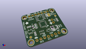](kicadPcb3d.png)|[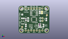](kicadPcb3dFront.png)|[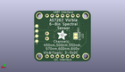](kicadPcb3dBack.png)|[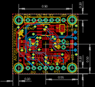](eagleImage.png)|[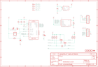](eagleSchemImage.png)|[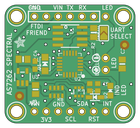](pcbdraw.png)|[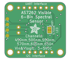](pcbdrawBack.png)|

## Tags

- hexID: PRA3779
- oompType: PROJ
- oompSize: ADAF
- oompColor: 3779
- oompDesc: STAN
- oompIndex: 01
- oompName: Adafruit AS7262 Breakout PCB
- sources: All source files from https://github.com/adafruit/Adafruit-AS7262-Breakout-PCB (source licence details in srcLicense.md)
- linkBuyPage: http://www.adafruit.com/products/3779
- oompID: PROJ-ADAF-3779-STAN-01
- oompParts: C1,CAPC-0805-X-UF10-V10
- oompParts: C2,CAPC-0805-X-UF10-V10
- oompParts: C3,CAPC-0805-X-UF10-V10
- oompParts: C4,CAPC-0603-X-NF100-V50
- oompParts: C5,CAPC-0603-X-NF100-V50
- oompParts: D1,LEDS-UNMATCHED-G-STAN-01
- oompParts: D2,LEDS-0805-G-STAN-01
- oompParts: D3,DIOD-S323-X-UNMATCHED-01
- oompParts: EXT_LED,HEAD-I01-X-PI02-01
- oompParts: FTDI1,HEAD-I01-X-PI07-01
- oompParts: JP2,HEAD-I01-X-PI07-01
- oompParts: Q3,MOSN-SO363-X-KBSS138-01
- oompParts: R2,RESE-0805-X-O103-01
- oompParts: R7,RESE-0603-X-O103-01
- oompParts: R8,RESA-06038-X-O103X4-01
- oompParts: TP1,UNMATCHED-UNMATCHED-X-UNMATCHED-01
- oompParts: TP2,UNMATCHED-UNMATCHED-X-UNMATCHED-01
- oompParts: TP3,UNMATCHED-UNMATCHED-X-UNMATCHED-01
- oompParts: TP4,UNMATCHED-UNMATCHED-X-UNMATCHED-01
- oompParts: U1,UNMATCHED-UNMATCHED-X-UNMATCHED-01
- oompParts: U2,UNMATCHED-UNMATCHED-X-UNMATCHED-01
- oompParts: U3,VREG-SO235-X-KMIC5225-V33D
- rawParts: C1,10uF,RESISTOR0805_NOOUTLINE,0805-NO,Resistors,,,
- rawParts: C2,10uF,CAP_CERAMIC0805-NOOUTLINE,0805-NO,Ceramic Capacitors,,,
- rawParts: C3,10uF,CAP_CERAMIC0805-NOOUTLINE,0805-NO,Ceramic Capacitors,,,
- rawParts: C4,0.1uF,CAP_CERAMIC0603_NO,0603-NO,Ceramic Capacitors,,,
- rawParts: C5,0.1uF,CAP_CERAMIC0603_NO,0603-NO,Ceramic Capacitors,,,
- rawParts: D1,L130-5780001400001,LEDEV45-21,EVERLIGHT_45-21,LED,,,
- rawParts: D2,GREEN,LED0805_NOOUTLINE,CHIPLED_0805_NOOUTLINE,LED,,,
- rawParts: D3,IN4148,DIODESOD-323,SOD-323,Diode,,,
- rawParts: EXT_LED,,HEADER-1X2ROUND,1X02_ROUND,PIN HEADER,,,
- rawParts: FID2,FIDUCIAL_1MM,FIDUCIAL_1MM,FIDUCIAL_1MM,Fiducial Alignment Points,EXCLUDE,,
- rawParts: FID3,FIDUCIAL_1MM,FIDUCIAL_1MM,FIDUCIAL_1MM,Fiducial Alignment Points,EXCLUDE,,
- rawParts: FTDI1,,HEADER-1X7ROUND,1X07_ROUND,PIN HEADER,,,
- rawParts: JP2,,HEADER-1X7ROUND,1X07_ROUND,PIN HEADER,,,
- rawParts: LED,,SOLDERJUMPERCLOSED,SOLDERJUMPER_CLOSEDWIRE,SMD Solder JUMPER,,,
- rawParts: Q3,BSS138,MOSFET-N_DUAL,SOT363,Dual N-Channel MOSFET,,,
- rawParts: R2,10K,RESISTOR0805_NOOUTLINE,0805-NO,Resistors,,,
- rawParts: R7,10K,RESISTOR_0603_NOOUT,0603-NO,Resistors,,,
- rawParts: R8,10k,RESISTOR_4PACK_NO,RESPACK_4X0603_NO,Resistor Packs (4 resistors),,,
- rawParts: TP1,PTR1TP15R,PTR1TP15R,TP15R,TEST PIN,,,
- rawParts: TP2,PTR1TP15R,PTR1TP15R,TP15R,TEST PIN,,,
- rawParts: TP3,PTR1TP15R,PTR1TP15R,TP15R,TEST PIN,,,
- rawParts: TP4,PTR1TP15R,PTR1TP15R,TP15R,TEST PIN,,,
- rawParts: U$2,MOUNTINGHOLE2.5,MOUNTINGHOLE2.5,MOUNTINGHOLE_2.5_PLATED,Mounting Hole,EXCLUDE,,
- rawParts: U$3,MOUNTINGHOLE2.5,MOUNTINGHOLE2.5,MOUNTINGHOLE_2.5_PLATED,Mounting Hole,EXCLUDE,,
- rawParts: U$22,MOUNTINGHOLE2.5,MOUNTINGHOLE2.5,MOUNTINGHOLE_2.5_PLATED,Mounting Hole,EXCLUDE,,
- rawParts: U$23,MOUNTINGHOLE2.5,MOUNTINGHOLE2.5,MOUNTINGHOLE_2.5_PLATED,Mounting Hole,EXCLUDE,,
- rawParts: U1,AT25SF041-SSHD-B,SPIFLASH_SOIC8,SOIC8_150MIL,SOIC8 SPI Flash,,,
- rawParts: U2,AS7262-BLGT,AS726X_SPECTRAL,AS726X_LGA20,AS726x Spectral Sensor,,,
- rawParts: U3,MIC5225-3.3,VREG_SOT23-5,SOT23-5,SOT23-5 Fixed Voltage Regulators,,,
- rawParts: UART,,SOLDERJUMPER,SOLDERJUMPER_ARROW_NOPASTE,SMD Solder JUMPER,EXCLUDE,,

[im]: kicadPcb3d_450.png
