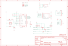

Contents
========

* [PRA3779 > Adafruit](#pra3779--adafruit)
	* [Images](#images)
	* [Tags](#tags)
  
![][im]
# PRA3779 > Adafruit

- ID: PROJ-ADAF-3779-STAN-01
- Hex ID: PRA3779
- Name: Adafruit
- Description: Adafruit

## Images
  
  

|kicadPcb3d|kicadPcb3dFront|kicadPcb3dBack|eagleImage|eagleSchemImage|
| :---: | :---: | :---: | :---: | :---: |
||||||

## Tags

- hexID: PRA3779
- oompType: PROJ
- oompSize: ADAF
- oompColor: 3779
- oompDesc: STAN
- oompIndex: 01
- oompName: Adafruit AS7262 Breakout PCB
- sources: All source files from https://github.com/adafruit/Adafruit-AS7262-Breakout-PCB (source licence details in srcLicense.md)
- linkBuyPage: http://www.adafruit.com/products/3779
- oompID: PROJ-ADAF-3779-STAN-01
- oompParts: C1,UNMATCHED-UNMATCHED-UNMATCHED-UNMATCHED-UNMATCHED
- oompParts: C2,UNMATCHED-UNMATCHED-UNMATCHED-UNMATCHED-UNMATCHED
- oompParts: C3,UNMATCHED-UNMATCHED-UNMATCHED-UNMATCHED-UNMATCHED
- oompParts: C4,UNMATCHED-UNMATCHED-UNMATCHED-UNMATCHED-UNMATCHED
- oompParts: C5,UNMATCHED-UNMATCHED-UNMATCHED-UNMATCHED-UNMATCHED
- oompParts: D1,UNMATCHED-UNMATCHED-UNMATCHED-UNMATCHED-UNMATCHED
- oompParts: D2,UNMATCHED-UNMATCHED-UNMATCHED-UNMATCHED-UNMATCHED
- oompParts: D3,UNMATCHED-UNMATCHED-UNMATCHED-UNMATCHED-UNMATCHED
- oompParts: EXT_LED,UNMATCHED-UNMATCHED-UNMATCHED-UNMATCHED-UNMATCHED
- oompParts: FTDI1,UNMATCHED-UNMATCHED-UNMATCHED-UNMATCHED-UNMATCHED
- oompParts: JP2,UNMATCHED-UNMATCHED-UNMATCHED-UNMATCHED-UNMATCHED
- oompParts: LED,UNMATCHED-UNMATCHED-UNMATCHED-UNMATCHED-UNMATCHED
- oompParts: Q3,UNMATCHED-UNMATCHED-UNMATCHED-UNMATCHED-UNMATCHED
- oompParts: R2,UNMATCHED-UNMATCHED-UNMATCHED-UNMATCHED-UNMATCHED
- oompParts: R7,UNMATCHED-UNMATCHED-UNMATCHED-UNMATCHED-UNMATCHED
- oompParts: R8,UNMATCHED-UNMATCHED-UNMATCHED-UNMATCHED-UNMATCHED
- oompParts: TP1,UNMATCHED-UNMATCHED-UNMATCHED-UNMATCHED-UNMATCHED
- oompParts: TP2,UNMATCHED-UNMATCHED-UNMATCHED-UNMATCHED-UNMATCHED
- oompParts: TP3,UNMATCHED-UNMATCHED-UNMATCHED-UNMATCHED-UNMATCHED
- oompParts: TP4,UNMATCHED-UNMATCHED-UNMATCHED-UNMATCHED-UNMATCHED
- oompParts: U1,UNMATCHED-UNMATCHED-UNMATCHED-UNMATCHED-UNMATCHED
- oompParts: U2,UNMATCHED-UNMATCHED-UNMATCHED-UNMATCHED-UNMATCHED
- oompParts: U3,UNMATCHED-UNMATCHED-UNMATCHED-UNMATCHED-UNMATCHED
- rawParts: C1,10uF,RESISTOR0805_NOOUTLINE,0805-NO,Resistors,,,
- rawParts: C2,10uF,CAP_CERAMIC0805-NOOUTLINE,0805-NO,Ceramic Capacitors,,,
- rawParts: C3,10uF,CAP_CERAMIC0805-NOOUTLINE,0805-NO,Ceramic Capacitors,,,
- rawParts: C4,0.1uF,CAP_CERAMIC0603_NO,0603-NO,Ceramic Capacitors,,,
- rawParts: C5,0.1uF,CAP_CERAMIC0603_NO,0603-NO,Ceramic Capacitors,,,
- rawParts: D1,L130-5780001400001,LEDEV45-21,EVERLIGHT_45-21,LED,,,
- rawParts: D2,GREEN,LED0805_NOOUTLINE,CHIPLED_0805_NOOUTLINE,LED,,,
- rawParts: D3,IN4148,DIODESOD-323,SOD-323,Diode,,,
- rawParts: EXT_LED,,HEADER-1X2ROUND,1X02_ROUND,PIN HEADER,,,
- rawParts: FID2,FIDUCIAL_1MM,FIDUCIAL_1MM,FIDUCIAL_1MM,Fiducial Alignment Points,EXCLUDE,,
- rawParts: FID3,FIDUCIAL_1MM,FIDUCIAL_1MM,FIDUCIAL_1MM,Fiducial Alignment Points,EXCLUDE,,
- rawParts: FTDI1,,HEADER-1X7ROUND,1X07_ROUND,PIN HEADER,,,
- rawParts: JP2,,HEADER-1X7ROUND,1X07_ROUND,PIN HEADER,,,
- rawParts: LED,,SOLDERJUMPERCLOSED,SOLDERJUMPER_CLOSEDWIRE,SMD Solder JUMPER,,,
- rawParts: Q3,BSS138,MOSFET-N_DUAL,SOT363,Dual N-Channel MOSFET,,,
- rawParts: R2,10K,RESISTOR0805_NOOUTLINE,0805-NO,Resistors,,,
- rawParts: R7,10K,RESISTOR_0603_NOOUT,0603-NO,Resistors,,,
- rawParts: R8,10k,RESISTOR_4PACK_NO,RESPACK_4X0603_NO,Resistor Packs (4 resistors),,,
- rawParts: TP1,PTR1TP15R,PTR1TP15R,TP15R,TEST PIN,,,
- rawParts: TP2,PTR1TP15R,PTR1TP15R,TP15R,TEST PIN,,,
- rawParts: TP3,PTR1TP15R,PTR1TP15R,TP15R,TEST PIN,,,
- rawParts: TP4,PTR1TP15R,PTR1TP15R,TP15R,TEST PIN,,,
- rawParts: U$2,MOUNTINGHOLE2.5,MOUNTINGHOLE2.5,MOUNTINGHOLE_2.5_PLATED,Mounting Hole,EXCLUDE,,
- rawParts: U$3,MOUNTINGHOLE2.5,MOUNTINGHOLE2.5,MOUNTINGHOLE_2.5_PLATED,Mounting Hole,EXCLUDE,,
- rawParts: U$22,MOUNTINGHOLE2.5,MOUNTINGHOLE2.5,MOUNTINGHOLE_2.5_PLATED,Mounting Hole,EXCLUDE,,
- rawParts: U$23,MOUNTINGHOLE2.5,MOUNTINGHOLE2.5,MOUNTINGHOLE_2.5_PLATED,Mounting Hole,EXCLUDE,,
- rawParts: U1,AT25SF041-SSHD-B,SPIFLASH_SOIC8,SOIC8_150MIL,SOIC8 SPI Flash,,,
- rawParts: U2,AS7262-BLGT,AS726X_SPECTRAL,AS726X_LGA20,AS726x Spectral Sensor,,,
- rawParts: U3,MIC5225-3.3,VREG_SOT23-5,SOT23-5,SOT23-5 Fixed Voltage Regulators,,,
- rawParts: UART,,SOLDERJUMPER,SOLDERJUMPER_ARROW_NOPASTE,SMD Solder JUMPER,EXCLUDE,,

[im]: kicadPcb3d_450.png
