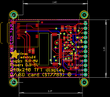
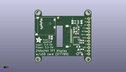
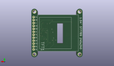
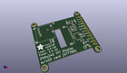

Contents
========

* [PROJ-ADAF-3787-STAN-01>Adafruit 1.54 inch 240x240 TFT PCB](#proj-adaf-3787-stan-01adafruit-154-inch-240x240-tft-pcb)
	* [Images](#images)
	* [Interactive BOM](#interactive-bom)
	* [Tags](#tags)
  
![][im]
# PROJ-ADAF-3787-STAN-01>Adafruit 1.54 inch 240x240 TFT PCB

- ID: PROJ-ADAF-3787-STAN-01
- Hex ID: PRA3787
- Name: Adafruit 1.54 inch 240x240 TFT PCB
- Description: 

## Images
  
  

|eagleImage|kicadPcb3dFront|kicadPcb3dBack|kicadPcb3d|
| :---: | :---: | :---: | :---: |
|||||

## Interactive BOM

- Interactive BOM page: [ibom.html](kicad/bom/ibom.html)

## Tags

- hexID: PRA3787
- oompType: PROJ
- oompSize: ADAF
- oompColor: 3787
- oompDesc: STAN
- oompIndex: 01
- oompName: Adafruit 1.54 inch 240x240 TFT PCB
- sources: All source files from https://github.com/adafruit/Adafruit-1.54-inch-240x240-TFT-PCB (source licence details in srcLicense.md)
- linkBuyPage: http://www.adafruit.com/products/3787
- oompPart: CAPC-0805-X-UF10-V25, C1, 31.115000000000002, 26.924, 270
- oompPart: CAPC-0805-X-UF10-V25, C2, 24.13, 26.924, 90
- oompPart: CAPC-0603-X-NF100-V50, C3, 26.416, 19.304, 0
- oompPart: CAPC-0805-X-UF10-V25, C4, 8.128, 14.604999999999999, 270
- oompPart: CAPC-0603-X-NF100-V50, C5, 6.223, 14.858999999999998, 270
- oompPart: UNMATCHED-UNMATCHED-X-UNMATCHED-01, IC2, 27.432, 26.924, 90
- oompPart: UNMATCHED-UNMATCHED-X-UNMATCHED-01, IC4, 28.701999999999995, 6.223, 180
- oompPart: UNMATCHED-UNMATCHED-X-UNMATCHED-01, JP2, 36.83, 15.620999999999999, 270
- oompPart: UNMATCHED-UNMATCHED-X-UNMATCHED-01, Q2, 10.795, 30.733999999999998, 270
- oompPart: UNMATCHED-UNMATCHED-X-UNMATCHED-01, Q3, 27.94, 21.971, 90
- oompPart: RESE-0603-X-O103-01, R1, 31.623, 12.318999999999999, 180
- oompPart: RESE-0603-X-O103-01, R2, 31.623, 5.334, 180
- oompPart: RESE-0603-X-O103-01, R3, 27.686, 17.779999999999998, 180
- oompPart: RESE-0603-X-O103-01, R4, 31.623, 10.540999999999999, 180
- oompPart: RESE-0603-X-UNMATCHED-01, R5, 25.273, 21.59, 270
- oompPart: UNMATCHED-UNMATCHED-X-UNMATCHED-01, TFT1, 20.447, 15.875, M90
- oompPart: SKIP-UNMATCHED-X-UNMATCHED-01, U$4, 13.081, 30.353, 0
- oompPart: SKIP-UNMATCHED-X-UNMATCHED-01, U$5, 31.623, 1.27, 0
- oompPart: SKIP-UNMATCHED-X-UNMATCHED-01, U$7, -2.54, 34.29, 0
- oompPart: SKIP-UNMATCHED-X-UNMATCHED-01, U$8, -2.54, -2.54, 0
- oompPart: SKIP-UNMATCHED-X-UNMATCHED-01, U$9, 36.195, 34.29, 0
- oompPart: SKIP-UNMATCHED-X-UNMATCHED-01, U$10, 36.195, -2.54, 0
- oompPart: UNMATCHED-UNMATCHED-X-UNMATCHED-01, U1, 27.178, 11.937999999999999, 180
- rawPart: 

[im]: kicadPcb3d_450.png
