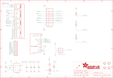

Contents
========

* [PRA3787 > Adafruit](#pra3787--adafruit)
	* [Schematic](#schematic)
	* [Interactive BOM](#interactive-bom)
	* [OOMP Parts](#oomp-parts)
	* [Images](#images)
	* [Tags](#tags)
  
![][im]
# PRA3787 > Adafruit

- ID: PROJ-ADAF-3787-STAN-01
- Hex ID: PRA3787
- Name: Adafruit
- Description: Adafruit
- Long Link: [http://oom.lt/PROJ-ADAF-3787-STAN-01](http://oom.lt/PROJ-ADAF-3787-STAN-01)
- Short Link: [http://oom.lt/PRA3787](http://oom.lt/PRA3787)

## Schematic
  

## Interactive BOM

- Interactive BOM page: [ibom.html](https://htmlpreview.github.io/?https://github.com/oomlout/oomlout_OOMP_projects/blob/main/PROJ-ADAF-3787-STAN-01/kicad/bom/ibom.html)

## OOMP Parts
  

|OOMP Parts|
| :---: |
|C1,CAPC-0805-X-UF10-V10,C1,10uF,CAP_CERAMIC0805-NOOUTLINE,0805-NO,Ceramic Capacitors,,|
|C2,CAPC-0805-X-UF10-V10,C2,10uF,CAP_CERAMIC0805-NOOUTLINE,0805-NO,Ceramic Capacitors,,|
|C3,CAPC-0603-X-NF100-V50,C3,0.1uF,CAP_CERAMIC0603_NO,0603-NO,Ceramic Capacitors,,|
|C4,CAPC-0805-X-UF10-V10,C4,10uF,CAP_CERAMIC0805-NOOUTLINE,0805-NO,Ceramic Capacitors,,|
|C5,CAPC-0603-X-NF100-V50,C5,0.1uF,CAP_CERAMIC0603_NO,0603-NO,Ceramic Capacitors,,|
|IC2,VREG-SO235-X-KLP298XS-V33D,IC2,AP2112,LP298XS,SOT23-5L,,,|
|IC4,UNMATCHED-SO23-X-UNMATCHED-01,IC4,APX803-SAG,AXP083-SAG,SOT23,,,|
|JP2,HEAD-I01-X-PI12-01,JP2,,HEADER-1X1276MIL,1X12_ROUND_76MIL,,,|
|Q2,UNMATCHED-UNMATCHED-X-UNMATCHED-01,Q2,MICROSD,MICROSD,MICROSD,Micro-SD / Transflash card holder with SPI pinout,,|
|Q3,MOSN-SO23-X-KBSS138-01,Q3,BSS138,MOSFET-NWIDE,SOT23-WIDE,N-Channel Mosfet,,|
|R1,RESE-0603-X-O103-01,R1,10K,RESISTOR_0603_NOOUT,0603-NO,Resistors,,|
|R2,RESE-0603-X-O103-01,R2,10K,RESISTOR_0603_NOOUT,0603-NO,Resistors,,|
|R3,RESE-0603-X-O103-01,R3,10K,RESISTOR_0603_NOOUT,0603-NO,Resistors,,|
|R4,RESE-0603-X-O103-01,R4,10K,RESISTOR_0603_NOOUT,0603-NO,Resistors,,|
|R5,RESE-0603-X-O11-01,R5,10,RESISTOR_0603_NOOUT,0603-NO,Resistors,,|
|TFT1,UNMATCHED-UNMATCHED-X-UNMATCHED-01,TFT1,DISP_TFT_1.54IN_240X240_22P,DISP_TFT_1.54IN_240X240_22P,TFT_1.54IN_240X240_22PIN,,,|
|U1,UNMATCHED-UNMATCHED-X-UNMATCHED-01,U$4,FIDUCIAL_1MM,FIDUCIAL_1MM,FIDUCIAL_1MM,Fiducial Alignment Points,EXCLUDE,|

## Images
  
  

|kicadPcb3d|kicadPcb3dFront|kicadPcb3dBack|eagleImage|eagleSchemImage|
| :---: | :---: | :---: | :---: | :---: |
||||||

## Tags

- hexID: PRA3787
- oompType: PROJ
- oompSize: ADAF
- oompColor: 3787
- oompDesc: STAN
- oompIndex: 01
- oompName: Adafruit 1.54 inch 240x240 TFT PCB
- sources: All source files from https://github.com/adafruit/Adafruit-1.54-inch-240x240-TFT-PCB (source licence details in srcLicense.md)
- linkBuyPage: http://www.adafruit.com/products/3787
- oompID: PROJ-ADAF-3787-STAN-01
- oompParts: C1,CAPC-0805-X-UF10-V10
- oompParts: C2,CAPC-0805-X-UF10-V10
- oompParts: C3,CAPC-0603-X-NF100-V50
- oompParts: C4,CAPC-0805-X-UF10-V10
- oompParts: C5,CAPC-0603-X-NF100-V50
- oompParts: IC2,VREG-SO235-X-KLP298XS-V33D
- oompParts: IC4,UNMATCHED-SO23-X-UNMATCHED-01
- oompParts: JP2,HEAD-I01-X-PI12-01
- oompParts: Q2,UNMATCHED-UNMATCHED-X-UNMATCHED-01
- oompParts: Q3,MOSN-SO23-X-KBSS138-01
- oompParts: R1,RESE-0603-X-O103-01
- oompParts: R2,RESE-0603-X-O103-01
- oompParts: R3,RESE-0603-X-O103-01
- oompParts: R4,RESE-0603-X-O103-01
- oompParts: R5,RESE-0603-X-O11-01
- oompParts: TFT1,UNMATCHED-UNMATCHED-X-UNMATCHED-01
- oompParts: U1,UNMATCHED-UNMATCHED-X-UNMATCHED-01
- rawParts: C1,10uF,CAP_CERAMIC0805-NOOUTLINE,0805-NO,Ceramic Capacitors,,
- rawParts: C2,10uF,CAP_CERAMIC0805-NOOUTLINE,0805-NO,Ceramic Capacitors,,
- rawParts: C3,0.1uF,CAP_CERAMIC0603_NO,0603-NO,Ceramic Capacitors,,
- rawParts: C4,10uF,CAP_CERAMIC0805-NOOUTLINE,0805-NO,Ceramic Capacitors,,
- rawParts: C5,0.1uF,CAP_CERAMIC0603_NO,0603-NO,Ceramic Capacitors,,
- rawParts: IC2,AP2112,LP298XS,SOT23-5L,,,
- rawParts: IC4,APX803-SAG,AXP083-SAG,SOT23,,,
- rawParts: JP2,,HEADER-1X1276MIL,1X12_ROUND_76MIL,,,
- rawParts: Q2,MICROSD,MICROSD,MICROSD,Micro-SD / Transflash card holder with SPI pinout,,
- rawParts: Q3,BSS138,MOSFET-NWIDE,SOT23-WIDE,N-Channel Mosfet,,
- rawParts: R1,10K,RESISTOR_0603_NOOUT,0603-NO,Resistors,,
- rawParts: R2,10K,RESISTOR_0603_NOOUT,0603-NO,Resistors,,
- rawParts: R3,10K,RESISTOR_0603_NOOUT,0603-NO,Resistors,,
- rawParts: R4,10K,RESISTOR_0603_NOOUT,0603-NO,Resistors,,
- rawParts: R5,10,RESISTOR_0603_NOOUT,0603-NO,Resistors,,
- rawParts: TFT1,DISP_TFT_1.54IN_240X240_22P,DISP_TFT_1.54IN_240X240_22P,TFT_1.54IN_240X240_22PIN,,,
- rawParts: U$4,FIDUCIAL_1MM,FIDUCIAL_1MM,FIDUCIAL_1MM,Fiducial Alignment Points,EXCLUDE,
- rawParts: U$5,FIDUCIAL_1MM,FIDUCIAL_1MM,FIDUCIAL_1MM,Fiducial Alignment Points,EXCLUDE,
- rawParts: U$7,MOUNTINGHOLE2.5,MOUNTINGHOLE2.5,MOUNTINGHOLE_2.5_PLATED,Mounting Hole,EXCLUDE,
- rawParts: U$8,MOUNTINGHOLE2.5,MOUNTINGHOLE2.5,MOUNTINGHOLE_2.5_PLATED,Mounting Hole,EXCLUDE,
- rawParts: U$9,MOUNTINGHOLE2.5,MOUNTINGHOLE2.5,MOUNTINGHOLE_2.5_PLATED,Mounting Hole,EXCLUDE,
- rawParts: U$10,MOUNTINGHOLE2.5,MOUNTINGHOLE2.5,MOUNTINGHOLE_2.5_PLATED,Mounting Hole,EXCLUDE,
- rawParts: U1,74HC4050PWR,74HC4050DTSSOP,TSSOP16,6-channel level shifter,,

[im]: kicadPcb3d_450.png
