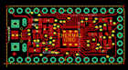
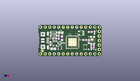
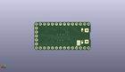
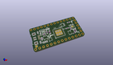

Contents
========

* [PROJ-ADAF-3800-STAN-01>Adafruit ItsyBitsy M4 Express PCB](#proj-adaf-3800-stan-01adafruit-itsybitsy-m4-express-pcb)
	* [Images](#images)
	* [Interactive BOM](#interactive-bom)
	* [OOMP Parts](#oomp-parts)
	* [Tags](#tags)
  
![][im]
# PROJ-ADAF-3800-STAN-01>Adafruit ItsyBitsy M4 Express PCB

- ID: PROJ-ADAF-3800-STAN-01
- Hex ID: PRA3800
- Name: Adafruit ItsyBitsy M4 Express PCB
- Description: 

## Images
  
  

|eagleImage|kicadPcb3dFront|kicadPcb3dBack|kicadPcb3d|
| :---: | :---: | :---: | :---: |
|||||

## Interactive BOM

- Interactive BOM page: [ibom.html](kicad/bom/ibom.html)

## OOMP Parts
  

|OOMP Parts|
| :---: |
|CAPC-0603-X-UNMATCHED-01, C1, 30.479999999999997, 5.9055, 0,C1, 1uF, _0603MP, microbuilder, (1.2, 0.2325), R0|
|CAPC-0603-X-UNMATCHED-01, C5, 28.320999999999998, 8.3185, 90,C5, 1uF, 0603-NO, microbuilder, (1.115, 0.3275), R90|
|CAPC-0805-X-UNMATCHED-01, C6, 12.57799999, 13.374999919999999, 0,C6, 10uF, 0805-NO, microbuilder, (0.49519685, 0.5265748), R0|
|CAPC-0603-X-UNMATCHED-01, C7, 11.446999966, 10.782499898, 90,C7, 1uF, 0603-NO, microbuilder, (0.45066929, 0.42450787), R90|
|CAPC-0805-X-UNMATCHED-01, C8, 8.44900012, 4.17600003, 180,C8, 10uF, 0805-NO, microbuilder, (0.3326378, 0.16440945), R180|
|CAPC-0805-X-UNMATCHED-01, C9, 13.271499999999998, 10.2235, 90,C9, 10uF, _0805MP, microbuilder, (0.5225, 0.4025), R90|
|CAPC-0603-X-UNMATCHED-01, C14, 6.7679062, 7.162799999999999, 90,C14, 1uF, 0603-NO, microbuilder, (0.266453, 0.282), R90|
|UNMATCHED-UNMATCHED-X-UNMATCHED-01, D1, 8.5725, 13.462, 180,D1, MBR120, SOD-123FL, adafruit, (0.3375, 0.53), R180|
|UNMATCHED-UNMATCHED-X-UNMATCHED-01, D2, 8.5725, 11.684, 180,D2, MBR120, SOD-123FL, adafruit, (0.3375, 0.46), R180|
|UNMATCHED-UNMATCHED-X-UNMATCHED-01, IC1, 24.066499999999998, 13.081, 90,IC1, 74HCT1G125DBV, SOT23-5, 74xx-little-us, (0.9475, 0.515), R90|
|UNMATCHED-UNMATCHED-X-UNMATCHED-01, IC2, 19.177, 7.9375, 0,IC2, ATSAMD51G_TQFN48, TQFN48_7MM, microbuilder, (0.755, 0.3125), R0|
|<table><tr><td></td><td> JP1</td><td>[HEAD-I01-X-PI05-01 2.54 mm 5 Pin Header](https://github.com/oomlout/oomlout_OOMP_parts/tree/main/HEAD-I01-X-PI05-01/)</td><td>[H05](https://github.com/oomlout/oomlout_OOMP_parts/tree/main/HEAD-I01-X-PI05-01/)</td></tr></table>|
|<table><tr><td></td><td> JP2</td><td>[HEAD-I01-X-PI14-01 2.54 mm 14 Pin Header](https://github.com/oomlout/oomlout_OOMP_parts/tree/main/HEAD-I01-X-PI14-01/)</td><td>[H14](https://github.com/oomlout/oomlout_OOMP_parts/tree/main/HEAD-I01-X-PI14-01/)</td></tr></table>|
|<table><tr><td></td><td> JP4</td><td>[HEAD-I01-X-PI14-01 2.54 mm 14 Pin Header](https://github.com/oomlout/oomlout_OOMP_parts/tree/main/HEAD-I01-X-PI14-01/)</td><td>[H14](https://github.com/oomlout/oomlout_OOMP_parts/tree/main/HEAD-I01-X-PI14-01/)</td></tr></table>|
|LEDS-UNMATCHED-X-UNMATCHED-01, L, 31.53599992, 13.376500044, 180,L, RED, CHIPLED_0603_NOOUTLINE, microbuilder, (1.2415748, 0.52663386), R180|
|UNMATCHED-UNMATCHED-X-UNMATCHED-01, L2, 12.065, 4.826, 0,L2, AP102-2020, APA102_2020, microbuilder, (0.475, 0.19), R0|
|<table><tr><td></td><td> R1</td><td>[RESE-0603-X-O104-01 SMD (0603) 100k Ohm Resistor](https://github.com/oomlout/oomlout_OOMP_parts/tree/main/RESE-0603-X-O104-01/)</td><td>[R6104](https://github.com/oomlout/oomlout_OOMP_parts/tree/main/RESE-0603-X-O104-01/)</td></tr></table>|
|<table><tr><td></td><td> R2</td><td>[RESE-0603-X-O104-01 SMD (0603) 100k Ohm Resistor](https://github.com/oomlout/oomlout_OOMP_parts/tree/main/RESE-0603-X-O104-01/)</td><td>[R6104](https://github.com/oomlout/oomlout_OOMP_parts/tree/main/RESE-0603-X-O104-01/)</td></tr></table>|
|RESE-0603-X-UNMATCHED-01, R3, 30.479999999999997, 4.8895, 180,R3, 2.2K, _0603MP, microbuilder, (1.2, 0.1925), R180|
|<table><tr><td></td><td> R4</td><td>[RESE-0603-X-O103-01 SMD (0603) 10k Ohm Resistor](https://github.com/oomlout/oomlout_OOMP_parts/tree/main/RESE-0603-X-O103-01/)</td><td>[R6103](https://github.com/oomlout/oomlout_OOMP_parts/tree/main/RESE-0603-X-O103-01/)</td></tr></table>|
|RESE-0603-X-UNMATCHED-01, R7, 29.209999999999997, 13.779499999999999, 0,R7, 2.2K, 0603-NO, microbuilder, (1.15, 0.5425), R0|
|UNMATCHED-UNMATCHED-X-UNMATCHED-01, SW1, 30.479999999999997, 9.017, 270,SW1, SPST_TACT-KMR2, KMR2, adafruit, (1.2, 0.355), R270|
|UNMATCHED-UNMATCHED-X-UNMATCHED-01, U1, 26.288999999999998, 5.1435, 270,U1, GD25x16, USON8, microbuilder, (1.035, 0.2025), R270|
|UNMATCHED-UNMATCHED-X-UNMATCHED-01, U2, 9.270999999999999, 7.238999999999999, 180,U2, AP2112K-3.3, SOT23-5, microbuilder, (0.365, 0.285), R180|
|UNMATCHED-UNMATCHED-X-UNMATCHED-01, X3, 4.444999999999999, 8.889999999999999, 270,X3, microUSB, 4UCONN_20329_V2, microbuilder, (0.175, 0.35), R270|

## Tags

- hexID: PRA3800
- oompType: PROJ
- oompSize: ADAF
- oompColor: 3800
- oompDesc: STAN
- oompIndex: 01
- oompName: Adafruit ItsyBitsy M4 Express PCB
- sources: All source files from https://github.com/adafruit/Adafruit-ItsyBitsy-M4-Express-PCB (source licence details in srcLicense.md)
- linkBuyPage: http://www.adafruit.com/products/3800
- oompPart: CAPC-0603-X-UNMATCHED-01, C1, 30.479999999999997, 5.9055, 0
- oompPart: CAPC-0603-X-UNMATCHED-01, C5, 28.320999999999998, 8.3185, 90
- oompPart: CAPC-0805-X-UNMATCHED-01, C6, 12.57799999, 13.374999919999999, 0
- oompPart: CAPC-0603-X-UNMATCHED-01, C7, 11.446999966, 10.782499898, 90
- oompPart: CAPC-0805-X-UNMATCHED-01, C8, 8.44900012, 4.17600003, 180
- oompPart: CAPC-0805-X-UNMATCHED-01, C9, 13.271499999999998, 10.2235, 90
- oompPart: CAPC-0603-X-UNMATCHED-01, C14, 6.7679062, 7.162799999999999, 90
- oompPart: UNMATCHED-UNMATCHED-X-UNMATCHED-01, D1, 8.5725, 13.462, 180
- oompPart: UNMATCHED-UNMATCHED-X-UNMATCHED-01, D2, 8.5725, 11.684, 180
- oompPart: UNMATCHED-UNMATCHED-X-UNMATCHED-01, IC1, 24.066499999999998, 13.081, 90
- oompPart: UNMATCHED-UNMATCHED-X-UNMATCHED-01, IC2, 19.177, 7.9375, 0
- oompPart: HEAD-I01-X-PI05-01, JP1, 34.29, 8.889999999999999, 90
- oompPart: HEAD-I01-X-PI14-01, JP2, 17.779999999999998, 16.509999999999998, 0
- oompPart: HEAD-I01-X-PI14-01, JP4, 17.779999999999998, 1.27, 180
- oompPart: LEDS-UNMATCHED-X-UNMATCHED-01, L, 31.53599992, 13.376500044, 180
- oompPart: UNMATCHED-UNMATCHED-X-UNMATCHED-01, L2, 12.065, 4.826, 0
- oompPart: RESE-0603-X-O104-01, R1, 9.143999999999998, 10.033, 180
- oompPart: RESE-0603-X-O104-01, R2, 26.034999999999997, 9.2075, 180
- oompPart: RESE-0603-X-UNMATCHED-01, R3, 30.479999999999997, 4.8895, 180
- oompPart: RESE-0603-X-O103-01, R4, 29.0195, 3.8734999999999995, 0
- oompPart: RESE-0603-X-UNMATCHED-01, R7, 29.209999999999997, 13.779499999999999, 0
- oompPart: SKIP-UNMATCHED-X-UNMATCHED-01, SJ1, 7.619999999999999, 4.5085, M90
- oompPart: UNMATCHED-UNMATCHED-X-UNMATCHED-01, SW1, 30.479999999999997, 9.017, 270
- oompPart: SKIP-UNMATCHED-X-UNMATCHED-01, U$34, 30.225999999999996, 9.398, 270
- oompPart: SKIP-UNMATCHED-X-UNMATCHED-01, U$35, 2.206200058, 3.054999986, 270
- oompPart: UNMATCHED-UNMATCHED-X-UNMATCHED-01, U1, 26.288999999999998, 5.1435, 270
- oompPart: UNMATCHED-UNMATCHED-X-UNMATCHED-01, U2, 9.270999999999999, 7.238999999999999, 180
- oompPart: UNMATCHED-UNMATCHED-X-UNMATCHED-01, X3, 4.444999999999999, 8.889999999999999, 270
- rawPart: C1, 1uF, _0603MP, microbuilder, (1.2, 0.2325), R0
- rawPart: C5, 1uF, 0603-NO, microbuilder, (1.115, 0.3275), R90
- rawPart: C6, 10uF, 0805-NO, microbuilder, (0.49519685, 0.5265748), R0
- rawPart: C7, 1uF, 0603-NO, microbuilder, (0.45066929, 0.42450787), R90
- rawPart: C8, 10uF, 0805-NO, microbuilder, (0.3326378, 0.16440945), R180
- rawPart: C9, 10uF, _0805MP, microbuilder, (0.5225, 0.4025), R90
- rawPart: C14, 1uF, 0603-NO, microbuilder, (0.266453, 0.282), R90
- rawPart: D1, MBR120, SOD-123FL, adafruit, (0.3375, 0.53), R180
- rawPart: D2, MBR120, SOD-123FL, adafruit, (0.3375, 0.46), R180
- rawPart: IC1, 74HCT1G125DBV, SOT23-5, 74xx-little-us, (0.9475, 0.515), R90
- rawPart: IC2, ATSAMD51G_TQFN48, TQFN48_7MM, microbuilder, (0.755, 0.3125), R0
- rawPart: JP1, 1X05_ROUND_70, microbuilder, (1.35, 0.35), R90
- rawPart: JP2, 1X14_ROUND70, microbuilder, (0.7, 0.65), R0
- rawPart: JP4, 1X14_ROUND70, microbuilder, (0.7, 0.05), R180
- rawPart: L, RED, CHIPLED_0603_NOOUTLINE, microbuilder, (1.2415748, 0.52663386), R180
- rawPart: L2, AP102-2020, APA102_2020, microbuilder, (0.475, 0.19), R0
- rawPart: R1, 100k, 0603-NO, microbuilder, (0.36, 0.395), R180
- rawPart: R2, 100k, 0603-NO, microbuilder, (1.025, 0.3625), R180
- rawPart: R3, 2.2K, _0603MP, microbuilder, (1.2, 0.1925), R180
- rawPart: R4, 10K, _0603MP, microbuilder, (1.1425, 0.1525), R0
- rawPart: R7, 2.2K, 0603-NO, microbuilder, (1.15, 0.5425), R0
- rawPart: SJ1, SOLDERJUMPER_CLOSEDWIRE, microbuilder, (0.3, 0.1775), MR90
- rawPart: SW1, SPST_TACT-KMR2, KMR2, adafruit, (1.2, 0.355), R270
- rawPart: U$34, FIDUCIAL_1MM, FIDUCIAL_1MM, microbuilder, (1.19, 0.37), R270
- rawPart: U$35, FIDUCIAL_1MM, FIDUCIAL_1MM, microbuilder, (0.08685827, 0.12027559), R270
- rawPart: U1, GD25x16, USON8, microbuilder, (1.035, 0.2025), R270
- rawPart: U2, AP2112K-3.3, SOT23-5, microbuilder, (0.365, 0.285), R180
- rawPart: X3, microUSB, 4UCONN_20329_V2, microbuilder, (0.175, 0.35), R270
- oompID: PROJ-ADAF-3800-STAN-01

[im]: kicadPcb3d_450.png
