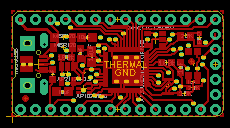
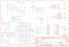

Contents
========

* [PRA3800 > Adafruit ItsyBitsy M4 Express PCB](#pra3800--adafruit-itsybitsy-m4-express-pcb)
	* [Schematic](#schematic)
	* [PCB](#pcb)
	* [Interactive BOM](#interactive-bom)
	* [OOMP Parts](#oomp-parts)
	* [Images](#images)
	* [Tags](#tags)
  
![][im]
# PRA3800 > Adafruit ItsyBitsy M4 Express PCB

- ID: PROJ-ADAF-3800-STAN-01
- Hex ID: PRA3800
- Name: Adafruit
- Description: Adafruit
- Long Link: [http://oom.lt/PROJ-ADAF-3800-STAN-01](http://oom.lt/PROJ-ADAF-3800-STAN-01)
- Short Link: [http://oom.lt/PRA3800](http://oom.lt/PRA3800)

## Schematic
  

## PCB
  

## Interactive BOM

- Interactive BOM page: [ibom.html](https://htmlpreview.github.io/?https://github.com/oomlout/oomlout_OOMP_projects/blob/main/PROJ-ADAF-3800-STAN-01/kicad/bom/ibom.html)

## OOMP Parts
  

|OOMP Parts|
| :---: |
|[CAPC-0603-X-UF1-V25  SMD (0603) 1 uF Capacitor (Ceramic) 25v  C1, C5, C7, C14](https://github.com/oomlout/oomlout_OOMP_parts/tree/main/CAPC-0603-X-UF1-V25/)|
|[CAPC-0805-X-UF10-V10  SMD (0805) 10 uF Capacitor (Ceramic) 10v  C6, C8, C9](https://github.com/oomlout/oomlout_OOMP_parts/tree/main/CAPC-0805-X-UF10-V10/)|
|[DIOD-S123-X-KMBR120-01  SMD (SOD-123) MBR120 Diode  D1, D2](https://github.com/oomlout/oomlout_OOMP_parts/tree/main/DIOD-S123-X-KMBR120-01/)|
|UNMATCHED-SO235-X-UNMATCHED-01 IC1|
|UNMATCHED-UNMATCHED-X-UNMATCHED-01 IC2, U1, X3|
|[HEAD-I01-X-PI05-01  2.54 mm 5 Pin Header  JP1](https://github.com/oomlout/oomlout_OOMP_parts/tree/main/HEAD-I01-X-PI05-01/)|
|[HEAD-I01-X-PI14-01  2.54 mm 14 Pin Header  JP2, JP4](https://github.com/oomlout/oomlout_OOMP_parts/tree/main/HEAD-I01-X-PI14-01/)|
|[LEDS-0603-R-STAN-01  SMD (0603) Red LED  L](https://github.com/oomlout/oomlout_OOMP_parts/tree/main/LEDS-0603-R-STAN-01/)|
|UNMATCHED-2020-X-K102-01 L2|
|RESE-0603-X-O1003-01 R1, R2|
|[RESE-0603-X-O222-01  SMD (0603) 2.2k Ohm Resistor  R3, R7](https://github.com/oomlout/oomlout_OOMP_parts/tree/main/RESE-0603-X-O222-01/)|
|[RESE-0603-X-O103-01  SMD (0603) 10k Ohm Resistor  R4](https://github.com/oomlout/oomlout_OOMP_parts/tree/main/RESE-0603-X-O103-01/)|
|BUTA-UNMATCHED-X-STAN-01 SW1|
|VREG-SO235-X-KAP2112K-V33D U2|

## Images
  
  

|kicadPcb3d|kicadPcb3dFront|kicadPcb3dBack|eagleImage|eagleSchemImage|
| :---: | :---: | :---: | :---: | :---: |
||||||

## Tags

- hexID: PRA3800
- oompType: PROJ
- oompSize: ADAF
- oompColor: 3800
- oompDesc: STAN
- oompIndex: 01
- oompName: Adafruit ItsyBitsy M4 Express PCB
- sources: All source files from https://github.com/adafruit/Adafruit-ItsyBitsy-M4-Express-PCB (source licence details in srcLicense.md)
- linkBuyPage: http://www.adafruit.com/products/3800
- oompID: PROJ-ADAF-3800-STAN-01
- oompParts: C1,CAPC-0603-X-UF1-V25
- oompParts: C5,CAPC-0603-X-UF1-V25
- oompParts: C6,CAPC-0805-X-UF10-V10
- oompParts: C7,CAPC-0603-X-UF1-V25
- oompParts: C8,CAPC-0805-X-UF10-V10
- oompParts: C9,CAPC-0805-X-UF10-V10
- oompParts: C14,CAPC-0603-X-UF1-V25
- oompParts: D1,DIOD-S123-X-KMBR120-01
- oompParts: D2,DIOD-S123-X-KMBR120-01
- oompParts: IC1,UNMATCHED-SO235-X-UNMATCHED-01
- oompParts: IC2,UNMATCHED-UNMATCHED-X-UNMATCHED-01
- oompParts: JP1,HEAD-I01-X-PI05-01
- oompParts: JP2,HEAD-I01-X-PI14-01
- oompParts: JP4,HEAD-I01-X-PI14-01
- oompParts: L,LEDS-0603-R-STAN-01
- oompParts: L2,UNMATCHED-2020-X-K102-01
- oompParts: R1,RESE-0603-X-O1003-01
- oompParts: R2,RESE-0603-X-O1003-01
- oompParts: R3,RESE-0603-X-O222-01
- oompParts: R4,RESE-0603-X-O103-01
- oompParts: R7,RESE-0603-X-O222-01
- oompParts: SW1,BUTA-UNMATCHED-X-STAN-01
- oompParts: U1,UNMATCHED-UNMATCHED-X-UNMATCHED-01
- oompParts: U2,VREG-SO235-X-KAP2112K-V33D
- oompParts: X3,UNMATCHED-UNMATCHED-X-UNMATCHED-01
- rawParts: C1,1uF,CAP_CERAMIC_0603MP,_0603MP,Ceramic Capacitors,,
- rawParts: C5,1uF,CAP_CERAMIC0603_NO,0603-NO,Ceramic Capacitors,,
- rawParts: C6,10µF,CAP_CERAMIC0805-NOOUTLINE,0805-NO,Ceramic Capacitors,,
- rawParts: C7,1uF,CAP_CERAMIC0603_NO,0603-NO,Ceramic Capacitors,,
- rawParts: C8,10µF,CAP_CERAMIC0805-NOOUTLINE,0805-NO,Ceramic Capacitors,,
- rawParts: C9,10uF,CAP_CERAMIC_0805MP,_0805MP,Ceramic Capacitors,,
- rawParts: C14,1uF,CAP_CERAMIC0603_NO,0603-NO,Ceramic Capacitors,,
- rawParts: D1,MBR120,DIODE_SOD-123FL,SOD-123FL,Diode,,
- rawParts: D2,MBR120,DIODE_SOD-123FL,SOD-123FL,Diode,,
- rawParts: IC1,74HCT1G125DBV,74AHC1G125DBV,SOT23-5,Single Bus Buffer Gate with 3-State Output,,
- rawParts: IC2,ATSAMD51G_TQFN48,ATSAMD51G_TQFN48,TQFN48_7MM,,,
- rawParts: JP1,,HEADER-1X570MIL,1X05_ROUND_70,PIN HEADER,,
- rawParts: JP2,,HEADER-1X14,1X14_ROUND70,,,
- rawParts: JP4,,HEADER-1X14,1X14_ROUND70,,,
- rawParts: L,RED,LED0603_NOOUTLINE,CHIPLED_0603_NOOUTLINE,LED,,
- rawParts: L2,AP102-2020,APA1022020,APA102_2020,APA102/DotStar Pixels,,
- rawParts: R1,100k,RESISTOR_0603_NOOUT,0603-NO,Resistors,,
- rawParts: R2,100k,RESISTOR_0603_NOOUT,0603-NO,Resistors,,
- rawParts: R3,2.2K,RESISTOR_0603MP,_0603MP,Resistors,,
- rawParts: R4,10K,RESISTOR_0603MP,_0603MP,Resistors,,
- rawParts: R7,2.2K,RESISTOR_0603_NOOUT,0603-NO,Resistors,,
- rawParts: SJ1,,SOLDERJUMPERCLOSED,SOLDERJUMPER_CLOSEDWIRE,SMD Solder JUMPER,,
- rawParts: SW1,SPST_TACT-KMR2,SPST_TACT-KMR2,KMR2,SMT 6mm switch, EVQQ2 series,,
- rawParts: U$34,FIDUCIAL_1MM,FIDUCIAL_1MM,FIDUCIAL_1MM,Fiducial Alignment Points,EXCLUDE,
- rawParts: U$35,FIDUCIAL_1MM,FIDUCIAL_1MM,FIDUCIAL_1MM,Fiducial Alignment Points,EXCLUDE,
- rawParts: U1,GD25x16,SPIFLASH_8PINUX,USON8,SOIC8 SPI Flash,,
- rawParts: U2,AP2112K-3.3,VREG_SOT23-5,SOT23-5,SOT23-5 Fixed Voltage Regulators,,
- rawParts: X3,microUSB,USB_MICRO_20329_V2,4UCONN_20329_V2,USB Connectors,,

[im]: kicadPcb3d_450.png
