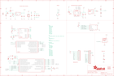

Contents
========

* [PRA3857 > Adafruit Feather M4 Express PCB](#pra3857--adafruit-feather-m4-express-pcb)
	* [Schematic](#schematic)
	* [PCB](#pcb)
	* [Interactive BOM](#interactive-bom)
	* [OOMP Parts](#oomp-parts)
	* [Images](#images)
	* [Tags](#tags)
  
![][im]
# PRA3857 > Adafruit Feather M4 Express PCB

- ID: PROJ-ADAF-3857-STAN-01
- Hex ID: PRA3857
- Name: Adafruit
- Description: Adafruit
- Long Link: [http://oom.lt/PROJ-ADAF-3857-STAN-01](http://oom.lt/PROJ-ADAF-3857-STAN-01)
- Short Link: [http://oom.lt/PRA3857](http://oom.lt/PRA3857)

## Schematic
  

## PCB
  

## Interactive BOM

- Interactive BOM page: [ibom.html](https://htmlpreview.github.io/?https://github.com/oomlout/oomlout_OOMP_projects/blob/main/PROJ-ADAF-3857-STAN-01/kicad/bom/ibom.html)

## OOMP Parts
  

|OOMP Parts|
| :---: |
|C2 C2,CAPC-0603-X-PF22-01|
|[C3 CAPC-0805-X-UF10-V10 SMD (0805) 10 uF Capacitor (Ceramic) 10v](https://github.com/oomlout/oomlout_OOMP_parts/tree/main/CAPC-0805-X-UF10-V10/)|
|C4 C4,CAPC-0603-X-PF22-01|
|[C5 CAPC-0805-X-UF10-V10 SMD (0805) 10 uF Capacitor (Ceramic) 10v](https://github.com/oomlout/oomlout_OOMP_parts/tree/main/CAPC-0805-X-UF10-V10/)|
|[C6 CAPC-0805-X-UF10-V10 SMD (0805) 10 uF Capacitor (Ceramic) 10v](https://github.com/oomlout/oomlout_OOMP_parts/tree/main/CAPC-0805-X-UF10-V10/)|
|C7 C7,CAPC-0603-X-UF1-01|
|[C8 CAPC-0805-X-UF10-V10 SMD (0805) 10 uF Capacitor (Ceramic) 10v](https://github.com/oomlout/oomlout_OOMP_parts/tree/main/CAPC-0805-X-UF10-V10/)|
|C10 C10,CAPC-0603-X-UF1-01|
|C11 C11,CAPC-0603-X-UF1-01|
|C12 C12,CAPC-0603-X-UF1-01|
|[C13 CAPC-0805-X-UF10-V10 SMD (0805) 10 uF Capacitor (Ceramic) 10v](https://github.com/oomlout/oomlout_OOMP_parts/tree/main/CAPC-0805-X-UF10-V10/)|
|C14 C14,CAPC-0603-X-UF1-01|
|C15 C15,CAPC-0603-X-UF1-01|
|[CHG LEDS-0805-G-STAN-01 SMD (0805) Green LED](https://github.com/oomlout/oomlout_OOMP_parts/tree/main/LEDS-0805-G-STAN-01/)|
|D+ D+,UNMATCHED-UNMATCHED-X-UNMATCHED-01|
|D- D-,UNMATCHED-UNMATCHED-X-UNMATCHED-01|
|[D4 DIOD-S123-X-KMBR120-01 SMD (SOD-123) MBR120 Diode](https://github.com/oomlout/oomlout_OOMP_parts/tree/main/DIOD-S123-X-KMBR120-01/)|
|[JP1 HEAD-I01-X-PI16-01 2.54 mm 16 Pin Header](https://github.com/oomlout/oomlout_OOMP_parts/tree/main/HEAD-I01-X-PI16-01/)|
|[JP3 HEAD-I01-X-PI12-01 2.54 mm 12 Pin Header](https://github.com/oomlout/oomlout_OOMP_parts/tree/main/HEAD-I01-X-PI12-01/)|
|[L LEDS-0805-G-STAN-01 SMD (0805) Green LED](https://github.com/oomlout/oomlout_OOMP_parts/tree/main/LEDS-0805-G-STAN-01/)|
|L2 L2,UNMATCHED-UNMATCHED-X-UNMATCHED-01|
|[LED1 LEDS-3535-RGB-K2812-01 SMD (3535) Smart Controller (WS2812B) RGB LED](https://github.com/oomlout/oomlout_OOMP_parts/tree/main/LEDS-3535-RGB-K2812-01/)|
|Q3 Q3,MOSP-SO23-X-UNMATCHED-01|
|[R2 RESE-0603-X-O102-01 SMD (0603) 1k Ohm Resistor](https://github.com/oomlout/oomlout_OOMP_parts/tree/main/RESE-0603-X-O102-01/)|
|[R3 RESE-0603-X-O103-01 SMD (0603) 10k Ohm Resistor](https://github.com/oomlout/oomlout_OOMP_parts/tree/main/RESE-0603-X-O103-01/)|
|[R4 RESE-0603-X-O103-01 SMD (0603) 10k Ohm Resistor](https://github.com/oomlout/oomlout_OOMP_parts/tree/main/RESE-0603-X-O103-01/)|
|[R5 RESE-0603-X-O103-01 SMD (0603) 10k Ohm Resistor](https://github.com/oomlout/oomlout_OOMP_parts/tree/main/RESE-0603-X-O103-01/)|
|[R6 RESE-0603-X-O103-01 SMD (0603) 10k Ohm Resistor](https://github.com/oomlout/oomlout_OOMP_parts/tree/main/RESE-0603-X-O103-01/)|
|[R7 RESE-0603-X-O222-01 SMD (0603) 2.2k Ohm Resistor](https://github.com/oomlout/oomlout_OOMP_parts/tree/main/RESE-0603-X-O222-01/)|
|R8 R8,RESE-0603-X-UNMATCHED-01|
|R9 R9,RESA-06038-X-O1003X4-01|
|SW1 SW1,UNMATCHED-UNMATCHED-X-UNMATCHED-01|
|TP1 TP1,UNMATCHED-UNMATCHED-X-UNMATCHED-01|
|TP2 TP2,UNMATCHED-UNMATCHED-X-UNMATCHED-01|
|U$14 U$14,UNMATCHED-UNMATCHED-X-UNMATCHED-01|
|U1 U1,UNMATCHED-UNMATCHED-X-UNMATCHED-01|
|U2 U2,UNMATCHED-SO235-X-UNMATCHED-01|
|U3 U3,UNMATCHED-SO235-X-UNMATCHED-01|
|X1 X1,UNMATCHED-UNMATCHED-X-UNMATCHED-01|
|X2 X2,UNMATCHED-UNMATCHED-X-UNMATCHED-01|
|X3 X3,UNMATCHED-UNMATCHED-X-UNMATCHED-01|

## Images
  
  

|kicadPcb3d|kicadPcb3dFront|kicadPcb3dBack|eagleImage|eagleSchemImage|
| :---: | :---: | :---: | :---: | :---: |
||||||

## Tags

- hexID: PRA3857
- oompType: PROJ
- oompSize: ADAF
- oompColor: 3857
- oompDesc: STAN
- oompIndex: 01
- oompName: Adafruit Feather M4 Express PCB
- sources: All source files from https://github.com/adafruit/Adafruit-Feather-M4-Express-PCB (source licence details in srcLicense.md)
- linkBuyPage: http://www.adafruit.com/products/3857
- oompID: PROJ-ADAF-3857-STAN-01
- oompParts: C2,CAPC-0603-X-PF22-01
- oompParts: C3,CAPC-0805-X-UF10-V10
- oompParts: C4,CAPC-0603-X-PF22-01
- oompParts: C5,CAPC-0805-X-UF10-V10
- oompParts: C6,CAPC-0805-X-UF10-V10
- oompParts: C7,CAPC-0603-X-UF1-01
- oompParts: C8,CAPC-0805-X-UF10-V10
- oompParts: C10,CAPC-0603-X-UF1-01
- oompParts: C11,CAPC-0603-X-UF1-01
- oompParts: C12,CAPC-0603-X-UF1-01
- oompParts: C13,CAPC-0805-X-UF10-V10
- oompParts: C14,CAPC-0603-X-UF1-01
- oompParts: C15,CAPC-0603-X-UF1-01
- oompParts: CHG,LEDS-0805-G-STAN-01
- oompParts: D+,UNMATCHED-UNMATCHED-X-UNMATCHED-01
- oompParts: D-,UNMATCHED-UNMATCHED-X-UNMATCHED-01
- oompParts: D4,DIOD-S123-X-KMBR120-01
- oompParts: JP1,HEAD-I01-X-PI16-01
- oompParts: JP3,HEAD-I01-X-PI12-01
- oompParts: L,LEDS-0805-G-STAN-01
- oompParts: L2,UNMATCHED-UNMATCHED-X-UNMATCHED-01
- oompParts: LED1,LEDS-3535-RGB-K2812-01
- oompParts: Q3,MOSP-SO23-X-UNMATCHED-01
- oompParts: R2,RESE-0603-X-O102-01
- oompParts: R3,RESE-0603-X-O103-01
- oompParts: R4,RESE-0603-X-O103-01
- oompParts: R5,RESE-0603-X-O103-01
- oompParts: R6,RESE-0603-X-O103-01
- oompParts: R7,RESE-0603-X-O222-01
- oompParts: R8,RESE-0603-X-UNMATCHED-01
- oompParts: R9,RESA-06038-X-O1003X4-01
- oompParts: SW1,UNMATCHED-UNMATCHED-X-UNMATCHED-01
- oompParts: TP1,UNMATCHED-UNMATCHED-X-UNMATCHED-01
- oompParts: TP2,UNMATCHED-UNMATCHED-X-UNMATCHED-01
- oompParts: U$14,UNMATCHED-UNMATCHED-X-UNMATCHED-01
- oompParts: U1,UNMATCHED-UNMATCHED-X-UNMATCHED-01
- oompParts: U2,UNMATCHED-SO235-X-UNMATCHED-01
- oompParts: U3,UNMATCHED-SO235-X-UNMATCHED-01
- oompParts: X1,UNMATCHED-UNMATCHED-X-UNMATCHED-01
- oompParts: X2,UNMATCHED-UNMATCHED-X-UNMATCHED-01
- oompParts: X3,UNMATCHED-UNMATCHED-X-UNMATCHED-01
- rawParts: C2,22pF,CAP_CERAMIC0603_NO,0603-NO,Ceramic Capacitors,,,
- rawParts: C3,10µF,CAP_CERAMIC0805-NOOUTLINE,0805-NO,Ceramic Capacitors,,,
- rawParts: C4,22pF,CAP_CERAMIC0603_NO,0603-NO,Ceramic Capacitors,,,
- rawParts: C5,10uF,CAP_CERAMIC0805-NOOUTLINE,0805-NO,Ceramic Capacitors,,,
- rawParts: C6,10µF,CAP_CERAMIC0805-NOOUTLINE,0805-NO,Ceramic Capacitors,,,
- rawParts: C7,1uF,CAP_CERAMIC0603_NO,0603-NO,Ceramic Capacitors,,,
- rawParts: C8,10µF,CAP_CERAMIC0805-NOOUTLINE,0805-NO,Ceramic Capacitors,,,
- rawParts: C10,1uF,CAP_CERAMIC0603_NO,0603-NO,Ceramic Capacitors,,,
- rawParts: C11,1uF,CAP_CERAMIC0603_NO,0603-NO,Ceramic Capacitors,,,
- rawParts: C12,1uF,CAP_CERAMIC0603_NO,0603-NO,Ceramic Capacitors,,,
- rawParts: C13,10uF,CAP_CERAMIC0805-NOOUTLINE,0805-NO,Ceramic Capacitors,,,
- rawParts: C14,1uF,CAP_CERAMIC0603_NO,0603-NO,Ceramic Capacitors,,,
- rawParts: C15,1uF,CAP_CERAMIC0603_NO,0603-NO,Ceramic Capacitors,,,
- rawParts: CHG,ORANGE,LED0805_NOOUTLINE,CHIPLED_0805_NOOUTLINE,LED,,,
- rawParts: D+,TPB1,27,TPB1,27,B1,27,Test pad,,,
- rawParts: D-,TPB1,27,TPB1,27,B1,27,Test pad,,,
- rawParts: D4,MBR120,DIODE-SCHOTTKYSOD-123,SOD-123,,,,
- rawParts: JP1,,HEADER-1X16ROUND,1X16_ROUND,PIN HEADER,,,
- rawParts: JP3,,HEADER-1X12,1X12_ROUND,,,,
- rawParts: L,RED,LED0805_NOOUTLINE,CHIPLED_0805_NOOUTLINE,LED,,,
- rawParts: L2,10uH,INDUCTOR,INDUCTOR_1007,Inductors,,,
- rawParts: LED1,WS2812B3535,WS2812B3535,LED3535,,,,
- rawParts: Q3,DMG341,MOSFET-P,SOT23-R,P-Channel Mosfet,,,
- rawParts: R2,1K,RESISTOR_0603_NOOUT,0603-NO,Resistors,,,
- rawParts: R3,10K,RESISTOR_0603_NOOUT,0603-NO,Resistors,,,
- rawParts: R4,10K,RESISTOR_0603_NOOUT,0603-NO,Resistors,,,
- rawParts: R5,10K,RESISTOR_0603_NOOUT,0603-NO,Resistors,,,
- rawParts: R6,10K,RESISTOR_0603_NOOUT,0603-NO,Resistors,,,
- rawParts: R7,2.2K,RESISTOR_0603_NOOUT,0603-NO,Resistors,,,
- rawParts: R8,10K\,RESISTOR_0603_NOOUT,0603-NO,Resistors,,,
- rawParts: R9,100K,RESISTOR_4PACK_NO,RESPACK_4X0603_NO,Resistor Packs (4 resistors),,,
- rawParts: SJ1,,SOLDERJUMPERCLOSED,SOLDERJUMPER_CLOSEDWIRE,SMD Solder JUMPER,,,
- rawParts: SW1,KMR2,SWITCH_TACT_SMT4.6X2.8,BTN_KMR2_4.6X2.8,SMT Tact Switches,,,
- rawParts: TP1,,TESTPOINTROUND1.5MM,TESTPOINT_ROUND_1.5MM,Test Point,,,
- rawParts: TP2,,TESTPOINTROUND1.5MM,TESTPOINT_ROUND_1.5MM,Test Point,,,
- rawParts: U$14,ATSAMD51J,ATSAMD51J,PQFN64-1,ATSAMD51J cortex m4 microcontroller,,,
- rawParts: U$31,MOUNTINGHOLE2.5,MOUNTINGHOLE2.5,MOUNTINGHOLE_2.5_PLATED,Mounting Hole,EXCLUDE,,
- rawParts: U$32,MOUNTINGHOLE2.5,MOUNTINGHOLE2.5,MOUNTINGHOLE_2.5_PLATED,Mounting Hole,EXCLUDE,,
- rawParts: U$34,FIDUCIAL_1MM,FIDUCIAL_1MM,FIDUCIAL_1MM,Fiducial Alignment Points,EXCLUDE,,
- rawParts: U$35,FIDUCIAL_1MM,FIDUCIAL_1MM,FIDUCIAL_1MM,Fiducial Alignment Points,EXCLUDE,,
- rawParts: U1,2MB Flash,SPIFLASH_8PINUX,USON8,SOIC8 SPI Flash,,,
- rawParts: U2,AP2112-3.3,VREG_SOT23-5,SOT23-5,SOT23-5 Fixed Voltage Regulators,,,
- rawParts: U3,MCP73831T-2ACI/OT,MCP73831/2,SOT23-5,MCP73831/2 LIPO Charger,,,
- rawParts: X1,JSTPH,CON_JST_PH_2PIN,JSTPH2,JST 2-Pin Right-Angle Connector,,,
- rawParts: X2,32.768,XTAL-3.2X1.5,XTAL3215,Low cost SMT crystals, no capacitors included,,,
- rawParts: X3,microUSB,USB_MICRO_20329_V2,4UCONN_20329_V2,USB Connectors,,,

[im]: kicadPcb3d_450.png
