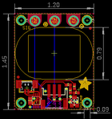
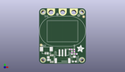
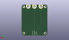
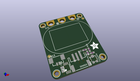

Contents
========

* [PROJ-ADAF-3885-STAN-01>Adafruit STEMMA Speaker PCB](#proj-adaf-3885-stan-01adafruit-stemma-speaker-pcb)
	* [Images](#images)
	* [Interactive BOM](#interactive-bom)
	* [Tags](#tags)
  
![][im]
# PROJ-ADAF-3885-STAN-01>Adafruit STEMMA Speaker PCB

- ID: PROJ-ADAF-3885-STAN-01
- Hex ID: PRA3885
- Name: Adafruit STEMMA Speaker PCB
- Description: 

## Images
  
  

|eagleImage|kicadPcb3dFront|kicadPcb3dBack|kicadPcb3d|
| :---: | :---: | :---: | :---: |
|||||

## Interactive BOM

- Interactive BOM page: [ibom.html](kicad/bom/ibom.html)

## Tags

- hexID: PRA3885
- oompType: PROJ
- oompSize: ADAF
- oompColor: 3885
- oompDesc: STAN
- oompIndex: 01
- oompName: Adafruit STEMMA Speaker PCB
- sources: All source files from https://github.com/adafruit/Adafruit-STEMMA-Speaker-PCB (source licence details in srcLicense.md)
- linkBuyPage: http://www.adafruit.com/products/3885
- oompID: PROJ-ADAF-3885-STAN-01
- oompParts: C9,UNMATCHED-UNMATCHED-UNMATCHED-UNMATCHED-UNMATCHED
- oompParts: C13,UNMATCHED-UNMATCHED-UNMATCHED-UNMATCHED-UNMATCHED
- oompParts: C15,UNMATCHED-UNMATCHED-UNMATCHED-UNMATCHED-UNMATCHED
- oompParts: R12,UNMATCHED-UNMATCHED-UNMATCHED-UNMATCHED-UNMATCHED
- oompParts: R13,UNMATCHED-UNMATCHED-UNMATCHED-UNMATCHED-UNMATCHED
- oompParts: SENSE,UNMATCHED-UNMATCHED-UNMATCHED-UNMATCHED-UNMATCHED
- oompParts: TP1,UNMATCHED-UNMATCHED-UNMATCHED-UNMATCHED-UNMATCHED
- oompParts: TP2,UNMATCHED-UNMATCHED-UNMATCHED-UNMATCHED-UNMATCHED
- oompParts: TP3,UNMATCHED-UNMATCHED-UNMATCHED-UNMATCHED-UNMATCHED
- oompParts: U$13,UNMATCHED-UNMATCHED-UNMATCHED-UNMATCHED-UNMATCHED
- oompParts: U5,UNMATCHED-UNMATCHED-UNMATCHED-UNMATCHED-UNMATCHED
- oompParts: VR2,UNMATCHED-UNMATCHED-UNMATCHED-UNMATCHED-UNMATCHED
- rawParts: C9,1uF,CAP_CERAMIC0603_NO,0603-NO,Ceramic Capacitors,,
- rawParts: C13,1uF,CAP_CERAMIC0603_NO,0603-NO,Ceramic Capacitors,,
- rawParts: C15,10uF,CAP_CERAMIC0805-NOOUTLINE,0805-NO,Ceramic Capacitors,,
- rawParts: FID1,FIDUCIAL_1MM,FIDUCIAL_1MM,FIDUCIAL_1MM,Fiducial Alignment Points,EXCLUDE,
- rawParts: FID2,FIDUCIAL_1MM,FIDUCIAL_1MM,FIDUCIAL_1MM,Fiducial Alignment Points,EXCLUDE,
- rawParts: R12,100,RESISTOR_0603_NOOUT,0603-NO,Resistors,,
- rawParts: R13,100,RESISTOR_0603_NOOUT,0603-NO,Resistors,,
- rawParts: SENSE,JST PH 3,CON_JST_PH_3PIN,JSTPH3,,,
- rawParts: TP1,SEWTAPPCB_ALLIGATOR,SEWTAPPCB_ALLIGATOR,PCB_ALLI,,,
- rawParts: TP2,SEWTAPPCB_ALLIGATOR,SEWTAPPCB_ALLIGATOR,PCB_ALLI,,,
- rawParts: TP3,SEWTAPPCB_ALLIGATOR,SEWTAPPCB_ALLIGATOR,PCB_ALLI,,,
- rawParts: U$9,MOUNTINGHOLE2.0,MOUNTINGHOLE2.0,MOUNTINGHOLE_2.0_PLATED,Mounting Hole,EXCLUDE,
- rawParts: U$10,MOUNTINGHOLE2.0,MOUNTINGHOLE2.0,MOUNTINGHOLE_2.0_PLATED,Mounting Hole,EXCLUDE,
- rawParts: U$11,MOUNTINGHOLE2.0,MOUNTINGHOLE2.0,MOUNTINGHOLE_2.0_PLATED,Mounting Hole,EXCLUDE,
- rawParts: U$12,MOUNTINGHOLE2.0,MOUNTINGHOLE2.0,MOUNTINGHOLE_2.0_PLATED,Mounting Hole,EXCLUDE,
- rawParts: U$13,CON_MOLEX_2P,CON_MOLEX_2P,53398-0271,,,
- rawParts: U5,PAM8302AASCR,AUDIOAMP_PAM8302A,MSOP8_0.65MM,PAM8302A - 2.5W Class-D Mono Audio Amplifier,,
- rawParts: VR2,10K trim,TRIMPOT3303W/X,TRIMPOT_BOURNS_3303W,3-Pin SMT Trimpots,,

[im]: kicadPcb3d_450.png
