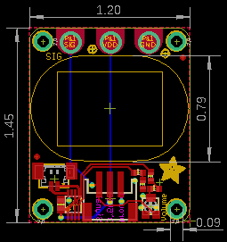
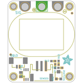
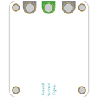
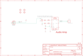
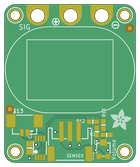
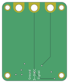

Contents
========

* [PRA3885 > Adafruit STEMMA Speaker PCB](#pra3885--adafruit-stemma-speaker-pcb)
	* [Schematic](#schematic)
	* [PCB](#pcb)
	* [Interactive BOM](#interactive-bom)
	* [OOMP Parts](#oomp-parts)
	* [Images](#images)
	* [Tags](#tags)
  
![][im]
# PRA3885 > Adafruit STEMMA Speaker PCB

- ID: PROJ-ADAF-3885-STAN-01
- Hex ID: PRA3885
- Name: Adafruit
- Description: Adafruit
- Long Link: [http://oom.lt/PROJ-ADAF-3885-STAN-01](http://oom.lt/PROJ-ADAF-3885-STAN-01)
- Short Link: [http://oom.lt/PRA3885](http://oom.lt/PRA3885)

## Schematic
  

## PCB
  

## Interactive BOM

- Interactive BOM page: [ibom.html](https://htmlpreview.github.io/?https://github.com/oomlout/oomlout_OOMP_projects/blob/main/PROJ-ADAF-3885-STAN-01/kicad/bom/ibom.html)

## OOMP Parts
  

|OOMP Parts|
| :---: |
|[CAPC-0603-X-UF1-V25  SMD (0603) 1 uF Capacitor (Ceramic) 25v  C9, C13](https://github.com/oomlout/oomlout_OOMP_parts/tree/main/CAPC-0603-X-UF1-V25/)|
|[CAPC-0805-X-UF10-V10  SMD (0805) 10 uF Capacitor (Ceramic) 10v  C15](https://github.com/oomlout/oomlout_OOMP_parts/tree/main/CAPC-0805-X-UF10-V10/)|
|[RESE-0603-X-O101-01  SMD (0603) 100 Ohm Resistor  R12, R13](https://github.com/oomlout/oomlout_OOMP_parts/tree/main/RESE-0603-X-O101-01/)|
|UNMATCHED-UNMATCHED-X-UNMATCHED-01 SENSE, U$13, U5, VR2|

## Images
  
  

|bominteractivefront|bominteractiveback|kicadPcb3d|kicadPcb3dFront|kicadPcb3dBack|eagleImage|eagleSchemImage|pcbdraw|pcbdrawback|
| :---: | :---: | :---: | :---: | :---: | :---: | :---: | :---: | :---: |
||||||||||

## Tags

- hexID: PRA3885
- oompType: PROJ
- oompSize: ADAF
- oompColor: 3885
- oompDesc: STAN
- oompIndex: 01
- oompName: Adafruit STEMMA Speaker PCB
- sources: All source files from https://github.com/adafruit/Adafruit-STEMMA-Speaker-PCB (source licence details in srcLicense.md)
- linkBuyPage: http://www.adafruit.com/products/3885
- oompID: PROJ-ADAF-3885-STAN-01
- oompParts: C9,CAPC-0603-X-UF1-V25
- oompParts: C13,CAPC-0603-X-UF1-V25
- oompParts: C15,CAPC-0805-X-UF10-V10
- oompParts: R12,RESE-0603-X-O101-01
- oompParts: R13,RESE-0603-X-O101-01
- oompParts: SENSE,UNMATCHED-UNMATCHED-X-UNMATCHED-01
- oompParts: U$13,UNMATCHED-UNMATCHED-X-UNMATCHED-01
- oompParts: U5,UNMATCHED-UNMATCHED-X-UNMATCHED-01
- oompParts: VR2,UNMATCHED-UNMATCHED-X-UNMATCHED-01
- rawParts: C9,1uF,CAP_CERAMIC0603_NO,0603-NO,Ceramic Capacitors,,
- rawParts: C13,1uF,CAP_CERAMIC0603_NO,0603-NO,Ceramic Capacitors,,
- rawParts: C15,10uF,CAP_CERAMIC0805-NOOUTLINE,0805-NO,Ceramic Capacitors,,
- rawParts: FID1,FIDUCIAL_1MM,FIDUCIAL_1MM,FIDUCIAL_1MM,Fiducial Alignment Points,EXCLUDE,
- rawParts: FID2,FIDUCIAL_1MM,FIDUCIAL_1MM,FIDUCIAL_1MM,Fiducial Alignment Points,EXCLUDE,
- rawParts: R12,100,RESISTOR_0603_NOOUT,0603-NO,Resistors,,
- rawParts: R13,100,RESISTOR_0603_NOOUT,0603-NO,Resistors,,
- rawParts: SENSE,JST PH 3,CON_JST_PH_3PIN,JSTPH3,,,
- rawParts: TP1,SEWTAPPCB_ALLIGATOR,SEWTAPPCB_ALLIGATOR,PCB_ALLI,,,
- rawParts: TP2,SEWTAPPCB_ALLIGATOR,SEWTAPPCB_ALLIGATOR,PCB_ALLI,,,
- rawParts: TP3,SEWTAPPCB_ALLIGATOR,SEWTAPPCB_ALLIGATOR,PCB_ALLI,,,
- rawParts: U$9,MOUNTINGHOLE2.0,MOUNTINGHOLE2.0,MOUNTINGHOLE_2.0_PLATED,Mounting Hole,EXCLUDE,
- rawParts: U$10,MOUNTINGHOLE2.0,MOUNTINGHOLE2.0,MOUNTINGHOLE_2.0_PLATED,Mounting Hole,EXCLUDE,
- rawParts: U$11,MOUNTINGHOLE2.0,MOUNTINGHOLE2.0,MOUNTINGHOLE_2.0_PLATED,Mounting Hole,EXCLUDE,
- rawParts: U$12,MOUNTINGHOLE2.0,MOUNTINGHOLE2.0,MOUNTINGHOLE_2.0_PLATED,Mounting Hole,EXCLUDE,
- rawParts: U$13,CON_MOLEX_2P,CON_MOLEX_2P,53398-0271,,,
- rawParts: U5,PAM8302AASCR,AUDIOAMP_PAM8302A,MSOP8_0.65MM,PAM8302A - 2.5W Class-D Mono Audio Amplifier,,
- rawParts: VR2,10K trim,TRIMPOT3303W/X,TRIMPOT_BOURNS_3303W,3-Pin SMT Trimpots,,

[im]: kicadPcb3d_450.png
