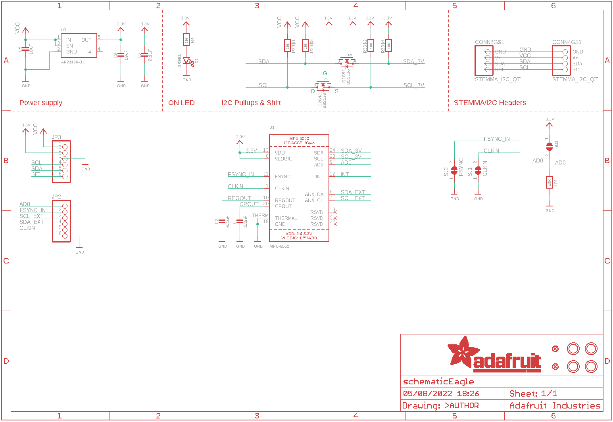
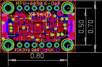

Contents
========

* [PRA3886 > Adafruit MPU6050 PCB](#pra3886--adafruit-mpu6050-pcb)
	* [Schematic](#schematic)
	* [PCB](#pcb)
	* [Interactive BOM](#interactive-bom)
	* [OOMP Parts](#oomp-parts)
	* [Images](#images)
	* [Tags](#tags)
  
![][im]
# PRA3886 > Adafruit MPU6050 PCB

- ID: PROJ-ADAF-3886-STAN-01
- Hex ID: PRA3886
- Name: Adafruit
- Description: Adafruit
- Long Link: [http://oom.lt/PROJ-ADAF-3886-STAN-01](http://oom.lt/PROJ-ADAF-3886-STAN-01)
- Short Link: [http://oom.lt/PRA3886](http://oom.lt/PRA3886)

## Schematic
  

## PCB
  

## Interactive BOM

- Interactive BOM page: [ibom.html](https://htmlpreview.github.io/?https://github.com/oomlout/oomlout_OOMP_projects/blob/main/PROJ-ADAF-3886-STAN-01/kicad/bom/ibom.html)

## OOMP Parts
  

|OOMP Parts|
| :---: |
|C1 C1,CAPC-0603-X-PF22D-01|
|C2 C2,CAPC-0603-X-UF1D-01|
|[C5 CAPC-0805-X-UF10-V10 SMD (0805) 10 uF Capacitor (Ceramic) 10v](https://github.com/oomlout/oomlout_OOMP_parts/tree/main/CAPC-0805-X-UF10-V10/)|
|[C6 CAPC-0805-X-UF10-V10 SMD (0805) 10 uF Capacitor (Ceramic) 10v](https://github.com/oomlout/oomlout_OOMP_parts/tree/main/CAPC-0805-X-UF10-V10/)|
|C7 C7,CAPC-0603-X-UF1D-01|
|[CONN3 HEAD-I01-X-PI04-01 2.54 mm 4 Pin Header](https://github.com/oomlout/oomlout_OOMP_parts/tree/main/HEAD-I01-X-PI04-01/)|
|[CONN4 HEAD-I01-X-PI04-01 2.54 mm 4 Pin Header](https://github.com/oomlout/oomlout_OOMP_parts/tree/main/HEAD-I01-X-PI04-01/)|
|[D1 LEDS-0603-G-STAN-01 SMD (0603) Green LED](https://github.com/oomlout/oomlout_OOMP_parts/tree/main/LEDS-0603-G-STAN-01/)|
|[JP2 HEAD-I01-X-PI06-01 2.54 mm 6 Pin Header](https://github.com/oomlout/oomlout_OOMP_parts/tree/main/HEAD-I01-X-PI06-01/)|
|[JP3 HEAD-I01-X-PI06-01 2.54 mm 6 Pin Header](https://github.com/oomlout/oomlout_OOMP_parts/tree/main/HEAD-I01-X-PI06-01/)|
|[Q2 MOSN-SO363-X-KBSS138-01 SMD (SOT-363) BSS138 N-Ch. MOSFET](https://github.com/oomlout/oomlout_OOMP_parts/tree/main/MOSN-SO363-X-KBSS138-01/)|
|[R2 RESE-0603-X-O103-01 SMD (0603) 10k Ohm Resistor](https://github.com/oomlout/oomlout_OOMP_parts/tree/main/RESE-0603-X-O103-01/)|
|R3 R3,RESA-06038-X-O103X4-01|
|[R4 RESE-0603-X-O103-01 SMD (0603) 10k Ohm Resistor](https://github.com/oomlout/oomlout_OOMP_parts/tree/main/RESE-0603-X-O103-01/)|
|U1 U1,UNMATCHED-UNMATCHED-X-UNMATCHED-01|
|U3 U3,VREG-SO235-X-KAP2112K-V33D|

## Images
  
  

|kicadPcb3d|kicadPcb3dFront|kicadPcb3dBack|eagleImage|eagleSchemImage|
| :---: | :---: | :---: | :---: | :---: |
||||||

## Tags

- hexID: PRA3886
- oompType: PROJ
- oompSize: ADAF
- oompColor: 3886
- oompDesc: STAN
- oompIndex: 01
- oompName: Adafruit MPU6050 PCB
- sources: All source files from https://github.com/adafruit/Adafruit-MPU6050-PCB (source licence details in srcLicense.md)
- linkBuyPage: http://www.adafruit.com/products/3886
- oompID: PROJ-ADAF-3886-STAN-01
- oompParts: C1,CAPC-0603-X-PF22D-01
- oompParts: C2,CAPC-0603-X-UF1D-01
- oompParts: C5,CAPC-0805-X-UF10-V10
- oompParts: C6,CAPC-0805-X-UF10-V10
- oompParts: C7,CAPC-0603-X-UF1D-01
- oompParts: CONN3,HEAD-I01-X-PI04-01
- oompParts: CONN4,HEAD-I01-X-PI04-01
- oompParts: D1,LEDS-0603-G-STAN-01
- oompParts: JP2,HEAD-I01-X-PI06-01
- oompParts: JP3,HEAD-I01-X-PI06-01
- oompParts: Q2,MOSN-SO363-X-KBSS138-01
- oompParts: R2,RESE-0603-X-O103-01
- oompParts: R3,RESA-06038-X-O103X4-01
- oompParts: R4,RESE-0603-X-O103-01
- oompParts: U1,UNMATCHED-UNMATCHED-X-UNMATCHED-01
- oompParts: U3,VREG-SO235-X-KAP2112K-V33D
- rawParts: C1,2.2nF,CAP_CERAMIC0603_NO,0603-NO,Ceramic Capacitors,,
- rawParts: C2,0.1uF,CAP_CERAMIC0603_NO,0603-NO,Ceramic Capacitors,,
- rawParts: C5,10uF,CAP_CERAMIC0805-NOOUTLINE,0805-NO,Ceramic Capacitors,,
- rawParts: C6,10uF,CAP_CERAMIC0805-NOOUTLINE,0805-NO,Ceramic Capacitors,,
- rawParts: C7,0.1uF,CAP_CERAMIC0603_NO,0603-NO,Ceramic Capacitors,,
- rawParts: CONN3,STEMMA_I2C_QT,STEMMA_I2C_QT,JST_SH4,,,
- rawParts: CONN4,STEMMA_I2C_QT,STEMMA_I2C_QT,JST_SH4,,,
- rawParts: D1,GREEN,LED0603_NOOUTLINE,CHIPLED_0603_NOOUTLINE,LED,,
- rawParts: FID3,FIDUCIAL_1MM,FIDUCIAL_1MM,FIDUCIAL_1MM,Fiducial Alignment Points,EXCLUDE,
- rawParts: FID4,FIDUCIAL_1MM,FIDUCIAL_1MM,FIDUCIAL_1MM,Fiducial Alignment Points,EXCLUDE,
- rawParts: JP2,,HEADER-1X6ROUND,1X06_ROUND,PIN HEADER,,
- rawParts: JP3,,HEADER-1X670MIL,1X06_ROUND_70,PIN HEADER,,
- rawParts: Q2,BSS138,MOSFET-N_DUAL,SOT363,Dual N-Channel MOSFET,,
- rawParts: R2,10K,RESISTOR_0603_NOOUT,0603-NO,Resistors,,
- rawParts: R3,10K,RESISTOR_4PACK,RESPACK_4X0603,Resistor Packs (4 resistors),,
- rawParts: R4,10K,RESISTOR_0603_NOOUT,0603-NO,Resistors,,
- rawParts: SJ1,CLKIN,SOLDERJUMPER_CLOSED,SOLDERJUMPER_CLOSEDWIRE,Solder Jumper - Closed,,
- rawParts: SJ2,FSYNC,SOLDERJUMPER_CLOSED,SOLDERJUMPER_CLOSEDWIRE,Solder Jumper - Closed,,
- rawParts: SJ3,,SOLDERJUMPER,SOLDERJUMPER_ARROW_NOPASTE,SMD Solder JUMPER,EXCLUDE,
- rawParts: U$39,MOUNTINGHOLE2.5,MOUNTINGHOLE2.5,MOUNTINGHOLE_2.5_PLATED,Mounting Hole,EXCLUDE,
- rawParts: U$40,MOUNTINGHOLE2.5,MOUNTINGHOLE2.5,MOUNTINGHOLE_2.5_PLATED,Mounting Hole,EXCLUDE,
- rawParts: U$42,MOUNTINGHOLE2.5,MOUNTINGHOLE2.5,MOUNTINGHOLE_2.5_PLATED,Mounting Hole,EXCLUDE,
- rawParts: U$43,MOUNTINGHOLE2.5,MOUNTINGHOLE2.5,MOUNTINGHOLE_2.5_PLATED,Mounting Hole,EXCLUDE,
- rawParts: U1,MPU-6050,MPU-6050,QFN24_4MM_SMSC,MPU-6050 3-Axis Accelerometer/Gyroscope,,
- rawParts: U3,AP2112K-3.3,VREG_SOT23-5,SOT23-5,SOT23-5 Fixed Voltage Regulators,,

[im]: kicadPcb3d_450.png
