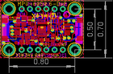
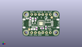
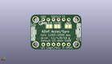
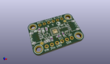

Contents
========

* [PROJ-ADAF-3886-STAN-01>Adafruit MPU6050 PCB](#proj-adaf-3886-stan-01adafruit-mpu6050-pcb)
	* [Images](#images)
	* [Interactive BOM](#interactive-bom)
	* [OOMP Parts](#oomp-parts)
	* [Tags](#tags)
  
![][im]
# PROJ-ADAF-3886-STAN-01>Adafruit MPU6050 PCB

- ID: PROJ-ADAF-3886-STAN-01
- Hex ID: PRA3886
- Name: Adafruit MPU6050 PCB
- Description: 

## Images
  
  

|eagleImage|kicadPcb3dFront|kicadPcb3dBack|kicadPcb3d|
| :---: | :---: | :---: | :---: |
|||||

## Interactive BOM

- Interactive BOM page: [ibom.html](kicad/bom/ibom.html)

## OOMP Parts
  

|OOMP Parts|
| :---: |
|CAPE-0603-X-NF22D-01, C1, 16.052799999999998, 6.095999999999999, 270,C1, 2.2nF, 0603-NO, microbuilder, (0.632, 0.24), R270|
|CAPE-0603-X-NF100-01, C2, 9.7282, 5.4737, 270,C2, 0.1uF, 0603-NO, microbuilder, (0.383, 0.2155), R270|
|CAPE-0805-X-UNMATCHED-01, C5, 7.340599999999999, 4.9276, 0,C5, 10uF, 0805-NO, microbuilder, (0.289, 0.194), R0|
|CAPE-0805-X-UNMATCHED-01, C6, 7.048500000000001, 11.5443, 90,C6, 10uF, 0805-NO, microbuilder, (0.2775, 0.4545), R90|
|CAPE-0603-X-NF100-01, C7, 13.4493, 5.588, 0,C7, 0.1uF, 0603-NO, microbuilder, (0.5295, 0.22), R0|
|UNMATCHED-UNMATCHED-X-UNMATCHED-01, CONN3, 22.86, 8.889999999999999, 90,CONN3, STEMMA_I2C_QT, JST_SH4, microbuilder, (0.9, 0.35), R90|
|UNMATCHED-UNMATCHED-X-UNMATCHED-01, CONN4, 2.54, 8.889999999999999, 270,CONN4, STEMMA_I2C_QT, JST_SH4, microbuilder, (0.1, 0.35), R270|
|UNMATCHED-UNMATCHED-X-UNMATCHED-01, D1, 3.556, 12.572999999999999, 90,D1, GREEN, CHIPLED_0603_NOOUTLINE, microbuilder, (0.14, 0.495), R90|
|UNMATCHED-UNMATCHED-X-UNMATCHED-01, JP2, 12.7, 15.239999999999998, 0,JP2, 1X06_ROUND, microbuilder, (0.5, 0.6), R0|
|UNMATCHED-UNMATCHED-X-UNMATCHED-01, JP3, 12.7, 2.54, 0,JP3, 1X06_ROUND_70, microbuilder, (0.5, 0.1), R0|
|UNMATCHED-UNMATCHED-X-UNMATCHED-01, Q2, 18.313399999999998, 6.1468, 180,Q2, BSS138, SOT363, microbuilder, (0.721, 0.242), R180|
|<table><tr><td></td><td> R2</td><td>[RESE-0603-X-O103-01 SMD (0603) 10k Ohm Resistor](https://github.com/oomlout/oomlout_OOMP_parts/tree/main/RESE-0603-X-O103-01/)</td><td>[R6103](https://github.com/oomlout/oomlout_OOMP_parts/tree/main/RESE-0603-X-O103-01/)</td></tr></table>|
|RESE-UNMATCHED-X-O103-01, R3, 17.424400000000002, 10.540999999999999, 180,R3, 10K, RESPACK_4X0603, microbuilder, (0.686, 0.415), R180|
|<table><tr><td></td><td> R4</td><td>[RESE-0603-X-O103-01 SMD (0603) 10k Ohm Resistor](https://github.com/oomlout/oomlout_OOMP_parts/tree/main/RESE-0603-X-O103-01/)</td><td>[R6103](https://github.com/oomlout/oomlout_OOMP_parts/tree/main/RESE-0603-X-O103-01/)</td></tr></table>|
|UNMATCHED-UNMATCHED-X-UNMATCHED-01, SJ1, 16.128999999999998, 11.811, M180,SJ1, CLKIN, SOLDERJUMPER_CLOSEDWIRE, microbuilder, (0.635, 0.465), MR180|
|UNMATCHED-UNMATCHED-X-UNMATCHED-01, SJ2, 12.065, 11.811, M0,SJ2, FSYNC, SOLDERJUMPER_CLOSEDWIRE, microbuilder, (0.475, 0.465), MR0|
|UNMATCHED-UNMATCHED-X-UNMATCHED-01, SJ3, 6.604, 11.811, M0,SJ3, SOLDERJUMPER_ARROW_NOPASTE, microbuilder, (0.26, 0.465), MR0|
|UNMATCHED-UNMATCHED-X-UNMATCHED-01, U1, 12.7, 8.889999999999999, 270,U1, MPU-6050, QFN24_4MM_SMSC, microbuilder, (0.5, 0.35), R270|
|UNMATCHED-UNMATCHED-X-UNMATCHED-01, U3, 7.696199999999999, 7.874, 0,U3, AP2112K-3.3, SOT23-5, microbuilder, (0.303, 0.31), R0|

## Tags

- hexID: PRA3886
- oompType: PROJ
- oompSize: ADAF
- oompColor: 3886
- oompDesc: STAN
- oompIndex: 01
- oompName: Adafruit MPU6050 PCB
- sources: All source files from https://github.com/adafruit/Adafruit-MPU6050-PCB (source licence details in srcLicense.md)
- linkBuyPage: http://www.adafruit.com/products/3886
- oompPart: CAPE-0603-X-NF22D-01, C1, 16.052799999999998, 6.095999999999999, 270
- oompPart: CAPE-0603-X-NF100-01, C2, 9.7282, 5.4737, 270
- oompPart: CAPE-0805-X-UNMATCHED-01, C5, 7.340599999999999, 4.9276, 0
- oompPart: CAPE-0805-X-UNMATCHED-01, C6, 7.048500000000001, 11.5443, 90
- oompPart: CAPE-0603-X-NF100-01, C7, 13.4493, 5.588, 0
- oompPart: UNMATCHED-UNMATCHED-X-UNMATCHED-01, CONN3, 22.86, 8.889999999999999, 90
- oompPart: UNMATCHED-UNMATCHED-X-UNMATCHED-01, CONN4, 2.54, 8.889999999999999, 270
- oompPart: UNMATCHED-UNMATCHED-X-UNMATCHED-01, D1, 3.556, 12.572999999999999, 90
- oompPart: SKIP-UNMATCHED-X-UNMATCHED-01, FID3, 20.066, 13.144499999999999, 0
- oompPart: SKIP-UNMATCHED-X-UNMATCHED-01, FID4, 4.6609, 4.7498, 0
- oompPart: UNMATCHED-UNMATCHED-X-UNMATCHED-01, JP2, 12.7, 15.239999999999998, 0
- oompPart: UNMATCHED-UNMATCHED-X-UNMATCHED-01, JP3, 12.7, 2.54, 0
- oompPart: UNMATCHED-UNMATCHED-X-UNMATCHED-01, Q2, 18.313399999999998, 6.1468, 180
- oompPart: RESE-0603-X-O103-01, R2, 8.928099999999999, 11.6332, 90
- oompPart: RESE-UNMATCHED-X-O103-01, R3, 17.424400000000002, 10.540999999999999, 180
- oompPart: RESE-0603-X-O103-01, R4, 5.4737, 12.4079, 90
- oompPart: UNMATCHED-UNMATCHED-X-UNMATCHED-01, SJ1, 16.128999999999998, 11.811, M180
- oompPart: UNMATCHED-UNMATCHED-X-UNMATCHED-01, SJ2, 12.065, 11.811, M0
- oompPart: UNMATCHED-UNMATCHED-X-UNMATCHED-01, SJ3, 6.604, 11.811, M0
- oompPart: SKIP-UNMATCHED-X-UNMATCHED-01, U$39, 2.54, 15.239999999999998, 0
- oompPart: SKIP-UNMATCHED-X-UNMATCHED-01, U$40, 22.86, 15.239999999999998, 0
- oompPart: SKIP-UNMATCHED-X-UNMATCHED-01, U$42, 2.54, 2.54, 0
- oompPart: SKIP-UNMATCHED-X-UNMATCHED-01, U$43, 22.86, 2.54, 0
- oompPart: UNMATCHED-UNMATCHED-X-UNMATCHED-01, U1, 12.7, 8.889999999999999, 270
- oompPart: UNMATCHED-UNMATCHED-X-UNMATCHED-01, U3, 7.696199999999999, 7.874, 0
- rawPart: C1, 2.2nF, 0603-NO, microbuilder, (0.632, 0.24), R270
- rawPart: C2, 0.1uF, 0603-NO, microbuilder, (0.383, 0.2155), R270
- rawPart: C5, 10uF, 0805-NO, microbuilder, (0.289, 0.194), R0
- rawPart: C6, 10uF, 0805-NO, microbuilder, (0.2775, 0.4545), R90
- rawPart: C7, 0.1uF, 0603-NO, microbuilder, (0.5295, 0.22), R0
- rawPart: CONN3, STEMMA_I2C_QT, JST_SH4, microbuilder, (0.9, 0.35), R90
- rawPart: CONN4, STEMMA_I2C_QT, JST_SH4, microbuilder, (0.1, 0.35), R270
- rawPart: D1, GREEN, CHIPLED_0603_NOOUTLINE, microbuilder, (0.14, 0.495), R90
- rawPart: FID3, FIDUCIAL_1MM, FIDUCIAL_1MM, microbuilder, (0.79, 0.5175), R0
- rawPart: FID4, FIDUCIAL_1MM, FIDUCIAL_1MM, microbuilder, (0.1835, 0.187), R0
- rawPart: JP2, 1X06_ROUND, microbuilder, (0.5, 0.6), R0
- rawPart: JP3, 1X06_ROUND_70, microbuilder, (0.5, 0.1), R0
- rawPart: Q2, BSS138, SOT363, microbuilder, (0.721, 0.242), R180
- rawPart: R2, 10K, 0603-NO, microbuilder, (0.3515, 0.458), R90
- rawPart: R3, 10K, RESPACK_4X0603, microbuilder, (0.686, 0.415), R180
- rawPart: R4, 10K, 0603-NO, microbuilder, (0.2155, 0.4885), R90
- rawPart: SJ1, CLKIN, SOLDERJUMPER_CLOSEDWIRE, microbuilder, (0.635, 0.465), MR180
- rawPart: SJ2, FSYNC, SOLDERJUMPER_CLOSEDWIRE, microbuilder, (0.475, 0.465), MR0
- rawPart: SJ3, SOLDERJUMPER_ARROW_NOPASTE, microbuilder, (0.26, 0.465), MR0
- rawPart: U$39, MOUNTINGHOLE2.5, MOUNTINGHOLE_2.5_PLATED, microbuilder, (0.1, 0.6), R0
- rawPart: U$40, MOUNTINGHOLE2.5, MOUNTINGHOLE_2.5_PLATED, microbuilder, (0.9, 0.6), R0
- rawPart: U$42, MOUNTINGHOLE2.5, MOUNTINGHOLE_2.5_PLATED, microbuilder, (0.1, 0.1), R0
- rawPart: U$43, MOUNTINGHOLE2.5, MOUNTINGHOLE_2.5_PLATED, microbuilder, (0.9, 0.1), R0
- rawPart: U1, MPU-6050, QFN24_4MM_SMSC, microbuilder, (0.5, 0.35), R270
- rawPart: U3, AP2112K-3.3, SOT23-5, microbuilder, (0.303, 0.31), R0

[im]: kicadPcb3d_450.png
