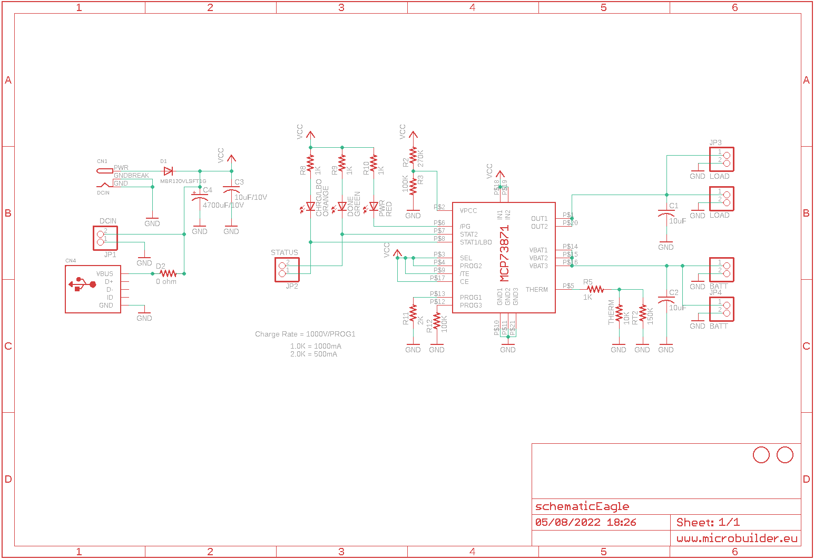
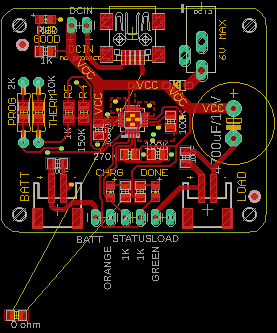

Contents
========

* [PRA390 > USB DC Solar Lithium Ion Polymer charger](#pra390--usb-dc-solar-lithium-ion-polymer-charger)
	* [Schematic](#schematic)
	* [PCB](#pcb)
	* [OOMP Parts](#oomp-parts)
	* [Images](#images)
	* [Tags](#tags)
  
![][im]
# PRA390 > USB DC Solar Lithium Ion Polymer charger

- ID: PROJ-ADAF-390-STAN-01
- Hex ID: PRA390
- Name: Adafruit
- Description: Adafruit
- Long Link: [http://oom.lt/PROJ-ADAF-390-STAN-01](http://oom.lt/PROJ-ADAF-390-STAN-01)
- Short Link: [http://oom.lt/PRA390](http://oom.lt/PRA390)

## Schematic
  

## PCB
  

## OOMP Parts
  

|OOMP ID|Name|Identifier|
| :---: | :---: | :---: |
|UNMATCHED-UNMATCHED-X-UNMATCHED-01||BATT, CN1, CN4, IC1, LOAD|
|[CAPC-0805-X-UF10-V10](https://github.com/oomlout/oomlout_OOMP_parts/tree/main/CAPC-0805-X-UF10-V10/)|[SMD (0805) 10 uF Capacitor (Ceramic) 10v](https://github.com/oomlout/oomlout_OOMP_parts/tree/main/CAPC-0805-X-UF10-V10/)|[C1, C2](https://github.com/oomlout/oomlout_OOMP_parts/tree/main/CAPC-0805-X-UF10-V10/)|
|CAPC-0805-X-UNMATCHED-01||C3|
|CAPX-UNMATCHED-X-UNMATCHED-01||C4|
|LEDS-0805-O-STAN-01||CHRG/LBO|
|[DIOD-S123-X-KMBR120-01](https://github.com/oomlout/oomlout_OOMP_parts/tree/main/DIOD-S123-X-KMBR120-01/)|[SMD (SOD-123) MBR120 Diode](https://github.com/oomlout/oomlout_OOMP_parts/tree/main/DIOD-S123-X-KMBR120-01/)|[D1](https://github.com/oomlout/oomlout_OOMP_parts/tree/main/DIOD-S123-X-KMBR120-01/)|
|DIOD-0805-X-UNMATCHED-01||D2|
|[LEDS-0805-G-STAN-01](https://github.com/oomlout/oomlout_OOMP_parts/tree/main/LEDS-0805-G-STAN-01/)|[SMD (0805) Green LED](https://github.com/oomlout/oomlout_OOMP_parts/tree/main/LEDS-0805-G-STAN-01/)|[DONE](https://github.com/oomlout/oomlout_OOMP_parts/tree/main/LEDS-0805-G-STAN-01/)|
|[HEAD-I01-X-PI02-01](https://github.com/oomlout/oomlout_OOMP_parts/tree/main/HEAD-I01-X-PI02-01/)|[2.54 mm 2 Pin Header](https://github.com/oomlout/oomlout_OOMP_parts/tree/main/HEAD-I01-X-PI02-01/)|[JP1, JP2, JP3, JP4](https://github.com/oomlout/oomlout_OOMP_parts/tree/main/HEAD-I01-X-PI02-01/)|
|[LEDS-0805-R-STAN-01](https://github.com/oomlout/oomlout_OOMP_parts/tree/main/LEDS-0805-R-STAN-01/)|[SMD (0805) Red LED](https://github.com/oomlout/oomlout_OOMP_parts/tree/main/LEDS-0805-R-STAN-01/)|[PWR](https://github.com/oomlout/oomlout_OOMP_parts/tree/main/LEDS-0805-R-STAN-01/)|
|RESE-0805-X-O2703-01||R2|
|RESE-0805-X-O1003-01||R3, R12|
|[RESE-0805-X-O102-01](https://github.com/oomlout/oomlout_OOMP_parts/tree/main/RESE-0805-X-O102-01/)|[SMD (0805) 1k Ohm Resistor](https://github.com/oomlout/oomlout_OOMP_parts/tree/main/RESE-0805-X-O102-01/)|[R5, R8, R9, R10](https://github.com/oomlout/oomlout_OOMP_parts/tree/main/RESE-0805-X-O102-01/)|
|[RESE-0805-X-O202-01](https://github.com/oomlout/oomlout_OOMP_parts/tree/main/RESE-0805-X-O202-01/)|[SMD (0805) 2k Ohm Resistor](https://github.com/oomlout/oomlout_OOMP_parts/tree/main/RESE-0805-X-O202-01/)|[R11](https://github.com/oomlout/oomlout_OOMP_parts/tree/main/RESE-0805-X-O202-01/)|
|UNMATCHED-0805-X-UNMATCHED-01||RT2, THERM|

## Images
  
  

|kicadPcb3d|kicadPcb3dFront|kicadPcb3dBack|eagleImage|eagleSchemImage|
| :---: | :---: | :---: | :---: | :---: |
||||||

## Tags

- hexID: PRA390
- oompType: PROJ
- oompSize: ADAF
- oompColor: 390
- oompDesc: STAN
- oompIndex: 01
- oompName: USB DC Solar Lithium Ion Polymer charger
- sources: All source files from https://github.com/adafruit/USB-DC-Solar-Lithium-Ion-Polymer-charger (source licence details in srcLicense.md)
- linkBuyPage: http://www.adafruit.com/products/390
- oompID: PROJ-ADAF-390-STAN-01
- oompParts: BATT,UNMATCHED-UNMATCHED-X-UNMATCHED-01
- oompParts: C1,CAPC-0805-X-UF10-V10
- oompParts: C2,CAPC-0805-X-UF10-V10
- oompParts: C3,CAPC-0805-X-UNMATCHED-01
- oompParts: C4,CAPX-UNMATCHED-X-UNMATCHED-01
- oompParts: CHRG/LBO,LEDS-0805-O-STAN-01
- oompParts: CN1,UNMATCHED-UNMATCHED-X-UNMATCHED-01
- oompParts: CN4,UNMATCHED-UNMATCHED-X-UNMATCHED-01
- oompParts: D1,DIOD-S123-X-KMBR120-01
- oompParts: D2,DIOD-0805-X-UNMATCHED-01
- oompParts: DONE,LEDS-0805-G-STAN-01
- oompParts: IC1,UNMATCHED-UNMATCHED-X-UNMATCHED-01
- oompParts: JP1,HEAD-I01-X-PI02-01
- oompParts: JP2,HEAD-I01-X-PI02-01
- oompParts: JP3,HEAD-I01-X-PI02-01
- oompParts: JP4,HEAD-I01-X-PI02-01
- oompParts: LOAD,UNMATCHED-UNMATCHED-X-UNMATCHED-01
- oompParts: PWR,LEDS-0805-R-STAN-01
- oompParts: R2,RESE-0805-X-O2703-01
- oompParts: R3,RESE-0805-X-O1003-01
- oompParts: R5,RESE-0805-X-O102-01
- oompParts: R8,RESE-0805-X-O102-01
- oompParts: R9,RESE-0805-X-O102-01
- oompParts: R10,RESE-0805-X-O102-01
- oompParts: R11,RESE-0805-X-O202-01
- oompParts: R12,RESE-0805-X-O1003-01
- oompParts: RT2,UNMATCHED-0805-X-UNMATCHED-01
- oompParts: THERM,UNMATCHED-0805-X-UNMATCHED-01
- rawParts: BATT,,JST_2PIN-SMT-RA,JST-PH-2-SMT-RA,JST 2-Pin Connectors of various flavors,,
- rawParts: C1,10uF,C-USC0805K,C0805K,CAPACITOR, American symbol,,
- rawParts: C2,10uF,C-USC0805K,C0805K,CAPACITOR, American symbol,,
- rawParts: C3,10uF/10V,C-USC0805K,C0805K,CAPACITOR, American symbol,,
- rawParts: C4,4700uF/10V,CPOL-USE5-13,E5-13,POLARIZED CAPACITOR, American symbol,,
- rawParts: CHRG/LBO,ORANGE,LEDCHIP-LED0805,CHIP-LED0805,LED,,
- rawParts: CN1,DCIN,DCBARREL1.3MM,DCJACK_1.3MM_PTH,DC Barrel Jack,,
- rawParts: CN4,,USBMINIB,USB-MINIB,USB Connectors,,
- rawParts: D1,MBR120VLSFT1G,DIODESOD-123,SOD-123,Diode,,
- rawParts: D2,0 ohm,R-US_R0805,R0805,RESISTOR, American symbol,,
- rawParts: DONE,GREEN,LEDCHIP-LED0805,CHIP-LED0805,LED,,
- rawParts: IC1,MCP73871,MCP73871,QFN20_4MM,,,
- rawParts: JP1,DCIN,HEADER-1X2,1X02_OVAL,PIN HEADER,,
- rawParts: JP2,STATUS,HEADER-1X2,1X02_OVAL,PIN HEADER,,
- rawParts: JP3,LOAD,HEADER-1X2,1X02_OVAL,PIN HEADER,,
- rawParts: JP4,BATT,HEADER-1X2,1X02_OVAL,PIN HEADER,,
- rawParts: LOAD,,JST_2PIN-SMT-RA,JST-PH-2-SMT-RA,JST 2-Pin Connectors of various flavors,,
- rawParts: PWR,RED,LEDCHIP-LED0805,CHIP-LED0805,LED,,
- rawParts: R2,270K,R-US_R0805,R0805,RESISTOR, American symbol,,
- rawParts: R3,100K,R-US_R0805,R0805,RESISTOR, American symbol,,
- rawParts: R5,1K,R-US_M0805,M0805,RESISTOR, American symbol,,
- rawParts: R8,1K,R-US_R0805,R0805,RESISTOR, American symbol,,
- rawParts: R9,1K,R-US_R0805,R0805,RESISTOR, American symbol,,
- rawParts: R10,1K,R-US_R0805,R0805,RESISTOR, American symbol,,
- rawParts: R11,2K,R-US_FLIPFLOP,0805-THM,RESISTOR, American symbol,,
- rawParts: R12,100K,R-US_R0805,R0805,RESISTOR, American symbol,,
- rawParts: RT2,150K,R-US_M0805,M0805,RESISTOR, American symbol,,
- rawParts: THERM,10K,R-US_FLIPFLOP,0805-THM,RESISTOR, American symbol,,
- rawParts: U$2,FIDUCIAL,FIDUCIAL,FIDUCIAL_1MM,For use by pick and place machines to calibrate the vision/machine, 1mm,,
- rawParts: U$3,FIDUCIAL,FIDUCIAL,FIDUCIAL_1MM,For use by pick and place machines to calibrate the vision/machine, 1mm,,

[im]: kicadPcb3d_450.png
