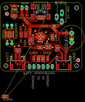

Contents
========

* [PROJ-ADAF-390-STAN-01>USB DC Solar Lithium Ion Polymer charger](#proj-adaf-390-stan-01usb-dc-solar-lithium-ion-polymer-charger)
	* [Images](#images)
	* [OOMP Parts](#oomp-parts)
	* [Tags](#tags)
  
![][im]
# PROJ-ADAF-390-STAN-01>USB DC Solar Lithium Ion Polymer charger

- ID: PROJ-ADAF-390-STAN-01
- Hex ID: PRA390
- Name: USB DC Solar Lithium Ion Polymer charger
- Description: 

## Images
  
  

|eagleImage|kicadPcb3dFront|kicadPcb3dBack|kicadPcb3d|
| :---: | :---: | :---: | :---: |
|||||

## OOMP Parts
  

|OOMP Parts|
| :---: |
|UNMATCHED-UNMATCHED-X-UNMATCHED-01, BATT, 9.524999999999999, 3.8099999999999996, 180,BATT, JST-PH-2-SMT-RA, adafruit, (0.375, 0.15), R180|
|CAPC-0805-X-UNMATCHED-01, C1, 31.241999999999997, 12.7, 90,C1, 10uF, C0805K, adafruit, (1.23, 0.5), R90|
|CAPC-0805-X-UNMATCHED-01, C2, 9.524999999999999, 11.684, 0,C2, 10uF, C0805K, adafruit, (0.375, 0.46), R0|
|UNMATCHED-0805-X-UNMATCHED-01, C3, 16.509999999999998, 17.429999937999998, 270,C3, 10uF/10V, C0805K, adafruit, (0.65, 0.68622047), R270|
|UNMATCHED-UNMATCHED-X-UNMATCHED-01, C4, 39.37, 18.415, 270,C4, 4700uF/10V, E5-13, adafruit, (1.55, 0.725), R270|
|UNMATCHED-0805-X-UNMATCHED-01, CHRG/LBO, 18.415, 6.985, 180,CHRG/LBO, ORANGE, CHIP-LED0805, adafruit, (0.725, 0.275), R180|
|UNMATCHED-UNMATCHED-X-UNMATCHED-01, CN1, 33.841999879999996, 38.253999946, 180,CN1, DCIN, DCJACK_1.3MM_PTH, microbuilder, (1.3323622, 1.50606299), R180|
|UNMATCHED-UNMATCHED-X-UNMATCHED-01, CN4, 22.224999999999998, 33.654999999999994, 180,CN4, USB-MINIB, adafruit, (0.875, 1.325), R180|
|UNMATCHED-UNMATCHED-X-UNMATCHED-01, D1, 29.845, 24.892, 0,D1, MBR120VLSFT1G, SOD-123, microbuilder, (1.175, 0.98), R0|
|ERROR, D2 0 ohm, 0, 0, 0,D2, 0, ohm, R0805, adafruit, (0.1, -0.55), R0|
|UNMATCHED-0805-X-UNMATCHED-01, DONE, 26.034999999999997, 6.985, 180,DONE, GREEN, CHIP-LED0805, adafruit, (1.025, 0.275), R180|
|UNMATCHED-UNMATCHED-X-UNMATCHED-01, IC1, 22.224999999999998, 19.049999999999997, 0,IC1, MCP73871, QFN20_4MM, adafruit, (0.875, 0.75), R0|
|<table><tr><td></td><td> JP1</td><td>[HEAD-I01-X-PI02-01 2.54 mm 2 Pin Header](https://github.com/oomlout/oomlout_OOMP_parts/tree/main/HEAD-I01-X-PI02-01/)</td><td>[H02](https://github.com/oomlout/oomlout_OOMP_parts/tree/main/HEAD-I01-X-PI02-01/)</td></tr></table>|
|<table><tr><td></td><td> JP2</td><td>[HEAD-I01-X-PI02-01 2.54 mm 2 Pin Header](https://github.com/oomlout/oomlout_OOMP_parts/tree/main/HEAD-I01-X-PI02-01/)</td><td>[H02](https://github.com/oomlout/oomlout_OOMP_parts/tree/main/HEAD-I01-X-PI02-01/)</td></tr></table>|
|<table><tr><td></td><td> JP3</td><td>[HEAD-I01-X-PI02-01 2.54 mm 2 Pin Header](https://github.com/oomlout/oomlout_OOMP_parts/tree/main/HEAD-I01-X-PI02-01/)</td><td>[H02](https://github.com/oomlout/oomlout_OOMP_parts/tree/main/HEAD-I01-X-PI02-01/)</td></tr></table>|
|<table><tr><td></td><td> JP4</td><td>[HEAD-I01-X-PI02-01 2.54 mm 2 Pin Header](https://github.com/oomlout/oomlout_OOMP_parts/tree/main/HEAD-I01-X-PI02-01/)</td><td>[H02](https://github.com/oomlout/oomlout_OOMP_parts/tree/main/HEAD-I01-X-PI02-01/)</td></tr></table>|
|UNMATCHED-UNMATCHED-X-UNMATCHED-01, LOAD, 34.925, 3.8099999999999996, 180,LOAD, JST-PH-2-SMT-RA, adafruit, (1.375, 0.15), R180|
|UNMATCHED-0805-X-UNMATCHED-01, PWR, 7.5089999679999995, 36.129999876, 270,PWR, RED, CHIP-LED0805, adafruit, (0.29562992, 1.42244094), R270|
|RESE-0805-X-O274-01, R2, 21.779999873999998, 13.160000096000001, 0,R2, 270K, R0805, adafruit, (0.85748031, 0.51811024), R0|
|RESE-0805-X-O104-01, R3, 26.495000096000002, 13.160000096000001, 180,R3, 100K, R0805, adafruit, (1.04311024, 0.51811024), R180|
|RESE-0805-X-UNMATCHED-01, R5, 11.43, 20.32, 270,R5, 1K, M0805, adafruit, (0.45, 0.8), R270|
|RESE-0805-X-UNMATCHED-01, R8, 20.955, 6.985, 270,R8, 1K, R0805, adafruit, (0.825, 0.275), R270|
|RESE-0805-X-UNMATCHED-01, R9, 23.495, 6.985, 270,R9, 1K, R0805, adafruit, (0.925, 0.275), R270|
|RESE-0805-X-UNMATCHED-01, R10, 7.5089999679999995, 30.668999875999997, 0,R10, 1K, R0805, adafruit, (0.29562992, 1.20744094), R0|
|RESE-0805-X-UNMATCHED-01, R11, 3.8099999999999996, 20.32, 270,R11, 2K, 0805-THM, adafruit, (0.15, 0.8), R270|
|RESE-0805-X-O104-01, R12, 28.701999999999995, 18.748000096, 90,R12, 100K, R0805, adafruit, (1.13, 0.73811024), R90|
|UNMATCHED-0805-X-UNMATCHED-01, RT2, 13.97, 20.32, 270,RT2, 150K, M0805, adafruit, (0.55, 0.8), R270|
|UNMATCHED-0805-X-UNMATCHED-01, THERM, 6.35, 20.32, 270,THERM, 10K, 0805-THM, adafruit, (0.25, 0.8), R270|

## Tags

- hexID: PRA390
- oompType: PROJ
- oompSize: ADAF
- oompColor: 390
- oompDesc: STAN
- oompIndex: 01
- oompName: USB DC Solar Lithium Ion Polymer charger
- sources: All source files from https://github.com/adafruit/USB-DC-Solar-Lithium-Ion-Polymer-charger (source licence details in srcLicense.md)
- linkBuyPage: http://www.adafruit.com/products/390
- oompID: PROJ-ADAF-390-STAN-01
- oompPart: UNMATCHED-UNMATCHED-X-UNMATCHED-01, BATT, 9.524999999999999, 3.8099999999999996, 180
- oompPart: CAPC-0805-X-UNMATCHED-01, C1, 31.241999999999997, 12.7, 90
- oompPart: CAPC-0805-X-UNMATCHED-01, C2, 9.524999999999999, 11.684, 0
- oompPart: UNMATCHED-0805-X-UNMATCHED-01, C3, 16.509999999999998, 17.429999937999998, 270
- oompPart: UNMATCHED-UNMATCHED-X-UNMATCHED-01, C4, 39.37, 18.415, 270
- oompPart: UNMATCHED-0805-X-UNMATCHED-01, CHRG/LBO, 18.415, 6.985, 180
- oompPart: UNMATCHED-UNMATCHED-X-UNMATCHED-01, CN1, 33.841999879999996, 38.253999946, 180
- oompPart: UNMATCHED-UNMATCHED-X-UNMATCHED-01, CN4, 22.224999999999998, 33.654999999999994, 180
- oompPart: UNMATCHED-UNMATCHED-X-UNMATCHED-01, D1, 29.845, 24.892, 0
- oompPart: ERROR, D2 0 ohm, 0, 0, 0
- oompPart: UNMATCHED-0805-X-UNMATCHED-01, DONE, 26.034999999999997, 6.985, 180
- oompPart: UNMATCHED-UNMATCHED-X-UNMATCHED-01, IC1, 22.224999999999998, 19.049999999999997, 0
- oompPart: HEAD-I01-X-PI02-01, JP1, 13.208, 35.05199999999999, 180
- oompPart: HEAD-I01-X-PI02-01, JP2, 22.224999999999998, 2.54, 0
- oompPart: HEAD-I01-X-PI02-01, JP3, 27.304999999999996, 2.54, 0
- oompPart: HEAD-I01-X-PI02-01, JP4, 17.145, 2.54, 0
- oompPart: UNMATCHED-UNMATCHED-X-UNMATCHED-01, LOAD, 34.925, 3.8099999999999996, 180
- oompPart: UNMATCHED-0805-X-UNMATCHED-01, PWR, 7.5089999679999995, 36.129999876, 270
- oompPart: RESE-0805-X-O274-01, R2, 21.779999873999998, 13.160000096000001, 0
- oompPart: RESE-0805-X-O104-01, R3, 26.495000096000002, 13.160000096000001, 180
- oompPart: RESE-0805-X-UNMATCHED-01, R5, 11.43, 20.32, 270
- oompPart: RESE-0805-X-UNMATCHED-01, R8, 20.955, 6.985, 270
- oompPart: RESE-0805-X-UNMATCHED-01, R9, 23.495, 6.985, 270
- oompPart: RESE-0805-X-UNMATCHED-01, R10, 7.5089999679999995, 30.668999875999997, 0
- oompPart: RESE-0805-X-UNMATCHED-01, R11, 3.8099999999999996, 20.32, 270
- oompPart: RESE-0805-X-O104-01, R12, 28.701999999999995, 18.748000096, 90
- oompPart: UNMATCHED-0805-X-UNMATCHED-01, RT2, 13.97, 20.32, 270
- oompPart: UNMATCHED-0805-X-UNMATCHED-01, THERM, 6.35, 20.32, 270
- oompPart: SKIP-UNMATCHED-X-UNMATCHED-01, U$2, 3.556, 31.75, 0
- oompPart: SKIP-UNMATCHED-X-UNMATCHED-01, U$3, 42.925999999999995, 6.095999999999999, 0
- rawPart: BATT, JST-PH-2-SMT-RA, adafruit, (0.375, 0.15), R180
- rawPart: C1, 10uF, C0805K, adafruit, (1.23, 0.5), R90
- rawPart: C2, 10uF, C0805K, adafruit, (0.375, 0.46), R0
- rawPart: C3, 10uF/10V, C0805K, adafruit, (0.65, 0.68622047), R270
- rawPart: C4, 4700uF/10V, E5-13, adafruit, (1.55, 0.725), R270
- rawPart: CHRG/LBO, ORANGE, CHIP-LED0805, adafruit, (0.725, 0.275), R180
- rawPart: CN1, DCIN, DCJACK_1.3MM_PTH, microbuilder, (1.3323622, 1.50606299), R180
- rawPart: CN4, USB-MINIB, adafruit, (0.875, 1.325), R180
- rawPart: D1, MBR120VLSFT1G, SOD-123, microbuilder, (1.175, 0.98), R0
- rawPart: D2, 0, ohm, R0805, adafruit, (0.1, -0.55), R0
- rawPart: DONE, GREEN, CHIP-LED0805, adafruit, (1.025, 0.275), R180
- rawPart: IC1, MCP73871, QFN20_4MM, adafruit, (0.875, 0.75), R0
- rawPart: JP1, DCIN, 1X02_OVAL, microbuilder, (0.52, 1.38), R180
- rawPart: JP2, STATUS, 1X02_OVAL, microbuilder, (0.875, 0.1), R0
- rawPart: JP3, LOAD, 1X02_OVAL, microbuilder, (1.075, 0.1), R0
- rawPart: JP4, BATT, 1X02_OVAL, microbuilder, (0.675, 0.1), R0
- rawPart: LOAD, JST-PH-2-SMT-RA, adafruit, (1.375, 0.15), R180
- rawPart: PWR, RED, CHIP-LED0805, adafruit, (0.29562992, 1.42244094), R270
- rawPart: R2, 270K, R0805, adafruit, (0.85748031, 0.51811024), R0
- rawPart: R3, 100K, R0805, adafruit, (1.04311024, 0.51811024), R180
- rawPart: R5, 1K, M0805, adafruit, (0.45, 0.8), R270
- rawPart: R8, 1K, R0805, adafruit, (0.825, 0.275), R270
- rawPart: R9, 1K, R0805, adafruit, (0.925, 0.275), R270
- rawPart: R10, 1K, R0805, adafruit, (0.29562992, 1.20744094), R0
- rawPart: R11, 2K, 0805-THM, adafruit, (0.15, 0.8), R270
- rawPart: R12, 100K, R0805, adafruit, (1.13, 0.73811024), R90
- rawPart: RT2, 150K, M0805, adafruit, (0.55, 0.8), R270
- rawPart: THERM, 10K, 0805-THM, adafruit, (0.25, 0.8), R270
- rawPart: U$2, FIDUCIAL, FIDUCIAL_1MM, adafruit, (0.14, 1.25), R0
- rawPart: U$3, FIDUCIAL, FIDUCIAL_1MM, adafruit, (1.69, 0.24), R0

[im]: kicadPcb3d_450.png
