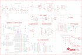

Contents
========

* [PRA3900 > Adafruit](#pra3900--adafruit)
	* [Schematic](#schematic)
	* [Interactive BOM](#interactive-bom)
	* [OOMP Parts](#oomp-parts)
	* [Images](#images)
	* [Tags](#tags)
  
![][im]
# PRA3900 > Adafruit

- ID: PROJ-ADAF-3900-STAN-01
- Hex ID: PRA3900
- Name: Adafruit
- Description: Adafruit
- Long Link: [http://oom.lt/PROJ-ADAF-3900-STAN-01](http://oom.lt/PROJ-ADAF-3900-STAN-01)
- Short Link: [http://oom.lt/PRA3900](http://oom.lt/PRA3900)

## Schematic
  

## Interactive BOM

- Interactive BOM page: [ibom.html](https://htmlpreview.github.io/?https://github.com/oomlout/oomlout_OOMP_projects/blob/main/PROJ-ADAF-3900-STAN-01/kicad/bom/ibom.html)

## OOMP Parts
  

|OOMP Parts|
| :---: |
|C1,CAPC-0603-X-UF1-01,C1,1uF,CAP_CERAMIC0603_NO,0603-NO,Ceramic Capacitors,,|
|C2,CAPC-0603-X-UF1-01,C2,1uF,CAP_CERAMIC0603_NO,0603-NO,Ceramic Capacitors,,|
|C3,CAPC-0805-X-UNMATCHED-01,C3,10µF,CAP_CERAMIC0805-NOOUTLINE,0805-NO,Ceramic Capacitors,,|
|C4,CAPC-0603-X-UF1-01,C4,1uF,CAP_CERAMIC0603_NO,0603-NO,Ceramic Capacitors,,|
|C5,CAPC-0805-X-UF10-V10,C5,10uF,CAP_CERAMIC0805-NOOUTLINE,0805-NO,Ceramic Capacitors,,|
|C6,CAPC-0805-X-UNMATCHED-01,C6,10µF,CAP_CERAMIC0805-NOOUTLINE,0805-NO,Ceramic Capacitors,,|
|C7,CAPC-0603-X-UF1-01,C7,1uF,CAP_CERAMIC0603_NO,0603-NO,Ceramic Capacitors,,|
|C8,CAPC-UNMATCHED-X-UNMATCHED-01,C8,10µF,CAP_CERAMIC0805_10MGAP,0805_10MGAP,Ceramic Capacitors,,|
|C9,CAPC-0603-X-UF1-01,C9,1uF,CAP_CERAMIC0603_NO,0603-NO,Ceramic Capacitors,,|
|C10,CAPC-0805-X-UF10-V10,C10,10uF,CAP_CERAMIC0805-NOOUTLINE,0805-NO,Ceramic Capacitors,,|
|C11,CAPC-UNMATCHED-X-UF10-01,C11,10uF,CAP_CERAMIC0805_10MGAP,0805_10MGAP,Ceramic Capacitors,,|
|C13,CAPC-0603-X-UF1-01,C13,1uF,CAP_CERAMIC0603_NO,0603-NO,Ceramic Capacitors,,|
|C14,CAPC-0603-X-UF1-01,C14,1uF,CAP_CERAMIC0603_NO,0603-NO,Ceramic Capacitors,,|
|C15,CAPC-0805-X-UF10-V10,C15,10uF,CAP_CERAMIC0805-NOOUTLINE,0805-NO,Ceramic Capacitors,,|
|CHG,LEDS-0805-G-STAN-01,CHG,ORANGE,LED0805_NOOUTLINE,CHIPLED_0805_NOOUTLINE,LED,,|
|D1,DIOD-S323-X-UNMATCHED-01,D1,3.6V,DIODE-ZENERSOD323,SOD-323,Zener Diode,,|
|D2,DIOD-S323-X-UNMATCHED-01,D2,3.6V,DIODE-ZENERSOD323,SOD-323,Zener Diode,,|
|D4,DIOD-UNMATCHED-X-UNMATCHED-01,D4,MBR120,DIODE-SCHOTTKYSOD-123,SOD-123,,,|
|I2C,UNMATCHED-UNMATCHED-X-UNMATCHED-01,I2C,JST PH 4,STEMMA_I2C_RASMT,JSTPH4,,,|
|IC4,UNMATCHED-UNMATCHED-X-UNMATCHED-01,IC4,LIS3DH,ACCEL_LIS3DHTR,LGA16_3X3MM,LIS3DHTR 3-Axis Accelerometer with I2C/SPI Interface,,|
|L,LEDS-0805-G-STAN-01,L,RED,LED0805_NOOUTLINE,CHIPLED_0805_NOOUTLINE,LED,,|
|LED1,UNMATCHED-UNMATCHED-X-UNMATCHED-01,LED1,WS2812B3535,WS2812B3535,LED3535,,,|
|MS1,UNMATCHED-UNMATCHED-X-UNMATCHED-01,MS1,FEATHERWING_SMTDUALNOHOLES,FEATHERWING_SMTDUALNOHOLES,FEATHERWING_SMT_NOHOLES,,,|
|NEOPIXEL,UNMATCHED-UNMATCHED-X-UNMATCHED-01,NEOPIXEL,JST PH 3,CON_JST_PH_3PIN,JSTPH3,,,|
|PIR,UNMATCHED-UNMATCHED-X-UNMATCHED-01,PIR,JST PH 3,CON_JST_PH_3PIN,JSTPH3,,,|
|Q1,MOSP-SO23-X-UNMATCHED-01,Q1,DMG341,MOSFET-P,SOT23-R,P-Channel Mosfet,,|
|Q2,MOSP-SO23-X-UNMATCHED-01,Q2,DMG341,MOSFET-P,SOT23-R,P-Channel Mosfet,,|
|Q3,MOSN-SO23-X-KBSS138-01,Q3,BSS138,MOSFET-NWIDE,SOT23-WIDE,N-Channel Mosfet,,|
|R1,RESE-UNMATCHED-X-O1003-01,R1,100K,RESISTOR_4PACK,RESPACK_4X0603,Resistor Packs (4 resistors),,|
|R2,RESE-0603-X-O102-01,R2,1K,RESISTOR_0603_NOOUT,0603-NO,Resistors,,|
|R3,RESE-0603-X-O103-01,R3,10K,RESISTOR_0603_NOOUT,0603-NO,Resistors,,|
|R4,RESE-UNMATCHED-X-O103-01,R4,10K,RESISTOR_4PACK,RESPACK_4X0603,Resistor Packs (4 resistors),,|
|R5,RESE-0603-X-O102-01,R5,1K,RESISTOR_0603_NOOUT,0603-NO,Resistors,,|
|R6,RESE-0603-X-O102-01,R6,1K,RESISTOR_0603_NOOUT,0603-NO,Resistors,,|
|R7,RESE-0603-X-UNMATCHED-01,R7,2.2K,RESISTOR_0603_NOOUT,0603-NO,Resistors,,|
|R8,RESE-0603-X-O103-01,R8,10K,RESISTOR_0603_NOOUT,0603-NO,Resistors,,|
|R9,RESE-UNMATCHED-X-O103-01,R9,10K,RESISTOR_4PACK,RESPACK_4X0603,Resistor Packs (4 resistors),,|
|R12,RESE-0603-X-O101-01,R12,100,RESISTOR_0603_NOOUT,0603-NO,Resistors,,|
|R13,RESE-0603-X-O101-01,R13,100,RESISTOR_0603_NOOUT,0603-NO,Resistors,,|
|SW1,UNMATCHED-UNMATCHED-X-UNMATCHED-01,SJ1,,SOLDERJUMPER_2WAY,SOLDERJUMPER_2WAY_OPEN_NOPASTE,2-Way Solder Jumper,,|
|SW2,UNMATCHED-UNMATCHED-X-UNMATCHED-01,SW1,SPST_TACT-KMR2,SPST_TACT-KMR2,KMR2,SMT 6mm switch, EVQQ2 series,,|
|TFT,UNMATCHED-UNMATCHED-X-UNMATCHED-01,SW2,Slide Switch,SWITCH_DPDTEG1390,EG1390,Switch - DPDT,,|
|TP1,UNMATCHED-UNMATCHED-X-UNMATCHED-01,TFT,DISP_LCD_ST7735_1.44IN,DISP_LCD_ST7735_1.44IN,TFT_1.44IN_128_128,,,|
|TP2,UNMATCHED-UNMATCHED-X-UNMATCHED-01,TP1,,TESTPOINTROUND1.5MM,TESTPOINT_ROUND_1.5MM,Test Point,,|
|TP3,UNMATCHED-UNMATCHED-X-UNMATCHED-01,TP2,,TESTPOINTROUND1.5MM,TESTPOINT_ROUND_1.5MM,Test Point,,|
|TP4,UNMATCHED-UNMATCHED-X-UNMATCHED-01,TP3,SEWTAP_ALLILONG,SEWTAP_ALLILONG,PCB_ALLI_LONG,,,|
|TP5,UNMATCHED-UNMATCHED-X-UNMATCHED-01,TP4,SEWTAPPCB_ALLIGATOR,SEWTAPPCB_ALLIGATOR,PCB_ALLI,,,|
|TP28,UNMATCHED-UNMATCHED-X-UNMATCHED-01,TP5,,TESTPOINTROUND1.5MM,TESTPOINT_ROUND_1.5MM,Test Point,,|
|TP29,UNMATCHED-UNMATCHED-X-UNMATCHED-01,TP28,SEWTAPPCB_ALLIGATOR,SEWTAPPCB_ALLIGATOR,PCB_ALLI,,,|
|U$4,UNMATCHED-UNMATCHED-X-UNMATCHED-01,TP29,SEWTAP_ALLILONG,SEWTAP_ALLILONG,PCB_ALLI_LONG,,,|
|U$13,UNMATCHED-UNMATCHED-X-UNMATCHED-01,U$4,ATSAMD21G18_QFN,ATSAMD21G_QFN,TQFN48_7MM,,,|
|U1,UNMATCHED-UNMATCHED-X-UNMATCHED-01,U$13,CON_MOLEX_2P,CON_MOLEX_2P,53398-0271,,,|
|U2,UNMATCHED-SO235-X-UNMATCHED-01,U$31,MOUNTINGHOLE2.5,MOUNTINGHOLE2.5,MOUNTINGHOLE_2.5_PLATED,Mounting Hole,EXCLUDE,|
|U3,UNMATCHED-SO235-X-UNMATCHED-01,U$32,MOUNTINGHOLE2.5,MOUNTINGHOLE2.5,MOUNTINGHOLE_2.5_PLATED,Mounting Hole,EXCLUDE,|
|U4,UNMATCHED-UNMATCHED-X-UNMATCHED-01,U$34,FIDUCIAL_1MM,FIDUCIAL_1MM,FIDUCIAL_1MM,Fiducial Alignment Points,EXCLUDE,|
|U5,UNMATCHED-UNMATCHED-X-UNMATCHED-01,U$35,FIDUCIAL_1MM,FIDUCIAL_1MM,FIDUCIAL_1MM,Fiducial Alignment Points,EXCLUDE,|
|VR2,UNMATCHED-UNMATCHED-X-UNMATCHED-01,U1,2MB Flash,SPIFLASH_8PIN208MIL,SOIC8_208MIL,SOIC8 SPI Flash,,|
|X1,UNMATCHED-UNMATCHED-X-UNMATCHED-01,U2,AP2112-3.3,VREG_SOT23-5,SOT23-5,SOT23-5 Fixed Voltage Regulators,,|
|X3,UNMATCHED-UNMATCHED-X-UNMATCHED-01,U3,MCP73831T-2ACI/OT,MCP73831/2,SOT23-5,MCP73831/2 LIPO Charger,,|
|X6,UNMATCHED-UNMATCHED-X-UNMATCHED-01,U4,ALS-PT21,PHOTOTRANSISTOR_PT26-21C,ALS-PT26-21C,ALS-PT19-315C - Analog Light Sensor,,|

## Images
  
  

|kicadPcb3d|kicadPcb3dFront|kicadPcb3dBack|eagleImage|eagleSchemImage|
| :---: | :---: | :---: | :---: | :---: |
||||||

## Tags

- hexID: PRA3900
- oompType: PROJ
- oompSize: ADAF
- oompColor: 3900
- oompDesc: STAN
- oompIndex: 01
- oompName: Adafruit Hallowing M0 PCB
- sources: All source files from https://github.com/adafruit/Adafruit-Hallowing-M0-PCB (source licence details in srcLicense.md)
- linkBuyPage: http://www.adafruit.com/products/3900
- oompID: PROJ-ADAF-3900-STAN-01
- oompParts: C1,CAPC-0603-X-UF1-01
- oompParts: C2,CAPC-0603-X-UF1-01
- oompParts: C3,CAPC-0805-X-UNMATCHED-01
- oompParts: C4,CAPC-0603-X-UF1-01
- oompParts: C5,CAPC-0805-X-UF10-V10
- oompParts: C6,CAPC-0805-X-UNMATCHED-01
- oompParts: C7,CAPC-0603-X-UF1-01
- oompParts: C8,CAPC-UNMATCHED-X-UNMATCHED-01
- oompParts: C9,CAPC-0603-X-UF1-01
- oompParts: C10,CAPC-0805-X-UF10-V10
- oompParts: C11,CAPC-UNMATCHED-X-UF10-01
- oompParts: C13,CAPC-0603-X-UF1-01
- oompParts: C14,CAPC-0603-X-UF1-01
- oompParts: C15,CAPC-0805-X-UF10-V10
- oompParts: CHG,LEDS-0805-G-STAN-01
- oompParts: D1,DIOD-S323-X-UNMATCHED-01
- oompParts: D2,DIOD-S323-X-UNMATCHED-01
- oompParts: D4,DIOD-UNMATCHED-X-UNMATCHED-01
- oompParts: I2C,UNMATCHED-UNMATCHED-X-UNMATCHED-01
- oompParts: IC4,UNMATCHED-UNMATCHED-X-UNMATCHED-01
- oompParts: L,LEDS-0805-G-STAN-01
- oompParts: LED1,UNMATCHED-UNMATCHED-X-UNMATCHED-01
- oompParts: MS1,UNMATCHED-UNMATCHED-X-UNMATCHED-01
- oompParts: NEOPIXEL,UNMATCHED-UNMATCHED-X-UNMATCHED-01
- oompParts: PIR,UNMATCHED-UNMATCHED-X-UNMATCHED-01
- oompParts: Q1,MOSP-SO23-X-UNMATCHED-01
- oompParts: Q2,MOSP-SO23-X-UNMATCHED-01
- oompParts: Q3,MOSN-SO23-X-KBSS138-01
- oompParts: R1,RESE-UNMATCHED-X-O1003-01
- oompParts: R2,RESE-0603-X-O102-01
- oompParts: R3,RESE-0603-X-O103-01
- oompParts: R4,RESE-UNMATCHED-X-O103-01
- oompParts: R5,RESE-0603-X-O102-01
- oompParts: R6,RESE-0603-X-O102-01
- oompParts: R7,RESE-0603-X-UNMATCHED-01
- oompParts: R8,RESE-0603-X-O103-01
- oompParts: R9,RESE-UNMATCHED-X-O103-01
- oompParts: R12,RESE-0603-X-O101-01
- oompParts: R13,RESE-0603-X-O101-01
- oompParts: SW1,UNMATCHED-UNMATCHED-X-UNMATCHED-01
- oompParts: SW2,UNMATCHED-UNMATCHED-X-UNMATCHED-01
- oompParts: TFT,UNMATCHED-UNMATCHED-X-UNMATCHED-01
- oompParts: TP1,UNMATCHED-UNMATCHED-X-UNMATCHED-01
- oompParts: TP2,UNMATCHED-UNMATCHED-X-UNMATCHED-01
- oompParts: TP3,UNMATCHED-UNMATCHED-X-UNMATCHED-01
- oompParts: TP4,UNMATCHED-UNMATCHED-X-UNMATCHED-01
- oompParts: TP5,UNMATCHED-UNMATCHED-X-UNMATCHED-01
- oompParts: TP28,UNMATCHED-UNMATCHED-X-UNMATCHED-01
- oompParts: TP29,UNMATCHED-UNMATCHED-X-UNMATCHED-01
- oompParts: U$4,UNMATCHED-UNMATCHED-X-UNMATCHED-01
- oompParts: U$13,UNMATCHED-UNMATCHED-X-UNMATCHED-01
- oompParts: U1,UNMATCHED-UNMATCHED-X-UNMATCHED-01
- oompParts: U2,UNMATCHED-SO235-X-UNMATCHED-01
- oompParts: U3,UNMATCHED-SO235-X-UNMATCHED-01
- oompParts: U4,UNMATCHED-UNMATCHED-X-UNMATCHED-01
- oompParts: U5,UNMATCHED-UNMATCHED-X-UNMATCHED-01
- oompParts: VR2,UNMATCHED-UNMATCHED-X-UNMATCHED-01
- oompParts: X1,UNMATCHED-UNMATCHED-X-UNMATCHED-01
- oompParts: X3,UNMATCHED-UNMATCHED-X-UNMATCHED-01
- oompParts: X6,UNMATCHED-UNMATCHED-X-UNMATCHED-01
- rawParts: C1,1uF,CAP_CERAMIC0603_NO,0603-NO,Ceramic Capacitors,,
- rawParts: C2,1uF,CAP_CERAMIC0603_NO,0603-NO,Ceramic Capacitors,,
- rawParts: C3,10µF,CAP_CERAMIC0805-NOOUTLINE,0805-NO,Ceramic Capacitors,,
- rawParts: C4,1uF,CAP_CERAMIC0603_NO,0603-NO,Ceramic Capacitors,,
- rawParts: C5,10uF,CAP_CERAMIC0805-NOOUTLINE,0805-NO,Ceramic Capacitors,,
- rawParts: C6,10µF,CAP_CERAMIC0805-NOOUTLINE,0805-NO,Ceramic Capacitors,,
- rawParts: C7,1uF,CAP_CERAMIC0603_NO,0603-NO,Ceramic Capacitors,,
- rawParts: C8,10µF,CAP_CERAMIC0805_10MGAP,0805_10MGAP,Ceramic Capacitors,,
- rawParts: C9,1uF,CAP_CERAMIC0603_NO,0603-NO,Ceramic Capacitors,,
- rawParts: C10,10uF,CAP_CERAMIC0805-NOOUTLINE,0805-NO,Ceramic Capacitors,,
- rawParts: C11,10uF,CAP_CERAMIC0805_10MGAP,0805_10MGAP,Ceramic Capacitors,,
- rawParts: C13,1uF,CAP_CERAMIC0603_NO,0603-NO,Ceramic Capacitors,,
- rawParts: C14,1uF,CAP_CERAMIC0603_NO,0603-NO,Ceramic Capacitors,,
- rawParts: C15,10uF,CAP_CERAMIC0805-NOOUTLINE,0805-NO,Ceramic Capacitors,,
- rawParts: CHG,ORANGE,LED0805_NOOUTLINE,CHIPLED_0805_NOOUTLINE,LED,,
- rawParts: D1,3.6V,DIODE-ZENERSOD323,SOD-323,Zener Diode,,
- rawParts: D2,3.6V,DIODE-ZENERSOD323,SOD-323,Zener Diode,,
- rawParts: D4,MBR120,DIODE-SCHOTTKYSOD-123,SOD-123,,,
- rawParts: I2C,JST PH 4,STEMMA_I2C_RASMT,JSTPH4,,,
- rawParts: IC4,LIS3DH,ACCEL_LIS3DHTR,LGA16_3X3MM,LIS3DHTR 3-Axis Accelerometer with I2C/SPI Interface,,
- rawParts: L,RED,LED0805_NOOUTLINE,CHIPLED_0805_NOOUTLINE,LED,,
- rawParts: LED1,WS2812B3535,WS2812B3535,LED3535,,,
- rawParts: MS1,FEATHERWING_SMTDUALNOHOLES,FEATHERWING_SMTDUALNOHOLES,FEATHERWING_SMT_NOHOLES,,,
- rawParts: NEOPIXEL,JST PH 3,CON_JST_PH_3PIN,JSTPH3,,,
- rawParts: PIR,JST PH 3,CON_JST_PH_3PIN,JSTPH3,,,
- rawParts: Q1,DMG341,MOSFET-P,SOT23-R,P-Channel Mosfet,,
- rawParts: Q2,DMG341,MOSFET-P,SOT23-R,P-Channel Mosfet,,
- rawParts: Q3,BSS138,MOSFET-NWIDE,SOT23-WIDE,N-Channel Mosfet,,
- rawParts: R1,100K,RESISTOR_4PACK,RESPACK_4X0603,Resistor Packs (4 resistors),,
- rawParts: R2,1K,RESISTOR_0603_NOOUT,0603-NO,Resistors,,
- rawParts: R3,10K,RESISTOR_0603_NOOUT,0603-NO,Resistors,,
- rawParts: R4,10K,RESISTOR_4PACK,RESPACK_4X0603,Resistor Packs (4 resistors),,
- rawParts: R5,1K,RESISTOR_0603_NOOUT,0603-NO,Resistors,,
- rawParts: R6,1K,RESISTOR_0603_NOOUT,0603-NO,Resistors,,
- rawParts: R7,2.2K,RESISTOR_0603_NOOUT,0603-NO,Resistors,,
- rawParts: R8,10K,RESISTOR_0603_NOOUT,0603-NO,Resistors,,
- rawParts: R9,10K,RESISTOR_4PACK,RESPACK_4X0603,Resistor Packs (4 resistors),,
- rawParts: R12,100,RESISTOR_0603_NOOUT,0603-NO,Resistors,,
- rawParts: R13,100,RESISTOR_0603_NOOUT,0603-NO,Resistors,,
- rawParts: SJ1,,SOLDERJUMPER_2WAY,SOLDERJUMPER_2WAY_OPEN_NOPASTE,2-Way Solder Jumper,,
- rawParts: SW1,SPST_TACT-KMR2,SPST_TACT-KMR2,KMR2,SMT 6mm switch, EVQQ2 series,,
- rawParts: SW2,Slide Switch,SWITCH_DPDTEG1390,EG1390,Switch - DPDT,,
- rawParts: TFT,DISP_LCD_ST7735_1.44IN,DISP_LCD_ST7735_1.44IN,TFT_1.44IN_128_128,,,
- rawParts: TP1,,TESTPOINTROUND1.5MM,TESTPOINT_ROUND_1.5MM,Test Point,,
- rawParts: TP2,,TESTPOINTROUND1.5MM,TESTPOINT_ROUND_1.5MM,Test Point,,
- rawParts: TP3,SEWTAP_ALLILONG,SEWTAP_ALLILONG,PCB_ALLI_LONG,,,
- rawParts: TP4,SEWTAPPCB_ALLIGATOR,SEWTAPPCB_ALLIGATOR,PCB_ALLI,,,
- rawParts: TP5,,TESTPOINTROUND1.5MM,TESTPOINT_ROUND_1.5MM,Test Point,,
- rawParts: TP28,SEWTAPPCB_ALLIGATOR,SEWTAPPCB_ALLIGATOR,PCB_ALLI,,,
- rawParts: TP29,SEWTAP_ALLILONG,SEWTAP_ALLILONG,PCB_ALLI_LONG,,,
- rawParts: U$4,ATSAMD21G18_QFN,ATSAMD21G_QFN,TQFN48_7MM,,,
- rawParts: U$13,CON_MOLEX_2P,CON_MOLEX_2P,53398-0271,,,
- rawParts: U$31,MOUNTINGHOLE2.5,MOUNTINGHOLE2.5,MOUNTINGHOLE_2.5_PLATED,Mounting Hole,EXCLUDE,
- rawParts: U$32,MOUNTINGHOLE2.5,MOUNTINGHOLE2.5,MOUNTINGHOLE_2.5_PLATED,Mounting Hole,EXCLUDE,
- rawParts: U$34,FIDUCIAL_1MM,FIDUCIAL_1MM,FIDUCIAL_1MM,Fiducial Alignment Points,EXCLUDE,
- rawParts: U$35,FIDUCIAL_1MM,FIDUCIAL_1MM,FIDUCIAL_1MM,Fiducial Alignment Points,EXCLUDE,
- rawParts: U1,2MB Flash,SPIFLASH_8PIN208MIL,SOIC8_208MIL,SOIC8 SPI Flash,,
- rawParts: U2,AP2112-3.3,VREG_SOT23-5,SOT23-5,SOT23-5 Fixed Voltage Regulators,,
- rawParts: U3,MCP73831T-2ACI/OT,MCP73831/2,SOT23-5,MCP73831/2 LIPO Charger,,
- rawParts: U4,ALS-PT21,PHOTOTRANSISTOR_PT26-21C,ALS-PT26-21C,ALS-PT19-315C - Analog Light Sensor,,
- rawParts: U5,PAM8302AASCR,AUDIOAMP_PAM8302A,MSOP8_0.65MM,PAM8302A - 2.5W Class-D Mono Audio Amplifier,,
- rawParts: VR2,10K trim,TRIMPOT3303W/X,TRIMPOT_BOURNS_3303W,3-Pin SMT Trimpots,,
- rawParts: X1,JSTPH,CON_JST_PH_2PIN,JSTPH2,JST 2-Pin Right-Angle Connector,,
- rawParts: X3,microUSB,USB_MICRO_20329_V2,4UCONN_20329_V2,USB Connectors,,
- rawParts: X6,CON_JST_PH_2PIN_MTPH2,CON_JST_PH_2PIN_MTPH2,JSTPH2,,,

[im]: kicadPcb3d_450.png
