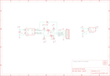

Contents
========

* [PRA391 > Adafruit BMP085 PCB](#pra391--adafruit-bmp085-pcb)
	* [Schematic](#schematic)
	* [PCB](#pcb)
	* [OOMP Parts](#oomp-parts)
	* [Images](#images)
	* [Tags](#tags)
  
![][im]
# PRA391 > Adafruit BMP085 PCB

- ID: PROJ-ADAF-391-STAN-01
- Hex ID: PRA391
- Name: Adafruit
- Description: Adafruit
- Long Link: [http://oom.lt/PROJ-ADAF-391-STAN-01](http://oom.lt/PROJ-ADAF-391-STAN-01)
- Short Link: [http://oom.lt/PRA391](http://oom.lt/PRA391)

## Schematic
  

## PCB
  

## OOMP Parts
  

|OOMP Parts|
| :---: |
|CAPC-0805-X-UNMATCHED-01 C1, C2|
|[DIOD-S323-X-K4148-01  SMD (SOD-323) Diode  D1](https://github.com/oomlout/oomlout_OOMP_parts/tree/main/DIOD-S323-X-K4148-01/)|
|[HEAD-I01-X-PI07-01  2.54 mm 7 Pin Header  JP2](https://github.com/oomlout/oomlout_OOMP_parts/tree/main/HEAD-I01-X-PI07-01/)|
|[MOSN-SO23-X-KBSS138-01  SMD (SOT-23) BSS138 N-Ch. MOSFET  Q1, Q2](https://github.com/oomlout/oomlout_OOMP_parts/tree/main/MOSN-SO23-X-KBSS138-01/)|
|[RESE-0805-X-O103-01  SMD (0805) 10k Ohm Resistor  R1, R2, R3, R4](https://github.com/oomlout/oomlout_OOMP_parts/tree/main/RESE-0805-X-O103-01/)|
|UNMATCHED-UNMATCHED-X-UNMATCHED-01 U1|
|UNMATCHED-SO235-X-UNMATCHED-01 U2|

## Images
  
  

|kicadPcb3d|kicadPcb3dFront|kicadPcb3dBack|eagleImage|eagleSchemImage|
| :---: | :---: | :---: | :---: | :---: |
||||||

## Tags

- hexID: PRA391
- oompType: PROJ
- oompSize: ADAF
- oompColor: 391
- oompDesc: STAN
- oompIndex: 01
- oompName: Adafruit BMP085 PCB
- sources: All source files from https://github.com/adafruit/Adafruit-BMP085-PCB (source licence details in srcLicense.md)
- linkBuyPage: http://www.adafruit.com/products/391
- oompID: PROJ-ADAF-391-STAN-01
- oompParts: C1,CAPC-0805-X-UNMATCHED-01
- oompParts: C2,CAPC-0805-X-UNMATCHED-01
- oompParts: D1,DIOD-S323-X-K4148-01
- oompParts: JP2,HEAD-I01-X-PI07-01
- oompParts: Q1,MOSN-SO23-X-KBSS138-01
- oompParts: Q2,MOSN-SO23-X-KBSS138-01
- oompParts: R1,RESE-0805-X-O103-01
- oompParts: R2,RESE-0805-X-O103-01
- oompParts: R3,RESE-0805-X-O103-01
- oompParts: R4,RESE-0805-X-O103-01
- oompParts: U1,UNMATCHED-UNMATCHED-X-UNMATCHED-01
- oompParts: U2,UNMATCHED-SO235-X-UNMATCHED-01
- rawParts: C1,1.0uF,C-USC0805,C0805,CAPACITOR, American symbol,,
- rawParts: C2,1.0uF,C-USC0805,C0805,CAPACITOR, American symbol,,
- rawParts: D1,1N4148,DIODESOD-323F,SOD-323F,Diode,,
- rawParts: JP2,Breakout,HEADER-1X7THICKER,1X07_ROUND_76,PIN HEADER,,
- rawParts: Q1,BSS138,MOSFET-NREFLOW,SOT23,N-Channel Mosfet,,
- rawParts: Q2,BSS138,MOSFET-NREFLOW,SOT23,N-Channel Mosfet,,
- rawParts: R1,10K,R-US_R0805,R0805,RESISTOR, American symbol,,
- rawParts: R2,10K,R-US_R0805,R0805,RESISTOR, American symbol,,
- rawParts: R3,10K,R-US_R0805,R0805,RESISTOR, American symbol,,
- rawParts: R4,10K,R-US_R0805,R0805,RESISTOR, American symbol,,
- rawParts: U$1,FIDUCIAL,FIDUCIAL,FIDUCIAL_1MM,For use by pick and place machines to calibrate the vision/machine, 1mm,,
- rawParts: U$7,MOUNTINGHOLE2.0,MOUNTINGHOLE2.0,MOUNTINGHOLE_2.0_PLATED,Mounting Hole,,
- rawParts: U$8,MOUNTINGHOLE2.0,MOUNTINGHOLE2.0,MOUNTINGHOLE_2.0_PLATED,Mounting Hole,,
- rawParts: U$15,FIDUCIAL,FIDUCIAL,FIDUCIAL_1MM,For use by pick and place machines to calibrate the vision/machine, 1mm,,
- rawParts: U1,BMP085,BMP085,BMP085,BMP085 Digital Pressure Sensor,,
- rawParts: U2,RT9193-33GB,VREG_SOT23-5,SOT23-5,SOT23-5 Fixed Voltage Regulators,,

[im]: kicadPcb3d_450.png
