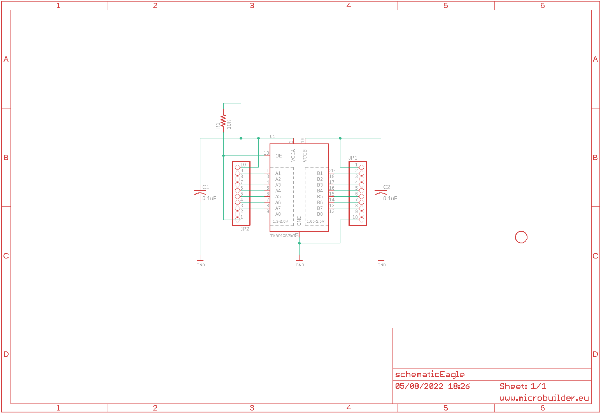
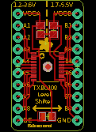
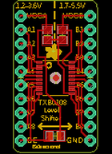
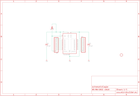

Contents
========

* [PRA395 > Adafruit TXB0108 PCB](#pra395--adafruit-txb0108-pcb)
	* [Schematic](#schematic)
	* [PCB](#pcb)
	* [OOMP Parts](#oomp-parts)
	* [Images](#images)
	* [Tags](#tags)
  
![][im]
# PRA395 > Adafruit TXB0108 PCB

- ID: PROJ-ADAF-395-STAN-01
- Hex ID: PRA395
- Name: Adafruit
- Description: Adafruit
- Long Link: [http://oom.lt/PROJ-ADAF-395-STAN-01](http://oom.lt/PROJ-ADAF-395-STAN-01)
- Short Link: [http://oom.lt/PRA395](http://oom.lt/PRA395)

## Schematic
  

## PCB
  

## OOMP Parts
  

|OOMP ID|Name|Identifier|
| :---: | :---: | :---: |
|[CAPC-0805-X-NF100-V50](https://github.com/oomlout/oomlout_OOMP_parts/tree/main/CAPC-0805-X-NF100-V50/)|[SMD (0805) 100 nF Capacitor (Ceramic) 50v](https://github.com/oomlout/oomlout_OOMP_parts/tree/main/CAPC-0805-X-NF100-V50/)|[C1, C2](https://github.com/oomlout/oomlout_OOMP_parts/tree/main/CAPC-0805-X-NF100-V50/)|
|[HEAD-I01-X-PI10-01](https://github.com/oomlout/oomlout_OOMP_parts/tree/main/HEAD-I01-X-PI10-01/)|[2.54 mm 10 Pin Header](https://github.com/oomlout/oomlout_OOMP_parts/tree/main/HEAD-I01-X-PI10-01/)|[JP1, JP2](https://github.com/oomlout/oomlout_OOMP_parts/tree/main/HEAD-I01-X-PI10-01/)|
|[RESE-0805-X-O103-01](https://github.com/oomlout/oomlout_OOMP_parts/tree/main/RESE-0805-X-O103-01/)|[SMD (0805) 10k Ohm Resistor](https://github.com/oomlout/oomlout_OOMP_parts/tree/main/RESE-0805-X-O103-01/)|[R1](https://github.com/oomlout/oomlout_OOMP_parts/tree/main/RESE-0805-X-O103-01/)|
|UNMATCHED-UNMATCHED-X-UNMATCHED-01||U1|

## Images
  
  

|kicadPcb3d|kicadPcb3dFront|kicadPcb3dBack|eagleImage|eagleSchemImage|
| :---: | :---: | :---: | :---: | :---: |
||||||

## Tags

- hexID: PRA395
- oompType: PROJ
- oompSize: ADAF
- oompColor: 395
- oompDesc: STAN
- oompIndex: 01
- oompName: Adafruit TXB0108 PCB
- sources: All source files from https://github.com/adafruit/Adafruit-TXB0108-PCB (source licence details in srcLicense.md)
- linkBuyPage: http://www.adafruit.com/products/395
- oompID: PROJ-ADAF-395-STAN-01
- oompParts: C1,CAPC-0805-X-NF100-V50
- oompParts: C2,CAPC-0805-X-NF100-V50
- oompParts: JP1,HEAD-I01-X-PI10-01
- oompParts: JP2,HEAD-I01-X-PI10-01
- oompParts: R1,RESE-0805-X-O103-01
- oompParts: U1,UNMATCHED-UNMATCHED-X-UNMATCHED-01
- rawParts: C1,0.1uF,C-USC0805,C0805,CAPACITOR, American symbol,,
- rawParts: C2,0.1uF,C-USC0805,C0805,CAPACITOR, American symbol,,
- rawParts: JP1,,HEADER-1X10THICKER,1X10_ROUND_76,PIN HEADER,,
- rawParts: JP2,,HEADER-1X10THICKER,1X10_ROUND_76,PIN HEADER,,
- rawParts: R1,10K,R-US_R0805,R0805,RESISTOR, American symbol,,
- rawParts: U$6,FIDUCIAL,FIDUCIAL,FIDUCIAL_1MM,For use by pick and place machines to calibrate the vision/machine, 1mm,,
- rawParts: U1,TXB0108PWR,TXB0108PWR,TSSOP20,8-Bit Bi-Directional Level Shifter,,

[im]: kicadPcb3d_450.png
