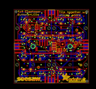
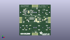
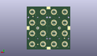
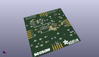

Contents
========

* [PROJ-ADAF-3954-STAN-01>Adafruit NeoTrellis 4x4 PCB](#proj-adaf-3954-stan-01adafruit-neotrellis-4x4-pcb)
	* [Images](#images)
	* [Interactive BOM](#interactive-bom)
	* [OOMP Parts](#oomp-parts)
	* [Tags](#tags)
  
![][im]
# PROJ-ADAF-3954-STAN-01>Adafruit NeoTrellis 4x4 PCB

- ID: PROJ-ADAF-3954-STAN-01
- Hex ID: PRA3954
- Name: Adafruit NeoTrellis 4x4 PCB
- Description: 

## Images
  
  

|eagleImage|kicadPcb3dFront|kicadPcb3dBack|kicadPcb3d|
| :---: | :---: | :---: | :---: |
|||||

## Interactive BOM

- Interactive BOM page: [ibom.html](kicad/bom/ibom.html)

## OOMP Parts
  

|OOMP Parts|
| :---: |
|CAPE-0805-X-UF10-01, C1, 22.098, -3.937, 0,C1, 10u, 0805-NO, microbuilder, (0.87, -0.155), R0|
|CAPE-0805-X-UF10-01, C2, -21.336, -3.8099999999999996, 270,C2, 10u, 0805-NO, microbuilder, (-0.84, -0.15), R270|
|CAPE-0805-X-UF10-01, C3, 1.5239999999999998, -23.868000015999996, 0,C3, 10u, 0805-NO, microbuilder, (0.06, -0.93968504), R0|
|CAPE-0805-X-UF10-01, C4, 3.8099999999999996, 22.733, 90,C4, 10u, 0805-NO, microbuilder, (0.15, 0.895), R90|
|CAPE-0603-X-UNMATCHED-01, C7, -4.4509999879999995, 17.875000063999998, 0,C7, 1uF, 0603-NO, microbuilder, (-0.17523622, 0.70374016), R0|
|CAPE-0805-X-UNMATCHED-01, C8, -5.398000126, 15.245999988, 270,C8, 10uF, 0805-NO, microbuilder, (-0.21251969, 0.60023622), R270|
|UNMATCHED-UNMATCHED-X-UNMATCHED-01, D1, 7.562000115999999, 18.979999885999998, 180,D1, 1N4148, SOD-323, microbuilder, (0.29771654, 0.74724409), R180|
|UNMATCHED-UNMATCHED-X-UNMATCHED-01, D2, -7.435000116, 18.979999885999998, 0,D2, 1N4148, SOD-323, microbuilder, (-0.29271654, 0.74724409), R0|
|UNMATCHED-UNMATCHED-X-UNMATCHED-01, D3, -20.364999909999998, 20.116999897999996, 0,D3, 1N4148, SOD-323, microbuilder, (-0.80177165, 0.79200787), R0|
|UNMATCHED-UNMATCHED-X-UNMATCHED-01, D4, 22.595000021999997, 10.992000114, 180,D4, 1N4148, SOD-323, microbuilder, (0.88956693, 0.43275591), R180|
|UNMATCHED-UNMATCHED-X-UNMATCHED-01, D5, 7.579000082, 10.992000114, 180,D5, 1N4148, SOD-323, microbuilder, (0.29838583, 0.43275591), R180|
|UNMATCHED-UNMATCHED-X-UNMATCHED-01, D6, -7.34100005, 10.992000114, 0,D6, 1N4148, SOD-323, microbuilder, (-0.28901575, 0.43275591), R0|
|UNMATCHED-UNMATCHED-X-UNMATCHED-01, D7, -22.10299999, 10.738000114, 0,D7, 1N4148, SOD-323, microbuilder, (-0.87019685, 0.42275591), R0|
|UNMATCHED-UNMATCHED-X-UNMATCHED-01, D8, 22.654999901999997, -11.006000086, 180,D8, 1N4148, SOD-323, microbuilder, (0.89192913, -0.43330709), R180|
|UNMATCHED-UNMATCHED-X-UNMATCHED-01, D9, 22.548000115999997, 18.965999914, 180,D9, 1N4148, SOD-323, microbuilder, (0.88771654, 0.74669291), R180|
|UNMATCHED-UNMATCHED-X-UNMATCHED-01, D10, 7.6689999019999995, -11.127000098, 180,D10, 1N4148, SOD-323, microbuilder, (0.30192913, -0.43807087), R180|
|UNMATCHED-UNMATCHED-X-UNMATCHED-01, D11, -15.969000066, -11.114000123999999, 180,D11, 1N4148, SOD-323, microbuilder, (-0.62870079, -0.43755906), R180|
|UNMATCHED-UNMATCHED-X-UNMATCHED-01, D12, -22.63099995, -11.141000069999999, 0,D12, 1N4148, SOD-323, microbuilder, (-0.89098425, -0.43862205), R0|
|UNMATCHED-UNMATCHED-X-UNMATCHED-01, D13, 22.453000052, -18.957999929999996, 180,D13, 1N4148, SOD-323, microbuilder, (0.88397638, -0.74637795), R180|
|UNMATCHED-UNMATCHED-X-UNMATCHED-01, D14, 7.594000051999999, -18.963999918, 180,D14, 1N4148, SOD-323, microbuilder, (0.29897638, -0.74661417), R180|
|UNMATCHED-UNMATCHED-X-UNMATCHED-01, D15, -16.916999948, -18.993000113999997, 180,D15, 1N4148, SOD-323, microbuilder, (-0.66602362, -0.74775591), R180|
|UNMATCHED-UNMATCHED-X-UNMATCHED-01, D16, -22.580000052, -18.949999946, 0,D16, 1N4148, SOD-323, microbuilder, (-0.88897638, -0.74606299), R0|
|UNMATCHED-UNMATCHED-X-UNMATCHED-01, IC2, 8.936999906, 1.8970000159999998, 270,IC2, ATSAMD09D14A-MU, QFN24_4MM, microbuilder, (0.35185039, 0.07468504), R270|
|UNMATCHED-UNMATCHED-X-UNMATCHED-01, IC3, 17.272000000000002, 20.32, 90,IC3, 74AHCT1G125DBV, SOT23-5, 74xx-little-us, (0.68, 0.8), R90|
|UNMATCHED-UNMATCHED-X-UNMATCHED-01, JP1, -27.432, 0.0, 90,JP1, 5P_EDGECONNECT, microbuilder, (-1.08, 0), R90|
|UNMATCHED-UNMATCHED-X-UNMATCHED-01, JP2, 27.432, 0.0, 90,JP2, 5P_EDGECONNECT, microbuilder, (1.08, 0), R90|
|UNMATCHED-UNMATCHED-X-UNMATCHED-01, JP3, 0.0, -27.432, 180,JP3, 5P_EDGECONNECT, microbuilder, (0, -1.08), R180|
|UNMATCHED-UNMATCHED-X-UNMATCHED-01, JP4, 0.0, 27.432, 180,JP4, 5P_EDGECONNECT, microbuilder, (0, 1.08), R180|
|UNMATCHED-UNMATCHED-X-UNMATCHED-01, LED1, 22.499999958, 22.499999958, M270,LED1, WS2812B3535, LED3535, microbuilder, (0.88582677, 0.88582677), MR270|
|UNMATCHED-UNMATCHED-X-UNMATCHED-01, LED2, 7.499999985999999, 22.499999958, M270,LED2, WS2812B3535, LED3535, microbuilder, (0.29527559, 0.88582677), MR270|
|UNMATCHED-UNMATCHED-X-UNMATCHED-01, LED3, -7.499999985999999, 22.499999958, M270,LED3, WS2812B3535, LED3535, microbuilder, (-0.29527559, 0.88582677), MR270|
|UNMATCHED-UNMATCHED-X-UNMATCHED-01, LED4, -22.499999958, 22.499999958, M270,LED4, WS2812B3535, LED3535, microbuilder, (-0.88582677, 0.88582677), MR270|
|UNMATCHED-UNMATCHED-X-UNMATCHED-01, LED5, 22.499999958, 7.499999985999999, M270,LED5, WS2812B3535, LED3535, microbuilder, (0.88582677, 0.29527559), MR270|
|UNMATCHED-UNMATCHED-X-UNMATCHED-01, LED6, 7.499999985999999, 7.499999985999999, M270,LED6, WS2812B3535, LED3535, microbuilder, (0.29527559, 0.29527559), MR270|
|UNMATCHED-UNMATCHED-X-UNMATCHED-01, LED7, -7.499999985999999, 7.499999985999999, M270,LED7, WS2812B3535, LED3535, microbuilder, (-0.29527559, 0.29527559), MR270|
|UNMATCHED-UNMATCHED-X-UNMATCHED-01, LED8, -22.499999958, 7.499999985999999, M270,LED8, WS2812B3535, LED3535, microbuilder, (-0.88582677, 0.29527559), MR270|
|UNMATCHED-UNMATCHED-X-UNMATCHED-01, LED9, 22.499999958, -7.499999985999999, M270,LED9, WS2812B3535, LED3535, microbuilder, (0.88582677, -0.29527559), MR270|
|UNMATCHED-UNMATCHED-X-UNMATCHED-01, LED10, 7.499999985999999, -7.499999985999999, M270,LED10, WS2812B3535, LED3535, microbuilder, (0.29527559, -0.29527559), MR270|
|UNMATCHED-UNMATCHED-X-UNMATCHED-01, LED11, -22.499999958, -7.499999985999999, M270,LED11, WS2812B3535, LED3535, microbuilder, (-0.88582677, -0.29527559), MR270|
|UNMATCHED-UNMATCHED-X-UNMATCHED-01, LED12, -7.499999985999999, -7.499999985999999, M270,LED12, WS2812B3535, LED3535, microbuilder, (-0.29527559, -0.29527559), MR270|
|UNMATCHED-UNMATCHED-X-UNMATCHED-01, LED13, 22.499999958, -22.499999958, M270,LED13, WS2812B3535, LED3535, microbuilder, (0.88582677, -0.88582677), MR270|
|UNMATCHED-UNMATCHED-X-UNMATCHED-01, LED14, 7.499999985999999, -22.499999958, M270,LED14, WS2812B3535, LED3535, microbuilder, (0.29527559, -0.88582677), MR270|
|UNMATCHED-UNMATCHED-X-UNMATCHED-01, LED15, -7.499999985999999, -22.499999958, M270,LED15, WS2812B3535, LED3535, microbuilder, (-0.29527559, -0.88582677), MR270|
|UNMATCHED-UNMATCHED-X-UNMATCHED-01, LED16, -22.499999958, -22.499999958, M270,LED16, WS2812B3535, LED3535, microbuilder, (-0.88582677, -0.88582677), MR270|
|UNMATCHED-UNMATCHED-X-UNMATCHED-01, Q1, -22.098, 16.128999999999998, 90,Q1, BSS138, SOT23-WIDE, microbuilder, (-0.87, 0.635), R90|
|UNMATCHED-UNMATCHED-X-UNMATCHED-01, Q2, -18.287999999999997, 16.128999999999998, 270,Q2, BSS138, SOT23-WIDE, microbuilder, (-0.72, 0.635), R270|
|<table><tr><td></td><td> R3</td><td>[RESE-0603-X-O103-01 SMD (0603) 10k Ohm Resistor](https://github.com/oomlout/oomlout_OOMP_parts/tree/main/RESE-0603-X-O103-01/)</td><td>[R6103](https://github.com/oomlout/oomlout_OOMP_parts/tree/main/RESE-0603-X-O103-01/)</td></tr></table>|
|<table><tr><td></td><td> R4</td><td>[RESE-0603-X-O103-01 SMD (0603) 10k Ohm Resistor](https://github.com/oomlout/oomlout_OOMP_parts/tree/main/RESE-0603-X-O103-01/)</td><td>[R6103](https://github.com/oomlout/oomlout_OOMP_parts/tree/main/RESE-0603-X-O103-01/)</td></tr></table>|
|<table><tr><td></td><td> R5</td><td>[RESE-0603-X-O103-01 SMD (0603) 10k Ohm Resistor](https://github.com/oomlout/oomlout_OOMP_parts/tree/main/RESE-0603-X-O103-01/)</td><td>[R6103](https://github.com/oomlout/oomlout_OOMP_parts/tree/main/RESE-0603-X-O103-01/)</td></tr></table>|
|<table><tr><td></td><td> R6</td><td>[RESE-0603-X-O103-01 SMD (0603) 10k Ohm Resistor](https://github.com/oomlout/oomlout_OOMP_parts/tree/main/RESE-0603-X-O103-01/)</td><td>[R6103](https://github.com/oomlout/oomlout_OOMP_parts/tree/main/RESE-0603-X-O103-01/)</td></tr></table>|
|<table><tr><td></td><td> R7</td><td>[RESE-0603-X-O103-01 SMD (0603) 10k Ohm Resistor](https://github.com/oomlout/oomlout_OOMP_parts/tree/main/RESE-0603-X-O103-01/)</td><td>[R6103](https://github.com/oomlout/oomlout_OOMP_parts/tree/main/RESE-0603-X-O103-01/)</td></tr></table>|
|<table><tr><td></td><td> R8</td><td>[RESE-0603-X-O103-01 SMD (0603) 10k Ohm Resistor](https://github.com/oomlout/oomlout_OOMP_parts/tree/main/RESE-0603-X-O103-01/)</td><td>[R6103](https://github.com/oomlout/oomlout_OOMP_parts/tree/main/RESE-0603-X-O103-01/)</td></tr></table>|
|UNMATCHED-UNMATCHED-X-UNMATCHED-01, SJ1, 2.206999904, -2.2630000459999997, 180,SJ1, SOLDERJUMPER_ARROW_NOPASTE, microbuilder, (0.08688976, -0.08909449), R180|
|UNMATCHED-UNMATCHED-X-UNMATCHED-01, SJ2, 2.206999904, -0.016999966, 180,SJ2, SOLDERJUMPER_ARROW_NOPASTE, microbuilder, (0.08688976, -0.00066929), R180|
|UNMATCHED-UNMATCHED-X-UNMATCHED-01, SJ3, 2.206999904, 2.229000114, 180,SJ3, SOLDERJUMPER_ARROW_NOPASTE, microbuilder, (0.08688976, 0.08775591), R180|
|UNMATCHED-UNMATCHED-X-UNMATCHED-01, SJ4, -12.191999999999998, 15.748, 270,SJ4, SOLDERJUMPER_2WAY_OPEN_NOPASTE, microbuilder, (-0.48, 0.62), R270|
|UNMATCHED-UNMATCHED-X-UNMATCHED-01, SJ8, 7.2629999519999995, -3.2540000959999995, 270,SJ8, SOLDERJUMPER_ARROW_NOPASTE, microbuilder, (0.28594488, -0.12811024), R270|
|UNMATCHED-UNMATCHED-X-UNMATCHED-01, SJ9, 5.144000126, -3.2540000959999995, 270,SJ9, SOLDERJUMPER_ARROW_NOPASTE, microbuilder, (0.20251969, -0.12811024), R270|
|UNMATCHED-UNMATCHED-X-UNMATCHED-01, TP1, 28.194000000000003, 0.0, M90,TP1, TESTPOINT_SMT, microbuilder, (1.11, 0), MR90|
|UNMATCHED-UNMATCHED-X-UNMATCHED-01, TP2, -0.254, -28.194000000000003, M0,TP2, TESTPOINT_SMT, microbuilder, (-0.01, -1.11), MR0|
|UNMATCHED-UNMATCHED-X-UNMATCHED-01, TP3, 0.0, 28.194000000000003, M0,TP3, TESTPOINT_SMT, microbuilder, (0, 1.11), MR0|
|UNMATCHED-UNMATCHED-X-UNMATCHED-01, TP4, -28.320999999999998, 0.0, M90,TP4, TESTPOINT_SMT, microbuilder, (-1.115, 0), MR90|
|UNMATCHED-UNMATCHED-X-UNMATCHED-01, TP5, 18.612000113999997, 0.3969999679999999, 0,TP5, TESTPOINT_ROUND_2MM, microbuilder, (0.73275591, 0.01562992), R0|
|UNMATCHED-UNMATCHED-X-UNMATCHED-01, TP6, 20.009000114, 2.6350000639999998, 0,TP6, TESTPOINT_ROUND_2MM, microbuilder, (0.78775591, 0.10374016), R0|
|UNMATCHED-UNMATCHED-X-UNMATCHED-01, TP7, 10.668, -2.921, 0,TP7, TESTPOINT_ROUND_1.5MM, microbuilder, (0.42, -0.115), R0|
|UNMATCHED-UNMATCHED-X-UNMATCHED-01, TP8, 20.574, 13.462, 0,TP8, TESTPOINT_ROUND_1.5MM, microbuilder, (0.81, 0.53), R0|
|UNMATCHED-UNMATCHED-X-UNMATCHED-01, TP9, -9.398, -10.540999999999999, 0,TP9, TESTPOINT_ROUND_1.5MM, microbuilder, (-0.37, -0.415), R0|
|UNMATCHED-UNMATCHED-X-UNMATCHED-01, TP10, -10.540999999999999, -17.272000000000002, 0,TP10, TESTPOINT_ROUND_1.5MM, microbuilder, (-0.415, -0.68), R0|
|UNMATCHED-UNMATCHED-X-UNMATCHED-01, TP11, 17.525999999999996, 5.715, 0,TP11, TESTPOINT_ROUND_1.5MM, microbuilder, (0.69, 0.225), R0|
|UNMATCHED-UNMATCHED-X-UNMATCHED-01, TP12, 5.842, 5.08, 0,TP12, TESTPOINT_ROUND_1.5MM, microbuilder, (0.23, 0.2), R0|
|UNMATCHED-UNMATCHED-X-UNMATCHED-01, TP13, 0.7619999999999999, 6.35, 0,TP13, TESTPOINT_ROUND_1.5MM, microbuilder, (0.03, 0.25), R0|
|UNMATCHED-UNMATCHED-X-UNMATCHED-01, TP14, -18.415, 4.064, 0,TP14, TESTPOINT_ROUND_1.5MM, microbuilder, (-0.725, 0.16), R0|
|UNMATCHED-UNMATCHED-X-UNMATCHED-01, TP24, -17.906999999999996, 21.59, 0,TP24, TESTPOINT_ROUND_1.5MM, microbuilder, (-0.705, 0.85), R0|
|UNMATCHED-UNMATCHED-X-UNMATCHED-01, U2, -8.493000032, 15.245999988, 270,U2, AP2112-3.3, SOT23-5, microbuilder, (-0.33437008, 0.60023622), R270|
|UNMATCHED-UNMATCHED-X-UNMATCHED-01, X2, -6.476999999999999, -0.7619999999999999, 180,X2, STEMMA_I2C_RASMT, JSTPH4, microbuilder, (-0.255, -0.03), R180|

## Tags

- hexID: PRA3954
- oompType: PROJ
- oompSize: ADAF
- oompColor: 3954
- oompDesc: STAN
- oompIndex: 01
- oompName: Adafruit NeoTrellis 4x4 PCB
- sources: All source files from https://github.com/adafruit/Adafruit-NeoTrellis-4x4-PCB (source licence details in srcLicense.md)
- linkBuyPage: http://www.adafruit.com/products/3954
- oompPart: CAPE-0805-X-UF10-01, C1, 22.098, -3.937, 0
- oompPart: CAPE-0805-X-UF10-01, C2, -21.336, -3.8099999999999996, 270
- oompPart: CAPE-0805-X-UF10-01, C3, 1.5239999999999998, -23.868000015999996, 0
- oompPart: CAPE-0805-X-UF10-01, C4, 3.8099999999999996, 22.733, 90
- oompPart: CAPE-0603-X-UNMATCHED-01, C7, -4.4509999879999995, 17.875000063999998, 0
- oompPart: CAPE-0805-X-UNMATCHED-01, C8, -5.398000126, 15.245999988, 270
- oompPart: UNMATCHED-UNMATCHED-X-UNMATCHED-01, D1, 7.562000115999999, 18.979999885999998, 180
- oompPart: UNMATCHED-UNMATCHED-X-UNMATCHED-01, D2, -7.435000116, 18.979999885999998, 0
- oompPart: UNMATCHED-UNMATCHED-X-UNMATCHED-01, D3, -20.364999909999998, 20.116999897999996, 0
- oompPart: UNMATCHED-UNMATCHED-X-UNMATCHED-01, D4, 22.595000021999997, 10.992000114, 180
- oompPart: UNMATCHED-UNMATCHED-X-UNMATCHED-01, D5, 7.579000082, 10.992000114, 180
- oompPart: UNMATCHED-UNMATCHED-X-UNMATCHED-01, D6, -7.34100005, 10.992000114, 0
- oompPart: UNMATCHED-UNMATCHED-X-UNMATCHED-01, D7, -22.10299999, 10.738000114, 0
- oompPart: UNMATCHED-UNMATCHED-X-UNMATCHED-01, D8, 22.654999901999997, -11.006000086, 180
- oompPart: UNMATCHED-UNMATCHED-X-UNMATCHED-01, D9, 22.548000115999997, 18.965999914, 180
- oompPart: UNMATCHED-UNMATCHED-X-UNMATCHED-01, D10, 7.6689999019999995, -11.127000098, 180
- oompPart: UNMATCHED-UNMATCHED-X-UNMATCHED-01, D11, -15.969000066, -11.114000123999999, 180
- oompPart: UNMATCHED-UNMATCHED-X-UNMATCHED-01, D12, -22.63099995, -11.141000069999999, 0
- oompPart: UNMATCHED-UNMATCHED-X-UNMATCHED-01, D13, 22.453000052, -18.957999929999996, 180
- oompPart: UNMATCHED-UNMATCHED-X-UNMATCHED-01, D14, 7.594000051999999, -18.963999918, 180
- oompPart: UNMATCHED-UNMATCHED-X-UNMATCHED-01, D15, -16.916999948, -18.993000113999997, 180
- oompPart: UNMATCHED-UNMATCHED-X-UNMATCHED-01, D16, -22.580000052, -18.949999946, 0
- oompPart: SKIP-UNMATCHED-X-UNMATCHED-01, FID1, -19.796000032, -15.922999903999997, 0
- oompPart: SKIP-UNMATCHED-X-UNMATCHED-01, FID2, 28.448, -18.287999999999997, 0
- oompPart: SKIP-UNMATCHED-X-UNMATCHED-01, FID3, 26.219999883999996, 25.010000018, 0
- oompPart: SKIP-UNMATCHED-X-UNMATCHED-01, FID4, 21.336, 16.128999999999998, M0
- oompPart: SKIP-UNMATCHED-X-UNMATCHED-01, FID5, 14.731999999999998, -22.86, M0
- oompPart: SKIP-UNMATCHED-X-UNMATCHED-01, FID6, -22.098, -14.224, M0
- oompPart: UNMATCHED-UNMATCHED-X-UNMATCHED-01, IC2, 8.936999906, 1.8970000159999998, 270
- oompPart: UNMATCHED-UNMATCHED-X-UNMATCHED-01, IC3, 17.272000000000002, 20.32, 90
- oompPart: UNMATCHED-UNMATCHED-X-UNMATCHED-01, JP1, -27.432, 0.0, 90
- oompPart: UNMATCHED-UNMATCHED-X-UNMATCHED-01, JP2, 27.432, 0.0, 90
- oompPart: UNMATCHED-UNMATCHED-X-UNMATCHED-01, JP3, 0.0, -27.432, 180
- oompPart: UNMATCHED-UNMATCHED-X-UNMATCHED-01, JP4, 0.0, 27.432, 180
- oompPart: UNMATCHED-UNMATCHED-X-UNMATCHED-01, LED1, 22.499999958, 22.499999958, M270
- oompPart: UNMATCHED-UNMATCHED-X-UNMATCHED-01, LED2, 7.499999985999999, 22.499999958, M270
- oompPart: UNMATCHED-UNMATCHED-X-UNMATCHED-01, LED3, -7.499999985999999, 22.499999958, M270
- oompPart: UNMATCHED-UNMATCHED-X-UNMATCHED-01, LED4, -22.499999958, 22.499999958, M270
- oompPart: UNMATCHED-UNMATCHED-X-UNMATCHED-01, LED5, 22.499999958, 7.499999985999999, M270
- oompPart: UNMATCHED-UNMATCHED-X-UNMATCHED-01, LED6, 7.499999985999999, 7.499999985999999, M270
- oompPart: UNMATCHED-UNMATCHED-X-UNMATCHED-01, LED7, -7.499999985999999, 7.499999985999999, M270
- oompPart: UNMATCHED-UNMATCHED-X-UNMATCHED-01, LED8, -22.499999958, 7.499999985999999, M270
- oompPart: UNMATCHED-UNMATCHED-X-UNMATCHED-01, LED9, 22.499999958, -7.499999985999999, M270
- oompPart: UNMATCHED-UNMATCHED-X-UNMATCHED-01, LED10, 7.499999985999999, -7.499999985999999, M270
- oompPart: UNMATCHED-UNMATCHED-X-UNMATCHED-01, LED11, -22.499999958, -7.499999985999999, M270
- oompPart: UNMATCHED-UNMATCHED-X-UNMATCHED-01, LED12, -7.499999985999999, -7.499999985999999, M270
- oompPart: UNMATCHED-UNMATCHED-X-UNMATCHED-01, LED13, 22.499999958, -22.499999958, M270
- oompPart: UNMATCHED-UNMATCHED-X-UNMATCHED-01, LED14, 7.499999985999999, -22.499999958, M270
- oompPart: UNMATCHED-UNMATCHED-X-UNMATCHED-01, LED15, -7.499999985999999, -22.499999958, M270
- oompPart: UNMATCHED-UNMATCHED-X-UNMATCHED-01, LED16, -22.499999958, -22.499999958, M270
- oompPart: UNMATCHED-UNMATCHED-X-UNMATCHED-01, Q1, -22.098, 16.128999999999998, 90
- oompPart: UNMATCHED-UNMATCHED-X-UNMATCHED-01, Q2, -18.287999999999997, 16.128999999999998, 270
- oompPart: RESE-0603-X-O103-01, R3, 7.769999953999999, 15.499999987999999, 90
- oompPart: RESE-0603-X-O103-01, R4, -18.668999999999997, 13.462, 180
- oompPart: RESE-0603-X-O103-01, R5, -20.32, 18.541999999999998, 0
- oompPart: RESE-0603-X-O103-01, R6, -15.620999999999999, 17.779999999999998, 0
- oompPart: RESE-0603-X-O103-01, R7, 22.781999902, 3.5080000959999995, 0
- oompPart: RESE-0603-X-O103-01, R8, -18.415, 11.43, 0
- oompPart: UNMATCHED-UNMATCHED-X-UNMATCHED-01, SJ1, 2.206999904, -2.2630000459999997, 180
- oompPart: UNMATCHED-UNMATCHED-X-UNMATCHED-01, SJ2, 2.206999904, -0.016999966, 180
- oompPart: UNMATCHED-UNMATCHED-X-UNMATCHED-01, SJ3, 2.206999904, 2.229000114, 180
- oompPart: UNMATCHED-UNMATCHED-X-UNMATCHED-01, SJ4, -12.191999999999998, 15.748, 270
- oompPart: UNMATCHED-UNMATCHED-X-UNMATCHED-01, SJ8, 7.2629999519999995, -3.2540000959999995, 270
- oompPart: UNMATCHED-UNMATCHED-X-UNMATCHED-01, SJ9, 5.144000126, -3.2540000959999995, 270
- oompPart: UNMATCHED-UNMATCHED-X-UNMATCHED-01, TP1, 28.194000000000003, 0.0, M90
- oompPart: UNMATCHED-UNMATCHED-X-UNMATCHED-01, TP2, -0.254, -28.194000000000003, M0
- oompPart: UNMATCHED-UNMATCHED-X-UNMATCHED-01, TP3, 0.0, 28.194000000000003, M0
- oompPart: UNMATCHED-UNMATCHED-X-UNMATCHED-01, TP4, -28.320999999999998, 0.0, M90
- oompPart: UNMATCHED-UNMATCHED-X-UNMATCHED-01, TP5, 18.612000113999997, 0.3969999679999999, 0
- oompPart: UNMATCHED-UNMATCHED-X-UNMATCHED-01, TP6, 20.009000114, 2.6350000639999998, 0
- oompPart: UNMATCHED-UNMATCHED-X-UNMATCHED-01, TP7, 10.668, -2.921, 0
- oompPart: UNMATCHED-UNMATCHED-X-UNMATCHED-01, TP8, 20.574, 13.462, 0
- oompPart: UNMATCHED-UNMATCHED-X-UNMATCHED-01, TP9, -9.398, -10.540999999999999, 0
- oompPart: UNMATCHED-UNMATCHED-X-UNMATCHED-01, TP10, -10.540999999999999, -17.272000000000002, 0
- oompPart: UNMATCHED-UNMATCHED-X-UNMATCHED-01, TP11, 17.525999999999996, 5.715, 0
- oompPart: UNMATCHED-UNMATCHED-X-UNMATCHED-01, TP12, 5.842, 5.08, 0
- oompPart: UNMATCHED-UNMATCHED-X-UNMATCHED-01, TP13, 0.7619999999999999, 6.35, 0
- oompPart: UNMATCHED-UNMATCHED-X-UNMATCHED-01, TP14, -18.415, 4.064, 0
- oompPart: UNMATCHED-UNMATCHED-X-UNMATCHED-01, TP24, -17.906999999999996, 21.59, 0
- oompPart: SKIP-UNMATCHED-X-UNMATCHED-01, U$1, 14.985999999999999, 0.0, M0
- oompPart: SKIP-UNMATCHED-X-UNMATCHED-01, U$2, -14.985999999999999, 0.0, M0
- oompPart: SKIP-UNMATCHED-X-UNMATCHED-01, U$4, 22.499999958, 22.499999958, M180
- oompPart: SKIP-UNMATCHED-X-UNMATCHED-01, U$5, 7.499999985999999, 22.499999958, M180
- oompPart: SKIP-UNMATCHED-X-UNMATCHED-01, U$6, -7.499999985999999, 22.499999958, M0
- oompPart: SKIP-UNMATCHED-X-UNMATCHED-01, U$7, -22.499999958, 22.499999958, M0
- oompPart: SKIP-UNMATCHED-X-UNMATCHED-01, U$8, 22.499999958, 7.499999985999999, M180
- oompPart: SKIP-UNMATCHED-X-UNMATCHED-01, U$9, 7.499999985999999, 7.499999985999999, M180
- oompPart: SKIP-UNMATCHED-X-UNMATCHED-01, U$10, -7.499999985999999, 7.499999985999999, M0
- oompPart: SKIP-UNMATCHED-X-UNMATCHED-01, U$11, -22.499999958, 7.499999985999999, M0
- oompPart: SKIP-UNMATCHED-X-UNMATCHED-01, U$12, 22.499999958, -7.499999985999999, M180
- oompPart: SKIP-UNMATCHED-X-UNMATCHED-01, U$23, 7.499999985999999, -7.499999985999999, M180
- oompPart: SKIP-UNMATCHED-X-UNMATCHED-01, U$24, -22.499999958, -7.499999985999999, M0
- oompPart: SKIP-UNMATCHED-X-UNMATCHED-01, U$25, -7.499999985999999, -7.499999985999999, M0
- oompPart: SKIP-UNMATCHED-X-UNMATCHED-01, U$26, 22.499999958, -22.499999958, M180
- oompPart: SKIP-UNMATCHED-X-UNMATCHED-01, U$27, 7.499999985999999, -22.499999958, M180
- oompPart: SKIP-UNMATCHED-X-UNMATCHED-01, U$28, -7.499999985999999, -22.499999958, M0
- oompPart: SKIP-UNMATCHED-X-UNMATCHED-01, U$29, -22.499999958, -22.499999958, M0
- oompPart: UNMATCHED-UNMATCHED-X-UNMATCHED-01, U2, -8.493000032, 15.245999988, 270
- oompPart: UNMATCHED-UNMATCHED-X-UNMATCHED-01, X2, -6.476999999999999, -0.7619999999999999, 180
- rawPart: C1, 10u, 0805-NO, microbuilder, (0.87, -0.155), R0
- rawPart: C2, 10u, 0805-NO, microbuilder, (-0.84, -0.15), R270
- rawPart: C3, 10u, 0805-NO, microbuilder, (0.06, -0.93968504), R0
- rawPart: C4, 10u, 0805-NO, microbuilder, (0.15, 0.895), R90
- rawPart: C7, 1uF, 0603-NO, microbuilder, (-0.17523622, 0.70374016), R0
- rawPart: C8, 10uF, 0805-NO, microbuilder, (-0.21251969, 0.60023622), R270
- rawPart: D1, 1N4148, SOD-323, microbuilder, (0.29771654, 0.74724409), R180
- rawPart: D2, 1N4148, SOD-323, microbuilder, (-0.29271654, 0.74724409), R0
- rawPart: D3, 1N4148, SOD-323, microbuilder, (-0.80177165, 0.79200787), R0
- rawPart: D4, 1N4148, SOD-323, microbuilder, (0.88956693, 0.43275591), R180
- rawPart: D5, 1N4148, SOD-323, microbuilder, (0.29838583, 0.43275591), R180
- rawPart: D6, 1N4148, SOD-323, microbuilder, (-0.28901575, 0.43275591), R0
- rawPart: D7, 1N4148, SOD-323, microbuilder, (-0.87019685, 0.42275591), R0
- rawPart: D8, 1N4148, SOD-323, microbuilder, (0.89192913, -0.43330709), R180
- rawPart: D9, 1N4148, SOD-323, microbuilder, (0.88771654, 0.74669291), R180
- rawPart: D10, 1N4148, SOD-323, microbuilder, (0.30192913, -0.43807087), R180
- rawPart: D11, 1N4148, SOD-323, microbuilder, (-0.62870079, -0.43755906), R180
- rawPart: D12, 1N4148, SOD-323, microbuilder, (-0.89098425, -0.43862205), R0
- rawPart: D13, 1N4148, SOD-323, microbuilder, (0.88397638, -0.74637795), R180
- rawPart: D14, 1N4148, SOD-323, microbuilder, (0.29897638, -0.74661417), R180
- rawPart: D15, 1N4148, SOD-323, microbuilder, (-0.66602362, -0.74775591), R180
- rawPart: D16, 1N4148, SOD-323, microbuilder, (-0.88897638, -0.74606299), R0
- rawPart: FID1, FIDUCIAL_1MM, FIDUCIAL_1MM, microbuilder, (-0.77937008, -0.62688976), R0
- rawPart: FID2, FIDUCIAL_1MM, FIDUCIAL_1MM, microbuilder, (1.12, -0.72), R0
- rawPart: FID3, FIDUCIAL_1MM, FIDUCIAL_1MM, microbuilder, (1.03228346, 0.98464567), R0
- rawPart: FID4, FIDUCIAL_1MM, FIDUCIAL_1MM, microbuilder, (0.84, 0.635), MR0
- rawPart: FID5, FIDUCIAL_1MM, FIDUCIAL_1MM, microbuilder, (0.58, -0.9), MR0
- rawPart: FID6, FIDUCIAL_1MM, FIDUCIAL_1MM, microbuilder, (-0.87, -0.56), MR0
- rawPart: IC2, ATSAMD09D14A-MU, QFN24_4MM, microbuilder, (0.35185039, 0.07468504), R270
- rawPart: IC3, 74AHCT1G125DBV, SOT23-5, 74xx-little-us, (0.68, 0.8), R90
- rawPart: JP1, 5P_EDGECONNECT, microbuilder, (-1.08, 0), R90
- rawPart: JP2, 5P_EDGECONNECT, microbuilder, (1.08, 0), R90
- rawPart: JP3, 5P_EDGECONNECT, microbuilder, (0, -1.08), R180
- rawPart: JP4, 5P_EDGECONNECT, microbuilder, (0, 1.08), R180
- rawPart: LED1, WS2812B3535, LED3535, microbuilder, (0.88582677, 0.88582677), MR270
- rawPart: LED2, WS2812B3535, LED3535, microbuilder, (0.29527559, 0.88582677), MR270
- rawPart: LED3, WS2812B3535, LED3535, microbuilder, (-0.29527559, 0.88582677), MR270
- rawPart: LED4, WS2812B3535, LED3535, microbuilder, (-0.88582677, 0.88582677), MR270
- rawPart: LED5, WS2812B3535, LED3535, microbuilder, (0.88582677, 0.29527559), MR270
- rawPart: LED6, WS2812B3535, LED3535, microbuilder, (0.29527559, 0.29527559), MR270
- rawPart: LED7, WS2812B3535, LED3535, microbuilder, (-0.29527559, 0.29527559), MR270
- rawPart: LED8, WS2812B3535, LED3535, microbuilder, (-0.88582677, 0.29527559), MR270
- rawPart: LED9, WS2812B3535, LED3535, microbuilder, (0.88582677, -0.29527559), MR270
- rawPart: LED10, WS2812B3535, LED3535, microbuilder, (0.29527559, -0.29527559), MR270
- rawPart: LED11, WS2812B3535, LED3535, microbuilder, (-0.88582677, -0.29527559), MR270
- rawPart: LED12, WS2812B3535, LED3535, microbuilder, (-0.29527559, -0.29527559), MR270
- rawPart: LED13, WS2812B3535, LED3535, microbuilder, (0.88582677, -0.88582677), MR270
- rawPart: LED14, WS2812B3535, LED3535, microbuilder, (0.29527559, -0.88582677), MR270
- rawPart: LED15, WS2812B3535, LED3535, microbuilder, (-0.29527559, -0.88582677), MR270
- rawPart: LED16, WS2812B3535, LED3535, microbuilder, (-0.88582677, -0.88582677), MR270
- rawPart: Q1, BSS138, SOT23-WIDE, microbuilder, (-0.87, 0.635), R90
- rawPart: Q2, BSS138, SOT23-WIDE, microbuilder, (-0.72, 0.635), R270
- rawPart: R3, 10k, 0603-NO, microbuilder, (0.30590551, 0.61023622), R90
- rawPart: R4, 10K, 0603-NO, microbuilder, (-0.735, 0.53), R180
- rawPart: R5, 10K, 0603-NO, microbuilder, (-0.8, 0.73), R0
- rawPart: R6, 10K, 0603-NO, microbuilder, (-0.615, 0.7), R0
- rawPart: R7, 10K, 0603-NO, microbuilder, (0.89692913, 0.13811024), R0
- rawPart: R8, 10K, 0603-NO, microbuilder, (-0.725, 0.45), R0
- rawPart: SJ1, SOLDERJUMPER_ARROW_NOPASTE, microbuilder, (0.08688976, -0.08909449), R180
- rawPart: SJ2, SOLDERJUMPER_ARROW_NOPASTE, microbuilder, (0.08688976, -0.00066929), R180
- rawPart: SJ3, SOLDERJUMPER_ARROW_NOPASTE, microbuilder, (0.08688976, 0.08775591), R180
- rawPart: SJ4, SOLDERJUMPER_2WAY_OPEN_NOPASTE, microbuilder, (-0.48, 0.62), R270
- rawPart: SJ8, SOLDERJUMPER_ARROW_NOPASTE, microbuilder, (0.28594488, -0.12811024), R270
- rawPart: SJ9, SOLDERJUMPER_ARROW_NOPASTE, microbuilder, (0.20251969, -0.12811024), R270
- rawPart: TP1, TESTPOINT_SMT, microbuilder, (1.11, 0), MR90
- rawPart: TP2, TESTPOINT_SMT, microbuilder, (-0.01, -1.11), MR0
- rawPart: TP3, TESTPOINT_SMT, microbuilder, (0, 1.11), MR0
- rawPart: TP4, TESTPOINT_SMT, microbuilder, (-1.115, 0), MR90
- rawPart: TP5, TESTPOINT_ROUND_2MM, microbuilder, (0.73275591, 0.01562992), R0
- rawPart: TP6, TESTPOINT_ROUND_2MM, microbuilder, (0.78775591, 0.10374016), R0
- rawPart: TP7, TESTPOINT_ROUND_1.5MM, microbuilder, (0.42, -0.115), R0
- rawPart: TP8, TESTPOINT_ROUND_1.5MM, microbuilder, (0.81, 0.53), R0
- rawPart: TP9, TESTPOINT_ROUND_1.5MM, microbuilder, (-0.37, -0.415), R0
- rawPart: TP10, TESTPOINT_ROUND_1.5MM, microbuilder, (-0.415, -0.68), R0
- rawPart: TP11, TESTPOINT_ROUND_1.5MM, microbuilder, (0.69, 0.225), R0
- rawPart: TP12, TESTPOINT_ROUND_1.5MM, microbuilder, (0.23, 0.2), R0
- rawPart: TP13, TESTPOINT_ROUND_1.5MM, microbuilder, (0.03, 0.25), R0
- rawPart: TP14, TESTPOINT_ROUND_1.5MM, microbuilder, (-0.725, 0.16), R0
- rawPart: TP24, TESTPOINT_ROUND_1.5MM, microbuilder, (-0.705, 0.85), R0
- rawPart: U$1, MOUNTINGHOLE2.5, MOUNTINGHOLE_2.5_PLATED, microbuilder, (0.59, 0), MR0
- rawPart: U$2, MOUNTINGHOLE2.5, MOUNTINGHOLE_2.5_PLATED, microbuilder, (-0.59, 0), MR0
- rawPart: U$4, ELAST_10X10, ELAST_PAD_SQUARE_10MM_4X4WIDE, microbuilder, (0.88582677, 0.88582677), MR180
- rawPart: U$5, ELAST_10X10, ELAST_PAD_SQUARE_10MM_4X4WIDE, microbuilder, (0.29527559, 0.88582677), MR180
- rawPart: U$6, ELAST_10X10, ELAST_PAD_SQUARE_10MM_4X4WIDE, microbuilder, (-0.29527559, 0.88582677), MR0
- rawPart: U$7, ELAST_10X10, ELAST_PAD_SQUARE_10MM_4X4WIDE, microbuilder, (-0.88582677, 0.88582677), MR0
- rawPart: U$8, ELAST_10X10, ELAST_PAD_SQUARE_10MM_4X4WIDE, microbuilder, (0.88582677, 0.29527559), MR180
- rawPart: U$9, ELAST_10X10, ELAST_PAD_SQUARE_10MM_4X4WIDE, microbuilder, (0.29527559, 0.29527559), MR180
- rawPart: U$10, ELAST_10X10, ELAST_PAD_SQUARE_10MM_4X4WIDE, microbuilder, (-0.29527559, 0.29527559), MR0
- rawPart: U$11, ELAST_10X10, ELAST_PAD_SQUARE_10MM_4X4WIDE, microbuilder, (-0.88582677, 0.29527559), MR0
- rawPart: U$12, ELAST_10X10, ELAST_PAD_SQUARE_10MM_4X4WIDE, microbuilder, (0.88582677, -0.29527559), MR180
- rawPart: U$23, ELAST_10X10, ELAST_PAD_SQUARE_10MM_4X4WIDE, microbuilder, (0.29527559, -0.29527559), MR180
- rawPart: U$24, ELAST_10X10, ELAST_PAD_SQUARE_10MM_4X4WIDE, microbuilder, (-0.88582677, -0.29527559), MR0
- rawPart: U$25, ELAST_10X10, ELAST_PAD_SQUARE_10MM_4X4WIDE, microbuilder, (-0.29527559, -0.29527559), MR0
- rawPart: U$26, ELAST_10X10, ELAST_PAD_SQUARE_10MM_4X4WIDE, microbuilder, (0.88582677, -0.88582677), MR180
- rawPart: U$27, ELAST_10X10, ELAST_PAD_SQUARE_10MM_4X4WIDE, microbuilder, (0.29527559, -0.88582677), MR180
- rawPart: U$28, ELAST_10X10, ELAST_PAD_SQUARE_10MM_4X4WIDE, microbuilder, (-0.29527559, -0.88582677), MR0
- rawPart: U$29, ELAST_10X10, ELAST_PAD_SQUARE_10MM_4X4WIDE, microbuilder, (-0.88582677, -0.88582677), MR0
- rawPart: U2, AP2112-3.3, SOT23-5, microbuilder, (-0.33437008, 0.60023622), R270
- rawPart: X2, STEMMA_I2C_RASMT, JSTPH4, microbuilder, (-0.255, -0.03), R180

[im]: kicadPcb3d_450.png
