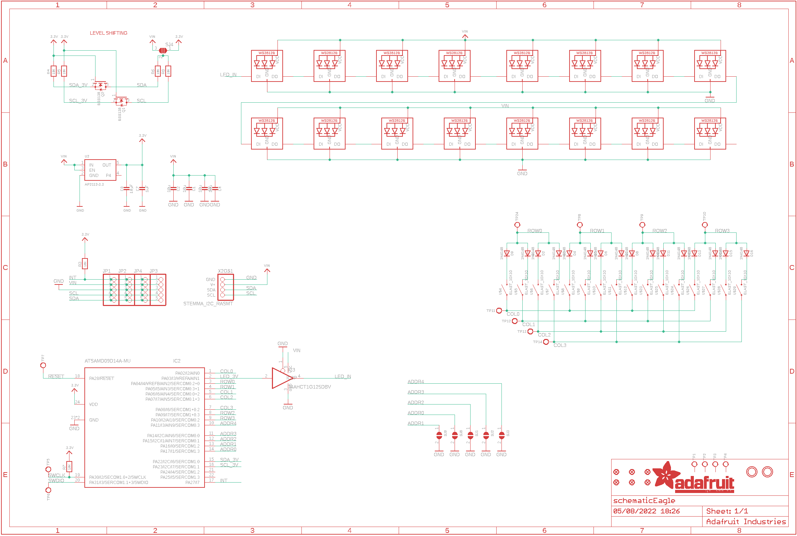
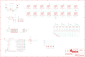

Contents
========

* [PRA3954 > Adafruit](#pra3954--adafruit)
	* [Schematic](#schematic)
	* [Interactive BOM](#interactive-bom)
	* [OOMP Parts](#oomp-parts)
	* [Images](#images)
	* [Tags](#tags)
  
![][im]
# PRA3954 > Adafruit

- ID: PROJ-ADAF-3954-STAN-01
- Hex ID: PRA3954
- Name: Adafruit
- Description: Adafruit
- Long Link: [http://oom.lt/PROJ-ADAF-3954-STAN-01](http://oom.lt/PROJ-ADAF-3954-STAN-01)
- Short Link: [http://oom.lt/PRA3954](http://oom.lt/PRA3954)

## Schematic
  

## Interactive BOM

- Interactive BOM page: [ibom.html](https://htmlpreview.github.io/?https://github.com/oomlout/oomlout_OOMP_projects/blob/main/PROJ-ADAF-3954-STAN-01/kicad/bom/ibom.html)

## OOMP Parts
  

|OOMP Parts|
| :---: |
|C1,UNMATCHED-UNMATCHED-UNMATCHED-UNMATCHED-UNMATCHED,C1,10u,CAP_CERAMIC0805-NOOUTLINE,0805-NO,Ceramic Capacitors,,|
|C2,UNMATCHED-UNMATCHED-UNMATCHED-UNMATCHED-UNMATCHED,C2,10u,CAP_CERAMIC0805-NOOUTLINE,0805-NO,Ceramic Capacitors,,|
|C3,UNMATCHED-UNMATCHED-UNMATCHED-UNMATCHED-UNMATCHED,C3,10u,CAP_CERAMIC0805-NOOUTLINE,0805-NO,Ceramic Capacitors,,|
|C4,UNMATCHED-UNMATCHED-UNMATCHED-UNMATCHED-UNMATCHED,C4,10u,CAP_CERAMIC0805-NOOUTLINE,0805-NO,Ceramic Capacitors,,|
|C7,UNMATCHED-UNMATCHED-UNMATCHED-UNMATCHED-UNMATCHED,C7,1uF,CAP_CERAMIC0603_NO,0603-NO,Ceramic Capacitors,,|
|C8,UNMATCHED-UNMATCHED-UNMATCHED-UNMATCHED-UNMATCHED,C8,10µF,CAP_CERAMIC0805-NOOUTLINE,0805-NO,Ceramic Capacitors,,|
|D1,UNMATCHED-UNMATCHED-UNMATCHED-UNMATCHED-UNMATCHED,D1,1N4148,DIODESOD-323,SOD-323,Diode,,|
|D2,UNMATCHED-UNMATCHED-UNMATCHED-UNMATCHED-UNMATCHED,D2,1N4148,DIODESOD-323,SOD-323,Diode,,|
|D3,UNMATCHED-UNMATCHED-UNMATCHED-UNMATCHED-UNMATCHED,D3,1N4148,DIODESOD-323,SOD-323,Diode,,|
|D4,UNMATCHED-UNMATCHED-UNMATCHED-UNMATCHED-UNMATCHED,D4,1N4148,DIODESOD-323,SOD-323,Diode,,|
|D5,UNMATCHED-UNMATCHED-UNMATCHED-UNMATCHED-UNMATCHED,D5,1N4148,DIODESOD-323,SOD-323,Diode,,|
|D6,UNMATCHED-UNMATCHED-UNMATCHED-UNMATCHED-UNMATCHED,D6,1N4148,DIODESOD-323,SOD-323,Diode,,|
|D7,UNMATCHED-UNMATCHED-UNMATCHED-UNMATCHED-UNMATCHED,D7,1N4148,DIODESOD-323,SOD-323,Diode,,|
|D8,UNMATCHED-UNMATCHED-UNMATCHED-UNMATCHED-UNMATCHED,D8,1N4148,DIODESOD-323,SOD-323,Diode,,|
|D9,UNMATCHED-UNMATCHED-UNMATCHED-UNMATCHED-UNMATCHED,D9,1N4148,DIODESOD-323,SOD-323,Diode,,|
|D10,UNMATCHED-UNMATCHED-UNMATCHED-UNMATCHED-UNMATCHED,D10,1N4148,DIODESOD-323,SOD-323,Diode,,|
|D11,UNMATCHED-UNMATCHED-UNMATCHED-UNMATCHED-UNMATCHED,D11,1N4148,DIODESOD-323,SOD-323,Diode,,|
|D12,UNMATCHED-UNMATCHED-UNMATCHED-UNMATCHED-UNMATCHED,D12,1N4148,DIODESOD-323,SOD-323,Diode,,|
|D13,UNMATCHED-UNMATCHED-UNMATCHED-UNMATCHED-UNMATCHED,D13,1N4148,DIODESOD-323,SOD-323,Diode,,|
|D14,UNMATCHED-UNMATCHED-UNMATCHED-UNMATCHED-UNMATCHED,D14,1N4148,DIODESOD-323,SOD-323,Diode,,|
|D15,UNMATCHED-UNMATCHED-UNMATCHED-UNMATCHED-UNMATCHED,D15,1N4148,DIODESOD-323,SOD-323,Diode,,|
|D16,UNMATCHED-UNMATCHED-UNMATCHED-UNMATCHED-UNMATCHED,D16,1N4148,DIODESOD-323,SOD-323,Diode,,|
|IC2,UNMATCHED-UNMATCHED-UNMATCHED-UNMATCHED-UNMATCHED,FID1,FIDUCIAL_1MM,FIDUCIAL_1MM,FIDUCIAL_1MM,Fiducial Alignment Points,EXCLUDE,|
|IC3,UNMATCHED-UNMATCHED-UNMATCHED-UNMATCHED-UNMATCHED,FID2,FIDUCIAL_1MM,FIDUCIAL_1MM,FIDUCIAL_1MM,Fiducial Alignment Points,EXCLUDE,|
|JP1,UNMATCHED-UNMATCHED-UNMATCHED-UNMATCHED-UNMATCHED,FID3,FIDUCIAL_1MM,FIDUCIAL_1MM,FIDUCIAL_1MM,Fiducial Alignment Points,EXCLUDE,|
|JP2,UNMATCHED-UNMATCHED-UNMATCHED-UNMATCHED-UNMATCHED,FID4,FIDUCIAL_1MM,FIDUCIAL_1MM,FIDUCIAL_1MM,Fiducial Alignment Points,EXCLUDE,|
|JP3,UNMATCHED-UNMATCHED-UNMATCHED-UNMATCHED-UNMATCHED,FID5,FIDUCIAL_1MM,FIDUCIAL_1MM,FIDUCIAL_1MM,Fiducial Alignment Points,EXCLUDE,|
|JP4,UNMATCHED-UNMATCHED-UNMATCHED-UNMATCHED-UNMATCHED,FID6,FIDUCIAL_1MM,FIDUCIAL_1MM,FIDUCIAL_1MM,Fiducial Alignment Points,EXCLUDE,|
|LED1,UNMATCHED-UNMATCHED-UNMATCHED-UNMATCHED-UNMATCHED,IC2,ATSAMD09D14A-MU,ATSAMD09D14A-MU,QFN24_4MM,,,|
|LED2,UNMATCHED-UNMATCHED-UNMATCHED-UNMATCHED-UNMATCHED,IC3,74AHCT1G125DBV,74AHCT1G125DBV,SOT23-5,Single Bus Buffer Gate with 3-State Output,,|
|LED3,UNMATCHED-UNMATCHED-UNMATCHED-UNMATCHED-UNMATCHED,JP1,,HEADER-1X5EDGESMT,5P_EDGECONNECT,PIN HEADER,,|
|LED4,UNMATCHED-UNMATCHED-UNMATCHED-UNMATCHED-UNMATCHED,JP2,,HEADER-1X5EDGESMT,5P_EDGECONNECT,PIN HEADER,,|
|LED5,UNMATCHED-UNMATCHED-UNMATCHED-UNMATCHED-UNMATCHED,JP3,,HEADER-1X5EDGESMT,5P_EDGECONNECT,PIN HEADER,,|
|LED6,UNMATCHED-UNMATCHED-UNMATCHED-UNMATCHED-UNMATCHED,JP4,,HEADER-1X5EDGESMT,5P_EDGECONNECT,PIN HEADER,,|
|LED7,UNMATCHED-UNMATCHED-UNMATCHED-UNMATCHED-UNMATCHED,LED1,WS2812B3535,WS2812B3535,LED3535,,,|
|LED8,UNMATCHED-UNMATCHED-UNMATCHED-UNMATCHED-UNMATCHED,LED2,WS2812B3535,WS2812B3535,LED3535,,,|
|LED9,UNMATCHED-UNMATCHED-UNMATCHED-UNMATCHED-UNMATCHED,LED3,WS2812B3535,WS2812B3535,LED3535,,,|
|LED10,UNMATCHED-UNMATCHED-UNMATCHED-UNMATCHED-UNMATCHED,LED4,WS2812B3535,WS2812B3535,LED3535,,,|
|LED11,UNMATCHED-UNMATCHED-UNMATCHED-UNMATCHED-UNMATCHED,LED5,WS2812B3535,WS2812B3535,LED3535,,,|
|LED12,UNMATCHED-UNMATCHED-UNMATCHED-UNMATCHED-UNMATCHED,LED6,WS2812B3535,WS2812B3535,LED3535,,,|
|LED13,UNMATCHED-UNMATCHED-UNMATCHED-UNMATCHED-UNMATCHED,LED7,WS2812B3535,WS2812B3535,LED3535,,,|
|LED14,UNMATCHED-UNMATCHED-UNMATCHED-UNMATCHED-UNMATCHED,LED8,WS2812B3535,WS2812B3535,LED3535,,,|
|LED15,UNMATCHED-UNMATCHED-UNMATCHED-UNMATCHED-UNMATCHED,LED9,WS2812B3535,WS2812B3535,LED3535,,,|
|LED16,UNMATCHED-UNMATCHED-UNMATCHED-UNMATCHED-UNMATCHED,LED10,WS2812B3535,WS2812B3535,LED3535,,,|
|Q1,UNMATCHED-UNMATCHED-UNMATCHED-UNMATCHED-UNMATCHED,LED11,WS2812B3535,WS2812B3535,LED3535,,,|
|Q2,UNMATCHED-UNMATCHED-UNMATCHED-UNMATCHED-UNMATCHED,LED12,WS2812B3535,WS2812B3535,LED3535,,,|
|R3,UNMATCHED-UNMATCHED-UNMATCHED-UNMATCHED-UNMATCHED,LED13,WS2812B3535,WS2812B3535,LED3535,,,|
|R4,UNMATCHED-UNMATCHED-UNMATCHED-UNMATCHED-UNMATCHED,LED14,WS2812B3535,WS2812B3535,LED3535,,,|
|R5,UNMATCHED-UNMATCHED-UNMATCHED-UNMATCHED-UNMATCHED,LED15,WS2812B3535,WS2812B3535,LED3535,,,|
|R6,UNMATCHED-UNMATCHED-UNMATCHED-UNMATCHED-UNMATCHED,LED16,WS2812B3535,WS2812B3535,LED3535,,,|
|R7,UNMATCHED-UNMATCHED-UNMATCHED-UNMATCHED-UNMATCHED,Q1,BSS138,MOSFET-NWIDE,SOT23-WIDE,N-Channel Mosfet,,|
|R8,UNMATCHED-UNMATCHED-UNMATCHED-UNMATCHED-UNMATCHED,Q2,BSS138,MOSFET-NWIDE,SOT23-WIDE,N-Channel Mosfet,,|
|SJ4,UNMATCHED-UNMATCHED-UNMATCHED-UNMATCHED-UNMATCHED,R3,10k,RESISTOR_0603_NOOUT,0603-NO,Resistors,,|
|TP1,UNMATCHED-UNMATCHED-UNMATCHED-UNMATCHED-UNMATCHED,R4,10K,RESISTOR_0603_NOOUT,0603-NO,Resistors,,|
|TP2,UNMATCHED-UNMATCHED-UNMATCHED-UNMATCHED-UNMATCHED,R5,10K,RESISTOR_0603_NOOUT,0603-NO,Resistors,,|
|TP3,UNMATCHED-UNMATCHED-UNMATCHED-UNMATCHED-UNMATCHED,R6,10K,RESISTOR_0603_NOOUT,0603-NO,Resistors,,|
|TP4,UNMATCHED-UNMATCHED-UNMATCHED-UNMATCHED-UNMATCHED,R7,10K,RESISTOR_0603_NOOUT,0603-NO,Resistors,,|
|TP5,UNMATCHED-UNMATCHED-UNMATCHED-UNMATCHED-UNMATCHED,R8,10K,RESISTOR_0603_NOOUT,0603-NO,Resistors,,|
|TP6,UNMATCHED-UNMATCHED-UNMATCHED-UNMATCHED-UNMATCHED,SJ1,,SOLDERJUMPER,SOLDERJUMPER_ARROW_NOPASTE,SMD Solder JUMPER,EXCLUDE,|
|TP7,UNMATCHED-UNMATCHED-UNMATCHED-UNMATCHED-UNMATCHED,SJ2,,SOLDERJUMPER,SOLDERJUMPER_ARROW_NOPASTE,SMD Solder JUMPER,EXCLUDE,|
|TP8,UNMATCHED-UNMATCHED-UNMATCHED-UNMATCHED-UNMATCHED,SJ3,,SOLDERJUMPER,SOLDERJUMPER_ARROW_NOPASTE,SMD Solder JUMPER,EXCLUDE,|
|TP9,UNMATCHED-UNMATCHED-UNMATCHED-UNMATCHED-UNMATCHED,SJ4,,SOLDERJUMPER_2WAY,SOLDERJUMPER_2WAY_OPEN_NOPASTE,2-Way Solder Jumper,,|
|TP10,UNMATCHED-UNMATCHED-UNMATCHED-UNMATCHED-UNMATCHED,SJ8,,SOLDERJUMPER,SOLDERJUMPER_ARROW_NOPASTE,SMD Solder JUMPER,EXCLUDE,|
|TP11,UNMATCHED-UNMATCHED-UNMATCHED-UNMATCHED-UNMATCHED,SJ9,,SOLDERJUMPER,SOLDERJUMPER_ARROW_NOPASTE,SMD Solder JUMPER,EXCLUDE,|
|TP12,UNMATCHED-UNMATCHED-UNMATCHED-UNMATCHED-UNMATCHED,TP1,,TESTPOINT,TESTPOINT_SMT,Test Point,,|
|TP13,UNMATCHED-UNMATCHED-UNMATCHED-UNMATCHED-UNMATCHED,TP2,,TESTPOINT,TESTPOINT_SMT,Test Point,,|
|TP14,UNMATCHED-UNMATCHED-UNMATCHED-UNMATCHED-UNMATCHED,TP3,,TESTPOINT,TESTPOINT_SMT,Test Point,,|
|TP24,UNMATCHED-UNMATCHED-UNMATCHED-UNMATCHED-UNMATCHED,TP4,,TESTPOINT,TESTPOINT_SMT,Test Point,,|
|U$4,UNMATCHED-UNMATCHED-UNMATCHED-UNMATCHED-UNMATCHED,TP5,,TESTPOINTROUND2MM,TESTPOINT_ROUND_2MM,Test Point,,|
|U$5,UNMATCHED-UNMATCHED-UNMATCHED-UNMATCHED-UNMATCHED,TP6,,TESTPOINTROUND2MM,TESTPOINT_ROUND_2MM,Test Point,,|
|U$6,UNMATCHED-UNMATCHED-UNMATCHED-UNMATCHED-UNMATCHED,TP7,,TESTPOINTROUND1.5MM,TESTPOINT_ROUND_1.5MM,Test Point,,|
|U$7,UNMATCHED-UNMATCHED-UNMATCHED-UNMATCHED-UNMATCHED,TP8,,TESTPOINTROUND1.5MM,TESTPOINT_ROUND_1.5MM,Test Point,,|
|U$8,UNMATCHED-UNMATCHED-UNMATCHED-UNMATCHED-UNMATCHED,TP9,,TESTPOINTROUND1.5MM,TESTPOINT_ROUND_1.5MM,Test Point,,|
|U$9,UNMATCHED-UNMATCHED-UNMATCHED-UNMATCHED-UNMATCHED,TP10,,TESTPOINTROUND1.5MM,TESTPOINT_ROUND_1.5MM,Test Point,,|
|U$10,UNMATCHED-UNMATCHED-UNMATCHED-UNMATCHED-UNMATCHED,TP11,,TESTPOINTROUND1.5MM,TESTPOINT_ROUND_1.5MM,Test Point,,|
|U$11,UNMATCHED-UNMATCHED-UNMATCHED-UNMATCHED-UNMATCHED,TP12,,TESTPOINTROUND1.5MM,TESTPOINT_ROUND_1.5MM,Test Point,,|
|U$12,UNMATCHED-UNMATCHED-UNMATCHED-UNMATCHED-UNMATCHED,TP13,,TESTPOINTROUND1.5MM,TESTPOINT_ROUND_1.5MM,Test Point,,|
|U$23,UNMATCHED-UNMATCHED-UNMATCHED-UNMATCHED-UNMATCHED,TP14,,TESTPOINTROUND1.5MM,TESTPOINT_ROUND_1.5MM,Test Point,,|
|U$24,UNMATCHED-UNMATCHED-UNMATCHED-UNMATCHED-UNMATCHED,TP24,,TESTPOINTROUND1.5MM,TESTPOINT_ROUND_1.5MM,Test Point,,|
|U$25,UNMATCHED-UNMATCHED-UNMATCHED-UNMATCHED-UNMATCHED,U$1,MOUNTINGHOLE2.5,MOUNTINGHOLE2.5,MOUNTINGHOLE_2.5_PLATED,Mounting Hole,EXCLUDE,|
|U$26,UNMATCHED-UNMATCHED-UNMATCHED-UNMATCHED-UNMATCHED,U$2,MOUNTINGHOLE2.5,MOUNTINGHOLE2.5,MOUNTINGHOLE_2.5_PLATED,Mounting Hole,EXCLUDE,|
|U$27,UNMATCHED-UNMATCHED-UNMATCHED-UNMATCHED-UNMATCHED,U$4,ELAST_10X10,ELAST_10X10,ELAST_PAD_SQUARE_10MM_4X4WIDE,10mm x 10mm elastomer pad,,|
|U$28,UNMATCHED-UNMATCHED-UNMATCHED-UNMATCHED-UNMATCHED,U$5,ELAST_10X10,ELAST_10X10,ELAST_PAD_SQUARE_10MM_4X4WIDE,10mm x 10mm elastomer pad,,|
|U$29,UNMATCHED-UNMATCHED-UNMATCHED-UNMATCHED-UNMATCHED,U$6,ELAST_10X10,ELAST_10X10,ELAST_PAD_SQUARE_10MM_4X4WIDE,10mm x 10mm elastomer pad,,|
|U2,UNMATCHED-UNMATCHED-UNMATCHED-UNMATCHED-UNMATCHED,U$7,ELAST_10X10,ELAST_10X10,ELAST_PAD_SQUARE_10MM_4X4WIDE,10mm x 10mm elastomer pad,,|
|X2,UNMATCHED-UNMATCHED-UNMATCHED-UNMATCHED-UNMATCHED,U$8,ELAST_10X10,ELAST_10X10,ELAST_PAD_SQUARE_10MM_4X4WIDE,10mm x 10mm elastomer pad,,|

## Images
  
  

|kicadPcb3d|kicadPcb3dFront|kicadPcb3dBack|eagleImage|eagleSchemImage|
| :---: | :---: | :---: | :---: | :---: |
||||||

## Tags

- hexID: PRA3954
- oompType: PROJ
- oompSize: ADAF
- oompColor: 3954
- oompDesc: STAN
- oompIndex: 01
- oompName: Adafruit NeoTrellis 4x4 PCB
- sources: All source files from https://github.com/adafruit/Adafruit-NeoTrellis-4x4-PCB (source licence details in srcLicense.md)
- linkBuyPage: http://www.adafruit.com/products/3954
- oompID: PROJ-ADAF-3954-STAN-01
- oompParts: C1,UNMATCHED-UNMATCHED-UNMATCHED-UNMATCHED-UNMATCHED
- oompParts: C2,UNMATCHED-UNMATCHED-UNMATCHED-UNMATCHED-UNMATCHED
- oompParts: C3,UNMATCHED-UNMATCHED-UNMATCHED-UNMATCHED-UNMATCHED
- oompParts: C4,UNMATCHED-UNMATCHED-UNMATCHED-UNMATCHED-UNMATCHED
- oompParts: C7,UNMATCHED-UNMATCHED-UNMATCHED-UNMATCHED-UNMATCHED
- oompParts: C8,UNMATCHED-UNMATCHED-UNMATCHED-UNMATCHED-UNMATCHED
- oompParts: D1,UNMATCHED-UNMATCHED-UNMATCHED-UNMATCHED-UNMATCHED
- oompParts: D2,UNMATCHED-UNMATCHED-UNMATCHED-UNMATCHED-UNMATCHED
- oompParts: D3,UNMATCHED-UNMATCHED-UNMATCHED-UNMATCHED-UNMATCHED
- oompParts: D4,UNMATCHED-UNMATCHED-UNMATCHED-UNMATCHED-UNMATCHED
- oompParts: D5,UNMATCHED-UNMATCHED-UNMATCHED-UNMATCHED-UNMATCHED
- oompParts: D6,UNMATCHED-UNMATCHED-UNMATCHED-UNMATCHED-UNMATCHED
- oompParts: D7,UNMATCHED-UNMATCHED-UNMATCHED-UNMATCHED-UNMATCHED
- oompParts: D8,UNMATCHED-UNMATCHED-UNMATCHED-UNMATCHED-UNMATCHED
- oompParts: D9,UNMATCHED-UNMATCHED-UNMATCHED-UNMATCHED-UNMATCHED
- oompParts: D10,UNMATCHED-UNMATCHED-UNMATCHED-UNMATCHED-UNMATCHED
- oompParts: D11,UNMATCHED-UNMATCHED-UNMATCHED-UNMATCHED-UNMATCHED
- oompParts: D12,UNMATCHED-UNMATCHED-UNMATCHED-UNMATCHED-UNMATCHED
- oompParts: D13,UNMATCHED-UNMATCHED-UNMATCHED-UNMATCHED-UNMATCHED
- oompParts: D14,UNMATCHED-UNMATCHED-UNMATCHED-UNMATCHED-UNMATCHED
- oompParts: D15,UNMATCHED-UNMATCHED-UNMATCHED-UNMATCHED-UNMATCHED
- oompParts: D16,UNMATCHED-UNMATCHED-UNMATCHED-UNMATCHED-UNMATCHED
- oompParts: IC2,UNMATCHED-UNMATCHED-UNMATCHED-UNMATCHED-UNMATCHED
- oompParts: IC3,UNMATCHED-UNMATCHED-UNMATCHED-UNMATCHED-UNMATCHED
- oompParts: JP1,UNMATCHED-UNMATCHED-UNMATCHED-UNMATCHED-UNMATCHED
- oompParts: JP2,UNMATCHED-UNMATCHED-UNMATCHED-UNMATCHED-UNMATCHED
- oompParts: JP3,UNMATCHED-UNMATCHED-UNMATCHED-UNMATCHED-UNMATCHED
- oompParts: JP4,UNMATCHED-UNMATCHED-UNMATCHED-UNMATCHED-UNMATCHED
- oompParts: LED1,UNMATCHED-UNMATCHED-UNMATCHED-UNMATCHED-UNMATCHED
- oompParts: LED2,UNMATCHED-UNMATCHED-UNMATCHED-UNMATCHED-UNMATCHED
- oompParts: LED3,UNMATCHED-UNMATCHED-UNMATCHED-UNMATCHED-UNMATCHED
- oompParts: LED4,UNMATCHED-UNMATCHED-UNMATCHED-UNMATCHED-UNMATCHED
- oompParts: LED5,UNMATCHED-UNMATCHED-UNMATCHED-UNMATCHED-UNMATCHED
- oompParts: LED6,UNMATCHED-UNMATCHED-UNMATCHED-UNMATCHED-UNMATCHED
- oompParts: LED7,UNMATCHED-UNMATCHED-UNMATCHED-UNMATCHED-UNMATCHED
- oompParts: LED8,UNMATCHED-UNMATCHED-UNMATCHED-UNMATCHED-UNMATCHED
- oompParts: LED9,UNMATCHED-UNMATCHED-UNMATCHED-UNMATCHED-UNMATCHED
- oompParts: LED10,UNMATCHED-UNMATCHED-UNMATCHED-UNMATCHED-UNMATCHED
- oompParts: LED11,UNMATCHED-UNMATCHED-UNMATCHED-UNMATCHED-UNMATCHED
- oompParts: LED12,UNMATCHED-UNMATCHED-UNMATCHED-UNMATCHED-UNMATCHED
- oompParts: LED13,UNMATCHED-UNMATCHED-UNMATCHED-UNMATCHED-UNMATCHED
- oompParts: LED14,UNMATCHED-UNMATCHED-UNMATCHED-UNMATCHED-UNMATCHED
- oompParts: LED15,UNMATCHED-UNMATCHED-UNMATCHED-UNMATCHED-UNMATCHED
- oompParts: LED16,UNMATCHED-UNMATCHED-UNMATCHED-UNMATCHED-UNMATCHED
- oompParts: Q1,UNMATCHED-UNMATCHED-UNMATCHED-UNMATCHED-UNMATCHED
- oompParts: Q2,UNMATCHED-UNMATCHED-UNMATCHED-UNMATCHED-UNMATCHED
- oompParts: R3,UNMATCHED-UNMATCHED-UNMATCHED-UNMATCHED-UNMATCHED
- oompParts: R4,UNMATCHED-UNMATCHED-UNMATCHED-UNMATCHED-UNMATCHED
- oompParts: R5,UNMATCHED-UNMATCHED-UNMATCHED-UNMATCHED-UNMATCHED
- oompParts: R6,UNMATCHED-UNMATCHED-UNMATCHED-UNMATCHED-UNMATCHED
- oompParts: R7,UNMATCHED-UNMATCHED-UNMATCHED-UNMATCHED-UNMATCHED
- oompParts: R8,UNMATCHED-UNMATCHED-UNMATCHED-UNMATCHED-UNMATCHED
- oompParts: SJ4,UNMATCHED-UNMATCHED-UNMATCHED-UNMATCHED-UNMATCHED
- oompParts: TP1,UNMATCHED-UNMATCHED-UNMATCHED-UNMATCHED-UNMATCHED
- oompParts: TP2,UNMATCHED-UNMATCHED-UNMATCHED-UNMATCHED-UNMATCHED
- oompParts: TP3,UNMATCHED-UNMATCHED-UNMATCHED-UNMATCHED-UNMATCHED
- oompParts: TP4,UNMATCHED-UNMATCHED-UNMATCHED-UNMATCHED-UNMATCHED
- oompParts: TP5,UNMATCHED-UNMATCHED-UNMATCHED-UNMATCHED-UNMATCHED
- oompParts: TP6,UNMATCHED-UNMATCHED-UNMATCHED-UNMATCHED-UNMATCHED
- oompParts: TP7,UNMATCHED-UNMATCHED-UNMATCHED-UNMATCHED-UNMATCHED
- oompParts: TP8,UNMATCHED-UNMATCHED-UNMATCHED-UNMATCHED-UNMATCHED
- oompParts: TP9,UNMATCHED-UNMATCHED-UNMATCHED-UNMATCHED-UNMATCHED
- oompParts: TP10,UNMATCHED-UNMATCHED-UNMATCHED-UNMATCHED-UNMATCHED
- oompParts: TP11,UNMATCHED-UNMATCHED-UNMATCHED-UNMATCHED-UNMATCHED
- oompParts: TP12,UNMATCHED-UNMATCHED-UNMATCHED-UNMATCHED-UNMATCHED
- oompParts: TP13,UNMATCHED-UNMATCHED-UNMATCHED-UNMATCHED-UNMATCHED
- oompParts: TP14,UNMATCHED-UNMATCHED-UNMATCHED-UNMATCHED-UNMATCHED
- oompParts: TP24,UNMATCHED-UNMATCHED-UNMATCHED-UNMATCHED-UNMATCHED
- oompParts: U$4,UNMATCHED-UNMATCHED-UNMATCHED-UNMATCHED-UNMATCHED
- oompParts: U$5,UNMATCHED-UNMATCHED-UNMATCHED-UNMATCHED-UNMATCHED
- oompParts: U$6,UNMATCHED-UNMATCHED-UNMATCHED-UNMATCHED-UNMATCHED
- oompParts: U$7,UNMATCHED-UNMATCHED-UNMATCHED-UNMATCHED-UNMATCHED
- oompParts: U$8,UNMATCHED-UNMATCHED-UNMATCHED-UNMATCHED-UNMATCHED
- oompParts: U$9,UNMATCHED-UNMATCHED-UNMATCHED-UNMATCHED-UNMATCHED
- oompParts: U$10,UNMATCHED-UNMATCHED-UNMATCHED-UNMATCHED-UNMATCHED
- oompParts: U$11,UNMATCHED-UNMATCHED-UNMATCHED-UNMATCHED-UNMATCHED
- oompParts: U$12,UNMATCHED-UNMATCHED-UNMATCHED-UNMATCHED-UNMATCHED
- oompParts: U$23,UNMATCHED-UNMATCHED-UNMATCHED-UNMATCHED-UNMATCHED
- oompParts: U$24,UNMATCHED-UNMATCHED-UNMATCHED-UNMATCHED-UNMATCHED
- oompParts: U$25,UNMATCHED-UNMATCHED-UNMATCHED-UNMATCHED-UNMATCHED
- oompParts: U$26,UNMATCHED-UNMATCHED-UNMATCHED-UNMATCHED-UNMATCHED
- oompParts: U$27,UNMATCHED-UNMATCHED-UNMATCHED-UNMATCHED-UNMATCHED
- oompParts: U$28,UNMATCHED-UNMATCHED-UNMATCHED-UNMATCHED-UNMATCHED
- oompParts: U$29,UNMATCHED-UNMATCHED-UNMATCHED-UNMATCHED-UNMATCHED
- oompParts: U2,UNMATCHED-UNMATCHED-UNMATCHED-UNMATCHED-UNMATCHED
- oompParts: X2,UNMATCHED-UNMATCHED-UNMATCHED-UNMATCHED-UNMATCHED
- rawParts: C1,10u,CAP_CERAMIC0805-NOOUTLINE,0805-NO,Ceramic Capacitors,,
- rawParts: C2,10u,CAP_CERAMIC0805-NOOUTLINE,0805-NO,Ceramic Capacitors,,
- rawParts: C3,10u,CAP_CERAMIC0805-NOOUTLINE,0805-NO,Ceramic Capacitors,,
- rawParts: C4,10u,CAP_CERAMIC0805-NOOUTLINE,0805-NO,Ceramic Capacitors,,
- rawParts: C7,1uF,CAP_CERAMIC0603_NO,0603-NO,Ceramic Capacitors,,
- rawParts: C8,10µF,CAP_CERAMIC0805-NOOUTLINE,0805-NO,Ceramic Capacitors,,
- rawParts: D1,1N4148,DIODESOD-323,SOD-323,Diode,,
- rawParts: D2,1N4148,DIODESOD-323,SOD-323,Diode,,
- rawParts: D3,1N4148,DIODESOD-323,SOD-323,Diode,,
- rawParts: D4,1N4148,DIODESOD-323,SOD-323,Diode,,
- rawParts: D5,1N4148,DIODESOD-323,SOD-323,Diode,,
- rawParts: D6,1N4148,DIODESOD-323,SOD-323,Diode,,
- rawParts: D7,1N4148,DIODESOD-323,SOD-323,Diode,,
- rawParts: D8,1N4148,DIODESOD-323,SOD-323,Diode,,
- rawParts: D9,1N4148,DIODESOD-323,SOD-323,Diode,,
- rawParts: D10,1N4148,DIODESOD-323,SOD-323,Diode,,
- rawParts: D11,1N4148,DIODESOD-323,SOD-323,Diode,,
- rawParts: D12,1N4148,DIODESOD-323,SOD-323,Diode,,
- rawParts: D13,1N4148,DIODESOD-323,SOD-323,Diode,,
- rawParts: D14,1N4148,DIODESOD-323,SOD-323,Diode,,
- rawParts: D15,1N4148,DIODESOD-323,SOD-323,Diode,,
- rawParts: D16,1N4148,DIODESOD-323,SOD-323,Diode,,
- rawParts: FID1,FIDUCIAL_1MM,FIDUCIAL_1MM,FIDUCIAL_1MM,Fiducial Alignment Points,EXCLUDE,
- rawParts: FID2,FIDUCIAL_1MM,FIDUCIAL_1MM,FIDUCIAL_1MM,Fiducial Alignment Points,EXCLUDE,
- rawParts: FID3,FIDUCIAL_1MM,FIDUCIAL_1MM,FIDUCIAL_1MM,Fiducial Alignment Points,EXCLUDE,
- rawParts: FID4,FIDUCIAL_1MM,FIDUCIAL_1MM,FIDUCIAL_1MM,Fiducial Alignment Points,EXCLUDE,
- rawParts: FID5,FIDUCIAL_1MM,FIDUCIAL_1MM,FIDUCIAL_1MM,Fiducial Alignment Points,EXCLUDE,
- rawParts: FID6,FIDUCIAL_1MM,FIDUCIAL_1MM,FIDUCIAL_1MM,Fiducial Alignment Points,EXCLUDE,
- rawParts: IC2,ATSAMD09D14A-MU,ATSAMD09D14A-MU,QFN24_4MM,,,
- rawParts: IC3,74AHCT1G125DBV,74AHCT1G125DBV,SOT23-5,Single Bus Buffer Gate with 3-State Output,,
- rawParts: JP1,,HEADER-1X5EDGESMT,5P_EDGECONNECT,PIN HEADER,,
- rawParts: JP2,,HEADER-1X5EDGESMT,5P_EDGECONNECT,PIN HEADER,,
- rawParts: JP3,,HEADER-1X5EDGESMT,5P_EDGECONNECT,PIN HEADER,,
- rawParts: JP4,,HEADER-1X5EDGESMT,5P_EDGECONNECT,PIN HEADER,,
- rawParts: LED1,WS2812B3535,WS2812B3535,LED3535,,,
- rawParts: LED2,WS2812B3535,WS2812B3535,LED3535,,,
- rawParts: LED3,WS2812B3535,WS2812B3535,LED3535,,,
- rawParts: LED4,WS2812B3535,WS2812B3535,LED3535,,,
- rawParts: LED5,WS2812B3535,WS2812B3535,LED3535,,,
- rawParts: LED6,WS2812B3535,WS2812B3535,LED3535,,,
- rawParts: LED7,WS2812B3535,WS2812B3535,LED3535,,,
- rawParts: LED8,WS2812B3535,WS2812B3535,LED3535,,,
- rawParts: LED9,WS2812B3535,WS2812B3535,LED3535,,,
- rawParts: LED10,WS2812B3535,WS2812B3535,LED3535,,,
- rawParts: LED11,WS2812B3535,WS2812B3535,LED3535,,,
- rawParts: LED12,WS2812B3535,WS2812B3535,LED3535,,,
- rawParts: LED13,WS2812B3535,WS2812B3535,LED3535,,,
- rawParts: LED14,WS2812B3535,WS2812B3535,LED3535,,,
- rawParts: LED15,WS2812B3535,WS2812B3535,LED3535,,,
- rawParts: LED16,WS2812B3535,WS2812B3535,LED3535,,,
- rawParts: Q1,BSS138,MOSFET-NWIDE,SOT23-WIDE,N-Channel Mosfet,,
- rawParts: Q2,BSS138,MOSFET-NWIDE,SOT23-WIDE,N-Channel Mosfet,,
- rawParts: R3,10k,RESISTOR_0603_NOOUT,0603-NO,Resistors,,
- rawParts: R4,10K,RESISTOR_0603_NOOUT,0603-NO,Resistors,,
- rawParts: R5,10K,RESISTOR_0603_NOOUT,0603-NO,Resistors,,
- rawParts: R6,10K,RESISTOR_0603_NOOUT,0603-NO,Resistors,,
- rawParts: R7,10K,RESISTOR_0603_NOOUT,0603-NO,Resistors,,
- rawParts: R8,10K,RESISTOR_0603_NOOUT,0603-NO,Resistors,,
- rawParts: SJ1,,SOLDERJUMPER,SOLDERJUMPER_ARROW_NOPASTE,SMD Solder JUMPER,EXCLUDE,
- rawParts: SJ2,,SOLDERJUMPER,SOLDERJUMPER_ARROW_NOPASTE,SMD Solder JUMPER,EXCLUDE,
- rawParts: SJ3,,SOLDERJUMPER,SOLDERJUMPER_ARROW_NOPASTE,SMD Solder JUMPER,EXCLUDE,
- rawParts: SJ4,,SOLDERJUMPER_2WAY,SOLDERJUMPER_2WAY_OPEN_NOPASTE,2-Way Solder Jumper,,
- rawParts: SJ8,,SOLDERJUMPER,SOLDERJUMPER_ARROW_NOPASTE,SMD Solder JUMPER,EXCLUDE,
- rawParts: SJ9,,SOLDERJUMPER,SOLDERJUMPER_ARROW_NOPASTE,SMD Solder JUMPER,EXCLUDE,
- rawParts: TP1,,TESTPOINT,TESTPOINT_SMT,Test Point,,
- rawParts: TP2,,TESTPOINT,TESTPOINT_SMT,Test Point,,
- rawParts: TP3,,TESTPOINT,TESTPOINT_SMT,Test Point,,
- rawParts: TP4,,TESTPOINT,TESTPOINT_SMT,Test Point,,
- rawParts: TP5,,TESTPOINTROUND2MM,TESTPOINT_ROUND_2MM,Test Point,,
- rawParts: TP6,,TESTPOINTROUND2MM,TESTPOINT_ROUND_2MM,Test Point,,
- rawParts: TP7,,TESTPOINTROUND1.5MM,TESTPOINT_ROUND_1.5MM,Test Point,,
- rawParts: TP8,,TESTPOINTROUND1.5MM,TESTPOINT_ROUND_1.5MM,Test Point,,
- rawParts: TP9,,TESTPOINTROUND1.5MM,TESTPOINT_ROUND_1.5MM,Test Point,,
- rawParts: TP10,,TESTPOINTROUND1.5MM,TESTPOINT_ROUND_1.5MM,Test Point,,
- rawParts: TP11,,TESTPOINTROUND1.5MM,TESTPOINT_ROUND_1.5MM,Test Point,,
- rawParts: TP12,,TESTPOINTROUND1.5MM,TESTPOINT_ROUND_1.5MM,Test Point,,
- rawParts: TP13,,TESTPOINTROUND1.5MM,TESTPOINT_ROUND_1.5MM,Test Point,,
- rawParts: TP14,,TESTPOINTROUND1.5MM,TESTPOINT_ROUND_1.5MM,Test Point,,
- rawParts: TP24,,TESTPOINTROUND1.5MM,TESTPOINT_ROUND_1.5MM,Test Point,,
- rawParts: U$1,MOUNTINGHOLE2.5,MOUNTINGHOLE2.5,MOUNTINGHOLE_2.5_PLATED,Mounting Hole,EXCLUDE,
- rawParts: U$2,MOUNTINGHOLE2.5,MOUNTINGHOLE2.5,MOUNTINGHOLE_2.5_PLATED,Mounting Hole,EXCLUDE,
- rawParts: U$4,ELAST_10X10,ELAST_10X10,ELAST_PAD_SQUARE_10MM_4X4WIDE,10mm x 10mm elastomer pad,,
- rawParts: U$5,ELAST_10X10,ELAST_10X10,ELAST_PAD_SQUARE_10MM_4X4WIDE,10mm x 10mm elastomer pad,,
- rawParts: U$6,ELAST_10X10,ELAST_10X10,ELAST_PAD_SQUARE_10MM_4X4WIDE,10mm x 10mm elastomer pad,,
- rawParts: U$7,ELAST_10X10,ELAST_10X10,ELAST_PAD_SQUARE_10MM_4X4WIDE,10mm x 10mm elastomer pad,,
- rawParts: U$8,ELAST_10X10,ELAST_10X10,ELAST_PAD_SQUARE_10MM_4X4WIDE,10mm x 10mm elastomer pad,,
- rawParts: U$9,ELAST_10X10,ELAST_10X10,ELAST_PAD_SQUARE_10MM_4X4WIDE,10mm x 10mm elastomer pad,,
- rawParts: U$10,ELAST_10X10,ELAST_10X10,ELAST_PAD_SQUARE_10MM_4X4WIDE,10mm x 10mm elastomer pad,,
- rawParts: U$11,ELAST_10X10,ELAST_10X10,ELAST_PAD_SQUARE_10MM_4X4WIDE,10mm x 10mm elastomer pad,,
- rawParts: U$12,ELAST_10X10,ELAST_10X10,ELAST_PAD_SQUARE_10MM_4X4WIDE,10mm x 10mm elastomer pad,,
- rawParts: U$23,ELAST_10X10,ELAST_10X10,ELAST_PAD_SQUARE_10MM_4X4WIDE,10mm x 10mm elastomer pad,,
- rawParts: U$24,ELAST_10X10,ELAST_10X10,ELAST_PAD_SQUARE_10MM_4X4WIDE,10mm x 10mm elastomer pad,,
- rawParts: U$25,ELAST_10X10,ELAST_10X10,ELAST_PAD_SQUARE_10MM_4X4WIDE,10mm x 10mm elastomer pad,,
- rawParts: U$26,ELAST_10X10,ELAST_10X10,ELAST_PAD_SQUARE_10MM_4X4WIDE,10mm x 10mm elastomer pad,,
- rawParts: U$27,ELAST_10X10,ELAST_10X10,ELAST_PAD_SQUARE_10MM_4X4WIDE,10mm x 10mm elastomer pad,,
- rawParts: U$28,ELAST_10X10,ELAST_10X10,ELAST_PAD_SQUARE_10MM_4X4WIDE,10mm x 10mm elastomer pad,,
- rawParts: U$29,ELAST_10X10,ELAST_10X10,ELAST_PAD_SQUARE_10MM_4X4WIDE,10mm x 10mm elastomer pad,,
- rawParts: U2,AP2112-3.3,VREG_SOT23-5,SOT23-5,SOT23-5 Fixed Voltage Regulators,,
- rawParts: X2,STEMMA_I2C_RASMT,STEMMA_I2C_RASMT,JSTPH4,,,

[im]: kicadPcb3d_450.png
