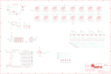

Contents
========

* [PRA3954 > Adafruit NeoTrellis 4x4 PCB](#pra3954--adafruit-neotrellis-4x4-pcb)
	* [Schematic](#schematic)
	* [PCB](#pcb)
	* [Interactive BOM](#interactive-bom)
	* [OOMP Parts](#oomp-parts)
	* [Images](#images)
	* [Tags](#tags)
  
![][im]
# PRA3954 > Adafruit NeoTrellis 4x4 PCB

- ID: PROJ-ADAF-3954-STAN-01
- Hex ID: PRA3954
- Name: Adafruit
- Description: Adafruit
- Long Link: [http://oom.lt/PROJ-ADAF-3954-STAN-01](http://oom.lt/PROJ-ADAF-3954-STAN-01)
- Short Link: [http://oom.lt/PRA3954](http://oom.lt/PRA3954)

## Schematic
  

## PCB
  

## Interactive BOM

- Interactive BOM page: [ibom.html](https://htmlpreview.github.io/?https://github.com/oomlout/oomlout_OOMP_projects/blob/main/PROJ-ADAF-3954-STAN-01/kicad/bom/ibom.html)

## OOMP Parts
  

|OOMP Parts|
| :---: |
|[CAPC-0805-X-UF10-V10  SMD (0805) 10 uF Capacitor (Ceramic) 10v  C1, C2, C3, C4, C8](https://github.com/oomlout/oomlout_OOMP_parts/tree/main/CAPC-0805-X-UF10-V10/)|
|[CAPC-0603-X-UF1-V25  SMD (0603) 1 uF Capacitor (Ceramic) 25v  C7](https://github.com/oomlout/oomlout_OOMP_parts/tree/main/CAPC-0603-X-UF1-V25/)|
|[DIOD-S323-X-K4148-01  SMD (SOD-323) Diode  D1, D2, D3, D4, D5, D6, D7, D8, D9, D10, D11, D12, D13, D14, D15, D16](https://github.com/oomlout/oomlout_OOMP_parts/tree/main/DIOD-S323-X-K4148-01/)|
|UNMATCHED-UNMATCHED-X-UNMATCHED-01 IC2|
|UNMATCHED-SO235-X-UNMATCHED-01 IC3, U2|
|HEAD-I01-X-UNMATCHED-01 JP1, JP2, JP3, JP4, X2|
|[LEDS-3535-RGB-K2812-01  SMD (3535) Smart Controller (WS2812B) RGB LED  LED1, LED2, LED3, LED4, LED5, LED6, LED7, LED8, LED9, LED10, LED11, LED12, LED13, LED14, LED15, LED16](https://github.com/oomlout/oomlout_OOMP_parts/tree/main/LEDS-3535-RGB-K2812-01/)|
|[MOSN-SO23-X-KBSS138-01  SMD (SOT-23) BSS138 N-Ch. MOSFET  Q1, Q2](https://github.com/oomlout/oomlout_OOMP_parts/tree/main/MOSN-SO23-X-KBSS138-01/)|
|[RESE-0603-X-O103-01  SMD (0603) 10k Ohm Resistor  R3, R4, R5, R6, R7, R8](https://github.com/oomlout/oomlout_OOMP_parts/tree/main/RESE-0603-X-O103-01/)|

## Images
  
  

|bominteractivefront|bominteractiveback|kicadPcb3d|kicadPcb3dFront|kicadPcb3dBack|eagleImage|eagleSchemImage|pcbdraw|pcbdrawback|
| :---: | :---: | :---: | :---: | :---: | :---: | :---: | :---: | :---: |
||||||||||

## Tags

- hexID: PRA3954
- oompType: PROJ
- oompSize: ADAF
- oompColor: 3954
- oompDesc: STAN
- oompIndex: 01
- oompName: Adafruit NeoTrellis 4x4 PCB
- sources: All source files from https://github.com/adafruit/Adafruit-NeoTrellis-4x4-PCB (source licence details in srcLicense.md)
- linkBuyPage: http://www.adafruit.com/products/3954
- oompID: PROJ-ADAF-3954-STAN-01
- oompParts: C1,CAPC-0805-X-UF10-V10
- oompParts: C2,CAPC-0805-X-UF10-V10
- oompParts: C3,CAPC-0805-X-UF10-V10
- oompParts: C4,CAPC-0805-X-UF10-V10
- oompParts: C7,CAPC-0603-X-UF1-V25
- oompParts: C8,CAPC-0805-X-UF10-V10
- oompParts: D1,DIOD-S323-X-K4148-01
- oompParts: D2,DIOD-S323-X-K4148-01
- oompParts: D3,DIOD-S323-X-K4148-01
- oompParts: D4,DIOD-S323-X-K4148-01
- oompParts: D5,DIOD-S323-X-K4148-01
- oompParts: D6,DIOD-S323-X-K4148-01
- oompParts: D7,DIOD-S323-X-K4148-01
- oompParts: D8,DIOD-S323-X-K4148-01
- oompParts: D9,DIOD-S323-X-K4148-01
- oompParts: D10,DIOD-S323-X-K4148-01
- oompParts: D11,DIOD-S323-X-K4148-01
- oompParts: D12,DIOD-S323-X-K4148-01
- oompParts: D13,DIOD-S323-X-K4148-01
- oompParts: D14,DIOD-S323-X-K4148-01
- oompParts: D15,DIOD-S323-X-K4148-01
- oompParts: D16,DIOD-S323-X-K4148-01
- oompParts: IC2,UNMATCHED-UNMATCHED-X-UNMATCHED-01
- oompParts: IC3,UNMATCHED-SO235-X-UNMATCHED-01
- oompParts: JP1,HEAD-I01-X-UNMATCHED-01
- oompParts: JP2,HEAD-I01-X-UNMATCHED-01
- oompParts: JP3,HEAD-I01-X-UNMATCHED-01
- oompParts: JP4,HEAD-I01-X-UNMATCHED-01
- oompParts: LED1,LEDS-3535-RGB-K2812-01
- oompParts: LED2,LEDS-3535-RGB-K2812-01
- oompParts: LED3,LEDS-3535-RGB-K2812-01
- oompParts: LED4,LEDS-3535-RGB-K2812-01
- oompParts: LED5,LEDS-3535-RGB-K2812-01
- oompParts: LED6,LEDS-3535-RGB-K2812-01
- oompParts: LED7,LEDS-3535-RGB-K2812-01
- oompParts: LED8,LEDS-3535-RGB-K2812-01
- oompParts: LED9,LEDS-3535-RGB-K2812-01
- oompParts: LED10,LEDS-3535-RGB-K2812-01
- oompParts: LED11,LEDS-3535-RGB-K2812-01
- oompParts: LED12,LEDS-3535-RGB-K2812-01
- oompParts: LED13,LEDS-3535-RGB-K2812-01
- oompParts: LED14,LEDS-3535-RGB-K2812-01
- oompParts: LED15,LEDS-3535-RGB-K2812-01
- oompParts: LED16,LEDS-3535-RGB-K2812-01
- oompParts: Q1,MOSN-SO23-X-KBSS138-01
- oompParts: Q2,MOSN-SO23-X-KBSS138-01
- oompParts: R3,RESE-0603-X-O103-01
- oompParts: R4,RESE-0603-X-O103-01
- oompParts: R5,RESE-0603-X-O103-01
- oompParts: R6,RESE-0603-X-O103-01
- oompParts: R7,RESE-0603-X-O103-01
- oompParts: R8,RESE-0603-X-O103-01
- oompParts: U2,UNMATCHED-SO235-X-UNMATCHED-01
- oompParts: X2,HEAD-I01-X-UNMATCHED-01
- rawParts: C1,10u,CAP_CERAMIC0805-NOOUTLINE,0805-NO,Ceramic Capacitors,,
- rawParts: C2,10u,CAP_CERAMIC0805-NOOUTLINE,0805-NO,Ceramic Capacitors,,
- rawParts: C3,10u,CAP_CERAMIC0805-NOOUTLINE,0805-NO,Ceramic Capacitors,,
- rawParts: C4,10u,CAP_CERAMIC0805-NOOUTLINE,0805-NO,Ceramic Capacitors,,
- rawParts: C7,1uF,CAP_CERAMIC0603_NO,0603-NO,Ceramic Capacitors,,
- rawParts: C8,10µF,CAP_CERAMIC0805-NOOUTLINE,0805-NO,Ceramic Capacitors,,
- rawParts: D1,1N4148,DIODESOD-323,SOD-323,Diode,,
- rawParts: D2,1N4148,DIODESOD-323,SOD-323,Diode,,
- rawParts: D3,1N4148,DIODESOD-323,SOD-323,Diode,,
- rawParts: D4,1N4148,DIODESOD-323,SOD-323,Diode,,
- rawParts: D5,1N4148,DIODESOD-323,SOD-323,Diode,,
- rawParts: D6,1N4148,DIODESOD-323,SOD-323,Diode,,
- rawParts: D7,1N4148,DIODESOD-323,SOD-323,Diode,,
- rawParts: D8,1N4148,DIODESOD-323,SOD-323,Diode,,
- rawParts: D9,1N4148,DIODESOD-323,SOD-323,Diode,,
- rawParts: D10,1N4148,DIODESOD-323,SOD-323,Diode,,
- rawParts: D11,1N4148,DIODESOD-323,SOD-323,Diode,,
- rawParts: D12,1N4148,DIODESOD-323,SOD-323,Diode,,
- rawParts: D13,1N4148,DIODESOD-323,SOD-323,Diode,,
- rawParts: D14,1N4148,DIODESOD-323,SOD-323,Diode,,
- rawParts: D15,1N4148,DIODESOD-323,SOD-323,Diode,,
- rawParts: D16,1N4148,DIODESOD-323,SOD-323,Diode,,
- rawParts: FID1,FIDUCIAL_1MM,FIDUCIAL_1MM,FIDUCIAL_1MM,Fiducial Alignment Points,EXCLUDE,
- rawParts: FID2,FIDUCIAL_1MM,FIDUCIAL_1MM,FIDUCIAL_1MM,Fiducial Alignment Points,EXCLUDE,
- rawParts: FID3,FIDUCIAL_1MM,FIDUCIAL_1MM,FIDUCIAL_1MM,Fiducial Alignment Points,EXCLUDE,
- rawParts: FID4,FIDUCIAL_1MM,FIDUCIAL_1MM,FIDUCIAL_1MM,Fiducial Alignment Points,EXCLUDE,
- rawParts: FID5,FIDUCIAL_1MM,FIDUCIAL_1MM,FIDUCIAL_1MM,Fiducial Alignment Points,EXCLUDE,
- rawParts: FID6,FIDUCIAL_1MM,FIDUCIAL_1MM,FIDUCIAL_1MM,Fiducial Alignment Points,EXCLUDE,
- rawParts: IC2,ATSAMD09D14A-MU,ATSAMD09D14A-MU,QFN24_4MM,,,
- rawParts: IC3,74AHCT1G125DBV,74AHCT1G125DBV,SOT23-5,Single Bus Buffer Gate with 3-State Output,,
- rawParts: JP1,,HEADER-1X5EDGESMT,5P_EDGECONNECT,PIN HEADER,,
- rawParts: JP2,,HEADER-1X5EDGESMT,5P_EDGECONNECT,PIN HEADER,,
- rawParts: JP3,,HEADER-1X5EDGESMT,5P_EDGECONNECT,PIN HEADER,,
- rawParts: JP4,,HEADER-1X5EDGESMT,5P_EDGECONNECT,PIN HEADER,,
- rawParts: LED1,WS2812B3535,WS2812B3535,LED3535,,,
- rawParts: LED2,WS2812B3535,WS2812B3535,LED3535,,,
- rawParts: LED3,WS2812B3535,WS2812B3535,LED3535,,,
- rawParts: LED4,WS2812B3535,WS2812B3535,LED3535,,,
- rawParts: LED5,WS2812B3535,WS2812B3535,LED3535,,,
- rawParts: LED6,WS2812B3535,WS2812B3535,LED3535,,,
- rawParts: LED7,WS2812B3535,WS2812B3535,LED3535,,,
- rawParts: LED8,WS2812B3535,WS2812B3535,LED3535,,,
- rawParts: LED9,WS2812B3535,WS2812B3535,LED3535,,,
- rawParts: LED10,WS2812B3535,WS2812B3535,LED3535,,,
- rawParts: LED11,WS2812B3535,WS2812B3535,LED3535,,,
- rawParts: LED12,WS2812B3535,WS2812B3535,LED3535,,,
- rawParts: LED13,WS2812B3535,WS2812B3535,LED3535,,,
- rawParts: LED14,WS2812B3535,WS2812B3535,LED3535,,,
- rawParts: LED15,WS2812B3535,WS2812B3535,LED3535,,,
- rawParts: LED16,WS2812B3535,WS2812B3535,LED3535,,,
- rawParts: Q1,BSS138,MOSFET-NWIDE,SOT23-WIDE,N-Channel Mosfet,,
- rawParts: Q2,BSS138,MOSFET-NWIDE,SOT23-WIDE,N-Channel Mosfet,,
- rawParts: R3,10k,RESISTOR_0603_NOOUT,0603-NO,Resistors,,
- rawParts: R4,10K,RESISTOR_0603_NOOUT,0603-NO,Resistors,,
- rawParts: R5,10K,RESISTOR_0603_NOOUT,0603-NO,Resistors,,
- rawParts: R6,10K,RESISTOR_0603_NOOUT,0603-NO,Resistors,,
- rawParts: R7,10K,RESISTOR_0603_NOOUT,0603-NO,Resistors,,
- rawParts: R8,10K,RESISTOR_0603_NOOUT,0603-NO,Resistors,,
- rawParts: SJ1,,SOLDERJUMPER,SOLDERJUMPER_ARROW_NOPASTE,SMD Solder JUMPER,EXCLUDE,
- rawParts: SJ2,,SOLDERJUMPER,SOLDERJUMPER_ARROW_NOPASTE,SMD Solder JUMPER,EXCLUDE,
- rawParts: SJ3,,SOLDERJUMPER,SOLDERJUMPER_ARROW_NOPASTE,SMD Solder JUMPER,EXCLUDE,
- rawParts: SJ4,,SOLDERJUMPER_2WAY,SOLDERJUMPER_2WAY_OPEN_NOPASTE,2-Way Solder Jumper,,
- rawParts: SJ8,,SOLDERJUMPER,SOLDERJUMPER_ARROW_NOPASTE,SMD Solder JUMPER,EXCLUDE,
- rawParts: SJ9,,SOLDERJUMPER,SOLDERJUMPER_ARROW_NOPASTE,SMD Solder JUMPER,EXCLUDE,
- rawParts: TP1,,TESTPOINT,TESTPOINT_SMT,Test Point,,
- rawParts: TP2,,TESTPOINT,TESTPOINT_SMT,Test Point,,
- rawParts: TP3,,TESTPOINT,TESTPOINT_SMT,Test Point,,
- rawParts: TP4,,TESTPOINT,TESTPOINT_SMT,Test Point,,
- rawParts: TP5,,TESTPOINTROUND2MM,TESTPOINT_ROUND_2MM,Test Point,,
- rawParts: TP6,,TESTPOINTROUND2MM,TESTPOINT_ROUND_2MM,Test Point,,
- rawParts: TP7,,TESTPOINTROUND1.5MM,TESTPOINT_ROUND_1.5MM,Test Point,,
- rawParts: TP8,,TESTPOINTROUND1.5MM,TESTPOINT_ROUND_1.5MM,Test Point,,
- rawParts: TP9,,TESTPOINTROUND1.5MM,TESTPOINT_ROUND_1.5MM,Test Point,,
- rawParts: TP10,,TESTPOINTROUND1.5MM,TESTPOINT_ROUND_1.5MM,Test Point,,
- rawParts: TP11,,TESTPOINTROUND1.5MM,TESTPOINT_ROUND_1.5MM,Test Point,,
- rawParts: TP12,,TESTPOINTROUND1.5MM,TESTPOINT_ROUND_1.5MM,Test Point,,
- rawParts: TP13,,TESTPOINTROUND1.5MM,TESTPOINT_ROUND_1.5MM,Test Point,,
- rawParts: TP14,,TESTPOINTROUND1.5MM,TESTPOINT_ROUND_1.5MM,Test Point,,
- rawParts: TP24,,TESTPOINTROUND1.5MM,TESTPOINT_ROUND_1.5MM,Test Point,,
- rawParts: U$1,MOUNTINGHOLE2.5,MOUNTINGHOLE2.5,MOUNTINGHOLE_2.5_PLATED,Mounting Hole,EXCLUDE,
- rawParts: U$2,MOUNTINGHOLE2.5,MOUNTINGHOLE2.5,MOUNTINGHOLE_2.5_PLATED,Mounting Hole,EXCLUDE,
- rawParts: U$4,ELAST_10X10,ELAST_10X10,ELAST_PAD_SQUARE_10MM_4X4WIDE,10mm x 10mm elastomer pad,,
- rawParts: U$5,ELAST_10X10,ELAST_10X10,ELAST_PAD_SQUARE_10MM_4X4WIDE,10mm x 10mm elastomer pad,,
- rawParts: U$6,ELAST_10X10,ELAST_10X10,ELAST_PAD_SQUARE_10MM_4X4WIDE,10mm x 10mm elastomer pad,,
- rawParts: U$7,ELAST_10X10,ELAST_10X10,ELAST_PAD_SQUARE_10MM_4X4WIDE,10mm x 10mm elastomer pad,,
- rawParts: U$8,ELAST_10X10,ELAST_10X10,ELAST_PAD_SQUARE_10MM_4X4WIDE,10mm x 10mm elastomer pad,,
- rawParts: U$9,ELAST_10X10,ELAST_10X10,ELAST_PAD_SQUARE_10MM_4X4WIDE,10mm x 10mm elastomer pad,,
- rawParts: U$10,ELAST_10X10,ELAST_10X10,ELAST_PAD_SQUARE_10MM_4X4WIDE,10mm x 10mm elastomer pad,,
- rawParts: U$11,ELAST_10X10,ELAST_10X10,ELAST_PAD_SQUARE_10MM_4X4WIDE,10mm x 10mm elastomer pad,,
- rawParts: U$12,ELAST_10X10,ELAST_10X10,ELAST_PAD_SQUARE_10MM_4X4WIDE,10mm x 10mm elastomer pad,,
- rawParts: U$23,ELAST_10X10,ELAST_10X10,ELAST_PAD_SQUARE_10MM_4X4WIDE,10mm x 10mm elastomer pad,,
- rawParts: U$24,ELAST_10X10,ELAST_10X10,ELAST_PAD_SQUARE_10MM_4X4WIDE,10mm x 10mm elastomer pad,,
- rawParts: U$25,ELAST_10X10,ELAST_10X10,ELAST_PAD_SQUARE_10MM_4X4WIDE,10mm x 10mm elastomer pad,,
- rawParts: U$26,ELAST_10X10,ELAST_10X10,ELAST_PAD_SQUARE_10MM_4X4WIDE,10mm x 10mm elastomer pad,,
- rawParts: U$27,ELAST_10X10,ELAST_10X10,ELAST_PAD_SQUARE_10MM_4X4WIDE,10mm x 10mm elastomer pad,,
- rawParts: U$28,ELAST_10X10,ELAST_10X10,ELAST_PAD_SQUARE_10MM_4X4WIDE,10mm x 10mm elastomer pad,,
- rawParts: U$29,ELAST_10X10,ELAST_10X10,ELAST_PAD_SQUARE_10MM_4X4WIDE,10mm x 10mm elastomer pad,,
- rawParts: U2,AP2112-3.3,VREG_SOT23-5,SOT23-5,SOT23-5 Fixed Voltage Regulators,,
- rawParts: X2,STEMMA_I2C_RASMT,STEMMA_I2C_RASMT,JSTPH4,,,

[im]: kicadPcb3d_450.png
